## {background-color="white"}

::: {style="text-align: center;"}
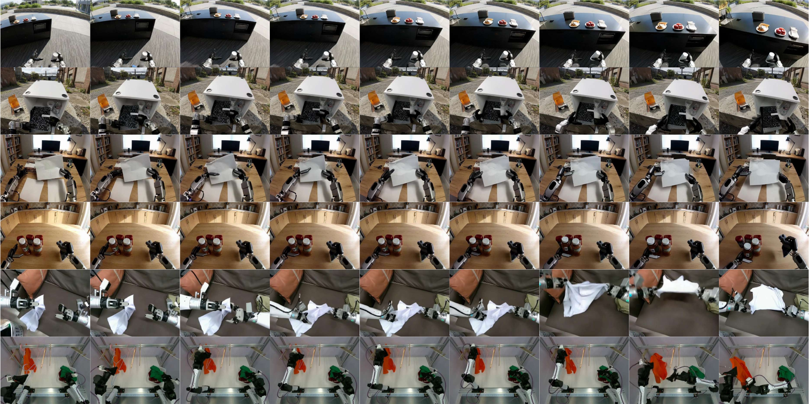{fig-align="center" width="60%"}
:::

<video src="https://dreamdojo-world.github.io/dreamdojo_demo.mp4" muted autoplay loop playsinline style="max-height: 180px; border-radius: 8px; display: block; margin: 0 auto;">Your browser does not support video. See dreamdojo-world.github.io for demos.</video>

<!-- Slide 1b: Roadmap -->

## Roadmap

1. [**Motivation**]{.hi} --- why robot data is not enough
2. [**Latent Action Model**]{.hi} --- self-supervised actions
3. [**Architecture & Training**]{.hi} --- building the world model
4. [**Distillation**]{.hi} --- making it real-time
5. [**Results**]{.hi} --- benchmarks and applications
6. [**Code Insights**]{.hi} --- under the hood
7. [**Discussion**]{.hi} --- takeaways and landscape

<!-- Slide 2: DreamZero Recap -->

## DreamZero Recap: WAMs for Zero-shot Policies

[**World Action Models (WAMs):**]{.hi}

- [**Joint**]{.hi} video + action generation from a single DiT backbone
- Autoregressive chunk-wise inference with ground-truth injection
- [**2x**]{.positive} over VLAs, [**38x**]{.positive} speedup to real-time 7Hz

::: {.keybox}
**Key Paradigm**

WAMs generate "[**how to move**]{.hi}" by predicting "[**what happens next**]{.hi}" --- inverse dynamics emerge from video understanding.
:::

<!-- Slide 2b: From DreamZero to DreamDojo -->

## From DreamZero to DreamDojo

:::: {.columns}
::: {.column width="48%"}
[**DreamZero (WAM = Policy):**]{.hi}

- Joint video + action prediction
- [**Inverse**]{.hi} dynamics: video $\rightarrow$ action
- [**Zero-shot policies**]{.positive}
- Trained on robot data
:::

::: {.column width="48%"}
[**DreamDojo (World Model):**]{.hi}

- Action-conditioned video prediction
- [**Forward**]{.hi} dynamics: action $\rightarrow$ video
- [**Open-world simulation**]{.positive}
- Pretrained on [**human video**]{.hi-gold}
:::
::::

::: {.keybox}
**The Shift**

Same team, complementary paradigms: DreamZero is a [**policy**]{.hi}, DreamDojo is a [**simulator**]{.hi}.
:::

<!-- Slide 3: The Data Gap -->

## The Data Gap: Robot Data Is Not Enough

[**The fundamental bottleneck:**]{.hi}

- Existing robot datasets: limited coverage, narrow distributions
- DROID: 350 hours, 86 skills, 564 scenes
- AgiBot World: 2.9K hours, 87 skills, 106 scenes
- World models trained on robot data $\rightarrow$ [**in-distribution only**]{.negative}

::: {.highlightbox}
**The Core Problem**

Robot world models plateau at [**observed setups**]{.negative} and are [**unresponsive to counterfactual actions**]{.negative} --- actions the robot never performed in training (e.g., patting a toy, reaching and missing). Scaling teleoperation alone cannot cover the long tail.
:::

<!-- Slide 4: The Human Video Insight -->

## The Human Video Insight

::: {.quotebox}
Despite the embodiment gap, the underlying physics during interactions is largely consistent between humans and robots, enabling effective knowledge transfer.
:::

[--- @gao2026dreamdojo]{style="display: block; text-align: right;"}

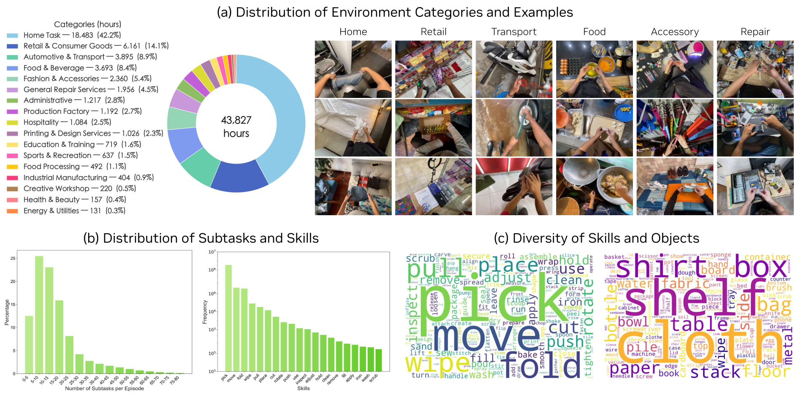{fig-align="center" width="82%"}

[**Key idea:**]{.hi} Human videos capture the same physics --- contact, gravity, deformation, tool use --- just with different end-effectors.

<!-- Slide 5: DreamDojo-HV at Scale -->

## DreamDojo-HV: The Largest WM Dataset

::: {.resultbox}
**Dataset Scale**

- [**44,711 hours**]{.positive} of egocentric video
- [**1,179K**]{.positive} trajectories
- [**~6,015**]{.positive} unique skills
- [**>1,135K**]{.positive} unique scenes
:::

[**vs. prior largest (AgiBot World):**]{.hi} [**15x**]{.positive} duration, [**96x**]{.positive} skills, [**2,000x**]{.positive} scenes

{fig-align="center" width="70%"}

<!-- Slide 6: Three Data Sources -->

## Three Data Sources {.smaller}

::: {.methodbox}
**Data Mixture**

:::: {.columns}
::: {.column width="32%"}
[**In-lab (55h)**]{.hi}

Manus gloves, 35 skills, 1 scene
:::

::: {.column width="32%"}
[**EgoDex (829h)**]{.hi}

Apple Vision Pro, 194 skills, 5 scenes
:::

::: {.column width="32%"}
[**HV (43.8Kh)**]{.hi}

Crowdsourced, 6,015 skills, 1.1M scenes
:::
::::
:::

[**Sampling ratio:**]{.hi} In-lab : EgoDex : HV $=$ [**1 : 2 : 10**]{.hi-gold}

:::: {.columns}
::: {.column width="48%"}
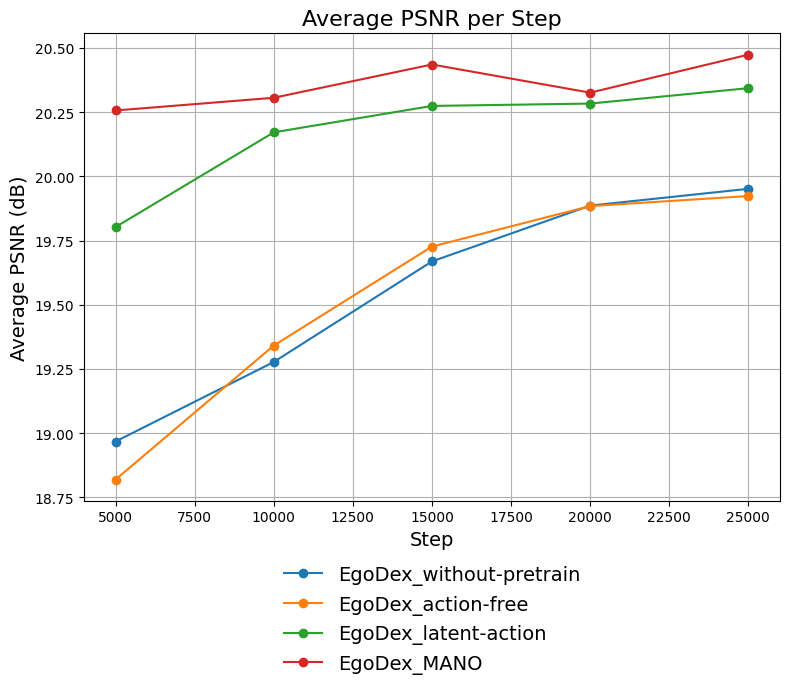{fig-align="center" width="82%"}

[EgoDex sample]{style="font-size: 0.75em;"}
:::
::: {.column width="48%"}
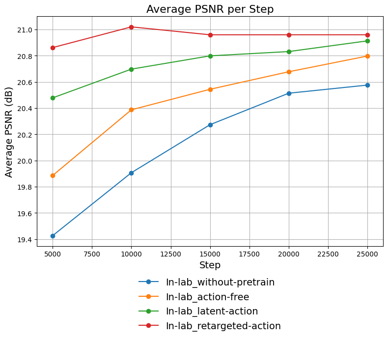{fig-align="center" width="82%"}

[In-lab PSNR curves]{style="font-size: 0.75em;"}
:::
::::

<!-- Slide 7: System Overview -->

## System Overview: Three-Phase Pipeline

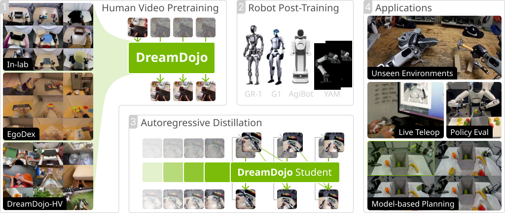{fig-align="center" width="90%"}

[**Phase 1:**]{.hi} Pretrain on human videos with [**latent actions**]{.hi-gold}

[**Phase 2:**]{.hi} Post-train on target robot data (reset action layer)

[**Phase 3:**]{.hi} Distill to autoregressive real-time student

<!---------------------------------------------------------------------------->
<!-- PART 2: LATENT ACTION MODEL                                            -->
<!---------------------------------------------------------------------------->

<!-- Section Divider -->

# How Does DreamDojo Learn Actions? {background-color="#E8EDF5"}

[**Latent Action Model**]{.hi-gold}

<!-- Slide 8: The Action Label Problem -->

## The Action Label Problem

[**Human videos are vast but lack action labels.**]{.hi}

- Passive video prediction ignores [**causality**]{.negative} between observations and actions
- Off-the-shelf hand pose extractors (HaMeR) miss arm movements, locomotion, and fail under occlusion
- Converting heterogeneous action formats into a unified representation $\rightarrow$ significant engineering burden

::: {.highlightbox}
**The Dilemma**

Actionless pretraining wastes interaction knowledge. Ground-truth actions require expensive capture devices. We need a [**self-supervised**]{.hi} middle ground.
:::

<!-- Slide 9: LAM Architecture -->

## Latent Action Model (LAM)

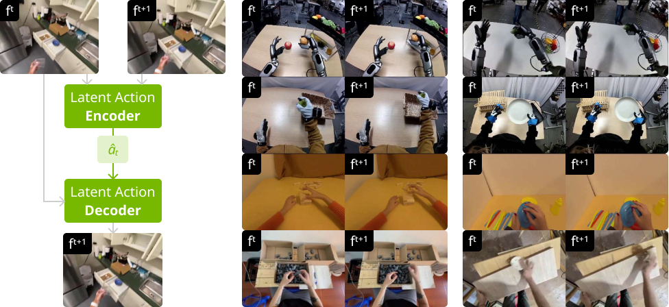{fig-align="center" width="88%"}

::: {.eqbox}
[**VAE with information bottleneck:**]{.hi}

$$
\mathcal{L}^{pred}_{\theta,\phi}(f^{t+1})
  = \mathbb{E}_{q_{\phi}(\hat{a}|f^{t:t+1})}
    \log p_{\theta}(f^{t+1}|\hat{a},f^{t})
  - \beta\,D_{KL}(q_{\phi}(\hat{a}|f^{t:t+1})||p(\hat{a}))
$$

$\hat{a} \in \mathbb{R}^{32}$, $\beta=10^{-6}$ (tight bottleneck $\rightarrow$ forces action disentanglement)
:::

<!-- Slide 10: Latent Actions Cross Embodiments -->

## Latent Actions Cross Embodiments

::: {.keybox}
**Cross-Embodiment Transfer**

The same latent action $\hat{a}$ captures the [**same physical interaction**]{.hi} regardless of whether it is performed by a human hand, a gripper, or a dexterous robot.
:::

[**LAM Architecture (700M params):**]{.hi}

- Spatiotemporal Transformer [@bruce2024genie]
- 24 encoder blocks $+$ 24 decoder blocks
- Encoder: $(f^t, f^{t+1}) \rightarrow \hat{a}$ --- Decoder: $(\hat{a}, f^t) \rightarrow \hat{f}^{t+1}$
- Trained on mixture of [**all**]{.hi} datasets (human + robot)

<!-- Slide 11: Latent Actions vs Alternatives -->

## Latent Actions vs. Alternatives {.smaller}

| **Method** | **PSNR** | **LPIPS** | **Note** |
|:---|:---:|:---:|:---|
| w/o pretrain | 20.576 | 0.222 | No human data |
| Action-free | 20.797 | 0.222 | Passive video |
| [**Latent action**]{.hi} | [**20.913**]{.positive} | [**0.219**]{.positive} | Self-supervised |
| [Retargeted GT]{.neutral} | [20.960]{.neutral} | [0.219]{.neutral} | [Requires gloves]{.neutral} |

::: {.methodbox}
**Key Finding**

Latent actions achieve [**near-parity**]{.positive} with ground-truth action labels --- without any capture devices. The gap: <0.05 PSNR, 0.000 LPIPS.
:::

::: {.softbox}
[**My Take:**]{.hi-gold} This is the enabler for 44K-hour scale. You cannot put Manus gloves on a million crowdworkers, but you [**can**]{.hi} run a VAE on their videos.
:::

<!---------------------------------------------------------------------------->
<!-- PART 3: ARCHITECTURE & TRAINING                                        -->
<!---------------------------------------------------------------------------->

<!-- Section Divider -->

# Building the World Model {background-color="#E8EDF5"}

[**Architecture & Training**]{.hi-gold}

<!-- Slide 12: Cosmos-Predict2.5 Backbone -->

## Cosmos-Predict2.5 Backbone

::: {.methodbox}
**Foundation**

- Latent video diffusion model [@ali2025world]
- [**WAN 2.2 tokenizer**]{.hi}: $4\times$ temporal compression (video latent $x^i$ corresponds to 4 pixel frames $f^{i:i+4}$)
- [**DiT**]{.hi} blocks [@peebles2023scalable] with cross-attention for text, AdaLN for timestep
- Trained with [**flow matching**]{.hi} loss
- Two variants: [**2B**]{.hi-gold} and [**14B**]{.hi-gold} parameters
:::

[**Training setup:**]{.hi}

- 140K steps pretrain (256 H100s), 50K steps post-train (128 H100s)
- Resolution: $640 \times 480$, sequences of 13 latent frames
- EMA maintained throughout

<!-- Slide 12b: Flow Matching in 60 Seconds -->

## Flow Matching in 60 Seconds

::: {.keybox}
**Intuition**

Learn a [**velocity field**]{.hi} that transports noise $\rightarrow$ data along straight paths. Simpler and faster than standard diffusion.
:::

::: {.eqbox}
[**Flow matching loss:**]{.hi}

$$
\mathcal{L}_{\text{flow}}(\theta)
  = \mathbb{E}_{\mathbf{x},\epsilon,\mathbf{c},t}
    \left\|\mathbf{u}(\mathbf{x}_{t},t,\mathbf{c};\theta)
    - \mathbf{v}_{t}\right\|^2
$$

where $\mathbf{v}_t = \epsilon - \mathbf{x}$ (velocity = noise $-$ clean data)
:::

- $t=0$: pure noise. $t=1$: clean data.
- Model predicts the [**velocity**]{.hi} pointing from noise toward data
- Conditions $\mathbf{c}$: text, frames, and [**actions**]{.hi-gold} (for world models)

<!-- Slide 13: Two Key Innovations -->

## Two Key Innovations for Controllability

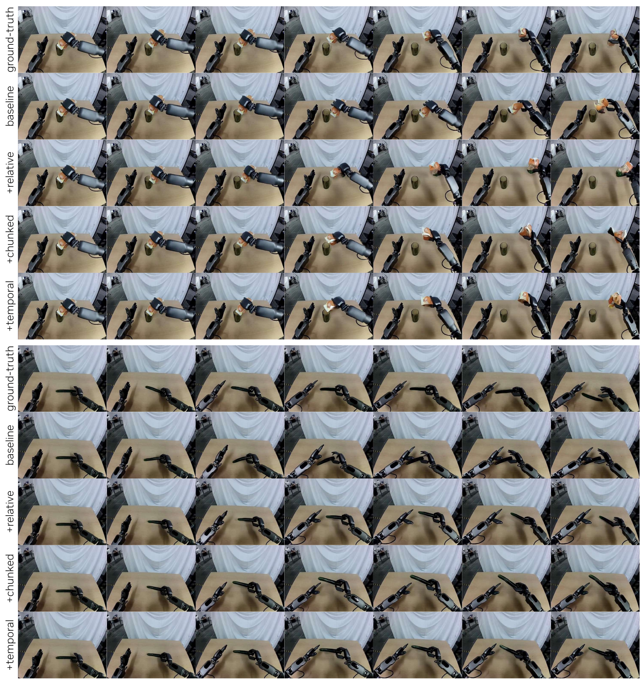{fig-align="center" width="80%"}

::: {.methodbox}
**Design Choices**

1. [**Relative actions:**]{.hi} Rebaseline every 4 timesteps --- concentrates action space $\rightarrow$ better generalization to compositions
2. [**Chunked injection:**]{.hi} 4 consecutive actions $a^{t:t+4}$ sent to matching latent frame --- respects causality $\rightarrow$ future actions do not leak
:::

<!-- Slide 14: Action Embedding Equation -->

## Action Embedding: AdaLN Injection

::: {.eqbox}
[**Action injection pathway:**]{.hi}

$$
\text{actions} \xrightarrow{\text{MLP}}
  \text{action embedding}
  \xrightarrow{+}
  \text{timestep embedding}
  \xrightarrow{\text{AdaLN}}
  \text{DiT blocks}
$$

Scale, shift, and gate modulations in every DiT block
:::

[**Key implementation details:**]{.hi}

- Last layer of action MLP [**zero-initialized**]{.hi} [@zhang2023adding] --- avoids perturbing pretrained state at start of training
- During post-training: [**reset first layer only**]{.hi}, finetune all weights
- Classifier-free guidance [**disabled**]{.hi} (empirically no benefit)

<!-- Slide 14b: Action Embedding Code Pattern -->

## Action Embedding: Code Insights

::: {.methodbox}
**Implementation Pattern**

- Latent actions projected via lightweight MLP to match timestep embedding dim
- [**Zero-init**]{.hi} on last MLP layer $\rightarrow$ identity-like at init
- Added to timestep embeddings before AdaLN processing
- Dual pathway: actions modulate through [**both**]{.hi} timestep AND scale/shift/gate
:::

::: {.softbox}
[**My Take:**]{.hi-gold} The dual-path action injection is more sophisticated than the paper describes --- actions modulate DiT through [**both timestep AND AdaLN**]{.hi} scale/shift/gate pathways. The zero-init trick from ControlNet is crucial for preserving pretrained physics.
:::

<!-- Slide 15: Temporal Consistency Loss -->

## Temporal Consistency Loss

[**Problem:**]{.hi} Flow matching supervises frames individually, ignoring temporal correlations.

::: {.eqbox}
[**Temporal consistency loss:**]{.hi}

$$
\mathcal{L}_{\text{temporal}}(\theta)
  = \mathbb{E}\Big[\sum^{K-1}_{i=1}
    \left\|(z^{i+1}-z^{i})-(v^{i+1}-v^{i})\right\|^2\Big]
$$
:::

::: {.eqbox}
[**Final objective:**]{.hi}

$\mathcal{L}_{\text{final}} = \mathcal{L}_{\text{flow}} + \lambda\,\mathcal{L}_{\text{temporal}}, \quad \lambda = 0.1$
:::

<!-- Slide 16: Post-Training -->

## Post-Training: Adapting to Target Robots

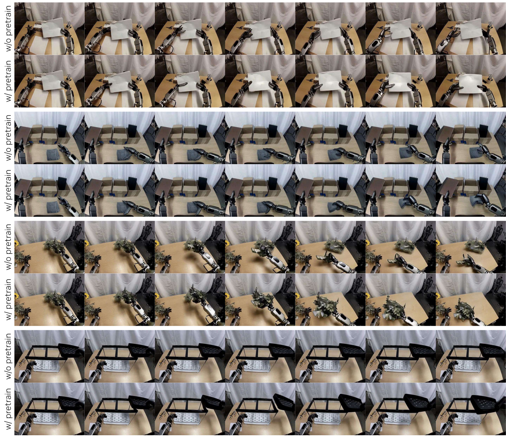{fig-align="center" width="80%"}

::: {.methodbox}
**Post-Training Recipe**

1. [**Reset first layer**]{.hi} of action MLP (new action space)
2. [**Finetune all weights**]{.hi}, target data at ~10 Hz
3. 128 H100s, 50K steps, batch 512
:::

Embodiments: GR-1, G1, AgiBot, YAM --- each post-trained separately. CFG disabled (no benefit).

<!---------------------------------------------------------------------------->
<!-- PART 4: DISTILLATION                                                   -->
<!---------------------------------------------------------------------------->

<!-- Section Divider -->

# Making It Real-Time {background-color="#E8EDF5"}

[**Distillation Pipeline**]{.hi-gold}

<!-- Slide 18: The Distillation Challenge -->

## The Distillation Challenge

[**Why distill?**]{.hi}

- Teacher: [**35 denoising steps**]{.negative}, bidirectional attention, 2.72 FPS
- Too slow for live teleoperation and online planning

::: {.highlightbox}
**Two Conversions Required**

1. [**Bidirectional $\rightarrow$ Autoregressive**]{.hi} (causal attention, streaming)
2. [**35 steps $\rightarrow$ 4 steps**]{.hi} (few-step generation)
:::

Student initialized from teacher weights, with bidirectional attention replaced by [**causal attention**]{.hi} over a sliding window of 12 frames.

<!-- Slide 19a: Self Forcing Warmup -->

## Self Forcing: Warmup Stage

[**Stage 1: Warmup**]{.hi} --- student regresses to teacher ODE solutions

::: {.eqbox}
$$
\mathcal{L}_{\text{warmup}}
  = \mathbb{E}_{x,t}\|G_{\text{student}}(x_{t},t)-x_{0}\|^2
$$

Student generates via teacher forcing (clean context)
:::

[**How it works:**]{.hi}

- Student receives [**clean**]{.hi} context frames (teacher forcing)
- Learns to map noisy inputs to clean data in fewer steps
- Provides a stable initialization before self-generated training

<!-- Slide 19b: Self Forcing Distillation -->

## Self Forcing: Distillation Stage

[**Stage 2: Distillation**]{.hi} --- student trains on its own outputs [@huang2025self]

::: {.eqbox}
$$
\nabla\mathcal{L}_{\text{distill}}
  = -\mathbb{E}_{z,t}\Big[
    (s_{\text{real}}(x_{t},t)
    - s_{\text{fake}}(x_{t},t))
    \frac{dG_{\text{student}}}{d\theta}\Big]
$$

KL divergence between teacher and student distributions [@yin2024one]
:::

$s_{\text{real}}$: score from real (teacher-generated) data | $s_{\text{fake}}$: score from fake (student-generated) data

[**Extended rollout:**]{.hi} Student generates $N'>N$ frames, loss on last $N$ --- reduces long-horizon drift.

<!-- Slide 20: Distillation Results -->

## Distillation Results {.smallest}

::: {.resultbox}
**Speed vs. Quality**

| | **PSNR** | **SSIM** | **LPIPS** | **FPS** | **Pred** | **Ctx** |
|:---|:---:|:---:|:---:|:---:|:---:|:---:|
| Teacher | 14.09 | 0.442 | 0.412 | 2.72 | 12 | 1 |
| Student | 13.15 | 0.379 | 0.485 | [**~10**]{.positive} | 4 | 12 |
:::

<video src="https://dreamdojo-world.github.io/real_time.mp4" muted autoplay loop playsinline style="max-height: 180px; border-radius: 8px; display: block; margin: 0 auto;">Your browser does not support video. See dreamdojo-world.github.io for demos.</video>

:::: {.columns}
::: {.column width="48%"}
{fig-align="center" width="100%"}

[1-minute rollouts]{style="font-size: 0.75em;"}
:::
::: {.column width="48%"}
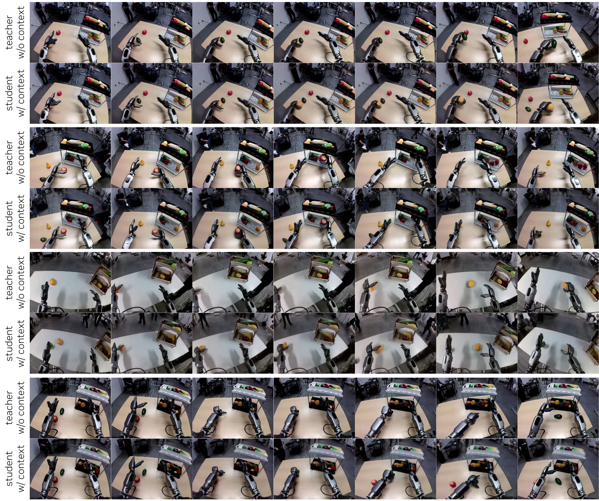{fig-align="center" width="100%"}

[Context advantage]{style="font-size: 0.75em;"}
:::
::::

<!---------------------------------------------------------------------------->
<!-- PART 5: RESULTS                                                        -->
<!---------------------------------------------------------------------------->

<!-- Section Divider -->

# Does It Actually Work? {background-color="#E8EDF5"}

[**Experimental Results**]{.hi-gold}

<!-- Slide 21: Benchmarks -->

## Benchmark Construction: 6 OOD Eval Sets

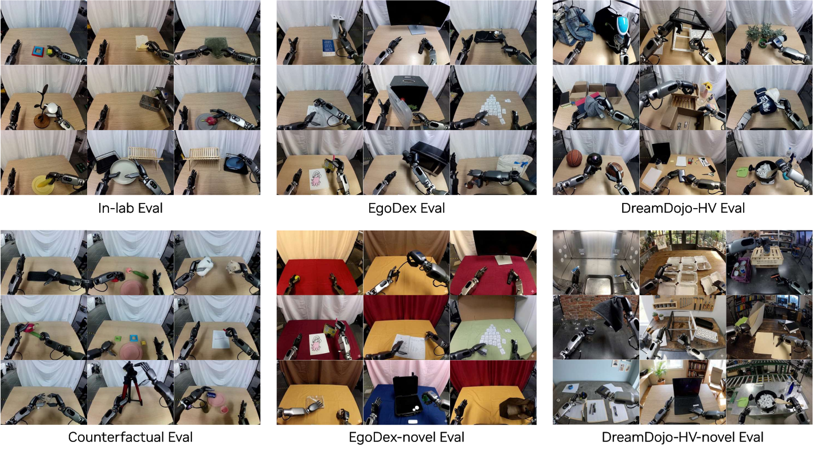{fig-align="center" width="85%"}

::: {.methodbox}
**6 Evaluation Sets on GR-1**

[**1.**]{.hi} In-lab Eval [**2.**]{.hi} EgoDex Eval [**3.**]{.hi} HV Eval [**4.**]{.hi} Counterfactual Eval

[**5.**]{.hi} EgoDex-novel (Gemini-edited BG) [**6.**]{.hi} HV-novel (Gemini-edited BG)

Metrics: PSNR, SSIM, LPIPS (auto); human preference for novel scenes.
:::

<!-- Slide 22: Data Scaling Works -->

## Data Scaling: More Diversity $=$ Better OOD {.smaller}

| **Data Mixture** | **In-lab** | **EgoDex** | **HV** |
|:---|:---:|:---:|:---:|
| No pretrain (Cosmos) | 20.58 | 19.95 | 18.27 |
| In-lab only | 20.91 | 20.27 | 18.62 |
| + EgoDex | 20.97 | 20.33 | 18.71 |
| + DreamDojo-HV | 21.02 | [**20.41**]{.positive} | 18.72 |
| DreamDojo-2B | 21.11 | 20.41 | 18.81 |
| DreamDojo-14B | [**21.41**]{.positive} | [**20.53**]{.positive} | [**18.92**]{.positive} |

::: {.keybox}
**Monotonic Improvement**

Adding more human data [**consistently improves**]{.positive} all OOD benchmarks --- both physics modeling and counterfactual action following.
:::

<!-- Slide 23: Human Preference -->

## Human Preference: 73.5% Win Rate

::: {.resultbox}
**Human Evaluation (12 volunteers)**

| **Comparison** | **Physics** | **Action** |
|:---|:---:|:---:|
| DreamDojo-2B > Cosmos | 62.5% | 63.5% |
| DreamDojo-14B > Cosmos | [**73.5%**]{.positive} | [**72.6%**]{.positive} |
| DreamDojo-14B > DreamDojo-2B | 72.5% | 65.5% |
:::

[**Two axes evaluated:**]{.hi}

- [**Physics correctness:**]{.hi} object permanence, shape consistency, contact causality
- [**Action following:**]{.hi} robot pose accuracy vs. ground-truth

<!-- Slide 24: Ablation -->

## Ablation: What Matters Most? {.smaller}

[Counterfactual Eval metrics:]{style="font-size: 0.75em; color: #555;"}

| **Rel.** | **Chunk** | **Temp.** | **PSNR** | **SSIM** | **LPIPS** |
|:---:|:---:|:---:|:---:|:---:|:---:|
| | | | 19.45 | 0.768 | 0.211 |
| &#10003; | | | 19.48 | 0.772 | 0.212 |
| &#10003; | &#10003; | | [**20.78**]{.positive} | [**0.790**]{.positive} | [**0.193**]{.positive} |
| &#10003; | &#10003; | &#10003; | [**20.98**]{.positive} | [**0.796**]{.positive} | [**0.189**]{.positive} |

::: {.keybox}
**Takeaway**

[**Chunked injection**]{.hi} is the largest single gain (+1.30 PSNR). Relative actions alone have minimal effect, but temporal loss adds a further +0.20 improvement.
:::

<!-- Slide 25: Multi-Embodiment -->

## Multi-Embodiment Support

::: {.keybox}
**Four Robot Platforms**

Post-trained on GR-1, G1, AgiBot, and YAM --- each with separate post-training runs using the same pretrained foundation.
:::

<video src="https://dreamdojo-world.github.io/g1/g1_0024_pred.mp4" muted autoplay loop playsinline style="max-height: 300px; border-radius: 8px; display: block; margin: 0 auto;">Your browser does not support video. See dreamdojo-world.github.io for demos.</video>

[**Per-embodiment adaptation:**]{.hi}

- Reset action MLP first layer for new action space
- Finetune all weights (50K steps)
- Same pretrained physics transfers across all platforms

<!-- Slide 26: Policy Evaluation -->

## Policy Evaluation: A Reliable Simulator

:::: {.columns}
::: {.column width="38%"}
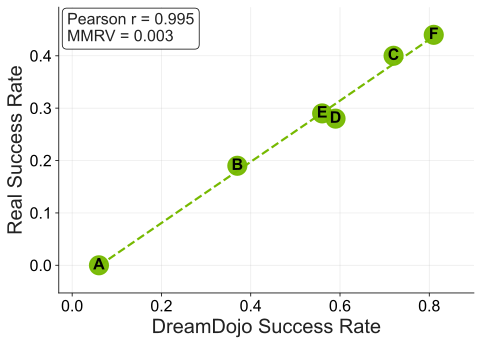{fig-align="center" width="100%"}
:::

::: {.column width="58%"}
::: {.resultbox}
**Correlation with Reality**

- Pearson $r$ = [**0.995**]{.positive}
- MMRV = [**0.003**]{.positive}
:::

[**Protocol:**]{.hi}

- AgiBot fruit packing (20 scenes)
- GR00T N1.5 policy checkpoints
- ~80s rollouts in real world *and* DreamDojo
- Success = fruits packed / 5
:::
::::

DreamDojo can reliably rank policies without deploying on a real robot.

<!-- Slide 27: MPC & Teleoperation -->

## MPC & Live Teleoperation

:::: {.columns}
::: {.column width="48%"}
[**Model-Based Planning:**]{.hi}

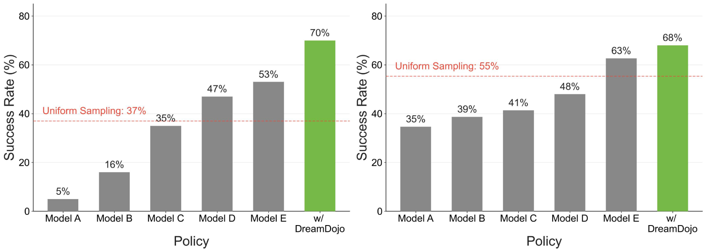{fig-align="center" width="100%"}

- 5 policy checkpoints $\rightarrow$ action proposals
- DreamDojo predicts futures, value model selects
- [**+17%**]{.positive} success rate over best checkpoint
:::

::: {.column width="48%"}
[**Live Teleoperation:**]{.hi}

<video src="https://dreamdojo-world.github.io/teleop/1.mp4" muted autoplay loop playsinline style="max-height: 200px; border-radius: 8px; display: block; margin: 0 auto;">Your browser does not support video. See dreamdojo-world.github.io for demos.</video>

- PICO VR controller $\rightarrow$ G1 actions
- Distilled model on RTX 5090
- Real-time interactive simulation
:::
::::

::: {.keybox}
World models as [**simulators**]{.hi} unlock planning, evaluation, and teleoperation --- all from a single foundation.
:::

<!---------------------------------------------------------------------------->
<!-- PART 6: CODE INSIGHTS                                                  -->
<!---------------------------------------------------------------------------->

<!-- Section Divider -->

# Under the Hood {background-color="#E8EDF5"}

[**Code-Level Insights**]{.hi-gold}

<!-- Slide 27b: Why Look at Code? -->

## Why Look at the Code?

::: {.keybox}
**Production-Grade NVIDIA Code**

DreamDojo's codebase reveals engineering decisions the paper glosses over --- these details matter for reproducibility and understanding.
:::

[**What we can learn:**]{.hi}

- How the LAM bottleneck actually works
- How actions modulate the DiT
- How three different data loaders handle heterogeneous sources
- How relative actions use proper SE(3) math

<!-- Slide 28: Code LAM -->

## Code: Latent Action Model

::: {.methodbox}
**Implementation Details (Not in Paper)**

- Class `LatentActionModel` wraps [**asymmetric**]{.hi} encoder--decoder
- Encoder: `SpatioTemporalTransformer` (joint space-time attention across frames)
- Decoder: `SpatioTransformer` (spatial-only --- no temporal mixing)
- Action prompt initialized as: `nn.Parameter(torch.empty(1, 1, 1, patch_token_dim))`
:::

[**Key asymmetry:**]{.hi} The encoder sees [**both**]{.hi} frames jointly (spatiotemporal), while the decoder reconstructs from action + [**single**]{.hi} frame (spatial only). This forces all temporal information through the 32-dim bottleneck.

<!-- Slide 29: Code DiT -->

## Code: DiT Action Injection

::: {.methodbox}
**Concrete Code Patterns**

- Temporal rearrange: `rearrange(action, "b 1 (t d) -> b t d", t=...)`
- [**Two separate MLPs**]{.hi} for action embedding: `action_embedder_B_D` (global timestep path) vs `action_embedder_B_3D` (per-frame spatial path)
- Each MLP last layer [**zero-initialized**]{.hi}
- Embeddings added to timestep *before* AdaLN
:::

::: {.softbox}
[**My Take:**]{.hi-gold} Two separate action MLPs --- not one --- feed into different pathways. This dual-path design is more sophisticated than the paper describes and explains why chunked injection has such a large ablation effect.
:::

<!-- Slide 30: Code Pipeline -->

## Code: Data Pipeline

::: {.methodbox}
**Three Distinct Loaders**

- [**MANO loader:**]{.hi} For EgoDex/In-lab with hand pose annotations
- [**VideoOnly loader:**]{.hi} For DreamDojo-HV (latent actions extracted online)
- [**LeRobot loader:**]{.hi} For target robot data with ground-truth joint actions
:::

[**Dual-resolution processing:**]{.hi} LAM operates at 320x240 (efficiency), while the world model trains at 640x480 (quality). Separate tokenizer passes for each resolution.

<!-- Slide 31: Code Relative Actions -->

## Code: Relative Action Computation

::: {.methodbox}
**SE(3) Math for Relative Actions**

- Translation: body-frame deltas, not naive world-frame subtraction
- Rotation: proper rotation matrix computation for relative orientation
- Scale factor: $\times$20 applied to normalize action magnitudes
- Rebaseline every 4 timesteps (matching tokenizer compression)
:::

::: {.softbox}
[**My Take:**]{.hi-gold} The relative action computation uses proper SE(3) math --- translation deltas in body frame, not naive subtraction. The [**20x scaling factor**]{.hi} is a practical detail the paper omits entirely. These "boring" engineering choices are what make the model actually work.
:::

<!---------------------------------------------------------------------------->
<!-- PART 7: DISCUSSION                                                     -->
<!---------------------------------------------------------------------------->

<!-- Section Divider -->

# What Does It All Mean? {background-color="#E8EDF5"}

[**Discussion & Takeaways**]{.hi-gold}

<!-- Slide 32: Limitations -->

## Limitations & Honest Assessment

::: {.highlightbox}
**Paper-Acknowledged Limitations**

- [**Uncommon actions**]{.negative} (slapping, fast waving) still fail
- Policy eval [**overestimates**]{.negative} success rates vs. real world
- No multi-view simulation support
- Post-training knowledge retention not studied
:::

::: {.softbox}
[**My Take:**]{.hi-gold} The proprietary 43.8K-hour dataset is both the biggest strength and weakness --- it makes the results hard to reproduce. The eval overestimation suggests the model struggles with nuanced failure modes.
:::

<!-- Slide 33: DreamDojo vs DreamZero Paradigms -->

## DreamDojo vs. DreamZero: Two Paradigms

:::: {.columns}
::: {.column width="48%"}
[**DreamZero (WAM = Policy):**]{.hi}

- [**Inverse**]{.hi} dynamics
- Video + action *jointly* generated
- Zero-shot policy transfer
- Trained on robot data only
- 500 hours robot teleoperation
:::

::: {.column width="48%"}
[**DreamDojo (World Model):**]{.hi}

- [**Forward**]{.hi} dynamics
- Action $\rightarrow$ video prediction
- Simulation, planning, teleoperation
- Pretrained on [**44K hours human video**]{.hi-gold}
- Adapted to robots via post-training
:::
::::

::: {.keybox}
**Complementary, Not Competing**

DreamZero asks "what action produces this future?"

DreamDojo asks "what future does this action produce?"
:::

<!-- Slide 33b: DreamDojo vs DreamZero Technical -->

## DreamDojo vs. DreamZero: Technical Comparison {.smaller}

| | **DreamZero** | **DreamDojo** |
|:---|:---|:---|
| Dynamics | Inverse (IDM) | Forward (WM) |
| Backbone | WAN 2.1 | Cosmos-Predict2.5 |
| Tokenizer | WAN 2.1 ($4\times$) | WAN 2.2 ($4\times$) |
| Conditioning | Joint video+action | Action $\rightarrow$ video |
| Data | Robot only | Human + robot |
| Scale | 500h robot | 44.7Kh total |
| Latent actions | No | Yes (32-dim VAE) |
| Distillation | Flash (1-step) | Self Forcing (4-step) |
| Speed | 7Hz (2xGB200) | ~10 FPS (1xH100) |

::: {.softbox}
[**My Take:**]{.hi-gold} The Cosmos-Predict2.5 backbone gives DreamDojo stronger video priors, while the latent action framework enables human video pretraining at scale. Different tools for different jobs.
:::

<!-- Slide 34: Landscape -->

## The World Model Landscape

::: {.softbox}
[**DreamDojo**]{.hi} is part of a rapid convergence in world models for robotics:
:::

- [**AdaWorld**]{.hi} [@gao2025adaworld]: latent actions for adaptable WMs (tabletop)
- [**Genie**]{.hi} [@bruce2024genie]: interactive environments from video (discrete control)
- [**DexWM**]{.hi} [@goswami2025dexwm]: human videos for dexterous manipulation (smaller scale)
- [**DreamDojo**]{.hi}: first foundation WM at [**44K hours**]{.positive} with [**continuous**]{.positive} latent actions

[**The trend:**]{.hi} Scale up human video, bridge the embodiment gap with latent actions, distill for real-time interaction.

<!-- Slide 35: Key Takeaways -->

## Key Takeaways

1. [**Human video pretraining works**]{.hi} --- 44K hours of ego video $\rightarrow$ physics that generalizes
2. [**Latent actions bridge embodiments**]{.hi} --- self-supervised, near GT quality, infinitely scalable
3. [**Chunked + relative actions**]{.hi} are the biggest controllability gains
4. [**Self Forcing distillation**]{.hi} enables real-time interaction (~10 FPS)
5. [**Policy evaluation**]{.hi} correlates with reality ($r=0.995$)
6. [**World models are becoming general-purpose simulators**]{.hi-gold} for planning, eval, and teleoperation

::: {style="text-align: center; margin-top: 0.8em;"}
[**The future of robot world models is human-video-native.**]{.hi}
:::

<!-- Slide 36: Thank You -->

## Thank You & References

:::: {.columns}
::: {.column width="48%"}
[**Paper & Code:**]{.hi}

- @gao2026dreamdojo
- arXiv: 2602.06949
- Code: `github.com/NVIDIA/DreamDojo`

[**DreamZero (predecessor):**]{.hi}

- @ye2026dreamzero
- `dreamzero0.github.io`
:::

::: {.column width="48%"}
[**Key References:**]{.hi}

- Cosmos-Predict2.5 [@ali2025world]
- Self Forcing [@huang2025self]
- AdaWorld [@gao2025adaworld]
- Genie [@bruce2024genie]
- DiT [@peebles2023scalable]
- Flow matching [@lipman2022flow]
:::
::::

::: {style="text-align: center; margin-top: 1em; font-size: 1.5em;"}
[**Q&A**]{.hi}
:::

<!-- Slide: References -->

## References

::: {#refs}
:::
