<!---------------------------------------------------------------------------->
<!-- PART 1: MOTIVATION & BACKGROUND                                        -->
<!---------------------------------------------------------------------------->

<!-- Slide 1: Title -->
## {background-color="white"}

::: {style="text-align: center;"}
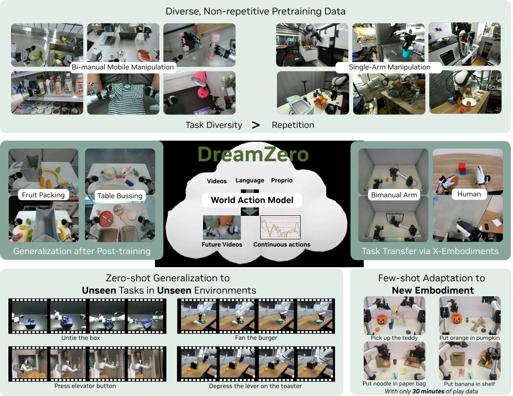{fig-align="center" width="85%"}
:::

<!-- Slide 2: The Second Pre-training Paradigm -->

## The Second Pre-training Paradigm

[**1st Paradigm:**]{.hi} Next-word prediction
$\rightarrow$ Language intelligence (LLMs)

[**2nd Paradigm:**]{.hi} [**Next physical state prediction**]{.hi-gold}
$\rightarrow$ Embodied intelligence (World Models)

::: {.quotebox}
2026 will go down as the first year that Large World Models lay real foundations for robotics.
:::

[--- Jim Fan (NVIDIA)]{style="display: block; text-align: right;"}

<!-- Slide 2b: Why Not Just Use VLMs? -->

## Why Not Just Use VLMs for Robots?

- VLMs are [**language-first**]{.negative} --- vision is a "second-class citizen"
- Most VLM parameters encode *knowledge*, not *physics*
- Static image--text pretraining $\neq$ spatiotemporal understanding

::: {.softbox}
[**Commentary:**]{.hi-gold} "Language is a bottleneck, a scaffold, not a foundation" for physical intelligence.
:::

<!-- Slide 3: The Data Problem (1/2) -->

## The Data Problem in Robotics (1/2)

[**How much data does each domain have?**]{.hi}

- [**LLMs:**]{.hi} text from [**billions of people**]{.positive} across history

- [**Vision:**]{.hi} images from [**billions of cameras**]{.positive} over decades

- [**Robotics:**]{.hi} [**thousands of hours**]{.negative} of teleoperation $\rightarrow$ [**massive gap**]{.negative}

::: {.highlightbox}
**In-the-wild vs. On-demand Data**

Text and images are "in-the-wild" --- generated continuously.
Robot data is "on-demand" --- requires expensive teleoperation.
:::

<!-- Slide 3b: The Data Problem (2/2) -->

## The Data Problem in Robotics (2/2)

::: {.quotebox}
You can't teleoperate your way to the long tail.
:::

[--- Joel Jang]{style="display: block; text-align: right;"}

*"Intelligence is a function of experience."*

$\Rightarrow$ Robotics needs [**vastly more experience**]{.hi-gold} to match human-level physical intelligence.

<!-- Slide 4: VLAs and Their Limitations -->

## The Rise of VLAs and Their Limitations

[**Vision-Language-Action Models (VLAs):**]{.hi}

- RT-2, OpenVLA, GR00T, $\pi_0$ [@rt22023arxiv; @kim2024openvla; @bjorck2025gr00t; @black2024pi0]
- Extend VLMs $\rightarrow$ predict motor actions
- [**Strong semantic understanding**]{.positive}: "pick up the red cup"

[**But:**]{.hi}

- Trained on [**static images**]{.negative} $\rightarrow$ lack spatiotemporal priors
- Fail on novel *motions*: "untie the shoelace"
- Scaling model size alone [**does not help**]{.negative}

<!-- Slide 4b: VLAs — The Evidence -->

## VLAs: The Evidence

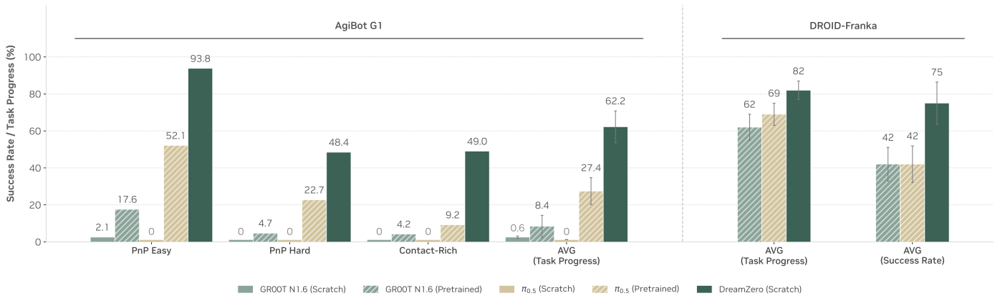{fig-align="center" width="75%"}

[VLA from-scratch at $\sim$0% on diverse data]{style="font-size: 0.75em;"}

::: {.softbox}
[**Commentary:**]{.hi-gold} The fundamental gap --- VLMs encode "[**what**]{.hi} to do" but not "[**how**]{.hi} to move".
:::

<!-- Slide 5: Video as Dense Representation -->

## Key Insight: Video as Dense Physical Representation

::: {.keybox}
**Core Idea**

Video diffusion models trained on web-scale data encode:
[**spatial geometry**]{.hi} $\cdot$ [**object dynamics**]{.hi} $\cdot$ [**contact physics**]{.hi} $\cdot$ [**motion patterns**]{.hi}
:::

- Every consecutive frame pair $\rightarrow$ [**dense supervision**]{.positive} (vs. sparse task-level labels in VLAs)
- "Generating pixels is the only way for humans to *verify* that the model truly understands" --- Joel Jang

<!-- Slide 5b: The Paradigm Shift -->

## The Paradigm Shift

::: {.quotebox}
Apes may not have good language models, but they surely have a robust mental picture of counterfactuals.
:::

[--- Jim Fan]{style="display: block; text-align: right;"}

::: {.softbox}
[**Commentary:**]{.hi-gold} This is the core paradigm shift --- from discrete task policies to [**continuous world modeling**]{.hi}.
:::

<!-- Slide 6: WAM Big Picture -->

## World Action Models: The Big Picture

[**WAM**]{.hi} = Video Prediction $\times$ Inverse Dynamics Model

::: {.eqbox}
$$
\underbrace{P(\mathbf{O}, \mathbf{A} \mid \text{ctx})}_{\text{DreamZero}}
  = \underbrace{P(\mathbf{O} \mid \text{ctx})}_{\text{video pred.}}
  \times \underbrace{P(\mathbf{A} \mid \mathbf{O},
  \text{ctx})}_{\text{IDM}}
$$
:::

[**IDM (Inverse Dynamics Model):**]{.hi} observes a sequence of states and infers what actions caused those transitions --- watching video and reverse-engineering motor commands.

- Instead of two separate models $\rightarrow$ [**single end-to-end model**]{.hi}
- [**DreamZero:**]{.hi} 14B autoregressive WAM built on [**Wan2.1**]{.hi-gold} video backbone [@wan2025wan]

<!-- Slide 6b: Headline Results -->

## DreamZero: Headline Results

::: {.resultbox}
**Key Achievements**

- [**$2\times$ improvement**]{.positive} over state-of-the-art VLAs
- [**$38\times$ inference speedup**]{.positive} $\rightarrow$ real-time at 7Hz
- [**Cross-embodiment transfer**]{.positive} from video-only data
:::

<!-- Slide 7: Human Data Scaling -->

## The Human Data Scaling Pathway

::: {.quotebox}
Humans are robots that have already been deployed at scale.
:::

[--- Joel Jang]{style="display: block; text-align: right;"}

[**The math:**]{.hi}

- 8 billion "units" $\times$ 16 waking hrs/day $=$ 128B person-hours *per day*
- Even capturing 0.1% $\rightarrow$ $\approx$ 100M hours of usable video
- $\approx$ 150 human lifetimes of experience

[**The vision:**]{.hi}
"Train once on human experience, deploy everywhere with calibration"

<!-- Slide 7b: Early Signal -->

## Human Data: Early Signal

::: {.resultbox}
**Cross-Embodiment Transfer**

12 min of human egocentric video
$\rightarrow$ [**>42% relative improvement**]{.positive} on unseen robot tasks
:::

::: {.softbox}
[**Commentary:**]{.hi-gold} This is the sleeper insight --- human video as the ultimate robot training data.
:::

<!---------------------------------------------------------------------------->
<!-- PART 2: DREAMZERO ARCHITECTURE                                         -->
<!---------------------------------------------------------------------------->

<!-- Slide: Section Divider — Architecture -->

# How Does DreamZero Work? {background-color="#E8EDF5"}

[**Architecture & Training**]{.hi-gold}

<!-- Slide 8: Architecture Overview -->

## Architecture Overview

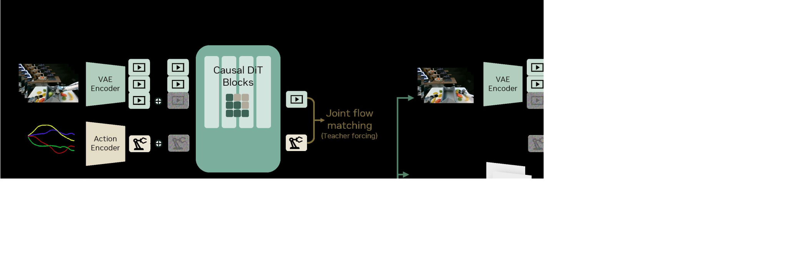{fig-align="center" width="88%"}

:::: {.columns}
::: {.column width="32%"}
[**Inputs:**]{.hi}
Visual context (VAE)
Language (text encoder)
Proprioceptive state
:::

::: {.column width="32%"}
[**Backbone:**]{.hi}
Autoregressive DiT
(Diffusion Transformer)
with flow matching
:::

::: {.column width="32%"}
[**Outputs:**]{.hi}
Joint video frames
+ action chunks
:::
::::

<!-- Slide 9: Why AR? -->

## Why Autoregressive? AR vs. Bidirectional

:::: {.columns}
::: {.column width="48%"}
[**Bidirectional problems:**]{.hi}

- Fixed-length sequences $\rightarrow$ [**video subsampling**]{.negative}
- Distorts native FPS $\rightarrow$ breaks alignment
- Especially harmful mid-task

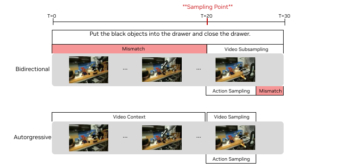{fig-align="center" width="100%"}
:::

::: {.column width="48%"}
[**Autoregressive advantages:**]{.hi}

- Preserves [**native frame rate**]{.positive}
- [**KV-cache**]{.positive} for $3$--$4\times$ speedup
- Natural modality alignment
- Variable-length training
:::
::::

<!-- Slide 9b: AR — Commentary -->

## AR vs. Bidirectional: Commentary

::: {.softbox}
[**Commentary:**]{.hi-gold} AR wins on both quality AND speed --- a rare "have your cake and eat it too" situation.
:::

- [**Speed:**]{.hi} KV-cache gives $3$--$4\times$ speedup --- bidirectional cannot cache
- [**Quality:**]{.hi} native frame rate preserves the temporal signal that the IDM needs

<!-- Slide 10: Chunk-wise Generation -->

## Chunk-wise Generation

::: {.methodbox}
**Chunking Strategy**

- Video: [**$K=2$ latent frames**]{.hi} per chunk
- Action horizon: [**$H=48$**]{.hi} (AgiBot, 30Hz) or [**$H=24$**]{.hi} (DROID, 15Hz)
- Each chunk $\approx$ [**1.6 seconds**]{.hi-gold}
- Max 4 chunks $\rightarrow$ [**6.6 seconds**]{.hi-gold} context
:::

[**Key design choices:**]{.hi}

- Variable-length training (like LLM token sequences)
- Video at 5 FPS, actions at 30Hz (AgiBot)
- 33 raw frames $\rightarrow$ 8 latent frames ($4 \times 2$)

<!-- Slide 11: Flow Matching Intuition -->

## Flow Matching: Intuition

::: {.keybox}
**What is Flow Matching?**

Learn a [**velocity field**]{.hi} that transports noise to data along straight paths --- simpler and faster than standard diffusion.
:::

*Analogy:* Think of a GPS that plots a straight-line route from "lost" (noise) to "home" (data). Flow matching learns that route; standard diffusion takes a random walk.

- At $t=0$: pure noise. At $t=1$: clean data.
- The model predicts the [**velocity**]{.hi} pointing from noise to data.
- [**Shared timestep**]{.hi} $t_k$ for video and action $\rightarrow$ aligned convergence.

<!-- Slide 11b: Flow Matching Equations -->

## Flow Matching: Equations

::: {.eqbox}
[**Noisy interpolation:**]{.hi}

$$
\mathbf{z}_{t_k}^k = t_k \mathbf{z}_1^k
  + (1-t_k)\mathbf{z}_0^k, \quad
\mathbf{a}_{t_k}^k = t_k \mathbf{a}_1^k
  + (1-t_k)\mathbf{a}_0^k
$$

where $\mathbf{z}_0^k, \mathbf{a}_0^k \sim \mathcal{N}(\mathbf{0}, \mathbf{I})$ and $t_k \in [0,1]$.
:::

::: {.eqbox}
[**Velocity prediction loss:**]{.hi}

$$
\mathcal{L}(\theta) = \mathbb{E}\Bigg[
  \frac{1}{K}\sum_{k=1}^{K} w(t_k)
  \Big\lVert \mathbf{u}_\theta(\cdots)
  - \mathbf{v}^k \Big\rVert^2\Bigg]
$$
:::

<!-- Slide 11c: Flow Matching Notation -->

## Flow Matching: Notation Guide

[**Key Symbols:**]{.hi}

- $\mathbf{u}_\theta$: the DiT model (predicts velocity)
- $\mathcal{C}_k$: clean context from previous chunks
- $\mathbf{c}$: language instruction
- $\mathbf{q}_k$: proprioceptive state
- $w(t_k)$: predefined weight function

[**Teacher forcing:**]{.hi} denoise noisy current chunk conditioned on [**clean**]{.positive} previous chunks (like LLM training with ground-truth tokens).

<!-- Slide 12: Attention Masking -->

## Attention Masking Strategy

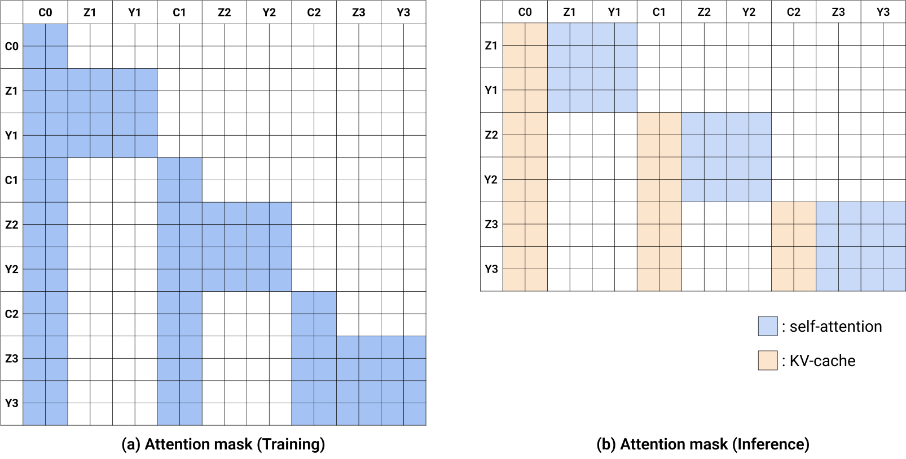{fig-align="center" width="78%"}

::: {.methodbox}
**Key Rules**

- [**Training:**]{.hi} noisy chunk attends ONLY to [**clean context**]{.positive}
- [**No cross-attention**]{.hi} between noisy video and noisy actions within same chunk
:::

<!-- Slide 13: Ground-Truth Injection -->

## Inference: Ground-Truth Injection

::: {.keybox}
**The Elegant Trick**

1. Denoise one chunk at a time (autoregressive)
2. Execute action chunk on robot $\rightarrow$ get [**real observation**]{.hi}
3. [**Replace predicted frame with ground-truth**]{.hi-gold} in KV cache
4. This [**eliminates error accumulation!**]{.positive}
:::

[**Why this is unique to WAMs:**]{.hi}

- Pure video generation: errors compound
- WAMs operate in [**closed-loop**]{.positive} --- reality corrects the model

<!-- Slide 13b: GT Injection — Commentary -->

## Ground-Truth Injection: Commentary

::: {.softbox}
[**Commentary:**]{.hi-gold} WAMs [**self-correct via reality**]{.hi}. No other paradigm gets this for free.
:::

- Closes the sim-to-real gap *by design*, not by domain randomization
- Compare to pure video generation (e.g. Sora) where errors compound indefinitely

<!-- Slide 14: DreamZero-Flash -->

## DreamZero-Flash: Faster Inference

[**Problem:**]{.hi} 4 denoising steps = 350ms (too slow for some applications)

[**Solution:**]{.hi} [**Decoupled noise scheduling**]{.hi-gold}

- Video: $t_{\text{vid}} = 1 - \eta$, $\eta \sim \text{Beta}(7,1)$
  $\rightarrow$ biased toward [**high-noise**]{.negative} (mean $t \approx 0.125$)
- Action: $t_{\text{act}} \sim \text{Uniform}[0,1]$ $\rightarrow$ standard

Trains actions to denoise from *predominantly noisy* visual context.

<!-- Slide 14b: Flash Results -->

## DreamZero-Flash: Results

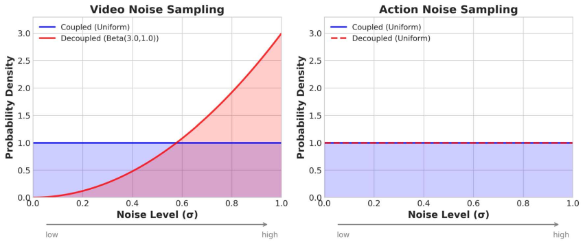{fig-align="center" width="60%"}

::: {.resultbox}
**Result**

1-step: [**74%**]{.positive} task progress (only 9% drop from 4-step at 83%)
:::

<!-- Slide 15: 38x Speedup -->

## $38\times$ Inference Speedup Breakdown {.smaller}

| **Optimization** | **H100** | **GB200** |
|:---|:---:|:---:|
| Baseline | $1\times$ | $1.1\times$ |
| *System-level* | | |
|    + CFG Parallelism | $1.9\times$ | $1.8\times$ |
|    + DiT Caching | $5.5\times$ | $5.4\times$ |
| *Implementation-level* | | |
|    + torch.compile | $8.9\times$ | $10.9\times$ |
|    + Kernel & Scheduler | $9.6\times$ | $14.8\times$ |
|    + Quantization | --- | $16.6\times$ |
| *Model-level* | | |
|    + DreamZero-Flash | --- | [**$38\times$**]{.hi-gold} |

[**Final:**]{.hi} 14B at [**7Hz**]{.positive} on $2 \times \text{GB200}$ (150ms per chunk)

<!---------------------------------------------------------------------------->
<!-- PART 3: DATA & TRAINING                                                -->
<!---------------------------------------------------------------------------->

<!-- Slide 16: Data Philosophy -->

## Data Philosophy: Diversity Over Repetition

::: {.resultbox}
**Counterintuitive Finding**

Same 500 hours of data:
[**Diverse**]{.hi} (22 envs, long-tail skills): [**50% task progress**]{.positive}
[**Repetitive**]{.hi} (70 tasks, many reps): [**33% task progress**]{.negative}
$\rightarrow$ [**+51% relative improvement**]{.positive} from diversity
:::

[**Why?**]{.hi}

- Video prediction inherited from pretraining
- Robust IDM requires [**diverse state-action correspondences**]{.positive}
- Repetitive data $\rightarrow$ narrow IDM

<!-- Slide 17a: AgiBot Dataset -->

## AgiBot G1 Dataset

:::: {.columns}
::: {.column width="50%"}
[**Data:**]{.hi}

- [**500 hours**]{.hi-gold} teleoperation
- 7.2K episodes
- [**22**]{.hi-gold} real-world environments
- Avg episode: 4.4 min, $\sim$42 subtasks
:::

::: {.column width="46%"}
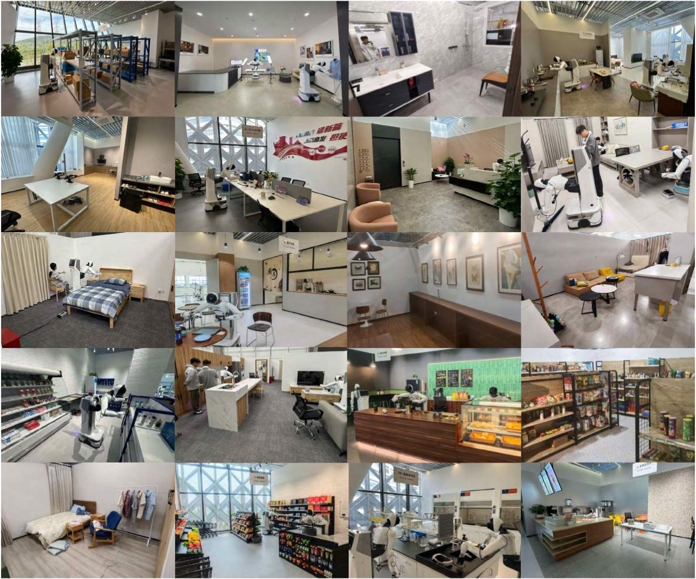{fig-align="center" width="100%"}

[22 diverse environments]{style="font-size: 0.75em;"}
:::
::::

<!-- Slide 17b: Training Config -->

## Training Configuration

:::: {.columns}
::: {.column width="50%"}
[**Training:**]{.hi}

- Backbone: [**Wan2.1-I2V-14B**]{.hi}
- 100K steps, batch size 128
- [**Freeze:**]{.positive} text enc, image enc, VAE
- [**Update:**]{.hi} DiT + state/action enc/dec
- Post-training: 50K steps per task
:::

::: {.column width="46%"}
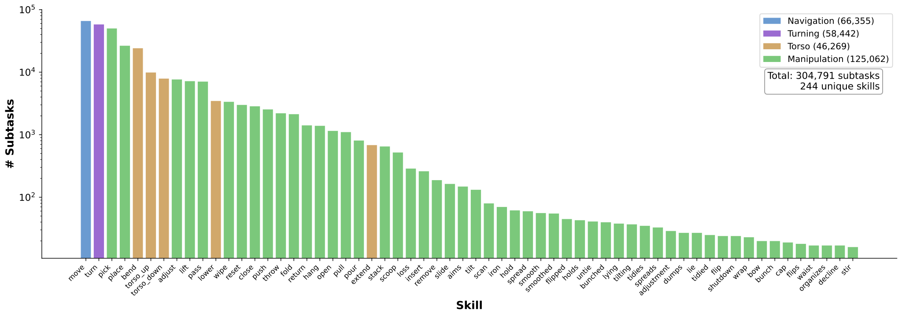{fig-align="center" width="100%"}

[Skill distribution]{style="font-size: 0.75em;"}
:::
::::

<!-- Slide 18a: Evaluation Setup -->

## Evaluation Protocol: Setup

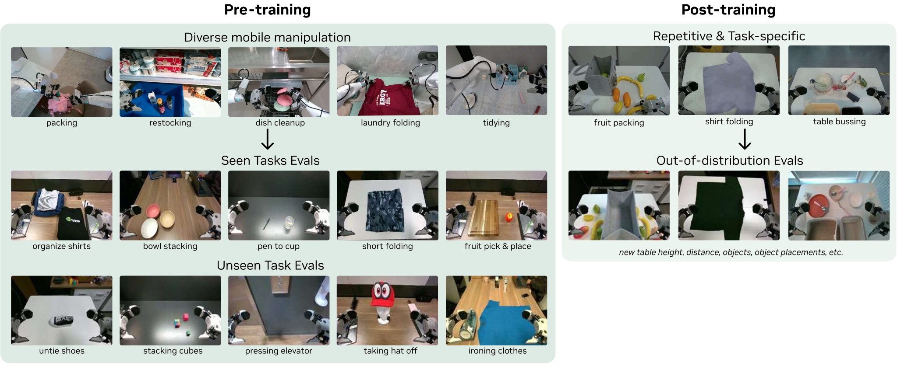{fig-align="center" width="80%"}

Default: [**unseen environments**]{.hi}, [**unseen objects**]{.hi}
Training and evaluation in [**different geographic locations**]{.negative}

<!-- Slide 18b: Evaluation Details -->

## Evaluation Protocol: Details

::: {.methodbox}
**True Out-of-Distribution**

- Seen tasks: 10 tasks $\times$ 8 rollouts $\times$ 4 robots = 80 rollouts
- Unseen tasks: 10 tasks absent from training
- Baselines: GR00T N1, $\pi_{0.5}$ (from-scratch & from-pretrained)
:::

<!---------------------------------------------------------------------------->
<!-- PART 4: RESULTS                                                        -->
<!---------------------------------------------------------------------------->

<!-- Slide: Section Divider — Results -->

# Does It Actually Work? {background-color="#E8EDF5"}

[**Experimental Results**]{.hi-gold}

<!-- Slide 19: Seen Tasks -->

## Seen Tasks: $2\times$ Improvement

{fig-align="center" width="78%"}

::: {.resultbox}
DreamZero: [**62.2%**]{.positive} avg. task progress
Best VLA (pretrained): 27.4% $\rightarrow$ [**$2.3\times$**]{.positive}
VLA from-scratch: [**$\sim$0%**]{.negative}
:::

<!-- Slide 20: Unseen Tasks -->

## Unseen Tasks: Zero-shot Generalization

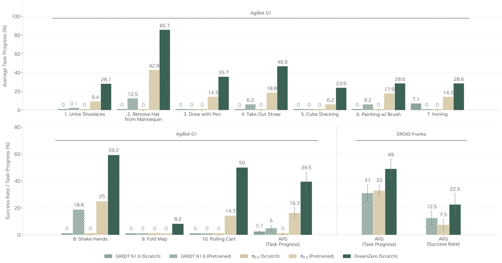{fig-align="center" width="78%"}

::: {.resultbox}
DreamZero: [**39.5%**]{.positive} on novel tasks
Best VLA (pretrained): 16.3% $\rightarrow$ [**$2.4\times$**]{.positive}
:::

<!-- Slide 20b: Unseen Tasks Details -->

## Unseen Tasks: Standout Results

[**Standout tasks:**]{.hi}

- Remove hat: [**85.7%**]{.positive}
- Shake hands: [**59.2%**]{.positive}

[**VLAs overfit**]{.hi} to pick-and-place regardless of instruction.

::: {.softbox}
[**Commentary:**]{.hi-gold} The key result --- DreamZero does things it was [**NEVER trained to do**]{.hi}.
:::

<!-- Slide 21: Joint Video-Action -->

## Joint Video-Action Prediction in Action

{fig-align="center" width="85%"}

- Tight alignment between predicted and actual trajectories
- Most failures: video generation errors, not action extraction

<!-- Slide 22: Post-training -->

## Post-training: Retained Generalization

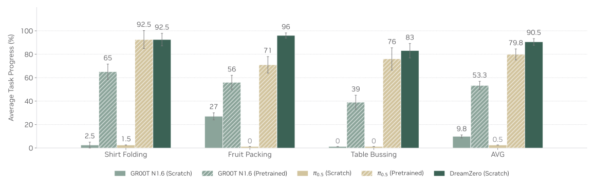{fig-align="center" width="78%"}

- [**Matches or outperforms**]{.positive} pretrained VLAs
- Evaluated in [**unseen environments**]{.hi} even after task-specific training

<!-- Slide 23: Cross-Embodiment Transfer -->

## Cross-Embodiment Transfer

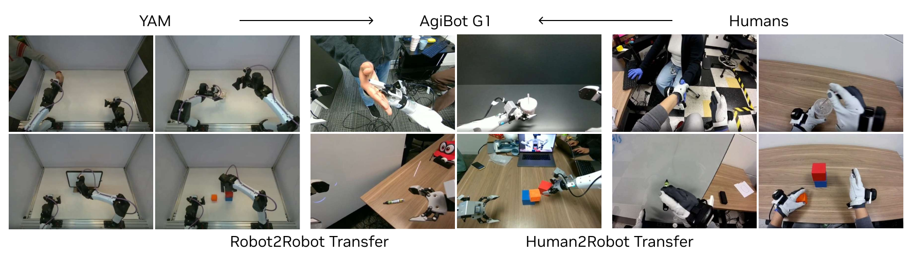{fig-align="center" width="75%"}

| **Method** | **Task Progress** |
|:---|:---:|
| DreamZero (baseline) | 38.3% |
| + Robot2Robot (YAM, 20 min) | [**55.4%**]{.positive} (+44.6% rel.) |
| + Human2Robot (12 min) | [**54.3%**]{.positive} (+41.8% rel.) |

<!-- Slide 23b: Cross-Embodiment Commentary -->

## Cross-Embodiment Transfer: Commentary

::: {.softbox}
[**Commentary:**]{.hi-gold} Video-only data (no action labels!) opens a [**massive scaling pathway**]{.hi}. Human video is orders of magnitude more abundant than robot data.
:::

- YouTube alone hosts [**>800M hours**]{.positive} of how-to and activity video
- The bottleneck shifts from "collect robot data" to "build a better IDM"

<!-- Slide 24: Few-shot -->

## Few-shot Adaptation to New Robot

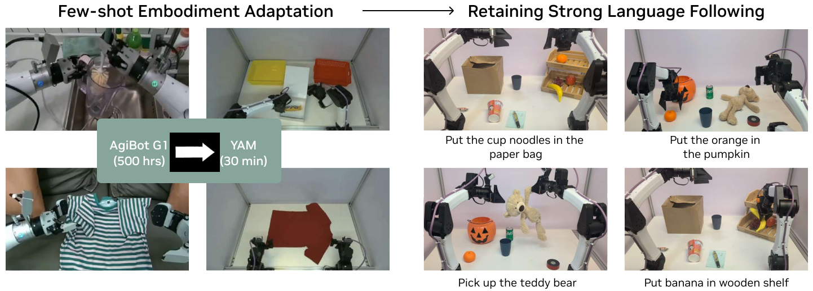{fig-align="center" width="82%"}

- 55 trajectories ($\sim$30 min play data) on YAM robot
- Retains [**language following**]{.positive} + generalizes to novel objects

<!-- Slide 25: Free-form -->

## Free-form Evaluation

{fig-align="center" width="85%"}

[**100+ novel tasks**]{.hi} via natural language instructions
"Pop the balloon", "Press elevator button", "Paint", "Iron clothes"

<!---------------------------------------------------------------------------->
<!-- PART 5: ABLATIONS & ANALYSIS                                           -->
<!---------------------------------------------------------------------------->

<!-- Slide 26: Ablation -->

## Ablation: What Matters Most? {.smaller}

| | **Arch** | **Size** | **Data** | **Progress** |
|:---|:---|:---:|:---|:---:|
| *Q1. Data Diversity* | | | | |
| | DZ (AR) | 14B | Repetitive | 33% |
| | DZ (AR) | 14B | Diverse | [**50%**]{.positive} |
| *Q2. Model Scale* | | | | |
| | DZ (AR) | 5B | Diverse | 21% |
| | DZ (AR) | 14B | Diverse | [**50%**]{.positive} |
| | VLA | 5B | Diverse | [**0%**]{.negative} |
| | VLA | 14B | Diverse | [**0%**]{.negative} |
| *Q3. Architecture* | | | | |
| | DZ (BD) | 14B | Diverse | 50% |
| | DZ (AR) | 14B | Diverse | [**50%**]{.positive} |

[All on PnP Easy, 50K steps, batch 32. DZ = DreamZero.]{style="font-size: 0.7em;"}

<!-- Slide 27: VLA vs WAM -->

## Why VLAs Fail While WAMs Succeed

:::: {.columns}
::: {.column width="48%"}
[**VLAs:**]{.hi}

- [**Static images**]{.negative} $\rightarrow$ no temporal dynamics
- Scaling does not help: [**0% at 5B and 14B**]{.negative}
- Repetitive data + static priors = [**overfitting**]{.negative}
:::

::: {.column width="48%"}
[**WAMs:**]{.hi}

- [**Video**]{.positive} $\rightarrow$ rich temporal dynamics
- Scaling improves video quality $\rightarrow$ [**better actions**]{.positive}
- Diverse data + video priors = [**generalization**]{.positive}
:::
::::

<!-- Slide 27b: VLA vs WAM — Commentary -->

## VLA vs. WAM: Commentary

::: {.softbox}
[**Commentary:**]{.hi-gold} A [**fundamental architectural difference**]{.hi}, not data/compute. VLMs encode semantics; video models encode physics. For robotics, physics wins.
:::

- This echoes the "bitter lesson": the right *representation* (video) matters more than scale
- Expect hybrid approaches that combine VLM semantics with WAM physics

<!-- Slide 28: Failure Analysis -->

## Failure Analysis: When DreamZero Breaks

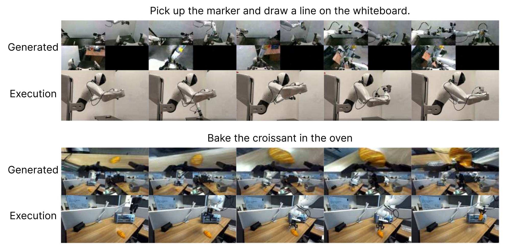{fig-align="center" width="75%"}

[Generated vs. executed trajectory pairs]{style="font-size: 0.75em;"}

[**Primary failure mode:**]{.hi}
[**video generation errors**]{.negative} (hallucinations, wrong physics)

<!-- Slide 28b: Failure Causal Chain -->

## Failure: Error Causal Chain

[**Error causal chain:**]{.hi}

1. Video backbone hallucinates
2. Predicted frames show wrong trajectory
3. IDM faithfully extracts actions from wrong video
4. Robot executes incorrect motion

::: {.softbox}
[**Commentary:**]{.hi-gold} The tight coupling is both strength and weakness --- [**video quality is the bottleneck**]{.hi}.
:::

<!---------------------------------------------------------------------------->
<!-- PART 6: CODE-LEVEL INSIGHTS                                            -->
<!---------------------------------------------------------------------------->

<!-- Slide: Section Divider — Code -->

# Under the Hood {background-color="#E8EDF5"}

[**Code-Level Insights**]{.hi-gold}

<!-- Slide 29: Multi-Embodiment -->

## Code: Multi-Embodiment Architecture

::: {.methodbox}
**Key Code Patterns**

- `CategorySpecificLinear`: separate weights per embodiment
- `MultiEmbodimentActionEncoder`: category-specific MLPs
- Supports up to [**32 embodiments**]{.hi}
- Relative action normalization
:::

::: {.softbox}
[**Commentary (from code):**]{.hi-gold} Each robot gets its own "translator" while sharing the world model.
:::

<!-- Slide 30a: Engineering -->

## Code: Making 14B Real-Time

::: {.methodbox}
**Production-Grade Engineering**

- [**VRAM management:**]{.hi} dynamic GPU--CPU offloading
- [**FP8 inference:**]{.hi} automatic scaling
- [**WebSocket server:**]{.hi} distributed multi-GPU
- [**DiT caching:**]{.hi} skip forward pass when velocity vectors converge
:::

<!-- Slide 30b: Quantization -->

## Code: Quantization Stack

[**Precision hierarchy:**]{.hi}

- Weights + activations: NVFP4
- QKV, Softmax: FP8
- Non-linear ops: FP16

[**Frame sequence:**]{.hi} 880 tokens (33 frames $\times$ $\sim$27 tokens/frame)

::: {.softbox}
[**Commentary (from code):**]{.hi-gold} Far beyond typical research code --- production-grade systems engineering.
:::

<!-- Slide 31: Data Pipeline -->

## Code: Data Pipeline

::: {.methodbox}
**Data Infrastructure**

- [**LeRobot v2 format**]{.hi} with GEAR metadata
- Multi-view camera alignment
- Sharded dataset loading (10% per shard)
- Action filtering: remove idle actions
:::

::: {.softbox}
[**Commentary (from code):**]{.hi-gold} Data infrastructure is as important as the model architecture.
:::

<!---------------------------------------------------------------------------->
<!-- PART 7: DISCUSSION & TAKEAWAYS                                         -->
<!---------------------------------------------------------------------------->

<!-- Slide: Section Divider — Discussion -->

# What Does It All Mean? {background-color="#E8EDF5"}

[**Discussion & Takeaways**]{.hi-gold}

<!-- Slide 32: Limitations -->

## Limitations

[**From the paper:**]{.hi}

1. No established [**scaling laws**]{.negative} for WAMs
2. Context window limited to [**6.6 seconds**]{.negative}
3. Still [**7Hz**]{.negative} vs. 20Hz+ for VLAs
4. Inherits behavior cloning limitations on [**sub-centimeter precision**]{.negative}
5. Separate training per embodiment

<!-- Slide 32b: Computational Requirements -->

## Limitations: Computational Requirements

[**Computational requirements:**]{.hi}

- $2 \times \text{GB200}$ GPUs for real-time control
- Not yet feasible on consumer hardware
- 14B parameters = significant VRAM

[**Long-horizon:**]{.hi}

- 6.6s context $\rightarrow$ System 1 only
- Needs System 2 planner for extended tasks

<!-- Slide 33: Unsolved IDM -->

## The Unsolved Inverse Dynamics Problem

[**Adaptation is not free.**]{.hi}

[**The credit card analogy:**]{.hi}

- Dexterous hands: slide + pinch
- Grippers: push from edge
- *Same task, different motions*

[**IDM complexity scales with DOF:**]{.hi}

- Simple grippers: relatively easy
- Dexterous hands: much harder
- Full humanoids: [**hardest**]{.negative}

<!-- Slide 34: Hardware vs Algorithm -->

## The Hardware vs. Algorithm Race

:::: {.columns}
::: {.column width="48%"}
::: {.keybox}
**Hardware Path**

If humanoid actuators mature quickly
$\rightarrow$ embodiment matching eliminates transfer loss
:::

::: {.keybox}
**Algorithm Path**

If embodiment adaptation improves faster
$\rightarrow$ intermediate morphologies remain viable
:::
:::

::: {.column width="48%"}
::: {.quotebox}
We are back to the age of research --- fundamentals matter again.
:::

[--- Jim Fan]{style="display: block; text-align: right;"}

Both paths converge on the same data:
[**human video**]{.hi-gold}
:::
::::

<!-- Slide 35: Critical Assessment Strengths -->

## Critical Assessment: Strengths

[**Strengths:**]{.hi}

- Comprehensive evaluation protocol
- Honest failure analysis
- Code and weights released
- Multiple embodiments tested

[**Questions:**]{.hi}

- How dependent on GB200 hardware?
- Will this work on consumer GPUs?
- Long-horizon tasks (>6.6s)?

<!-- Slide 35b: Critical Assessment — Missing -->

## Critical Assessment: What's Missing

[**Missing:**]{.hi}

- Comparison with other recent WAMs (Cosmos Policy, UVAM) on same benchmarks
- "From-pretrained" baseline used *different data*
- Multi-embodiment *unified* training

::: {.softbox}
[**Commentary:**]{.hi-gold} Current zero-shot is "AI Slop" phase (Joel Jang) --- correct direction, but [**not deployment-ready**]{.hi} yet.
:::

<!-- Slide 36a: Field Impact (1/2) -->

## What DreamZero Means for the Field (1/2)

::: {.keybox}
**Personal Assessment**

1. WAMs represent a [**paradigm shift**]{.hi}: from "policy learning" to "world understanding"
2. Jim Fan's "second pre-training paradigm" is happening [**NOW**]{.hi-gold}
3. "Diversity > repetition" could [**reshape robot data collection**]{.positive}
:::

<!-- Slide 36b: Field Impact (2/2) -->

## What DreamZero Means for the Field (2/2)

::: {.keybox}
**Personal Assessment (cont.)**

4. Cross-embodiment transfer via video-only data is the [**sleeper result**]{.hi}
5. Video backbone quality = policy quality $\rightarrow$ Watch for video model improvements
6. "Chain of thought in [**visual space**]{.hi} rather than language space"
:::

<!-- Slide 37: Key Takeaways -->

## Key Takeaways

1. [**WAMs jointly predict video + action**]{.hi} $\rightarrow$ better generalization
2. [**Diverse data + video priors**]{.hi} = zero-shot robot skills
3. [**AR + teacher forcing + GT injection**]{.hi} = elegant inference
4. [**$38\times$ speedup**]{.hi} makes 14B practical
5. [**Cross-embodiment transfer**]{.hi} via video-only data
6. [**"Train once on human experience, deploy everywhere"**]{.hi-gold}

::: {style="text-align: center; margin-top: 0.8em;"}
[**The future of robotics is video-native, not language-native.**]{.hi}
:::

<!-- Slide 38: Thank You -->

## Thank You & References

:::: {.columns}
::: {.column width="48%"}
[**Paper & Code:**]{.hi}

- @ye2026dreamzero
- `dreamzero0.github.io`

[**Blog Posts:**]{.hi}

- Joel Jang: "World Models for Robotics"
- Jim Fan: "The Second Pre-training Paradigm"
:::

::: {.column width="48%"}
[**Key References:**]{.hi}

- Wan2.1 [@wan2025wan]
- GR00T N1 [@bjorck2025gr00t]
- $\pi_0$ / $\pi_{0.5}$ [@black2024pi0; @intelligence2025pi05]
- Flow matching [@liu2022flow; @lipman2022flow]
- DROID [@khazatsky2024droid]
:::
::::

::: {style="text-align: center; margin-top: 1em; font-size: 1.5em;"}
[**Q&A**]{.hi}
:::

<!-- Slide: References -->

## References

::: {#refs}
:::
