## Roadmap {.bigger}
::::: {.slidebody}

1. [**Background & Related Work**]{.hi} - long-context policies, and the
   sequence models behind them
2. [**Method**]{.hi} - test-time training inside a flow-matching action head
3. [**Experiments**]{.hi} - three assembly tasks, and one scaling curve
4. [**Reading the result**]{.hi} - what the control condition actually shows

:::::


<!-- Slide 3: TL;DR -->

## Four claims, up front {.tightboxes}

::::: {.slidebody}

::: {.methodbox}
**1. 8,000 timesteps of visuomotor context, at constant inference cost.**
Three orders of magnitude beyond the policies it is built on.
:::

::: {.methodbox}
**2. One-shot imitation from a single in-context human video.**
[6 / 10]{.hi-green} on unseen circuit configurations; the matched baseline gets
[0 / 10]{.hi-red}.
:::

::: {.methodbox}
**3. On-the-fly improvement, from DAgger data used differently.**
[+36%]{.hi-green} over the same model without it.
:::

::: {.methodbox}
**4. Pretraining context length behaves like a scaling axis.**
Monotone from 128 to 8K timesteps, [with no sign of saturation]{.hi}.
:::

:::::


## Background & Related Work {.divider .center background-color="#E8EDF5"}


<!-- Slide 5: Why memory -->

## Why would a policy need memory? {.tightboxes}

::::: {.slidebody}

:::: {.columns}
::: {.column width="54%"}
A five-minute assembly task at [30 Hz]{.hi} is
[**9,000 control decisions**]{.hi}.

Most robot foundation models see [**one**]{.hi-red} of them:

- Single observation: GR00T N1.7, $\pi_0$, $\pi_{0.5}$, OpenVLA, SmolVLA
- A few consecutive frames, typically [2 to 8]{.hi}: RT-1, RT-2, Octo

Longer horizons get delegated upward, to keyframes or language. That answers
*what to do next*, not [fine visuomotor conditioning]{.hi}: which screw is
already tightened, what the occluded part looked like two minutes ago.
:::

::: {.column width="44%"}
::: {.keybox}
**The framing this paper borrows**

Context length became a scaling axis for language models years ago.
For robot policies it is still a fixed hyperparameter, usually set to 1.
:::

::: {.highlightbox}
**And it is not free.**
Naively appending history can *hurt*: past actions leak into past observations,
the policy latches onto them, and at inference it is temporally out of
distribution.
:::
:::
::::

:::::


<!-- Slide 6: RW1 robot foundation models -->

## Related work I: where the action head goes

::::: {.slidebody}

:::: {.columns}
::: {.column width="48%"}
[**Autoregressive tokens**]{.hi}

Discretise actions, predict them as tokens.

- RT-2 [(PR-454)]{.dim}, OpenVLA [(PR-489)]{.dim}, Magma, FAST

Inherits the LM stack wholesale, including its decoding cost.
:::

::: {.column width="48%"}
[**Continuous action heads**]{.hi}

Keep the action space continuous, attach a diffusion or flow-matching head.

- Octo, $\pi_0$, [**GR00T N1.7**]{.hi-gold} [(PR-508)]{.dim}

Expresses multimodal action distributions more directly.
:::
::::

::: {.keybox}
RoboTTT is a [**module**]{.hi}, not an architecture. It claims to drop into
either family. In this paper it is instantiated on the flow-matching side, on
GR00T N1.7, and every number in the paper is from that one instantiation.
:::

::: {.footnote}
Previously in this series: [PR-454 RT-2](https://www.youtube.com/results?search_query=PR-454+RT-2) &middot;
[PR-489 OpenVLA](https://www.youtube.com/results?search_query=PR-489+OpenVLA) &middot;
[PR-508 GR00T N1](https://youtu.be/Mt6wtD773uk)
:::

:::::


<!-- Slide 7: GR00T recap -->

## The backbone: GR00T N1.7 in one slide {.smaller}

::::: {.slidebody}

:::: {.columns}
::: {.column width="52%"}
- [**Eagle VLM**]{.hi} encodes images and the language instruction into
  vision-language tokens $\Phi_t$
- A [**Diffusion Transformer**]{.hi} action head, 16 layers, 538M parameters,
  denoises an $H$-step action chunk with a flow-matching objective
- Self-attention over the step's own tokens, cross-attention into $\Phi_t$
- Context: [**the current observation only**]{.hi-red}

::: {.keybox}
RoboTTT touches exactly one place: it inserts a TTT layer
[after]{.hi} the attention layers, in [all 16]{.hi} DiT blocks.
538M becomes [**690M**]{.hi-gold}.
:::
:::

::: {.column width="46%"}
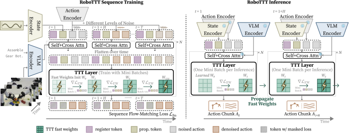{width="100%"}

::: {.srcnote}
Figure 2: sequence training on the left, inference on the right. We walk
through it properly in two slides.
:::
:::
::::

:::::


<!-- Slide 8: RW2 long context policies -->

## Related work II: three ways to hold a history {.smaller}

::::: {.slidebody}

:::: {.columns}
::: {.column width="32%"}
::: {.methodbox}
**Fixed short window**

Concatenate the last $k$ frames.

Cheap. Caps out. And on this paper's own Pup Go Car task it made things
[worse]{.hi-red}.
:::
:::

::: {.column width="32%"}
::: {.methodbox}
**Full autoregression**

Gato, VIMA, RoboCat, In-Context Robot Transformer.

Captures long dependencies well. Decoding latency grows [linearly with
context]{.hi-red}, even with a KV cache. Prohibitive on a real robot over a long
horizon.
:::
:::

::: {.column width="32%"}
::: {.methodbox}
**Recurrence**

LSTM policies. Constant inference cost.

But classic RNNs [scale worse]{.hi-red} than their attention counterparts.
:::
:::
::::

::: {.keybox}
**The gap this paper aims at.** Something with recurrence's constant cost and
attention's capacity, whose state is expressive enough to be worth scaling.
RoboTTT is an RNN policy whose recurrent state happens to be
[a small network's weights]{.hi}.
:::

:::::


<!-- Slide 9: NV-1 memory three shapes -->

## Memory, three shapes

::::: {.slidebody}

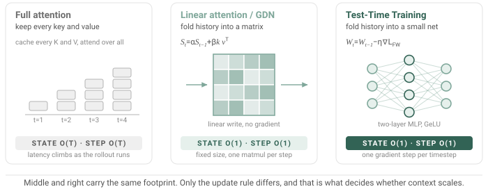{width="100%"}

:::::


<!-- Slide 10: delta rule lineage -->

## From accumulation to overwriting

::::: {.slidebody}

:::: {.columns}
::: {.column width="50%"}
[**Linear attention**]{.hi} (2020)

$$S_t = S_{t-1} + v_t k_t^{\top}$$

Pure accumulation. Write the same key twice and both writes stay in there,
superposed.

[**DeltaNet**]{.hi} (2021)

$$S_t = S_{t-1} + \beta_t\left(v_t - S_{t-1}k_t\right)k_t^{\top}$$

The [delta rule]{.hi}: look up what is currently stored at $k_t$, and correct
it toward $v_t$. Writing *replaces* instead of piling up.
:::

::: {.column width="48%"}
[**Gated DeltaNet**]{.hi} (2024)

Adds a learned decay so the state can also [forget]{.hi}. Efficient chunked
kernels made it practical at scale.

::: {.keybox}
**Why this slide exists**

Gated DeltaNet is not background here. It is this paper's
[**control condition**]{.hi-gold}: same layer positions, same gating, same
parameter count, [only the update rule differs]{.hi}.

Every comparison later in the talk turns on that one substitution.
:::
:::
::::

:::::


<!-- Slide 11: NV-2 spectrum -->

## The spectrum, and where TTT sits

::::: {.slidebody}



:::::


<!-- Slide 12: RW3 TTT lineage -->

## Related work III: Test-Time Training {.smaller}

::::: {.slidebody}

:::: {.columns}
::: {.column width="55%"}
The idea: a small subset of parameters, the [**fast weights**]{.hi}, is updated
by gradient descent on a self-supervised objective, [during training
*and* during inference]{.hi}.

- Language modelling first (Sun et al., 2024)
- Then video generation, vision, 3D reconstruction
- All sequential modalities. Robotics is the obvious next one and was, until
  this paper, missing

::: {.highlightbox}
**A naming trap.** Several robotics papers say "test-time training" for
something else entirely: collecting data on the test task and fine-tuning the
whole model. No fast weights involved.
:::
:::

::: {.column width="43%"}
::: {.keybox}
**Nearest prior work**

VITA (Ziakas et al., 2026) puts fast weights in a VLM, but to adapt a
[value function]{.hi}.

RoboTTT is the first to put them in the visuomotor policy itself, and the first
to ask what happens when you [scale the training context]{.hi-gold}.
:::

:::
::::

:::::


## Method {.divider .center background-color="#E8EDF5"}


<!-- Slide 14: NV-3 update then apply -->

## Update, then apply

::::: {.slidebody}



[.]{.fragment .beat-driver} [.]{.fragment .beat-driver} [.]{.fragment .beat-driver} [.]{.fragment .beat-driver} [.]{.fragment .beat-driver}

:::::


<!-- Slide 15: the two equations -->

## The two equations

::::: {.slidebody}

::: {.eqline}
[Eq. 1 &nbsp; update]{.eqtag}
$$W_t \leftarrow W_{t-1} - \eta\,\nabla_W \mathcal{L}_{\mathrm{FW}}\!\left(f_{W_{t-1}}(K_t),\, V_t\right)$$
:::

::: {.eqline}
[Eq. 2 &nbsp; apply]{.eqtag}
$$O_t = f_{W_t}(Q_t)$$
:::

:::: {.columns}
::: {.column width="49%"}
- $\mathcal{L}_{\mathrm{FW}}(\hat v, v) = \lVert \hat v - v \rVert^2$
- $\eta$ is [**learned**]{.hi}, on top of a constant base rate of 0.1
- $f_W$ is a [**two-layer MLP with GeLU**]{.hi}, not a linear layer
:::

::: {.column width="49%"}
::: {.keybox}
$\theta_Q, \theta_K, \theta_V$ and the initialisation $W_0$ are
[slow weights]{.hi}: learned by the outer task loss, frozen at inference.

$W$ itself is a [fast weight]{.hi}: it keeps moving after deployment.
:::
:::
::::

:::::


<!-- Slide 16: NV-4 inner outer -->

## Two loops, and the one that is easy to miss

::::: {.slidebody}

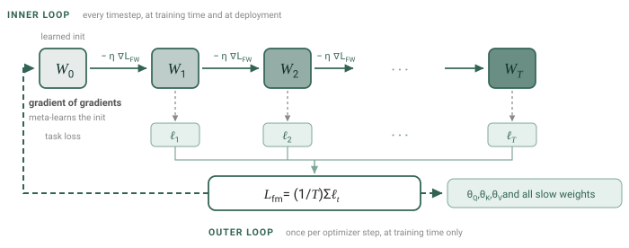{width="94%"}

:::::


<!-- Slide 17: robot sequence models -->

## What is being scaled
::::: {.slidebody}

A robot trajectory is a stream of tuples:
$$\xi = \left\{\left(o_t,\, q_t,\, A_t\right)\right\}_{t=1}^{T}
\qquad\text{image, proprioception, action chunk}$$

A robot [sequence model]{.hi} is a policy that conditions on the stream so far:
$$\pi\left(A_t \mid \xi_{<t},\, o_t,\, q_t\right)$$

::: {.keybox}
The quantity this paper scales is $\lvert \xi_{<t} \rvert$, the
[**number of past timesteps**]{.hi} the policy is conditioned on.

Not tokens. Not seconds. [**Control timesteps.**]{.hi-gold}
Hold on to that; we come back to it at the end.
:::

:::::


<!-- Slide 18: ANIM 1 architecture walkthrough -->

## Inside one DiT block

::::: {.slidebody}



[.]{.fragment .beat-driver} [.]{.fragment .beat-driver} [.]{.fragment .beat-driver} [.]{.fragment .beat-driver} [.]{.fragment .beat-driver}

:::::


<!-- Slide 19: architecture details -->

## Three details that carry weight {.smaller}

::::: {.slidebody}

:::: {.columns}
::: {.column width="55%"}
::: {.methodbox}
**1. TTT sits *after* attention.** Attention handles within-step structure; TTT
handles across-step structure. Clean division, and it is why the module ports
to other backbones.
:::

::: {.methodbox}
**2. The VL tokens $\Phi$ never enter the TTT path.** Too expensive. Instead
[$N = 16$ learned register tokens]{.hi} per timestep attend to everything and
carry the vision-language content across time.
:::

::: {.methodbox}
**3. The whole DiT input is one flat sequence.**
$$[\,R_1, \Phi_1, q_1, \tilde A_1,\; \ldots,\; R_T, \Phi_T, q_T, \tilde A_T\,]$$
:::
:::

::: {.column width="43%"}
{width="100%"}

::: {.srcnote}
Figure 2. Left: sequence training. Right: inference, fast weights propagating
forward one timestep at a time.
:::

::: {.highlightbox}
Register tokens are doing real work here. The ablation shows they add
[+18%]{.hi-green} on top of TTT, and [nothing at all]{.hi-red} when bolted onto
GR00T without it.
:::
:::
::::

:::::


<!-- Slide 20: ANIM 2 gating -->

## Gating: how not to break the pretrained model

::::: {.slidebody}



[.]{.fragment .beat-driver} [.]{.fragment .beat-driver} [.]{.fragment .beat-driver} [.]{.fragment .beat-driver} [.]{.fragment .beat-driver}

:::::


<!-- Slide 21: gating equation -->

## Gating, in one line {.smaller}

::::: {.slidebody}

::: {.eqline}
[Eq. 3]{.eqtag}
$$O = \tanh(\alpha) \odot O_{\mathrm{TTT}} + O_{\mathrm{attn}}$$
:::

:::: {.columns}
::: {.column width="52%"}
- $\alpha \in \mathbb{R}^d$, learned [per DiT layer]{.hi}
- Initialised to [**0.001**]{.hi-gold}, so $\tanh(\alpha) \approx 0.001$
- At step zero the model is, numerically, still GR00T N1.7
- The TTT path opens only as far as the loss asks it to

::: {.keybox}
This is why RoboTTT can be initialised from base-model weights and pretrain
[only the new layers]{.hi} for 30K steps without destroying what GR00T already
knew.
:::
:::

::: {.column width="46%"}
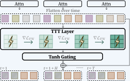{width="100%"}

::: {.srcnote}
Figure 3. Flattened tokens go through the TTT layer, then the tanh gate, then
rejoin the residual stream.
:::
:::
::::

:::::


<!-- Slide 22: sequence training -->

## Sequence training: the outer loss {.smaller}

::::: {.slidebody}

::: {.eqline}
[Eq. 4]{.eqtag}
$$\mathcal{L}_{\mathrm{fm}}(\xi; W_0) = \frac{1}{T}\sum_{t=1}^{T}
\ell_t\!\left(\left(l, o_t, q_t, A_t\right);\, W_{t-1}\right)$$
:::

- One training example is a [whole trajectory]{.hi}, or a contiguous
  sub-trajectory up to the context limit
- Run TTT forward along it. At timestep $t$ the policy is conditioned on
  $W_{t-1}$, the state the first $t-1$ steps produced
- Average the per-step flow-matching loss, then take [one]{.hi} optimiser step

::: {.keybox}
Both things move on that step: the ordinary model weights, and
[$W_0$, through gradients of gradients]{.hi-gold}. The initialisation is not
chosen, it is learned, and it is learned to be a good starting point *for
robot trajectories specifically*.
:::

:::::


<!-- Slide 23: ANIM 3 sequence action forcing -->

## Sequence action forcing

::::: {.slidebody}



[.]{.fragment .beat-driver} [.]{.fragment .beat-driver} [.]{.fragment .beat-driver} [.]{.fragment .beat-driver} [.]{.fragment .beat-driver}

:::::


<!-- Slide 24: eq 5 -->

## The full training objective {.smaller}

::::: {.slidebody}

::: {.eqline}
[Eq. 5]{.eqtag}
$$\mathcal{L}_{\mathrm{fm}}(\xi; W_0) = \frac{1}{T}\sum_{t=1}^{T}
\mathbb{E}_{\tau_t, \epsilon}\left[\left\lVert
v_\theta\!\left(\Phi_t, A_t^{\tau_t}, q_t;\, W_{t-1}\right) - \left(A_t - \epsilon\right)
\right\rVert^2\right]$$
:::

:::: {.columns}
::: {.column width="50%"}
$$A_t^{\tau} = \tau A_t + (1-\tau)\,\epsilon, \qquad \epsilon \sim \mathcal{N}(\mathbf{0}, \mathbf{I})$$

$$\tau_t = s(1-u), \quad u \sim \mathrm{Beta}(1.5, 1), \quad s = 0.999$$

The subscript on $\tau_t$ is the entire contribution. One noise level
[**per timestep**]{.hi}, drawn independently.
:::

::: {.column width="48%"}
::: {.highlightbox}
**How much does it matter?**

Removing sequence action forcing does not degrade the model gracefully. In the
ablation the resulting motions are inaccurate enough that the robot
[makes no meaningful progress at all]{.hi-red}.

This is a load-bearing detail, not a tuning trick.
:::
:::
::::

:::::


<!-- Slide 25: ANIM 4 TBPTT -->

## TBPTT: paying for context in time, not memory

::::: {.slidebody}



[.]{.fragment .beat-driver} [.]{.fragment .beat-driver} [.]{.fragment .beat-driver} [.]{.fragment .beat-driver} [.]{.fragment .beat-driver} [.]{.fragment .beat-driver}

:::::


<!-- Slide 26: ANIM 5 loss masking -->

## Loss masking: choosing what teaches and what only informs

::::: {.slidebody}



[.]{.fragment .beat-driver} [.]{.fragment .beat-driver} [.]{.fragment .beat-driver} [.]{.fragment .beat-driver} [.]{.fragment .beat-driver} [.]{.fragment .beat-driver}

:::::


<!-- Slide 27: implementation -->

## Implementation

::::: {.slidebody}

:::: {.columns}
::: {.column width="50%"}
[**Model**]{.hi}

| | |
|---|---|
| Backbone | GR00T N1.7 (Eagle VLM + DiT) |
| TTT layers | all 16 DiT layers |
| Fast model | 2-layer MLP, GeLU |
| Inner LR | learned, base 0.1 |
| Positional | RoPE, $\theta = 10{,}000$ |
| Params | 538M &rarr; [690M]{.hi-gold} |

: {.compactnum}

[**Deployment**]{.hi}

YAM bimanual, 4 &times; RealSense D405 at 480p, [**RTX 5090 @ 30 Hz**]{.hi-green}
:::

::: {.column width="48%"}
[**Training**]{.hi}

| | |
|---|---|
| Pretrain data | tabletop bimanual + EgoScale egocentric human video |
| Pretrain | 30K steps, [16 &times; GB200]{.hi}, new layers only |
| Post-train | 20K steps, 8 &times; GB200, 1K context, all params |
| Optimiser | AdamW, wd 1e-5 |
| Schedule | WSD peak 2e-5 / cosine peak 5e-5 |

: {.compactnum}

::: {.highlightbox}
Context is grown [gradually]{.hi} during pretraining up to the target. Global
batch drops from 64 to 16 above 4K context.
:::
:::
::::

:::::


## Experiments {.divider .center background-color="#E8EDF5"}


<!-- Slide 29: setup -->

## Three tasks, all bimanual, all long {.smaller}

::::: {.slidebody}

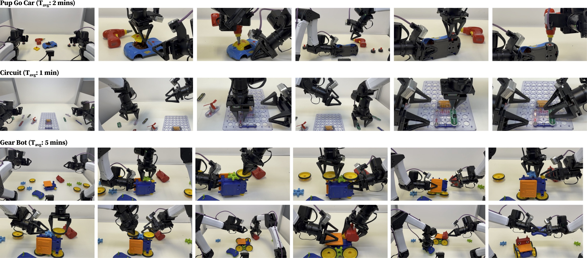{width="88%" fig-align="center"}

:::: {.columns}
::: {.column width="33%"}
[**Pup Go Car**]{.hi} &middot; 8 h data, ~2 min/episode

Roof, screw, drill, hand off the drill, flip the car, tire, drill again.
[14 rubric stages.]{.dim}
:::

::: {.column width="33%"}
[**Circuit**]{.hi} &middot; 6 h data, ~1 min/episode

~80 configurations. [**Train on 20, test on the other 60.**]{.hi-gold}
No partial credit if the order is wrong.
:::

::: {.column width="33%"}
[**Gear Bot**]{.hi} &middot; 5 h data, ~5 min/episode

Gears and wheels on both sides, two chassis flips, head, then drive it with the
remote. [10 stages.]{.dim}
:::
::::

:::::


<!-- Slide 30: tasks in motion -->

## What they look like at 1&times;

::::: {.slidebody}

:::: {.columns}
::: {.column width="33%"}
```{=html}
<video muted autoplay loop playsinline style="width:100%;border-radius:6px">
<source src="https://research.nvidia.com/labs/gear/robottt/videos/pup-go-car-1x.mp4" type="video/mp4">
<source src="videos/pup-go-car-1x.mp4" type="video/mp4">
</video>
```

[Pup Go Car]{.dim}
:::

::: {.column width="33%"}
```{=html}
<video muted autoplay loop playsinline style="width:100%;border-radius:6px">
<source src="https://research.nvidia.com/labs/gear/robottt/videos/circuit-1x-1.mp4" type="video/mp4">
<source src="videos/circuit-1x-1.mp4" type="video/mp4">
</video>
```

[Circuit]{.dim}
:::

::: {.column width="33%"}
```{=html}
<video muted autoplay loop playsinline style="width:100%;border-radius:6px">
<source src="https://research.nvidia.com/labs/gear/robottt/videos/gear-bot-1x-1.mp4" type="video/mp4">
<source src="videos/gear-bot-1x-1.mp4" type="video/mp4">
</video>
```

[Gear Bot]{.dim}
:::
::::

::: {.srcnote}
Real-time rollouts from the project page. Note the repeated, visually similar
stages: this is exactly where a single-step policy loses track of where it is.
:::

:::::


<!-- Slide 31: baselines -->

## Baselines, and why the last one matters most

::::: {.slidebody}

| Baseline | Context | What it tests |
|---|---|---|
| **GR00T N1.7** | current observation | the backbone, unmodified |
| **GR00T N1.7 Hist.** | + 1 history frame | does *any* history help? |
| **Gated DeltaNet** | 1K timesteps | [**does the update rule matter?**]{.hi-gold} |

: {.compactnum}

::: {.keybox}
The GDN baseline replaces RoboTTT's TTT layers with Gated DeltaNet layers and
matches [layer placement, gating, and parameter count]{.hi}.
Same footprint, same plumbing, [same amount of state]{.hi}.
The only difference is *how the state gets written*.

Keep this in view: it turns a "our method wins" table into an actual
experiment.
:::

Protocol: 20 trials per task (10 for Gear Bot), identical recorded initial
object placements across methods, a rubric-based completion score in $[0,1]$
plus a count of fully successful trials.

:::::


<!-- Slide 32: main results -->

## Main results

::::: {.slidebody}

:::: {.columns}
::: {.column width="54%"}
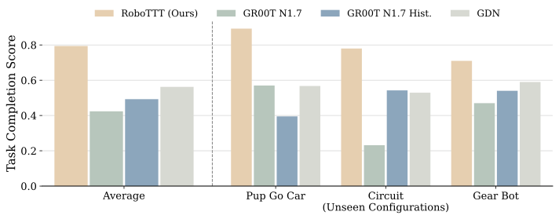{width="100%"}

::: {.srcnote}
Figure 7. Rubric-based task completion score, averaged over the three tasks.
:::
:::

::: {.column width="44%"}
::: {.statrow}
::: {.stat .win}
[79%]{.big}[RoboTTT]{.cap}
:::
::: {.stat .base}
[56%]{.big}[GDN]{.cap}
:::
::: {.stat .base}
[42%]{.big}[GR00T]{.cap}
:::
:::

**Fully successful trials** (Table 1)

| | Pup Go Car | Circuit | Gear Bot |
|---|:---:|:---:|:---:|
| **RoboTTT** | **9/20** | **13/20** | **2/10** |
| GR00T N1.7 | 3/20 | 3/20 | 0/10 |
| GR00T Hist. | 0/20 | 8/20 | 0/10 |
| GDN | 3/20 | 8/20 | 0/10 |

: {.compactnum}

::: {.keybox}
Gear Bot is the headline: a five-minute, ten-stage assembly completed
end to end, [which no baseline ever does]{.hi}.
:::
:::
::::

:::::


<!-- Slide 33: history is not free -->

## History, applied naively, is not free {.smaller}

::::: {.slidebody}

:::: {.columns}
::: {.column width="50%"}
On Pup Go Car:

::: {.statrow}
::: {.stat .base}
[57%]{.big}[GR00T, no history]{.cap}
:::
::: {.stat}
[39.5%]{.big}[GR00T + 1 frame]{.cap}
:::
:::

Adding a single history frame made the model [**worse**]{.hi-red}, by a wide
margin. Table 1 says the same thing more bluntly: 3/20 becomes
[0/20]{.hi-red}.
:::

::: {.column width="48%"}
::: {.highlightbox}
**Why**

Past actions are implicitly encoded in past observations. A policy given both
learns to read its own previous action off the frame instead of reading the
scene. At inference it then drifts temporally out of distribution.

This is a known failure mode with its own literature, and it is the reason
"just add history" was never the answer.
:::

::: {.keybox}
GDN improves on GR00T for Circuit and Gear Bot, but [not for Pup Go
Car]{.hi-red} either. Compressing history helps only if the compression is
good enough.
:::
:::
::::

:::::


<!-- Slide 34: context scaling -->

## The result the paper is really about {.smaller}

::::: {.slidebody}

:::: {.columns}
::: {.column width="58%"}
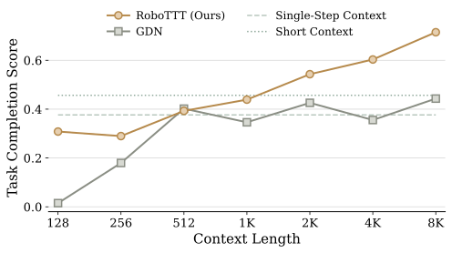{width="100%"}

::: {.srcnote}
Figure 8. Pretraining context length from 128 to 8K timesteps, then post-train
and evaluate closed-loop on all three tasks.
:::
:::

::: {.column width="40%"}
::: {.keybox}
**RoboTTT**: 43.9% at 1K &rarr; [**71.5% at 8K**]{.hi-green}.
[+63%]{.hi-green} over its own 1K variant, [+57%]{.hi-green} over the best
short-context baseline. [No sign of saturation.]{.hi}
:::

::: {.highlightbox}
**GDN**: no trend. Same footprint, same context lengths, same schedule.
:::

**The paper's explanation**, and it follows directly from the spectrum table:
gradient descent has an initialisation and update dynamics that the outer loss
can shape. Longer training sequences mean more update steps to shape them over.
[A linear associative state has nothing to meta-learn.]{.hi}

Below 1K it is weaker: 1K timesteps is half a minute, shorter than the
shortest episode. [Appendix A6.]{.dim}
:::
::::

:::::


<!-- Slide 35: one-shot imitation -->

## One-shot imitation from a human video

::::: {.slidebody}

:::: {.columns}
::: {.column width="56%"}
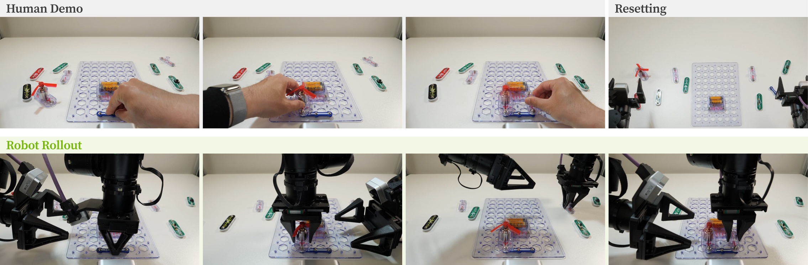{width="100%"}

```{=html}
<video muted autoplay loop playsinline style="width:100%;border-radius:6px;margin-top:6px">
<source src="https://research.nvidia.com/labs/gear/robottt/videos/circuit-1.mp4" type="video/mp4">
<source src="videos/circuit-1.mp4" type="video/mp4">
</video>
```
:::

::: {.column width="42%"}
The language prompt is [**"assemble circuit"**]{.hi} for every configuration.
The target is therefore identifiable [only from the in-context video]{.hi-gold}.

| | Score | Successes |
|---|:---:|:---:|
| **RoboTTT** | **65%** | **6/10** |
| GDN | 33% | 0/10 |

: {.compactnum}

::: {.keybox}
GDN does not fail by a little. It picks up the wrong components, or assembles
in the wrong order, [ten times out of ten]{.hi-red}.

It [encoded]{.hi} the video. It could not [use]{.hi} it.
:::
:::
::::

:::::


<!-- Slide 36: perturbation -->

## Perturbation robustness
::::: {.slidebody}

:::: {.columns}
::: {.column width="46%"}
```{=html}
<video muted autoplay loop playsinline style="width:100%;border-radius:6px">
<source src="https://research.nvidia.com/labs/gear/robottt/videos/perturbation-roof.mp4" type="video/mp4">
<source src="videos/perturbation-roof.mp4" type="video/mp4">
</video>
```
:::

::: {.column width="52%"}
A human removes the roof after the robot has installed it. A policy that
conditions on its own rollout should notice, go back, and reinstall it.

| | Roof | Tire |
|---|:---:|:---:|
| **RoboTTT** | **15/20** | **18/20** |
| GDN | 13/20 | **18/20** |
| GR00T N1.7 | 10/20 | 11/20 |
| GR00T Hist. | 3/20 | 5/20 |

: {.compactnum}

::: {.keybox}
Worth saying plainly: this is where GDN is [closest]{.hi}, and on tires it
[ties outright]{.hi}. 30 minutes of perturbation data was co-trained in, so
every method has some of this.
:::
:::
::::

:::::


<!-- Slide 37: DAgger Distillation -->

## On-the-fly improvement {.smaller}

::::: {.slidebody}

:::: {.columns}
::: {.column width="46%"}
```{=html}
<video muted autoplay loop playsinline style="width:100%;border-radius:6px">
<source src="https://research.nvidia.com/labs/gear/robottt/videos/on-the-fly-roof.mp4" type="video/mp4">
<source src="videos/on-the-fly-roof.mp4" type="video/mp4">
</video>
```

From the same [100 DAgger trajectories]{.hi}, 50 collected with RoboTTT as the
base policy and 50 with GR00T:
:::

::: {.column width="52%"}
- Standard DAgger, corrections only: [+13%]{.neutral} on the sequence models
- DAgger Distillation: [**+36%**]{.hi-green} for RoboTTT, [+29%]{.hi-green} for GDN

::: {.highlightbox}
Fine-tuning GR00T on the *full* trajectories, suboptimal robot actions
included, scores [57%]{.hi}. Identical to corrections alone.

The failures are worthless as targets. They are only valuable
[as context]{.hi-gold}.
:::

::: {.keybox}
GDN gains 29% too, so this is [not a TTT-specific trick]{.hi}. It applies to
sequence-model policies generally, which makes it the most portable idea in
the paper.
:::
:::
::::

:::::


## Reading the result {.divider .center background-color="#E8EDF5"}


<!-- Slide 38: limitations -->

## Limitations, as the authors state them

::::: {.slidebody}

::: {.methodbox}
**1. Scaling the training context costs training compute.**
Global batch drops from 64 to 16 above 4K. They point at TNT and similar
techniques as the way out.
:::

::: {.methodbox}
**2. The inner objective is generic.**
$\mathcal{L}_{\mathrm{FW}}$ is plain MSE reconstruction, inherited from the
language-modelling literature. Nothing about it is robotics-specific, and they
say so.
:::

::: {.methodbox}
**3. It does not fix every deployment failure.**
They name reinforcement learning, optimising task success directly, as the
natural next step.
:::

::: {.footnote}
Also unexplored by their own admission: better test-time optimisers such as
Muon, in place of plain gradient descent on the fast weights.
:::

:::::


<!-- Slide 39: insight 1 -->

## What the control condition actually shows {.smaller}

::::: {.slidebody}

::: {.keybox}
Gated DeltaNet and RoboTTT have the [same state size, same gating, same layer
placement, same parameter count]{.hi}. One substitution separates them.
:::

:::: {.columns}
::: {.column width="50%"}
Across the results, GDN behaves like this:

- Perturbation recovery: [nearly as good]{.hi-green} (13/20 and 18/20)
- DAgger Distillation: [benefits substantially]{.hi-green} (+29%)
- One-shot imitation from video: [0 / 10]{.hi-red}
- Context scaling: [no trend at all]{.hi-red}

The pattern is not "GDN is worse". It is [**GDN is fine until the task
requires reaching back into the context for something specific**]{.hi}.
:::

::: {.column width="48%"}
::: {.highlightbox}
**The reading I would offer**

Encoding a history and being able to *use* it are separate capabilities, and
this pair of models isolates them about as cleanly as a real-robot experiment
can.

A linear associative state accumulates; a gradient-updated nonlinear state is
*fit* to the history, and its starting point can be meta-learned. Only the
second gets better when you give it more context to be fit on.
:::

Same reason the ablation shows [TTT-Linear 27% worse than the MLP]{.hi}: as we
saw, TTT-Linear *is* the delta rule.
:::
::::

:::::


<!-- Slide 40: insight 2 -->

## Reading the numbers correctly {.smaller}

::::: {.slidebody}

:::: {.columns}
::: {.column width="50%"}
::: {.methodbox}
**"8K context" means 8,000 control timesteps.**
At 30 Hz that is [**4.4 minutes**]{.hi-gold}, not 8K tokens. The paper itself
says "over four minutes" in one section and "about five minutes" in another.
Worth stating precisely when you quote it.
:::

::: {.methodbox}
**"+87%" is a relative gain on a partial-credit rubric.**
79% versus 42% on a $[0,1]$ completion score. It is not a success rate.
The success rates are [9/20, 13/20, 2/10]{.hi}, which is a different and more
sobering picture, though still the best in the table by a clear margin.
:::
:::

::: {.column width="48%"}
::: {.methodbox}
**10 to 20 trials, no error bars, no code or weights.**

Be fair about this: a Gear Bot trial costs five minutes of real robot time, and
initial placements were recorded and replayed per method. But individual cells
are thin. The [scaling curve]{.hi} is the robust result, because it is a trend
across seven points rather than one comparison.
:::

::: {.keybox}
None of this makes the paper weaker. It makes the claim precise:
[**a trend, established carefully, on one backbone and three tasks.**]{.hi}
:::
:::
::::

:::::


<!-- Slide 41: takeaways -->

## Three things to take away {.smaller}

::::: {.slidebody}

::: {.keybox}
**1. The update rule decides whether context is worth scaling.**
Same state size, same cost, same plumbing. Gradient descent has an
initialisation and dynamics that an outer loss can shape; a linear associative
write does not.
:::

::: {.keybox}
**2. Loss masking separates *what conditions* from *what supervises*.**
One small mechanism buys both one-shot imitation from human video and
DAgger Distillation. And DAgger Distillation is not TTT-specific: it lifted the
GDN baseline by 29% too.
:::

::: {.keybox}
**3. Context length looks like a scaling axis for robot policies.**
128 to 8K, monotone, no saturation. One backbone, three tasks, so: a
well-supported hypothesis rather than a law. Someone should try to break it.
:::

<br>

::: {style="text-align:center"}
[**Thank you.**]{.hi style="font-size:1.4em"}

[Paper: arXiv:2607.15275 &nbsp;&middot;&nbsp;
Project page and all videos: research.nvidia.com/labs/gear/robottt]{.dim}
:::

:::::


## Appendix {.divider .center background-color="#E8EDF5" visibility="uncounted"}


<!-- A1 -->

## A1. Ablations {.smaller visibility="uncounted"}

::::: {.slidebody}

:::: {.columns}
::: {.column width="52%"}
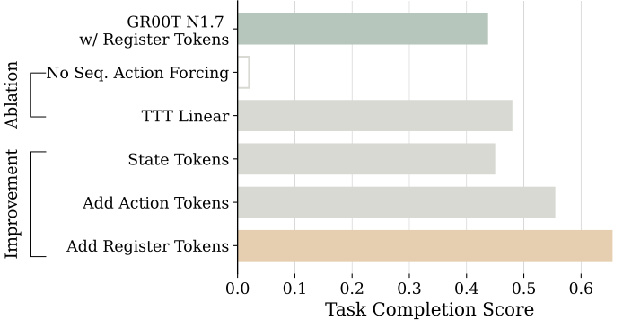{width="100%"}
:::

::: {.column width="46%"}
**Two variants**

- No sequence action forcing: motions become inaccurate enough that the robot
  makes [no meaningful progress]{.hi-red}
- TTT-Linear instead of the MLP fast model: beats GR00T, but
  [27% worse]{.hi-red} than the MLP

**The development roadmap**

- State tokens only &rarr; [+ action tokens: **+23%**]{.hi-green}
  ("aware of its past actions, the model better captures environment dynamics")
- &rarr; [+ register tokens: **+18%**]{.hi-green}
- Register tokens added to GR00T alone: [no help]{.hi-red}
:::
::::

:::::


<!-- A2 -->

## A2. DAgger Distillation in detail {.smaller visibility="uncounted"}

::::: {.slidebody}

:::: {.columns}
::: {.column width="50%"}
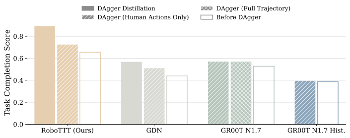{width="100%"}

Data: 50 DAgger trajectories collected with RoboTTT as base policy + 50 with
GR00T, pooled to 100 and used to train every method.
:::

::: {.column width="48%"}
| Method | Gain |
|---|:---:|
| Standard DAgger, all four methods | +9% |
| Standard DAgger, sequence models only | +13% |
| **DAgger Distillation, average** | **+33%** |
| &nbsp;&nbsp;RoboTTT | **+36%** |
| &nbsp;&nbsp;GDN | +29% |

: {.compactnum}

::: {.highlightbox}
GR00T fine-tuned on full trajectories = GR00T fine-tuned on corrections only =
[57%]{.hi}. Identical.
:::

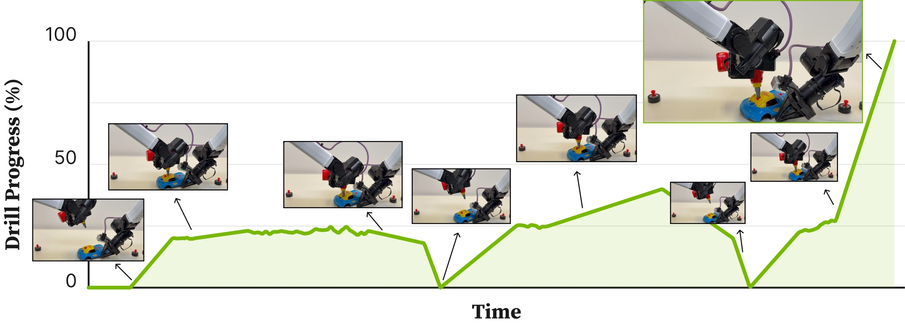{width="100%"}
:::
::::

:::::


<!-- A3 -->

## A3. Task rubrics {.smaller visibility="uncounted"}

::::: {.slidebody}

:::: {.columns}
::: {.column width="50%"}
**Pup Go Car**, 14 graded stages:

0.05 roof picked up &middot; 0.1 roof placed &middot; 0.25 roof screw inserted
&middot; 0.3 drill picked up &middot; 0.35 drill tip contacts screw &middot;
0.45 roof screw tightened &middot; 0.5 drill handed to right hand &middot;
0.55 car flipped and stabilised &middot; 0.6 tire picked up &middot;
0.75 tire inserted &middot; 0.8 drill picked up &middot; 0.85 drill aligned to
wheel screw &middot; 0.9 wheel tightened &middot; 1.0 drill handed to left hand

At most two attempts allowed for wheel assembly.
:::

::: {.column width="48%"}
**Gear Bot**, additive:
+0.1 per chassis flip, per gear or wheel installed, for the head, and for
successfully using the remote.

**Circuit**, depends on the configuration:

- 2 pieces, no switch: +0.5 each
- 2 pieces with switch: +0.33 each, +0.33 to turn it on
- 3 pieces, no switch: +0.33 each
- 3 pieces with switch: +0.25 each, +0.25 to turn it on

[**No partial credit if the assembly order is wrong.**]{.hi}
:::
::::

:::::


<!-- A4 -->

## A4. Task definitions {visibility="uncounted"}

::::: {.slidebody}

::: {.panel-tabset}
### Pup Go Car
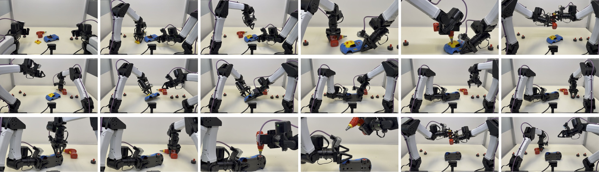{width="100%"}

### Gear Bot
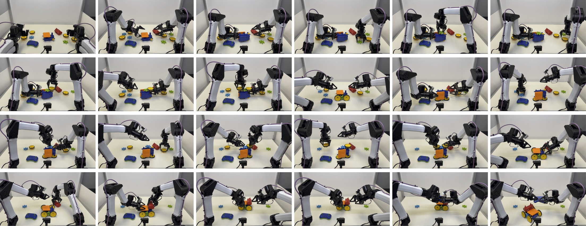{width="100%"}

### Circuit
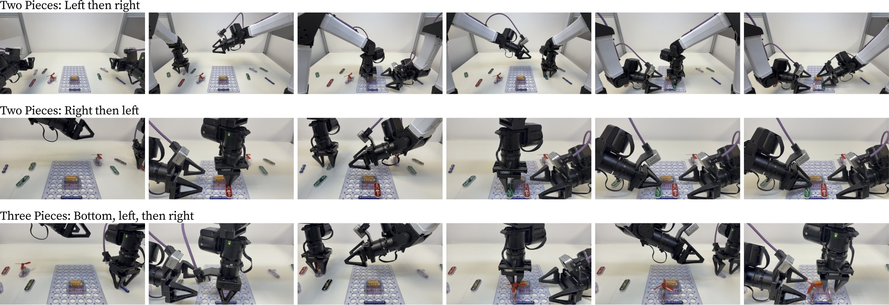{width="100%"}
:::

:::::


<!-- A5 -->

## A5. Training hyperparameters {.smaller visibility="uncounted"}

::::: {.slidebody}

| | Pretraining | Post-training |
|---|---|---|
| GPUs | 16 &times; GB200 | 8 &times; GB200 |
| Steps | 30K | 20K |
| What is trained | new sequence layers only (TTT or GDN) | all parameters |
| Context | grown gradually to target | 1K |
| Per-device batch | 4 (global 64) at &le; 4K, 1 (global 16) above | 1 |
| Optimiser | AdamW, weight decay 1e-5 | AdamW, weight decay 1e-5 |
| Schedule | WSD, peak 2e-5 | cosine, peak 5e-5 |

: {.compactnum}

**Data mixture**: tabletop bimanual robot data plus EgoScale egocentric human
video, curated to emphasise long trajectories.

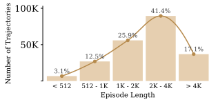{width="42%" fig-align="center"}

:::::


<!-- A6 -->

## A6. Why below 1K is weak {.smaller visibility="uncounted"}

::::: {.slidebody}

::: {.keybox}
1K timesteps at 30 Hz is [about half a minute]{.hi}, shorter than the shortest
episode in any of the three tasks (Circuit averages 1 minute).
:::

Two things go wrong at inference:

1. **The fast weights run past their training regime.** They keep updating far
   beyond the number of steps ever seen during training, so the update dynamics
   the outer loss shaped no longer describe the regime the model is in.
2. **Positional embeddings extrapolate.** RoPE positions extend to indices never
   observed in training.

::: {.highlightbox}
Note what this implies for the scaling curve: part of the gain from 1K to 8K is
[matching the training context to the rollout horizon]{.hi}, not pure capacity.
The curve keeps climbing past the point where the horizon is covered, which is
what makes it a scaling result rather than a fix.
:::

:::::


<!-- A7 -->

## A7. The GDN baseline, precisely {visibility="uncounted"}

::::: {.slidebody}

::: {.methodbox}
Each TTT layer is replaced by a **Gated DeltaNet** layer from the
[Flash Linear Attention]{.hi} library, keeping **layer placement, gating, and
parameter count matched** to RoboTTT.
:::

$$\text{GDN:}\quad S_t = \alpha_t S_{t-1}\left(I - \beta_t k_t k_t^{\top}\right)
+ \beta_t v_t k_t^{\top}$$

$$\text{TTT-Linear:}\quad W_t = W_{t-1} - 2\eta\left(W_{t-1}k_t - v_t\right)k_t^{\top}
= W_{t-1}\left(I - 2\eta\, k_t k_t^{\top}\right) + 2\eta\, v_t k_t^{\top}$$

::: {.keybox}
With $\alpha_t = 1$ and $\beta_t = 2\eta$ these are the [**same update**]{.hi}.
GDN adds a learned decay; TTT-MLP instead adds a nonlinearity and a
meta-learned $W_0$.

That is the entire axis this paper's comparison runs along.
:::

:::::


<!-- A8 -->

## A8. Full perturbation table and evaluation notes {.smaller visibility="uncounted"}

::::: {.slidebody}

:::: {.columns}
::: {.column width="46%"}
| Method | Roof | Tire |
|---|:---:|:---:|
| **RoboTTT** | **15/20** | **18/20** |
| GR00T N1.7 | 10/20 | 11/20 |
| GR00T N1.7 Hist. | 3/20 | 5/20 |
| GDN | 13/20 | **18/20** |

: {.compactnum}

Aggregate: RoboTTT [33/40 = 83%]{.hi-green}, best short-context baseline
[21/40 = 53%]{.neutral}.

30 minutes of perturbation data was collected and co-trained with the task
data, so *all* methods show some robustness.
:::

::: {.column width="52%"}
**Evaluation protocol**

- 20 rollouts for Pup Go Car and Circuit
- 10 for Gear Bot, and 10 for the one-shot Circuit setting, because of
  evaluation time
- Initial object placements [recorded and reproduced]{.hi} identically across
  methods
- Non-sequence baselines trained to a [matched compute budget]{.hi}
- Sequence models all post-trained at 1K context

::: {.highlightbox}
Tire perturbation is the one place the GDN baseline ties RoboTTT outright.
Worth conceding directly if it comes up.
:::
:::
::::

:::::

