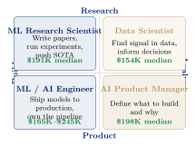
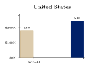
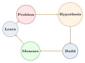
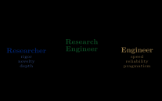
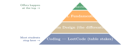

<!-- Slide 1: Title -->

## {background-color="white"}

::: {style="text-align: center; padding-top: 2em;"}
[**Career Roadmap for AI Researchers**]{style="font-size: 1.8em; color: #012169; font-weight: 700; display: block;"}

[**From Papers to Products**]{style="font-size: 1.4em; color: #012169; font-weight: 600; display: block; margin-top: 0.3em;"}

[SUNY Korea STEM Career Sprint 2026]{style="font-size: 1em; color: #B9975B; display: block; margin-top: 0.5em;"}

[Yunsung Lee · WoRV / Maum.ai · April 4, 2026]{style="font-size: 0.85em; color: #555; display: block; margin-top: 0.4em;"}

[*Stories from a Physical AI Research Lead & a 5M-User AI Agent Builder*]{style="font-size: 0.9em; color: #B9975B; display: block; margin-top: 1em;"}
:::

<!-- Slide 2: Who Am I? -->

## Who Am I?

:::: {.columns}
::: {.column width="55%"}
{fig-align="center" width="90%"}
:::
::: {.column width="42%"}
::: {style="text-align: center; padding-top: 1em;"}
[**10+**]{style="font-size: 2.2em; color: #012169; font-weight: 700;"}

Papers (ICLR, CVPR, NeurIPS)

[**1,844**]{style="font-size: 2.2em; color: #B9975B; font-weight: 700; display: block; margin-top: 0.8em;"}

Citations (Google Scholar)
:::

::: {.keybox}
Non-linear path. Intentional.
:::
:::
::::

<!-- Slide 3: What You'll Walk Away With -->

## What You'll Walk Away With

:::: {.columns}
::: {.column width="24%"}
::: {style="text-align: center;"}
::: {style="border: 2px solid #012169; background: #E8EDF5; border-radius: 6px; padding: 1em; font-weight: 700; color: #012169;"}
AI
Landscape
:::
[$245K median]{.neutral}
:::
:::
::: {.column width="24%"}
::: {style="text-align: center;"}
::: {style="border: 2px solid #B9975B; background: #faf5ec; border-radius: 6px; padding: 1em; font-weight: 700; color: #B9975B;"}
Product
Story
:::
[5M+ MAU]{.neutral}
:::
:::
::: {.column width="24%"}
::: {style="text-align: center;"}
::: {style="border: 2px solid #012169; background: #E8EDF5; border-radius: 6px; padding: 1em; font-weight: 700; color: #012169;"}
Research
Story
:::
[97.3% success]{.neutral}
:::
:::
::: {.column width="24%"}
::: {style="text-align: center;"}
::: {style="border: 2px solid #B9975B; background: #faf5ec; border-radius: 6px; padding: 1em; font-weight: 700; color: #B9975B;"}
Your Action
Plan
:::
[Start today]{.neutral}
:::
:::
::::

::: {style="text-align: center; margin-top: 1.2em;"}
[**3 real stories.**]{.hi} [**Concrete numbers.**]{.hi-gold} A career plan you can start today.
:::

# The AI Career Landscape in 2026 {background-color="#E8EDF5"}

<!-- Slide 4: AI Changed Everything -->

## AI Changed Everything

::: {style="text-align: center;"}
[**200,000,000**]{style="font-size: 3em; color: #012169; font-weight: 700;"}

**ChatGPT users.   Two years.**

The entire industry restructured around this number.
:::

:::: {.columns style="margin-top: 1em;"}
::: {.column width="45%"}
::: {.highlightbox}
**Before (2022)**

Software Engineer · Data Scientist
DevOps · Product Manager
:::
:::
::: {.column width="45%"}
::: {.keybox}
**After (2024--2026)**

[**AI Engineer**]{.hi} · [**MLOps Engineer**]{.hi}
[**AI PM**]{.hi} · [**AI Safety Researcher**]{.hi}
:::
:::
::::

::: {.footnote}
Source: OpenAI Feb 2025; LinkedIn Jobs on the Rise 2026; WEF Future of Jobs 2025
:::

<!-- Slide 5: The AI Job Map -->

## The AI Job Map {.smaller}

::: {style="text-align: center;"}
[**4 Paths.**]{.hi}   Researcher / Engineer / PM / Data.   Know the difference before you apply.
:::

{fig-align="center" width="85%"}

<!-- Slide 6: Salary Reality Check -->

## Salary Reality Check

::: {style="text-align: center;"}
[**$245,000**]{.hi}   US median total comp for AI engineers.

Korea? [**6% premium**]{.hi-gold} over non-AI. That gap is not a rumor.
:::

{fig-align="center" width="85%"}

::: {.footnote}
Source: Levels.fyi Q3 2025; Korea wage data 2025. Values in USD / KRW approximate.
:::

<!-- Slide 7: The Paradox -->

## The Paradox

:::: {.columns}
::: {.column width="44%"}
::: {style="text-align: center;"}
[**50%**]{style="font-size: 3em; color: #c0392b; font-weight: 700;"}

**AI/ML positions unfilled**

[92% increase in AI hiring demand]{.neutral}
:::
:::
::: {.column width="10%"}
::: {style="text-align: center; padding-top: 1.5em;"}
[**WHY?**]{style="color: #B9975B; font-size: 1.3em; font-weight: 700;"}
:::
:::
::: {.column width="44%"}
::: {style="text-align: center;"}
[**6.1%**]{style="font-size: 3em; color: #012169; font-weight: 700;"}

**CS graduates unemployed (2025)**

[CS ranks 7th highest unemployment among all college majors]{.neutral}
:::
:::
::::

::: {.highlightbox style="text-align: center; margin-top: 1em;"}
**Skills mismatch.** The market wants AI specialists who ship. It does not want generalists.
:::

<!-- Slide 8: What the Market Actually Wants -->

## What the Market Actually Wants

::: {style="text-align: center;"}
[**Not your GPA.**]{.negative}   [**Not your degree.**]{.negative}   [**Your ability to ship.**]{.hi}
:::

| [**What You Think They Want**]{.neutral} | [**What They Actually Hire For**]{.hi} |
|---|---|
| High GPA | Portfolio projects [**(38% of tech leaders)**]{.hi-gold} |
| Prestigious university | Internship experience [**(35%)**]{.hi-gold} |
| Certifications & courses | Public code / GitHub contributions [**(34%)**]{.hi-gold} |
| Knowing all the math | Can you ship end-to-end? |
| Publications (for eng. roles) | Deployed projects with real users |
| Long skills list | Depth in 2--3 areas + proof |

::: {.keybox style="text-align: center;"}
Only [**4%**]{.hi-gold} of hiring leaders cited credentials.   Only [**17%**]{.hi-gold} cited school prestige.
[Source: Fortune Tech Hiring Secrets, Dec 2025]{.neutral}
:::

<!-- Slide 9: Physical AI: The Next Frontier -->

## Physical AI: The Next Frontier {.smaller}

:::: {.columns}
::: {.column width="52%"}
::: {style="text-align: center;"}
[**$6B+**]{.hi}   VC into robotics, H1 2025 alone.

[$More than all of 2024 ($6.1B full year).]{.neutral}
:::

{fig-align="center" width="90%"}
:::
::: {.column width="45%"}
| | **Key Players** |
|---|---|
| NVIDIA | Isaac GR00T |
| Figure AI | $39B valuation |
| Tesla | Optimus |
| Google DeepMind | Gemini Robotics |
| Hyundai | Boston Dynamics |

::: {.keybox style="text-align: center; margin-top: 0.5em;"}
[**Korea:**]{.hi} 60% of CES 2026
Innovation Awards
[(168 of 284 companies)]{.neutral}
:::
:::
::::

::: {.footnote}
Source: Crunchbase 2025; Marion Street Capital; KoreaTechDesk CES 2026
:::

<!-- Slide 10: Korea's ₩10.1 Trillion AI Bet -->

## Korea's ₩10.1 Trillion AI Bet

::: {style="text-align: center;"}
[**₩10.1T**]{style="font-size: 3em; color: #012169; font-weight: 700;"}

**Korea's 2026 AI national budget.**

[**206% increase**]{.hi-gold} from 2025.
:::

:::: {.columns style="margin-top: 1em;"}
::: {.column width="30%"}
::: {.methodbox}
**Government**

₩200B for 5 sovereign AI foundation models

Manufacturing AI (M.AX): ₩700B in 2026
:::
:::
::: {.column width="30%"}
::: {.resultbox}
**Industry**

Samsung + SK + Hyundai
[**₩703T**]{.hi} combined investment pledge
:::
:::
::: {.column width="35%"}
::: {.keybox}
**Ecosystem**

Seoul: [**#2 global AI city**]{.hi-gold}
(Counterpoint Research 2025)

45.5% of Q3 2025 funded Korean startups are AI
:::
:::
::::

::: {.footnote}
1 USD ≈ 1,400 KRW for context
:::

<!-- Slide 11: Two Paths I Took -->

## Two Paths I Took

{fig-align="center" width="80%"}

::: {.keybox style="text-align: center;"}
Both roads converge on one skill:   [**knowing what problem to solve.**]{.hi}
:::

# Building a 5M-User AI Agent {background-color="#E8EDF5"}

[**My Wrtn Story**]{.hi-gold style="display: block; text-align: center; font-size: 1.2em; margin-top: 0.5em;"}

<!-- Slide 12: Wrtn Technologies -->

## Wrtn Technologies

::: {style="text-align: center;"}
Korea's [**#1**]{.hi} AI-native startup.

*I joined when the stakes were highest.*
:::

::: {.methodbox style="text-align: center; margin-top: 1em;"}
Seoul · Founded 2022 · Oct 2023--Apr 2025: Yunsung Lee, AI Engineer
:::

::: {style="text-align: center; margin-top: 0.8em;"}
Korea's most-used AI productivity platform.

["My Own AI" — a personal assistant that actually knows you.]{.neutral}
:::

<!-- Slide 13: 5M+ Users Hero Stat -->

## "My Own AI" — 5M+ Users {background-color="white"}

::: {style="text-align: center; padding-top: 2em;"}
[**5,000,000+**]{style="font-size: 3.5em; color: #012169; font-weight: 700;"}

**Monthly Active Users**

*I owned this product end-to-end.*

[My Own AI autonomous agent · Wrtn Technologies · 2023--2025]{.neutral}
:::

<!-- Slide 14: Memory & Personalization RAG -->

## Memory & Personalization RAG

:::: {.columns}
::: {.column width="47%"}
::: {.highlightbox}
**Before: Generic AI**

::: {style="text-align: center;"}
["How can I help you today?"]{style="color: gray;"}

[No memory. No context. Starts from zero every session.]{.neutral}
:::
:::
:::
::: {.column width="47%"}
::: {.keybox}
**After: Personalized AI**

::: {style="text-align: center;"}
[**"Good morning — your presentation is today. Want help with the opening?"**]{.hi}

[**Remembers. Anticipates. Personalizes.**]{.positive}
:::
:::
:::
::::

::: {style="text-align: center; margin-top: 1em;"}
[**+12.7%**]{style="font-size: 2.5em; color: #27ae60; font-weight: 700;"}

**Week-1 Retention Lift**

*Memory changed everything.*
:::

<!-- Slide 15: Real-time Web Search RAG -->

## Real-time Web Search RAG

::: {style="text-align: center;"}
*"What's the weather in Busan?"   The AI had to [**actually know**]{.hi}.*
:::

{fig-align="center" width="85%"}

::: {style="text-align: center; margin-top: 0.8em;"}
Latency target:  [**< 3 seconds**]{.hi} end-to-end

["A personal AI that doesn't know today's news isn't really personal."]{.neutral style="font-style: italic;"}
:::

<!-- Slide 16: Voice Calls with GPT-4o Realtime -->

## Voice Calls with GPT-4o Realtime

::: {style="text-align: center;"}
OpenAI released the Realtime API.

We shipped voice calls in [**2 weeks**]{.hi}.
:::

{fig-align="center" width="85%"}

::: {.keybox style="text-align: center;"}
[**Speed is a product strategy.**]{.hi}
[Clarity of purpose, not cleverness of code.]{.neutral}
:::

<!-- Slide 17: Proactive Messaging -->

## Proactive Messaging

::: {style="text-align: center;"}
[**What if AI reached out to YOU?**]{.hi}

*Before you even asked.*
:::

:::: {.columns style="margin-top: 0.8em;"}
::: {.column width="30%"}
::: {.methodbox style="text-align: center;"}
**Calendar**

**2:00 PM**
Presentation
:::
:::
::: {.column width="8%"}
::: {style="text-align: center; padding-top: 1.5em; font-size: 1.5em; color: #B9975B;"}
→
:::
:::
::: {.column width="55%"}
::: {.keybox}
**AI Message**

*"Your presentation is in 2 hours. Need help with your talking points?"*
:::
:::
::::

::: {style="text-align: center; margin-top: 0.8em;"}
Context + Calendar [**→**]{.hi-gold} Proactive Reminder

[System-initiated, context-driven outreach.]{.neutral}
:::

<!-- Slide 18: The Startup Grind -->

## The Startup Grind

[**Monday**]{.hi}   Ship a feature.

[**Tuesday**]{.hi-gold}   It breaks in production.

[**Wednesday**]{.hi}   Fix it while planning the next one.

::: {.highlightbox style="text-align: center; margin-top: 1.2em;"}
This is not a complaint.   [**This is the job.**]{.hi}
:::

::: {style="text-align: center; margin-top: 0.8em;"}
[In 18 months at Wrtn: more learning than 5 years at a slower org.]{.neutral}
:::

<!-- Slide 19: What I Got Wrong -->

## What I Got Wrong

:::: {.columns}
::: {.column width="47%"}
::: {.highlightbox}
**What I built**

::: {style="text-align: center;"}
Complex layered memory hierarchy
Short-term · Episodic · Semantic

[*Technically elegant.*]{.neutral}
:::
:::
:::
::: {.column width="47%"}
::: {.keybox}
**What users needed**

::: {style="text-align: center;"}
[**"Just tell me what to do next."**]{.hi}

[**Simple. Direct. Clear.**]{.positive}
:::
:::
:::
::::

::: {style="text-align: center; margin-top: 0.9em;"}
[**−3 weeks**]{.negative}   of team rework.

::: {.resultbox style="text-align: center;"}
[**User problem > technical solution.**]{.hi}
:::
:::

<!-- Slide 20: Skills That Actually Mattered -->

## Skills That Actually Mattered {.smaller}

| [**What I Thought Mattered**]{.neutral} | [**What Actually Mattered**]{.hi} | [**What You Should Build**]{.hi-gold} |
|---|---|---|
| PyTorch proficiency | Problem definition | One deployed project |
| Publications | Shipping speed | One user interview |
| Algorithm knowledge | User empathy | One metric improved |

::: {.keybox style="text-align: center; margin-top: 0.9em;"}
Technical skills are the [entry ticket]{.neutral}.
[**Judgment**]{.hi} is the differentiator.
:::

<!-- Slide 21: Startup vs. Big Tech -->

## Startup vs. Big Tech --- Honest Truth {.smaller}

| | [**Startup**]{.hi} | [**Big Tech**]{.hi-gold} |
|---|---|---|
| Learning speed | [**3--5 yrs in 1 yr**]{.positive} | Deep but narrow |
| Salary (US) | $90K--$220K | $200K--$550K TC |
| Ownership | [**High, direct**]{.positive} | Medium |
| Risk | [**High (90% fail)**]{.negative} | Low--Medium |
| Work hours | [**50--70+ hrs**]{.negative} | 40--55 hrs |

::: {style="text-align: center; margin-top: 0.8em;"}
*Neither is better.   [**It depends on who you are.**]{.hi}*
:::

<!-- Slide 22: How to Think Like a Product Engineer -->

## How to Think Like a Product Engineer

::: {style="text-align: center;"}
[**Start with the user's problem.**]{.hi}   Everything else is implementation detail.
:::

{fig-align="center" width="55%"}

::: {style="text-align: center; margin-top: 0.3em;"}
*Repeat. Forever.*

[This is not a startup framework. This is how good engineers everywhere think.]{.neutral}
:::

<!-- Slide 23: Part 2 Takeaway -->

## {background-color="#012169"}

::: {style="text-align: center; padding-top: 3em; color: white;"}
*"The 5M users came from problem definition,*

*not better algorithms."*
:::

# Leading a Physical AI Research Team {background-color="#E8EDF5"}

[**WoRV at Maum.ai**]{.hi-gold style="display: block; text-align: center; font-size: 1.2em; margin-top: 0.5em;"}

<!-- Slide 24: WoRV — Three Pillars -->

## WoRV --- World of Robotic Vision

:::: {.columns}
::: {.column width="32%"}
::: {.methodbox style="text-align: center;"}
**Navigation**

[**Navigation**]{.hi}

Robots that find their way
:::
:::
::: {.column width="32%"}
::: {.methodbox style="text-align: center;"}
**Manipulation**

[**Manipulation**]{.hi}

Robots that use their hands
:::
:::
::: {.column width="32%"}
::: {.methodbox style="text-align: center;"}
**Sim / Eval**

[**Sim / Eval**]{.hi}

Infrastructure to prove it works
:::
:::
::::

::: {style="text-align: center; margin-top: 1.2em;"}
*"I joined as Head of Research in May 2025."*
:::

<!-- Slide 25: SketchDrive -->

## SketchDrive: Draw a Map. The Robot Drives It.

- Hand-drawn sketch → robot navigation route
- VLA-based: vision + language + action in one model
- [**InternVL**]{.hi} backbone: [**2× faster**]{.hi} inference vs. alternatives
- Data pipeline: [**4--5 days**]{.negative} → [**2--3 hours**]{.positive}
- [**9 production releases**]{.hi}: v0.1.0 (Jan 2025) → v0.2.5 (Jun 2025)

::: {.keybox}
Source: CANVAS, ICRA 2025 (arXiv:2410.01273) · SketchDrive mono-repo
:::

<!-- Slide 26: GINT — Autonomous Agricultural Robot -->

## GINT: Autonomous Agricultural Robot

{fig-align="center" width="92%"}

::: {style="text-align: center; margin-top: 0.2em;"}
[**0% failure rate at final eval**]{.positive}

[**100+ commercial contracts**]{.hi}, Korea + Japan
:::

<!-- Slide 27: D2E: Games → Robots -->

## D2E: Desktop-to-Embodied AI

*Can game recordings teach robots?*

- [**1,300 hours**]{.hi} of game data (1,000h from YouTube)
- Collected in [**under 1 week**]{.hi} by 1 person
- Robot manipulation: [**96.6% success**]{.positive} on LIBERO benchmark
- Beats models up to [**7× larger**]{.hi} ($\pi_0$ 3.3B, OpenVLA 7B)
- Navigation: [**83.3% success**]{.positive} on CANVAS

::: {.keybox}
[**ICLR 2026 — top 10%**]{.hi} · Yunsung Lee, corresponding author
:::

<!-- Slide 28: Open Source Accelerates Everything -->

## Open Source Accelerates Everything

:::: {.columns}
::: {.column width="50%"}
::: {.methodbox}
**VLA Eval Harness**

`vla-eval` (arXiv:2603.13966)

- [**47×**]{.hi} throughput improvement
- [**14h**]{.negative} → [**18 min**]{.positive} (2,000 LIBERO eps.)
- [**13**]{.hi} benchmarks supported
- Apache 2.0 — pip installable
:::
:::
::: {.column width="47%"}
::: {.methodbox}
**OWA — Open World Agents**

Desktop agent data framework

- [**400,000**]{.hi} lines of code
- [**226**]{.hi} Pull Requests
- [**1,960**]{.hi} commits
:::
:::
::::

<!-- Slide 29: CORE Cluster -->

## CORE: Compute-Oriented Research Environment {.smaller}

DGX H100 cluster --- built by the research team.

| **Metric** | **Before** | **After** | **Improvement** |
|---|---|---|---|
| Storage bandwidth | 10 MB/s | 1 GB/s | [**100×**]{.hi} |
| Storage capacity | 28 TB | 100 TB | [**3.5×**]{.hi} |
| Multi-node training | bottlenecked | linear | [**~4×**]{.hi} |

::: {style="text-align: center; margin-top: 0.6em;"}
[**70,000+**]{.hi} Slurm jobs completed (as of Dec 2025)
:::

::: {.keybox}
*"Good infrastructure is invisible when it works."*
:::

<!-- Slide 30: How We Run the WoRV Research Team -->

## How We Run the WoRV Research Team

- [**Monthly OKRs**]{.hi} --- goals everyone can see and question
- [**Bi-weekly paper seminars**]{.hi} --- what the field is doing
- [**Daily standups**]{.hi} --- what is blocking you right now
- [**Code review on all research code**]{.hi} --- not just production
- [**1-on-1s every 3 weeks**]{.hi} --- career, not just tasks
- [**Public failure post-mortems**]{.hi} --- when evals drop, we discuss why

<!-- Slide 31: Researcher Career Paths -->

## Three Roads into Research {.smaller}

| | **Academia** | **Industry Lab** | **Startup Research** |
|---|---|---|---|
| Freedom | [**Highest**]{.positive} | Medium | [**Medium-Low**]{.negative} |
| Salary | [**Lowest**]{.negative} | [**Highest**]{.positive} | Medium |
| Impact timeline | Years | Months | [**Weeks**]{.positive} |
| Pub. pressure | [**Very high**]{.negative} | High | Medium |
| Job security | [**Low**]{.negative} | Medium | [**Low**]{.negative} |
| What you learn | Ask new questions | How to scale | [**How to ship**]{.hi} |

::: {style="text-align: center; margin-top: 0.8em;"}
[*"None of these is objectively better. Know who you are first."*]{.neutral}
:::

<!-- Slide 32: What Actually Gets Papers Accepted -->

## What Actually Gets Papers Accepted {.smaller}

[**10+ top-tier publications**]{.hi} (ICLR, CVPR, NeurIPS, ECCV, AAAI, ICRA) · [**1,800+ citations**]{.hi}

1. [**Write the abstract first**]{.hi} --- if you can't summarize in 5 sentences, the idea isn't ready
2. [**Think like a reviewer**]{.hi} --- every claim needs evidence; every baseline needs a reason
3. [**Pick the right venue**]{.hi} --- match your paper's identity to the venue's culture
4. [**Iterate the story**]{.hi}, not just the experiments --- a paper is an argument, not a lab report
5. [**Submit early, reject fast**]{.hi} --- one rejection cycle = 3--6 months of signal
6. [**Collaborate**]{.hi} with people smarter than you --- D2E had 7 co-authors

<!-- Slide 33: GINT: Lab → Field → 100+ Farms -->

## GINT: Lab → Field → 100+ Farms

1. [**Simulation research**]{.hi} --- Sim2Real method, 29% → 50%
2. [**Lab prototype**]{.hi} --- 87.5% with 2.5h real data
3. [**Field evaluation**]{.hi} --- 4 evals in 8 days, November 2025
4. [**Final result**]{.positive} --- [**97.3% success, 0% failure rate**]{.hi}
5. [**Commercial deployment**]{.positive} --- [**100+ contracts**]{.hi}, Korea + Japan

::: {.keybox}
*"Research that doesn't ship is just a hobby."*
:::

<!-- Slide 34: The Research Engineer Mindset -->

## The Research Engineer Mindset

{fig-align="center" width="55%"}

| Is this true? | + | Does this work? |
|---|---|---|
| Is this novel? | + | Is this fast enough? |
| Is this rigorous? | + | Can someone else run it? |

<!-- Slide 35: Part 3 Takeaway -->

## {background-color="#012169"}

::: {style="text-align: center; padding-top: 3em; color: white;"}
**Research is still about**

**solving someone's real problem.**
:::

# Career Preparation {background-color="#E8EDF5"}

[**The Blunt Truth**]{.hi-gold style="display: block; text-align: center; font-size: 1.2em; margin-top: 0.5em;"}

<!-- Slide 36: Your Portfolio Is Your Proof -->

## Your Portfolio Is Your Proof

:::: {.columns}
::: {.column width="47%"}
::: {.highlightbox}
**Transcript**

::: {style="text-align: center;"}
[~~GPA 3.9~~]{style="color: #c0392b; font-size: 1.3em;"}

[Only 4% of tech leaders cite credentials as #1 signal]{.neutral}
:::
:::
:::
::: {.column width="47%"}
::: {.keybox}
**GitHub**

::: {style="text-align: center;"}
[**Portfolio**]{style="color: #27ae60; font-size: 1.3em;"}

[**38%**]{.hi} of tech leaders cite this as their #1 hiring signal
:::
:::
:::
::::

::: {style="text-align: center; margin-top: 1em;"}
**"Nobody cares about your GPA.**

**Show me what you've built."**
:::

::: {.footnote}
Only 23% cite degree; 17% cite school prestige; 4% cite certifications. Source: Fortune Tech Hiring Secrets, Dec 2025
:::

<!-- Slide 37: The Portfolio Skeleton -->

## The Portfolio Skeleton

::: {.keybox}
**Minimum Viable Portfolio**

1. [**GitHub profile**]{.hi} with green contribution squares
   [Activity > perfection]{.neutral}
2. [**Tech blog**]{.hi} with 5+ posts
   [Write about what you build]{.neutral}
3. [**3 projects**]{.hi} with READMEs and at least one live demo
   [Deploy at least one]{.neutral}
:::

::: {style="text-align: center; margin-top: 1em;"}
*"This is the minimum. Not the ideal."*

If even one project has a live demo URL — you are ahead of [**90%**]{.hi} of applicants.
:::

<!-- Slide 38: Good vs. Bad Portfolio -->

## Good vs. Bad Portfolio

:::: {.columns}
::: {.column width="47%"}
::: {.highlightbox}
**Before ✗**

"Built a calculator app in Java"

[0 stars · no README]{.neutral}
[last commit 8 months ago]{.neutral}
:::
:::
::: {.column width="47%"}
::: {.keybox}
**After ✓**

"Built a RAG chatbot for lecture notes — deployed on HuggingFace Spaces, 1K queries/day, Claude API + ChromaDB"

[**Live demo · recent commits**]{.positive}
:::
:::
::::

::: {style="text-align: center; margin-top: 1em;"}
| [Vague]{.negative} | → | [Specific]{.positive} |
|---|---|---|
| [Local only]{.negative} | → | [Deployed]{.positive} |
| [No numbers]{.negative} | → | [Metrics]{.positive} |
:::

<!-- Slide 39: If Your GitHub Has Only Class Assignments -->

## {background-color="white"}

::: {style="text-align: center; padding-top: 2em;"}
**"If your GitHub has only class assignments..."**

you are competing with everyone who also did the homework.

[**Stand out or get filtered out.**]{style="font-size: 1.5em; color: #c0392b; font-weight: 700; display: block; margin-top: 1em;"}
:::

<!-- Slide 40: What to Build This Month -->

## What to Build This Month

::: {style="text-align: center;"}
**Pick ONE. Ship it. Deploy it. Write about it.**
:::

::: {.keybox}
[**Beginner**]{.positive} (4--8h)
: CLI tool with Copilot → publish on PyPI

[**Intermediate**]{.hi-gold} (6--10h)
: Full-stack app with Cursor + v0 → deploy on Vercel

[**Advanced**]{.negative} (4--6h)
: RAG chatbot with Claude API + ChromaDB → HuggingFace Spaces
:::

::: {style="text-align: center; margin-top: 0.8em;"}
*All three are free to deploy. All three demonstrate production-relevant skills.*
:::

<!-- Slide 41: AI Tools You Must Know -->

## AI Tools You Must Know

::: {style="text-align: center;"}
[**41%**]{style="font-size: 3.5em; color: #012169; font-weight: 700;"}

of all code is AI-generated or AI-assisted

[Stack Overflow Developer Survey, 2026]{.neutral}
:::

::: {style="text-align: center; margin-top: 0.8em;"}
[**Claude**]{.hi} · [**ChatGPT**]{.hi} · [**Cursor**]{.hi} · [**Copilot**]{.hi} · [**v0**]{.hi}
:::

::: {.highlightbox style="text-align: center;"}
**These are not optional anymore.**
:::

<!-- Slide 42: Build 10x Faster -->

## Build 10× Faster

:::: {.columns}
::: {.column width="47%"}
::: {.highlightbox}
**2020**

::: {style="text-align: center;"}
Full-stack app

[**3--4 months**]{.negative}

[Learn React, Node, Auth, CSS, deploy — all from scratch]{.neutral}
:::
:::
:::
::: {.column width="47%"}
::: {.keybox}
**2026**

::: {style="text-align: center;"}
Same app

[**1 weekend**]{.positive}

[v0 generates UI (30 min) Cursor adds backend (2 hrs) Deploy on Vercel (5 min)]{.positive}
:::
:::
:::
::::

::: {style="text-align: center; margin-top: 1.2em;"}
**Same app.   Same quality.   [10× faster.]{.hi}**
:::

<!-- Slide 43: AI for Resume & Interview -->

## AI for Resume & Interview

::: {style="text-align: center;"}
**"This is not cheating."**
:::

1. [**Claude**]{.hi} --- paste your resume, ask it to rewrite bullets using STAR with metrics
2. [**ChatGPT**]{.hi} --- "Interview me for an AI engineering role. Ask a medium LeetCode problem."
3. [**Rezi or Kickresume**]{.hi} --- ATS score checker; 75%+ of resumes are filtered before human review

::: {.keybox style="text-align: center;"}
Rezi free tier · ChatGPT free tier · Claude free tier
[Total cost to overhaul your entire job-search stack: $0]{.neutral}
:::

<!-- Slide 44: The 10x Student Framework -->

## The 10× Student Framework {.smaller}

| [**Traditional (2020)**]{.neutral} | [**10× Student (2026)**]{.hi} |
|---|---|
| 1--2 projects/year | [**1--2 projects/month**]{.positive} |
| 80% time on boilerplate | [**80% time on architecture**]{.positive} |
| Limited to studied tech | [**Comfortable with any stack**]{.positive} |
| Portfolio = coursework | [**Portfolio = initiative**]{.positive} |

::: {.keybox style="text-align: center; margin-top: 1em;"}
[**AI writes the code.   You own the understanding.**]{.hi}
:::

<!-- Slide 45: The STAR Method -->

## The STAR Method

::: {style="text-align: center; margin-bottom: 0.5em;"}
[**S**ituation]{.hi} → [**T**ask]{.hi} → [**A**ction]{.hi} → [**R**esult]{.hi}
:::

::: {.methodbox}
**Real Example --- Wrtn**

**S:** Chatbot had 30% user drop-off after first session.
**T:** Reduce drop-off by improving personalization.
**A:** Built a memory RAG system storing preferences across sessions.
**R:** Week-1 retention [**+12.7%**]{.positive}.
:::

::: {style="margin-top: 0.5em;"}
["Worked on improving user experience"]{.negative} vs. ["Built memory RAG → +12.7% week-1 retention"]{.positive}
:::

<!-- Slide 46: Resume Before → After -->

## Resume: Before → After

:::: {.columns}
::: {.column width="47%"}
::: {.highlightbox}
**Before ✗**

"Worked on machine learning project"

"Familiar with Python and TensorFlow"

"Participated in data analysis team"
:::
:::
::: {.column width="47%"}
::: {.keybox}
**After ✓**

"Built recommendation engine improving CTR by [**23%**]{.positive} for 50K users (PyTorch + Redis)"

"Reduced inference latency [**850ms → 120ms**]{.positive} via TensorRT"

"Led 3-person pipeline team; data freshness [**6h → 15min**]{.positive}"
:::
:::
::::

::: {style="text-align: center; margin-top: 0.8em;"}
Formula: [**Built [what] using [tools] resulting in [metric]**]{.hi}
:::

<!-- Slide 47: The Interview Pyramid -->

## The Interview Pyramid

{fig-align="center" width="65%"}

::: {.footnote}
LeetCode gets you through the door. System design + ML fundamentals get you the offer.
:::

<!-- Slide 48: Culture Fit: What They're Really Asking -->

## Culture Fit: What They're Really Asking

*"Tell me about a conflict"*
: = Can you work with humans?

*"Describe a time you failed"*
: = Do you take ownership or blame others?

*"Why this company?"*
: = Did you spend 30 minutes researching us?

::: {.keybox style="text-align: center; margin-top: 1em;"}
Prepare [**5 STAR stories**]{.hi} before every interview.
Map them to these question types. Reuse and adapt.
:::

<!-- Slide 49: Stop Listing Technologies -->

## Stop Listing Technologies

::: {.highlightbox}
**✗ Skills: Python, TensorFlow, Docker, AWS, PyTorch, React, MongoDB, Redis, Kubernetes, Git**

[Every CS student lists the same 10 keywords. This tells me nothing.]{.neutral}
:::

::: {.keybox style="margin-top: 0.8em;"}
**✓ Show, don't list**

"Deployed a real-time inference pipeline serving [**10K req/s**]{.hi} on AWS,
using PyTorch + TensorRT + Redis caching.
Reduced P99 latency from 2.1s to [**180ms**]{.positive}."
:::

::: {style="text-align: center; margin-top: 0.8em;"}
Any student can [list]{.negative} Python. Very few can [show]{.positive} what they built with it.
:::

<!-- Slide 50: Year-by-Year Roadmap -->

## Year-by-Year Roadmap {.smaller}

:::: {.columns}
::: {.column width="24%"}
::: {.methodbox}
**Year 1: Explore**

Python + ML basics

First GitHub commits

Join one community
:::
:::
::: {.column width="24%"}
::: {.methodbox}
**Year 2: Build**

2 side projects

First internship app

Start blogging
:::
:::
::: {.column width="24%"}
::: {.keybox}
**Year 3: Ship**

3 deployed projects

AI internship

Open source PR
:::
:::
::: {.column width="24%"}
::: {.keybox}
**Year 4: Land**

Polish portfolio

Interview prep

Internship → FTE
:::
:::
::::

::: {style="text-align: center; margin-top: 0.7em;"}
2+ AI-specific internships = dramatically better outcomes [**regardless of GPA**]{.hi}.

[Source: Fortune Tech Hiring Secrets, Dec 2025; ai-job-market research]{.neutral}
:::

<!-- Slide 51: Networking That Actually Works -->

## Networking That Actually Works {.smaller}

| **Activity** | **Effectiveness** |
|---|---|
| Open Source Contributions | [★★★★★]{.positive} |
| Technical Communities (PR12, TF Korea) | [★★★★]{.positive} |
| Conferences & Meetups | [★★★]{.hi-gold} |
| LinkedIn (active posting) | [★★]{.neutral} |
| Career Fairs | [★]{.neutral} |

::: {.keybox style="text-align: center; margin-top: 0.8em;"}
"Your next job comes from someone who has [**seen your work**]{.hi}."
:::

<!-- Slide 52: The 80/20 of Career Prep -->

## The 80/20 of Career Prep

:::: {.columns}
::: {.column width="47%"}
::: {.keybox}
**High Impact (20% of time)**

✓ Portfolio projects (deployed)

✓ AI tool fluency

✓ Networking + open source

✓ Interview prep (STAR + LeetCode + system design)
:::
:::
::: {.column width="47%"}
::: {.highlightbox}
**Low Impact (80% of time)**

✗ Collecting certificates

✗ Perfecting GPA 3.7 → 3.9

✗ Mass-applying without tailoring

✗ "Learning" without building
:::
:::
::::

::: {style="text-align: center; margin-top: 0.8em;"}
**Stop preparing to prepare.   [Start building.]{.hi}**
:::

<!-- Slide 53: 3 Things You Do TODAY -->

## 3 Things You Do TODAY

::: {.keybox}
**Before you leave this room**

1. [**Set up your GitHub profile**]{.hi}
   Write a bio. Pin your best repo. Apply for the Student Developer Pack (100+ free tools).

2. [**Install one AI coding tool**]{.hi}
   Cursor, Claude Code, or activate free GitHub Copilot.

3. [**Pick one project from Slide 40**]{.hi}
   Open a new repo. Write the first line of your README tonight.
:::

::: {style="text-align: center; margin-top: 0.8em;"}
**30 minutes.   [Tonight.]{.negative}   Not tomorrow.**
:::

<!-- Slide 54: The 30-Day Challenge -->

## The 30-Day Challenge

::: {style="text-align: center;"}
**Build one project end-to-end in 30 days.**
:::

{fig-align="center" width="85%"}

::: {style="text-align: center; margin-top: 0.7em;"}
Day 30 outcome: 1 deployed project · 1 blog post · updated resume · LinkedIn post

*"One project. End-to-end. With AI tools."*
:::

<!-- Slide 55: Your Career Is Yours to Design -->

## {background-color="#012169"}

::: {style="text-align: center; padding-top: 2em; color: white;"}
**Your Career Is Yours to Design**

No one else will build your portfolio.

No one else will write your resume.

No one else will show up to your interviews.

[**Start now.**]{style="font-size: 1.5em; color: #F2A900; font-weight: 700; display: block; margin-top: 1em;"}
:::

# Closing {background-color="#E8EDF5"}

[**Your Career Starts Now**]{.hi-gold style="display: block; text-align: center; font-size: 1.2em; margin-top: 0.5em;"}

<!-- Slide 56: Recap — The AI Landscape -->

## Recap: The AI Landscape

::: {style="text-align: center; margin-top: 0.5em;"}
| [**$245K**]{.hi} median AI engineer salary (US) | [**50% of positions unfilled**]{.hi-gold} |
|---|---|
| [**6.1%**]{.hi} of CS grads unemployed | [**Skills mismatch --- not supply**]{.hi-gold} |
| [**$6B+**]{.hi} VC into robotics in H1 2025 | [**₩10.1T Korea AI budget (+206%)**]{.hi-gold} |
:::

::: {style="text-align: center; margin-top: 1.2em;"}
*The demand has never been higher. The kind of talent companies need has never been more specific.*
:::

<!-- Slide 57: Recap — Two Jobs, One Lesson -->

## Recap: Two Jobs, One Lesson

::: {style="margin-top: 0.3em;"}
[**5,000,000**]{style="font-size: 1.8em; color: #012169; font-weight: 700;"} monthly active users

[**+12.7%**]{style="font-size: 1.8em; color: #B9975B; font-weight: 700;"} week-1 retention from one RAG feature

[**97.3%**]{style="font-size: 1.8em; color: #012169; font-weight: 700;"} success rate --- up from 29%

[**ICLR 2026**]{style="font-size: 1.8em; color: #B9975B; font-weight: 700;"} top 10% --- with game data, not robot data
:::

::: {style="text-align: center; margin-top: 0.8em;"}
*"Two jobs. One lesson: problem definition beats algorithms."*
:::

<!-- Slide 58: Your Action Plan -->

## Your Action Plan

| [**Portfolio**]{.hi style="font-size: 1.2em;"} | Build it. Deploy it. Quantify it. |
|---|---|
| [**AI Tools**]{.hi-gold style="font-size: 1.2em;"} | Claude, Cursor, v0. Use them now. Ship 10× faster. |
| [**Networking**]{.hi style="font-size: 1.2em;"} | PR12, open source, LinkedIn. Your next job is a person, not a job board. |

::: {style="text-align: center; margin-top: 1.5em;"}
[**Start today, not tomorrow.**]{style="font-size: 1.3em; color: #B9975B; font-weight: 700;"}
:::

<!-- Slide 59: Resources & Connect -->

## Resources & Connect

:::: {.columns}
::: {.column width="42%"}
::: {style="text-align: center; padding-top: 0.5em;"}
::: {style="border: 2px solid #012169; width: 200px; height: 150px; display: flex; align-items: center; justify-content: center; margin: 0 auto; border-radius: 4px;"}
QR Code
*(resource page)*
:::
Scan for tools, guides, communities
:::
:::
::: {.column width="55%"}
| | |
|---|---|
| [**LinkedIn**]{.hi} | linkedin.com/in/yunseong-lee |
| [**GitHub**]{.hi} | github.com/yunseong-lee |
| [**Email**]{.hi} | yunseong@maum.ai |

::: {style="margin-top: 1em; color: gray;"}
Resource list updated quarterly.
:::
:::
::::

<!-- Slide 60: Don't Leave Without a Plan -->

## {background-color="#012169"}

::: {style="text-align: center; padding-top: 2em; color: white;"}
**Don't leave without a plan.**

*What is ONE thing you will do this week?*

Write it down. Right now.

On your phone. On paper. Anywhere.

[**I'll wait.**]{style="font-size: 1.5em; color: #F2A900; font-weight: 700; display: block; margin-top: 1em;"}
:::
