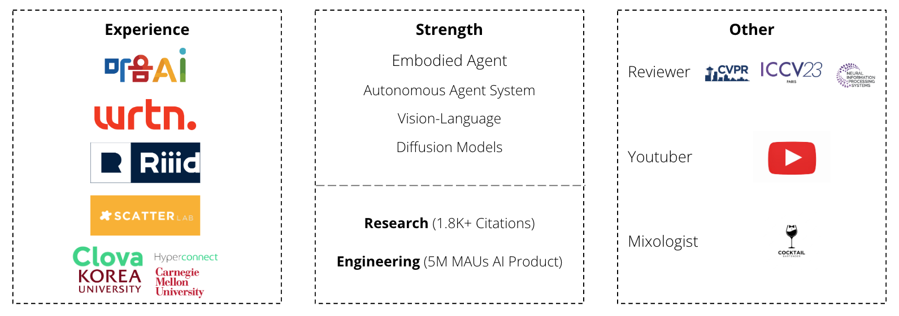
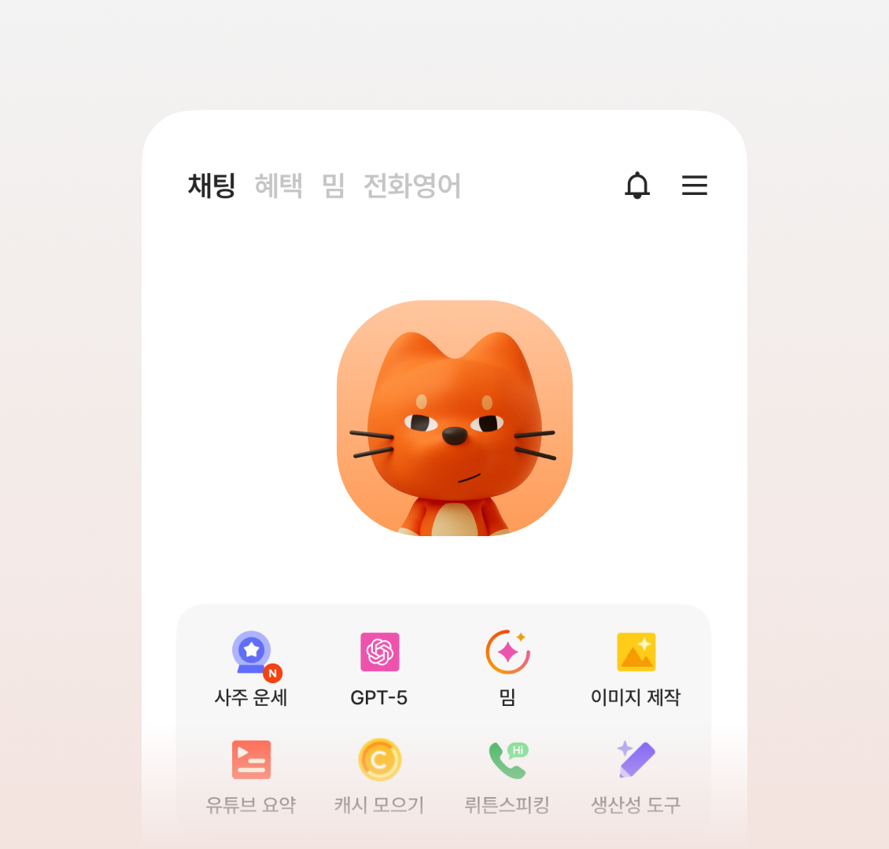
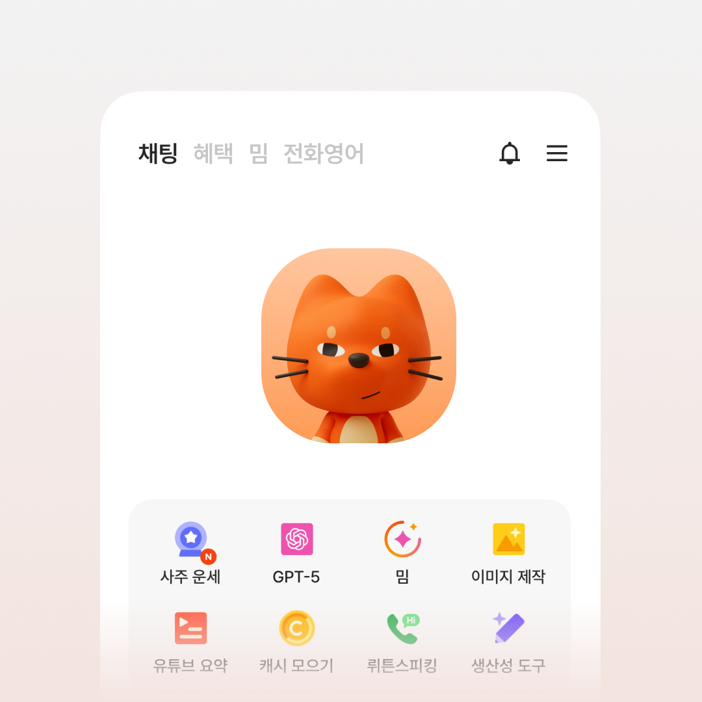
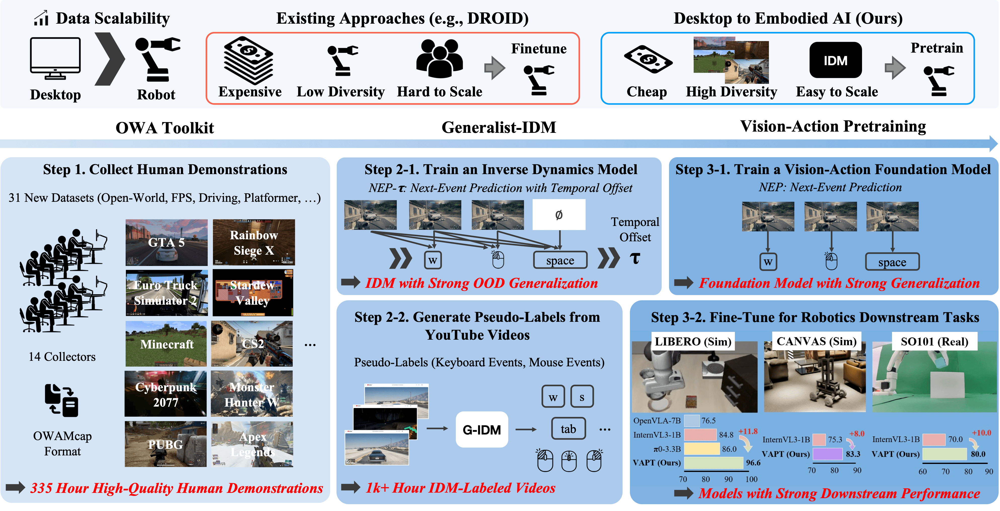
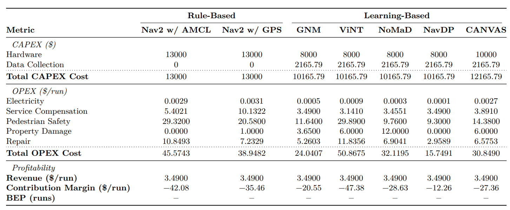

---
format:
  revealjs:
    theme: [default, suny-career.scss]
    slide-number: true
    footer: "Yunsung Lee &nbsp;|&nbsp; WoRV @ Maum.ai"
    width: 960
    height: 540
    margin: 0
    center: false
    auto-stretch: false
    transition: fade
    transition-speed: fast
    fig-align: center
    html-math-method: katex
    css: suny-theme-compat.css
    include-in-header:
      text: |
        <link rel="stylesheet" href="fonts/pretendard.css">
    include-after-body:
      text: |
        <script>
        // Match letterbox background to current slide background
        // Makes the letterbox area invisible on any slide
        function matchBackground() {
          const slide = document.querySelector('.reveal .slides > section.present');
          if (!slide) return;
          const bg = slide.getAttribute('data-background-color') || '#0B1D3A';
          document.documentElement.style.backgroundColor = bg;
          document.body.style.backgroundColor = bg;
        }
        Reveal.on('ready', matchBackground);
        Reveal.on('slidechanged', matchBackground);

        // Auto-play videos when entering a slide, pause when leaving
        function handleSlideVideos(event) {
          // Pause all videos first
          document.querySelectorAll('video').forEach(v => { v.pause(); v.currentTime = 0; });
          // Play videos on current slide
          const current = event.currentSlide || document.querySelector('.reveal .slides > section.present');
          if (current) {
            current.querySelectorAll('video').forEach(v => {
              v.muted = true;
              v.play().catch(() => {});
            });
          }
        }
        Reveal.on('ready', handleSlideVideos);
        Reveal.on('slidechanged', handleSlideVideos);
        </script>
---

## {background-color="#0B1D3A"}

```{=html}
<style>
#s01 {
  position: relative; width: 100%; height: 100%;
  font-family: "Pretendard", sans-serif;
  background: #0B1D3A;
  color: #FCFBF7;
}
#s01 .tide-line { position: absolute;
    inset: 0;
    pointer-events: none; }
#s01 .tide-line::before, #s01 .tide-line::after { content: "";
    position: absolute;
    left: -4%;
    right: -4%;
    border-top: 1.5px solid rgba(201,168,76,0.26);
    border-radius: 50%; }
#s01 .tide-line::before { bottom: 88px;
    height: 120px; }
#s01 .tide-line::after { bottom: 56px;
    height: 160px;
    opacity: 0.56; }
#s01 .gold-rule { position: absolute;
    top: 0;
    left: 0;
    right: 0;
    height: 3px;
    background: linear-gradient(90deg, transparent 0%, #C9A84C 20%, #C9A84C 80%, transparent 100%); }
#s01 .layout { position: relative;
    z-index: 2;
    height: 100%;
    display: grid;
    grid-template-columns: 1.18fr 0.82fr;
    padding: 40px 52px 32px;
    gap: 12px; }
#s01 .copy { display: flex;
    flex-direction: column;
    justify-content: space-between;
    min-width: 0; }
#s01 .eyebrow { font-size: 10px;
    font-weight: 700;
    letter-spacing: 0.22em;
    text-transform: uppercase;
    color: #C9A84C;
    margin-bottom: 18px; }
#s01 .kicker { font-size: 11px;
    font-weight: 600;
    letter-spacing: 0.1em;
    text-transform: uppercase;
    color: #8B9BB4;
    margin-bottom: 18px; }
#s01 .title { font-family: "Instrument Serif", Georgia, serif;
    font-size: 52px;
    line-height: 0.92;
    letter-spacing: -0.055em;
    color: #FCFBF7;
    max-width: 440px;
    padding-bottom: 12px; }
#s01 .subtitle { margin-top: 22px;
    max-width: 420px;
    font-size: 17px;
    line-height: 1.45;
    color: #D8DEEA; }
#s01 .subtitle strong { color: #E7C86A;
    font-weight: 700; }
#s01 .meta { display: grid;
    grid-template-columns: repeat(2, minmax(0, 1fr));
    gap: 12px;
    max-width: 420px; }
#s01 .meta-block { padding-top: 10px;
    border-top: 1px solid rgba(201,168,76,0.26); }
#s01 .meta-label { font-size: 9px;
    font-weight: 700;
    letter-spacing: 0.18em;
    text-transform: uppercase;
    color: #8B9BB4;
    margin-bottom: 6px; }
#s01 .meta-value { font-size: 12px;
    line-height: 1.45;
    color: #FCFBF7; }
#s01 .visual { position: relative;
    display: flex;
    align-items: flex-end;
    justify-content: center;
    min-width: 0; }
#s01 .glow { position: absolute;
    right: 24px;
    top: 18px;
    width: 180px;
    height: 180px;
    border-radius: 50%;
    background: radial-gradient(circle, rgba(201,168,76,0.25) 0%, rgba(201,168,76,0.06) 45%, transparent 68%);
    filter: blur(12px); }
#s01 .silhouette { position: relative;
    width: 100%;
    max-width: 280px;
    opacity: 0.96;
    transform: translateX(12px) translateY(-8px); }
#s01 .footer { position: absolute;
    bottom: 18px;
    left: 52px;
    right: 52px;
    display: flex;
    justify-content: space-between;
    font-size: 10px;
    color: #8B9BB4;
    letter-spacing: 0.08em; }
#s01 .footer strong { color: #E7C86A; }
</style>

<div id="s01" class="suny-slide deck-dark deck-poster deck-cover">

  <div class="gold-rule"></div>
  <div class="tide-line"></div>

  <div class="layout">
    <div class="copy">
      <div>
        <p class="eyebrow">STEM Career Sprint 2026</p>
        <p class="kicker">From papers to products</p>
        <h1 class="title">Career Roadmap<br>for AI Researchers</h1>

        <p class="subtitle">Don't get swept away by the AI wave —<br><strong>become the surfer.</strong></p>
      </div>

      <div class="meta">
        <div class="meta-block">
          <p class="meta-label">Speaker</p>
          <p class="meta-value">Yunsung Lee<br>WoRV @ Maum.ai</p>
        </div>
        <div class="meta-block">
          <p class="meta-label">Venue</p>
          <p class="meta-value">SUNY Korea<br>April 4, 2026</p>
        </div>
      </div>
    </div>

    <div class="visual">
      <div class="glow"></div>
      
    </div>
  </div>

</div>
```


## {background-color="#0B1D3A"}

```{=html}
<style>
#s02 {
  position: relative; width: 100%; height: 100%;
  font-family: "Pretendard", sans-serif;
  background: #0B1D3A;
  color: #FFFFFF;
}
#s02 .bg-accent { position: absolute;
    inset: 0;
    background: radial-gradient(ellipse 500px 300px at 80% 50%, rgba(17,42,74,0.8) 0%, transparent 70%); }
#s02 .gold-rule { position: absolute;
    top: 0; left: 0; right: 0;
    height: 3px;
    background: linear-gradient(90deg, transparent 0%, #C9A84C 30%, #C9A84C 70%, transparent 100%); }
#s02 .content { position: relative;
    z-index: 2;
    padding: 28px 48px 24px;
    height: 100%;
    display: flex;
    flex-direction: column; }
#s02 .header-row { display: flex;
    justify-content: space-between;
    align-items: flex-start;
    margin-bottom: 18px; }
#s02 h2 { font-size: 26px;
    font-weight: 800;
    color: #FFFFFF;
    letter-spacing: -0.02em; }
#s02 .stats-row { display: flex;
    gap: 20px; }
#s02 .stat-chip { background: rgba(201,168,76,0.12);
    border: 1px solid rgba(201,168,76,0.3);
    border-radius: 20px;
    padding: 4px 12px;
    font-size: 11px;
    font-weight: 700;
    color: #C9A84C;
    letter-spacing: 0.04em; }
#s02 .timeline-area { flex: 1;
    position: relative; }
#s02 .timeline-svg { position: absolute;
    top: 0; left: 0;
    width: 100%;
    height: 100%; }
#s02 .nodes { position: absolute;
    top: 0; left: 0;
    width: 100%;
    height: 100%; }
#s02 .node { position: absolute;
    display: flex;
    flex-direction: column;
    align-items: center; }
#s02 .dot { width: 10px;
    height: 10px;
    border-radius: 50%;
    background: #C9A84C;
    border: 2px solid #0B1D3A;
    box-shadow: 0 0 0 2px #C9A84C;
    flex-shrink: 0; }
#s02 .dot.dim { background: #8B9BB4;
    box-shadow: 0 0 0 2px #8B9BB4; }
#s02 .dot.highlight { background: #C9A84C;
    box-shadow: 0 0 0 3px rgba(201,168,76,0.4);
    width: 14px;
    height: 14px; }
#s02 .node-label { font-size: 9.5px;
    font-weight: 600;
    color: #FFFFFF;
    text-align: center;
    margin-top: 5px;
    white-space: nowrap;
    line-height: 1.3; }
#s02 .node-label.gold { color: #C9A84C; }
#s02 .node-label.dim { color: #8B9BB4; }
#s02 .node-year { font-size: 8px;
    font-weight: 400;
    color: #4A6080;
    margin-top: 2px; }
#s02 .label-note { font-size: 9px;
    font-style: italic;
    color: #8B9BB4;
    text-align: center;
    margin-top: 3px; }
</style>

<div id="s02" class="suny-slide deck-dark">

  <div class="bg-accent"></div>
  <div class="gold-rule"></div>

  <div class="content">
    <div class="header-row">
      <h2>Who Am I?</h2>
      <div class="stats-row">
        <span class="stat-chip">10+ top-tier papers</span>
        <span class="stat-chip">1,850+ citations</span>
        <span class="stat-chip">double-digit h-index</span>
      </div>
    </div>

    <div style="flex:1; display:flex; align-items:center; justify-content:center;">
      
    </div>
  </div>

</div>
```


## {background-color="#0B1D3A"}

```{=html}
<style>
#s03 {
  position: relative; width: 100%; height: 100%;
  font-family: "Pretendard", sans-serif;
  background: #0B1D3A;
  color: #FCFBF7;
}
#s03 .bg { position: absolute;
    inset: 0;
    background:
      radial-gradient(ellipse 540px 240px at 76% 24%, rgba(201,168,76,0.12) 0%, transparent 60%),
      radial-gradient(ellipse 760px 220px at 18% 108%, rgba(201,168,76,0.1) 0%, transparent 60%),
      linear-gradient(180deg, #07111F 0%, #0B1D3A 46%, #091325 100%); }
#s03 .wave-stack { position: absolute;
    inset: auto 0 0 0;
    height: 126px;
    pointer-events: none; }
#s03 .wave-stack::before, #s03 .wave-stack::after, #s03 .wave-stack .line { content: "";
    position: absolute;
    left: 0;
    right: 0;
    border-top: 1px solid rgba(201,168,76,0.22);
    border-radius: 50%; }
#s03 .wave-stack::before { bottom: 40px; height: 66px; }
#s03 .wave-stack::after { bottom: 14px; height: 92px; opacity: 0.6; }
#s03 .wave-stack .line { bottom: 0; height: 118px; opacity: 0.34; }
#s03 .gold-rule { position: absolute;
    top: 0;
    left: 0;
    right: 0;
    height: 3px;
    background: linear-gradient(90deg, transparent 0%, #C9A84C 20%, #C9A84C 80%, transparent 100%); }
#s03 .layout { position: relative;
    z-index: 2;
    height: 100%;
    display: grid;
    grid-template-columns: 1fr auto;
    padding: 38px 52px 32px;
    gap: 18px; }
#s03 .copy { display: flex;
    flex-direction: column;
    justify-content: center;
    max-width: 420px; }
#s03 .eyebrow { font-size: 10px;
    font-weight: 700;
    letter-spacing: 0.2em;
    text-transform: uppercase;
    color: #C9A84C;
    margin-bottom: 16px;
    padding-bottom: 10px;
    padding-bottom: 10px; }
#s03 h1 { font-family: "Instrument Serif", Georgia, serif;
    font-size: 48px;
    line-height: 0.92;
    letter-spacing: -0.06em;
    color: #FCFBF7;
    margin-bottom: 16px;
    padding-bottom: 10px; }
#s03 h1 span { color: #E7C86A; }
#s03 .lead { font-size: 16px;
    line-height: 1.5;
    color: #D8DEEA;
    max-width: 360px; }
#s03 .lead strong { color: #FCFBF7; }
#s03 .roadmap { align-self: center;
    width: 244px;
    border-radius: 22px;
    border: 1px solid rgba(201,168,76,0.24);
    background: rgba(255,255,255,0.04);
    padding: 18px 18px 14px; }
#s03 .roadmap-label { font-size: 10px;
    font-weight: 700;
    letter-spacing: 0.18em;
    text-transform: uppercase;
    color: #8B9BB4;
    margin-bottom: 10px; }
#s03 .step { display: grid;
    grid-template-columns: 22px 1fr;
    gap: 10px;
    align-items: start;
    padding: 10px 0;
    border-top: 1px solid rgba(201,168,76,0.14); }
#s03 .step:first-of-type { border-top: none; }
#s03 .step-num { width: 22px;
    height: 22px;
    border-radius: 50%;
    display: flex;
    align-items: center;
    justify-content: center;
    border: 1px solid rgba(201,168,76,0.48);
    color: #E7C86A;
    font-size: 10px;
    font-weight: 700; }
#s03 .step-title { font-size: 12px;
    font-weight: 700;
    color: #FCFBF7;
    margin-bottom: 2px; }
#s03 .step-sub { font-size: 10px;
    line-height: 1.45;
    color: #8B9BB4; }
#s03 .footer { position: absolute;
    bottom: 18px;
    left: 52px;
    right: 52px;
    display: flex;
    justify-content: space-between;
    font-size: 10px;
    color: #8B9BB4;
    letter-spacing: 0.08em; }
</style>

<div id="s03" class="suny-slide deck-dark deck-poster">

  <div class="bg"></div>
  <div class="wave-stack"><div class="line"></div></div>
  <div class="gold-rule"></div>

  <div class="layout">
    <div class="copy">
      <p class="eyebrow">Opening roadmap</p>
      <h1>The wave is <span>here.</span></h1>
      <p class="lead">The AI shift is already changing how people <strong>build, learn, and get hired.</strong> Today is about how to ride it on purpose.</p>
    </div>

    <div class="roadmap">
      <p class="roadmap-label">Today's route</p>
      <div class="step"><p class="step-num">1</p><div><p class="step-title">See the Wave</p><p class="step-sub">AI landscape, salary reality, and why the old playbook broke.</p></div></div>
      <div class="step"><p class="step-num">2</p><div><p class="step-title">My First Wave</p><p class="step-sub">What shipping for 5M users at Wrtn taught me.</p></div></div>
      <div class="step"><p class="step-num">3</p><div><p class="step-title">The Next Wave</p><p class="step-sub">Physical AI, research bets, and why robotics matters now.</p></div></div>
      <div class="step"><p class="step-num">4</p><div><p class="step-title">Your Surfboard</p><p class="step-sub">A blunt career guide you can act on this week.</p></div></div>
    </div>
  </div>

</div>
```


## {background-color="#0B1D3A"}

```{=html}
<style>
#s04 {
  position: relative; width: 100%; height: 100%;
  font-family: "Pretendard", sans-serif;
  background: #0B1D3A;
  color: #FCFBF7;
}
#s04 .gold-rule { position: absolute; top: 0; left: 0; right: 0; height: 3px;
    background: linear-gradient(90deg, transparent 0%, #C9A84C 20%, #C9A84C 80%, transparent 100%); }
#s04 .layout { height: 100%; padding: 36px 48px 28px; position: relative; z-index: 2;
    display: grid; grid-template-columns: 1.08fr 0.92fr; gap: 18px; }
#s04 .left { display: flex; flex-direction: column; justify-content: center; }
#s04 .eyebrow { font-size: 10px; font-weight: 700; letter-spacing: 0.2em; text-transform: uppercase;
    color: #C9A84C; margin-bottom: 10px; }
#s04 .hero { font-family: "Pretendard", sans-serif; font-size: 64px; line-height: 0.84;
    font-weight: 900; letter-spacing: -0.04em; color: #FCFBF7; margin-bottom: 10px; padding-bottom: 18px; }
#s04 .headline { font-size: 22px; line-height: 1.25; font-weight: 700; max-width: 380px; color: #FCFBF7; }
#s04 .headline strong { color: #E7C86A; }
#s04 .subnote { margin-top: 16px; font-size: 13px; line-height: 1.5; color: #BFC9D8; max-width: 300px; }
#s04 .right { display: flex; flex-direction: column; justify-content: center; gap: 14px; }
#s04 .metric-card { background: rgba(255,255,255,0.05); border: 1px solid rgba(201,168,76,0.22); border-radius: 16px;
    padding: 18px 18px 16px; box-shadow: 0 18px 40px rgba(3,11,26,0.3); }
#s04 .metric-label { font-size: 10px; font-weight: 700; letter-spacing: 0.16em; text-transform: uppercase;
    color: #8B9BB4; margin-bottom: 8px; }
#s04 .metric-value { font-family: "Pretendard", sans-serif; font-size: 30px; line-height: 0.9;
    font-weight: 800; letter-spacing: -0.03em; color: #E7C86A; margin-bottom: 8px; padding-bottom: 10px; }
#s04 .metric-copy { font-size: 13px; line-height: 1.45; color: #D7DEE9; }
#s04 .chips { display: flex; gap: 10px; flex-wrap: wrap; margin-top: 4px; }
#s04 .chip { padding: 8px 12px; border-radius: 999px; background: rgba(201,168,76,0.12);
    border: 1px solid rgba(201,168,76,0.24); font-size: 11px; font-weight: 700; color: #E7C86A; }
#s04 .footer { position: absolute; bottom: 18px; left: 48px; right: 48px;
    display: flex; justify-content: space-between; font-size: 10px; color: #8B9BB4; letter-spacing: 0.08em; }
</style>

<div id="s04" class="suny-slide deck-dark">

  <div class="gold-rule"></div>
  <div class="layout">
    <div class="left">
      <p class="eyebrow">The fastest growth in history</p>
      <h1 class="hero">200M</h1>
      <p class="headline">ChatGPT reached <strong>200 million users</strong> in two years.<br>Now software developers sit at <strong>8–9/10</strong> on AI job exposure.</p>
      <p class="subnote">The surprising part is not that AI is coming. It is that the most screen-native, high-paying work is now directly in the blast radius.</p>
    </div>
    <div class="right">
      <div class="metric-card">
        <p class="metric-label">Karpathy's warning</p>
        <p class="metric-value">8–9 / 10</p>
        <p class="metric-copy">Developers rank near the top of AI exposure because their work already happens in language and interfaces.</p>
      </div>
      <div class="metric-card">
        <p class="metric-label">Why it matters</p>
        <div class="chips">
          <span class="chip">2 years</span>
          <span class="chip">200M users</span>
          <span class="chip">job map changed</span>
        </div>
      </div>
    </div>
  </div>

</div>
```


## {background-color="#0B1D3A"}

```{=html}
<style>
#s05 {
  position: relative; width: 100%; height: 100%;
  font-family: "Pretendard", sans-serif;
  background: #0B1D3A;
  color: #FFFFFF;
  padding: 32px 40px 28px;
  display: flex;
  flex-direction: column;
}
#s05 .accent { position: absolute; top: 0; left: 0; right: 0; height: 3px; background: #C9A84C; }
#s05 .headline { font-size: 28px; font-weight: 800; letter-spacing: -0.02em; margin-bottom: 16px; }
#s05 .grid { display: grid; grid-template-columns: 1fr 1fr; grid-template-rows: 1fr 1fr; gap: 14px; flex: 1; }
#s05 .cell { border: 1px solid rgba(201, 168, 76, 0.4); border-radius: 8px; padding: 14px; background: rgba(255, 255, 255, 0.05); }
#s05 .cell-title { font-size: 17px; font-weight: 800; color: #C9A84C; margin-bottom: 6px; }
#s05 .cell-stats { font-size: 13px; font-weight: 500; color: #F8F7F4; opacity: 0.9; }
#s05 .cell-desc { font-size: 11px; font-weight: 400; color: #8B9BB4; margin-top: 8px; }
#s05 .footer { position: absolute; bottom: 12px; left: 40px; font-size: 10px; color: #8B9BB4; opacity: 0.6; }
</style>

<div id="s05" class="suny-slide deck-dark">

  <div class="accent"></div>
  <h1 class="headline">Know Your Wave</h1>
  <div class="grid">
    <div class="cell fragment fade-in" data-fragment-index="1">
      <p class="cell-title">AI Researcher</p>
      <p class="cell-stats">$160K - $400K TC</p>
      <p class="cell-desc">Publish papers, advance SOTA.<br>Deep math & experimentation.</p>
    </div>
    <div class="cell fragment fade-in" data-fragment-index="2">
      <p class="cell-title">AI Engineer</p>
      <p class="cell-stats">$180K - $320K TC</p>
      <p class="cell-desc">Build production ML systems.<br>High demand, model serving, infra.</p>
    </div>
    <div class="cell fragment fade-in" data-fragment-index="3">
      <p class="cell-title">Data Scientist</p>
      <p class="cell-stats">$130K - $250K TC</p>
      <p class="cell-desc">Analyze, model, interpret data.<br>Bridges research and product.</p>
    </div>
    <div class="cell fragment fade-in" data-fragment-index="4">
      <p class="cell-title">AI Product Manager</p>
      <p class="cell-stats">$150K - $280K TC</p>
      <p class="cell-desc">Define what to build and why.<br>Rarest combo of user & tech.</p>
    </div>
  </div>

</div>
```


## {background-color="#F8F7F4"}

```{=html}
<style>
#s06 {
  position: relative; width: 100%; height: 100%;
  font-family: "Pretendard",sans-serif;
  background: #F8F7F4;
  color: #0B1D3A;
}
#s06 .gold-rule { position:absolute; top:0; left:0; right:0; height:3px; background:linear-gradient(90deg, transparent 0%, #C9A84C 20%, #C9A84C 80%, transparent 100%); }
#s06 .layout { height:100%; padding:26px 42px 32px; display:grid; grid-template-columns: 0.82fr 1.18fr; gap:18px; position:relative; z-index:2; }
#s06 .left { display:flex; flex-direction:column; justify-content:center; }
#s06 .eyebrow { font-size:10px; font-weight:700; letter-spacing:0.18em; text-transform:uppercase; color:#C9A84C; margin-bottom:8px; }
#s06 .headline { font-family:"Instrument Serif", Georgia, serif; font-size:32px; line-height:1.0; letter-spacing:-0.05em; padding-bottom:8px; max-width:280px; }
#s06 .sub { margin-top:8px; font-size:12px; line-height:1.5; color:#5E6C84; max-width:250px; }
#s06 .callouts { margin-top:16px; display:flex; flex-direction:column; gap:10px; }
#s06 .callout { background:#FFFFFF; border:1px solid rgba(201,168,76,0.18); border-radius:14px; padding:6px 12px; box-shadow:0 14px 28px rgba(11,29,58,0.06); }
#s06 .callout-label { font-size:10px; font-weight:700; letter-spacing:0.16em; text-transform:uppercase; color:#C9A84C; margin-bottom:4px; }
#s06 .callout-copy { font-size:12px; line-height:1.45; color:#0B1D3A; }
#s06 .right { display:grid; grid-template-columns: 1fr 1fr; gap:14px; align-items:end; }
#s06 .panel { background:#FFFFFF; border:1px solid rgba(201,168,76,0.16); border-radius:18px; padding:10px 14px 8px; box-shadow:0 18px 36px rgba(11,29,58,0.06); }
#s06 .panel-title { font-size:10px; font-weight:700; letter-spacing:0.16em; text-transform:uppercase; color:#8B9BB4; margin-bottom:6px; }
#s06 .bars { display:flex; align-items:flex-end; justify-content:center; gap:14px; flex:1; }
#s06 .bar-col { width:76px; text-align:center; }
#s06 .bar-value { font-size:13px; font-weight:800; color:#0B1D3A; margin-bottom:4px; }
#s06 .bar { width:54px; margin:0 auto 8px; border-radius:10px 10px 0 0; }
#s06 .bar.ai { background:linear-gradient(180deg,#D7B45A,#C39D3B); height:72px; }
#s06 .bar.us-non { background:linear-gradient(180deg,#2A4B77,#152B48); height:52px; }
#s06 .bar.kr-ai { background:linear-gradient(180deg,#D7B45A,#C39D3B); height:60px; }
#s06 .bar.kr-non { background:linear-gradient(180deg,#FD7A7A,#E34B4B); height:56px; }
#s06 .bar-label { font-size:11px; line-height:1.35; color:#5E6C84; }
#s06 .badge { display:inline-block; margin-top:10px; padding:7px 11px; border-radius:999px; font-size:11px; font-weight:800; }
#s06 .badge.good { background:rgba(201,168,76,0.14); color:#B68E29; }
#s06 .badge.warn { background:#FFF1F1; color:#D64F4F; border:1px solid rgba(214,79,79,0.22); }
#s06 .footer { position:absolute; bottom:8px; left:42px; right:42px; display:flex; justify-content:space-between; font-size:10px; color:#8B9BB4; letter-spacing:0.08em; }
</style>

<div id="s06" class="suny-slide deck-light">

<div class="gold-rule"></div>
<div class="layout">
  <div class="left">
    <p class="eyebrow">Salary reality check</p>
    <h1 class="headline">The U.S. pays for AI already. Korea mostly hasn't — yet.</h1>
    <p class="sub">That mismatch is exactly why the window matters: the Korean premium is still small, but the capability demand is moving much faster than the salary signal.</p>
    <div class="callouts">
      <div class="callout"><p class="callout-label">United States</p><p class="callout-copy">AI engineers already command a visible compensation premium.</p></div>
      <div class="callout"><p class="callout-label">Korea</p><p class="callout-copy">Only a modest gap today, which means the upside is more about timing than current salary.</p></div>
    </div>
  </div>
  <div class="right">
    <div class="panel">
      <p class="panel-title">United States — total compensation</p>
      <div class="bars">
        <div class="bar-col"><p class="bar-value">$245K</p><div class="bar ai"></div><p class="bar-label">AI<br>Engineer</p></div>
        <div class="bar-col"><p class="bar-value">$180K</p><div class="bar us-non"></div><p class="bar-label">Non-AI<br>Engineer</p></div>
      </div>
      <span class="badge good">+36% AI premium</span>
    </div>
    <div class="panel">
      <p class="panel-title">Korea — salary gap</p>
      <div class="bars">
        <div class="bar-col"><p class="bar-value">₩95M</p><div class="bar kr-ai"></div><p class="bar-label">AI<br>Engineer</p></div>
        <div class="bar-col"><p class="bar-value">₩90M</p><div class="bar kr-non"></div><p class="bar-label">Non-AI<br>Engineer</p></div>
      </div>
      <span class="badge warn">Only 6% gap in Korea</span>
    </div>
  </div>
</div>

</div>
```


## {background-color="#0B1D3A"}

```{=html}
<style>
#s07 {
  position: relative; width: 100%; height: 100%;
  font-family: "Pretendard", sans-serif;
  background: #0B1D3A;
  color: #FFFFFF;
}
#s07 .gold-rule { position: absolute;
    top: 0; left: 0; right: 0;
    height: 3px;
    background: linear-gradient(90deg, transparent 0%, #C9A84C 30%, #C9A84C 70%, transparent 100%); }
#s07 .bg-glow { position: absolute;
    inset: 0;
    background:
      radial-gradient(ellipse 300px 300px at 25% 50%, rgba(201,168,76,0.07) 0%, transparent 70%),
      radial-gradient(ellipse 300px 300px at 75% 50%, rgba(139,155,180,0.12) 0%, transparent 70%); }
#s07 .content { position: relative;
    z-index: 2;
    height: 100%;
    display: grid;
    grid-template-columns: 1fr auto 1fr;
    align-items: center;
    padding-bottom: 56px; }
#s07 .panel { padding: 40px 32px;
    display: flex;
    flex-direction: column;
    align-items: center;
    text-align: center;
    height: 100%;
    justify-content: center;
    gap: 10px; }
#s07 .panel-number { font-size: 58px;
    font-weight: 900;
    line-height: 0.95;
    letter-spacing: -0.04em;
    margin: 0;
    padding: 0;
    overflow: hidden; }
#s07 .panel-number.red { color: #FFFFFF; }
#s07 .panel-number.green { color: #C9A84C; }
#s07 .panel-label { font-size: 13px;
    font-weight: 600;
    color: #8B9BB4;
    line-height: 1.4;
    max-width: 180px; }
#s07 .panel-detail { font-size: 10.5px;
    color: #8B9BB4;
    line-height: 1.5;
    max-width: 180px;
    margin-top: 2px; }
#s07 .center-col { display: flex;
    flex-direction: column;
    align-items: center;
    gap: 12px;
    padding: 0 8px; }
#s07 .v-line { width: 1px;
    height: 80px;
    background: linear-gradient(180deg, transparent, rgba(201,168,76,0.4) 50%, transparent); }
#s07 .why-badge { font-size: 22px;
    font-weight: 900;
    color: #C9A84C;
    letter-spacing: 0.08em;
    text-align: center;
    line-height: 1; }
#s07 .bottom-callout { position: absolute;
    bottom: 0;
    left: 0;
    right: 0;
    background: rgba(11,29,58,0.92);
    border-top: 1px solid rgba(139,155,180,0.22);
    padding: 12px 40px;
    display: flex;
    align-items: center;
    gap: 12px; }
#s07 .callout-label { font-size: 9px;
    font-weight: 700;
    letter-spacing: 0.14em;
    text-transform: uppercase;
    color: #C9A84C;
    white-space: nowrap;
    flex-shrink: 0; }
#s07 .callout-text { font-size: 11px;
    font-weight: 500;
    color: #8B9BB4;
    line-height: 1.4; }
#s07 .callout-text strong { color: #FFFFFF; }
#s07 .separator { width: 1px;
    height: 24px;
    background: rgba(139,155,180,0.22);
    flex-shrink: 0; }
#s07 .callout-page { margin-left: auto;
    color: #C9A84C;
    font-size: 10px;
    font-weight: 700;
    letter-spacing: 0.08em;
    white-space: nowrap; }
</style>

<div id="s07" class="suny-slide deck-dark">

  <div class="gold-rule"></div>
  <div class="bg-glow"></div>

  <div class="content">
    <!-- Left: unfilled positions -->
    <div class="panel fragment fade-in" data-fragment-index="1">
      <p class="panel-number green" style="padding-bottom:10px">50%</p>
      <p class="panel-label">of AI positions remain unfilled</p>
      <p class="panel-detail">Companies can't find qualified candidates despite waves of applicants.</p>
    </div>

    <!-- Center: WHY -->
    <div class="center-col fragment fade-in" data-fragment-index="2">
      <div class="v-line"></div>
      <div class="why-badge">WHY?</div>
      <div class="v-line"></div>
    </div>

    <!-- Right: CS unemployment -->
    <div class="panel fragment fade-in" data-fragment-index="3">
      <p class="panel-number red" style="padding-bottom:10px">6.1%</p>
      <p class="panel-label">CS grad unemployment rate</p>
      <p class="panel-detail">Degree holders can't land jobs. Skills mismatch — market wants AI-augmented builders.</p>
    </div>
  </div>

  <div class="bottom-callout">
    <span class="callout-label">Anthropic &nbsp;Mar 2026</span>
    <div class="separator"></div>
    <p class="callout-text"><strong>75% of programming tasks are coverable by AI</strong> &nbsp;·&nbsp; 14% hiring slowdown for traditional coders. The old playbook is broken.</p>
  </div>

</div>
```


## {background-color="#0B1D3A"}

```{=html}
<style>
#s08 {
  position: relative; width: 100%; height: 100%;
  font-family: "Pretendard",sans-serif;
  background: #0B1D3A;
  color: #FCFBF7;
  display: flex;
}
#s08 .gold-rule { position:absolute; top:0; left:0; right:0; height:3px; background:linear-gradient(90deg, transparent 0%, #C9A84C 20%, #C9A84C 80%, transparent 100%); z-index:10; }
#s08 .left, #s08 .right { flex:1; padding:40px 42px 32px; display:flex; flex-direction:column; justify-content:center; }
#s08 .left { background:#0B1D3A; color:#D7DEE9; }
#s08 .right { background:#F8F7F4; color:#0B1D3A; }
#s08 .label { font-size:10px; font-weight:700; letter-spacing:0.18em; text-transform:uppercase; margin-bottom:10px; }
#s08 .left .label { color:#8B9BB4; }
#s08 .right .label { color:#C9A84C; }
#s08 .headline { font-family:"Instrument Serif", Georgia, serif; font-size:42px; line-height:0.95; letter-spacing:-0.05em; margin-bottom:16px; padding-bottom:8px; }
#s08 .left .headline { color:#B8C2D5; }
#s08 .right .headline { color:#0B1D3A; }
#s08 .list { list-style:none; display:flex; flex-direction:column; gap:16px; }
#s08 .item { display:flex; align-items:center; gap:12px; font-size:22px; font-weight:800; line-height:1.2; }
#s08 .left .item { color:#93A2BB; opacity:0.72; }
#s08 .left .item .text { text-decoration:line-through; text-decoration-thickness: 2px; }
#s08 .right .item { color:#0B1D3A; }
#s08 .badge { margin-left:auto; padding:7px 12px; border-radius:10px; font-size:14px; font-weight:900; }
#s08 .right .badge { background:#D7B45A; color:#0B1D3A; }
#s08 .vs { position:absolute; top:50%; left:50%; transform:translate(-50%,-50%); width:66px; height:66px; border-radius:50%; display:flex; align-items:center; justify-content:center; font-size:22px; font-weight:900; background:#0B1D3A; color:#E7C86A; border:2px solid #C9A84C; z-index:5; }
#s08 .foot { margin-top:18px; font-size:12px; line-height:1.45; max-width:250px; }
#s08 .left .foot { color:#8B9BB4; }
#s08 .right .foot { color:#5E6C84; }
</style>

<div id="s08" class="suny-slide deck-dark">

<div class="gold-rule"></div>
<div class="left">
  <p class="label">What students think matters</p>
  <h1 class="headline">The old playbook.</h1>
  <ul class="list">
    <li class="item"><span class="text">GPA / Honors</span></li>
    <li class="item"><span class="text">Degree Prestige</span></li>
    <li class="item"><span class="text">Certs & Bootcamps</span></li>
    <li class="item"><span class="text">Traditional Resume</span></li>
  </ul>
  <p class="foot">These signals are not meaningless.<br>They just no longer win by themselves.</p>
</div>
<div class="vs">VS</div>
<div class="right">
  <p class="label">What recruiters actually want</p>
  <h1 class="headline">The 2026 reality.</h1>
  <ul class="list">
    <li class="item">Portfolio <span class="badge">38%</span></li>
    <li class="item">Internships <span class="badge">35%</span></li>
    <li class="item">Public Code <span class="badge">34%</span></li>
    <li class="item" style="opacity:0.45; font-size:18px;">Credentials <span class="badge" style="background:#D7DCE5; color:#8B9BB4;">4%</span></li>
  </ul>
  <p class="foot">The strongest signal is still simple:<br>can you point to real things you built?</p>
</div>

</div>
```


## {background-color="#0B1D3A"}

```{=html}
<style>
#s09 {
  position: relative; width: 100%; height: 100%;
  font-family: "Pretendard", sans-serif;
  background: #0B1D3A;
  color: #FCFBF7;
}
#s09 .gold-rule { position:absolute; top:0; left:0; right:0; height:3px;
    background: linear-gradient(90deg, transparent 0%, #C9A84C 20%, #C9A84C 80%, transparent 100%); }
#s09 .layout { height:100%; padding: 34px 44px 36px; position:relative; z-index:2;
    display:grid; grid-template-columns: 1.18fr 0.82fr; gap: 18px; }
#s09 .quote-wrap { display:flex; flex-direction:column; justify-content:center; }
#s09 .eyebrow { font-size:10px; font-weight:700; letter-spacing:0.2em; text-transform:uppercase; color:#C9A84C; margin-bottom:10px; }
#s09 .quote { font-family:"Instrument Serif", Georgia, serif; font-size:52px; line-height:0.92; letter-spacing:-0.06em;
    color:#FCFBF7; max-width: 470px; padding-bottom: 14px; }
#s09 .quote strong { color:#E7C86A; font-weight:400; }
#s09 .attribution { margin-top:12px; font-size:18px; font-weight:700; color:#D8DEEA; }
#s09 .attribution span { color:#8B9BB4; font-weight:500; }
#s09 .stats { display:grid; grid-template-rows: repeat(3, 1fr) auto; gap: 12px; align-content:center; }
#s09 .stat-card { background: rgba(255,255,255,0.05); border:1px solid rgba(201,168,76,0.22); border-radius:16px;
    padding:16px 16px 14px; box-shadow:0 18px 40px rgba(3,11,26,0.28); }
#s09 .stat-value { font-family:"Instrument Serif", Georgia, serif; font-size:34px; line-height:0.9; letter-spacing:-0.05em;
    color:#E7C86A; margin-bottom:8px; padding-bottom:6px; }
#s09 .stat-title { font-size:10px; font-weight:700; letter-spacing:0.16em; text-transform:uppercase; color:#8B9BB4; margin-bottom:4px; }
#s09 .stat-copy { font-size:12px; line-height:1.45; color:#D7DEE9; }
#s09 .players { display:flex; flex-wrap:wrap; gap:8px; align-content:flex-start; }
#s09 .player { padding:7px 10px; border-radius:999px; background: rgba(201,168,76,0.12); border: 1px solid rgba(201,168,76,0.22);
    font-size: 10px; font-weight:700; color:#E7C86A; }
#s09 .footer { position:absolute; bottom:10px; left:44px; right:44px; display:flex; justify-content:space-between;
    font-size:10px; color:#8B9BB4; letter-spacing:0.08em; }
</style>

<div id="s09" class="suny-slide deck-dark deck-poster">

  <div class="gold-rule"></div>
  <div class="layout">
    <div class="quote-wrap">
      <p class="eyebrow">The ChatGPT moment for robotics</p>
      <p class="quote">When machines begin to <strong>understand</strong>, reason, and act in the real world — <strong>that's Physical AI.</strong></p>
      <p class="attribution">Jensen Huang <span>· CES 2026</span></p>
    </div>
    <div class="stats">
      <div class="stat-card">
        <p class="stat-title">Capital</p>
        <p class="stat-value">$7.2B</p>
        <p class="stat-copy">Robotics funding in 2025 — up 2.3× from 2023.</p>
      </div>
      <div class="stat-card">
        <p class="stat-title">Units</p>
        <p class="stat-value">13K–18K</p>
        <p class="stat-copy">Humanoids shipped in the first meaningful commercial year.</p>
      </div>
      <div class="stat-card">
        <p class="stat-title">Korea signal</p>
        <p class="stat-value">60%</p>
        <p class="stat-copy">Share of CES 2026 Innovation Awards tied to Korea.</p>
      </div>
      <div class="players">
        <span class="player">NVIDIA</span>
        <span class="player">Tesla</span>
        <span class="player">Figure</span>
        <span class="player">Boston Dynamics</span>
        <span class="player">1X</span>
        <span class="player">Unitree</span>
      </div>
    </div>
  </div>

</div>
```


## {background-color="#0B1D3A"}

```{=html}
<style>
#s10 {
  position: relative; width: 100%; height: 100%;
  font-family: "Pretendard", sans-serif;
  background: #0B1D3A;
  color: #FFFFFF;
  display: flex;
  flex-direction: column;
  justify-content: center;
  padding: 48px 280px 48px 56px;
}
#s10 .accent { position: absolute; top: 0; left: 0; width: 100%; height: 3px; background: #C9A84C; }
#s10 .eyebrow { font-size: 14px; font-weight: 600; color: #C9A84C; letter-spacing: 0.12em; text-transform: uppercase; margin-bottom: 8px; }
#s10 .display { font-size: 72px; font-weight: 800; line-height: 1; letter-spacing: -0.04em; margin-bottom: 12px; color: #C9A84C; }
#s10 .headline { font-size: 22px; font-weight: 700; line-height: 1.2; color: #F8F7F4; }
#s10 .badge { display: inline-block; padding: 6px 16px; background: #48BB78; border-radius: 4px; color: #0B1D3A; font-weight: 800; font-size: 11px; margin-top: 20px; }
#s10 .pledges { position: absolute; right: 48px; top: 50%; transform: translateY(-50%); width: 200px; display: flex; flex-direction: column; gap: 12px; }
#s10 .pledge-item { border-bottom: 1px solid rgba(255,255,255,0.1); padding-bottom: 8px; }
#s10 .pledge-name { font-size: 9px; color: #8B9BB4; margin-bottom: 2px; }
#s10 .pledge-val { font-size: 14px; font-weight: 800; color: #F8F7F4; }
</style>

<div id="s10" class="suny-slide deck-dark">

  <div class="accent"></div>
  <div style="flex: 1; display: flex; flex-direction: column; justify-content: center;">
    <p class="eyebrow">National AI Budget 2026</p>
    <h1 class="display" style="padding-bottom: 12px;">₩10.1T</h1>
    <h2 class="headline">206% increase YoY.<br>Your home advantage.</h2>
    <div class="badge">▲ Korea AI Pivot</div>
  </div>
  <div class="pledges">
    <div class="pledge-item">
      <p class="pledge-name">Samsung Electronics</p>
      <p class="pledge-val">₩300T+</p>
    </div>
    <div class="pledge-item">
      <p class="pledge-name">SK Group</p>
      <p class="pledge-val">₩247T</p>
    </div>
    <div class="pledge-item">
      <p class="pledge-name">Hyundai Motor</p>
      <p class="pledge-val">₩156T</p>
    </div>
  </div>

</div>
```


## {background-color="#0B1D3A"}

```{=html}
<style>
#s11 {
  position: relative; width: 100%; height: 100%;
  font-family: "Pretendard",sans-serif;
  background: #0B1D3A;
  color: #FCFBF7;
}
#s11 .gold-rule { position:absolute; top:0; left:0; right:0; height:3px; background:linear-gradient(90deg, transparent 0%, #C9A84C 20%, #C9A84C 80%, transparent 100%); }
#s11 .content { height:100%; padding:34px 44px 26px; position:relative; z-index:2; display:flex; flex-direction:column; }
#s11 .eyebrow { font-size:10px; font-weight:700; letter-spacing:0.2em; text-transform:uppercase; color:#C9A84C; margin-bottom:8px; }
#s11 .headline { font-family:"Instrument Serif", Georgia, serif; font-size:46px; line-height:0.94; letter-spacing:-0.05em; max-width:430px; margin-bottom:16px; padding-bottom:10px; }
#s11 .sub { font-size:14px; line-height:1.5; color:#D7DEE9; max-width:420px; margin-bottom:20px; }
#s11 .row { display:grid; grid-template-columns: 1fr 94px 1fr; gap:14px; align-items:center; flex:1; }
#s11 .card { background:rgba(255,255,255,0.05); border:1px solid rgba(201,168,76,0.22); border-radius:18px; padding:18px 18px 16px; min-height:170px; }
#s11 .date { font-size:10px; font-weight:700; letter-spacing:0.16em; text-transform:uppercase; color:#C9A84C; margin-bottom:10px; }
#s11 .card-title { font-size:22px; font-weight:800; line-height:1.1; margin-bottom:10px; color:#FCFBF7; padding-bottom:6px; }
#s11 .card-copy { font-size:13px; line-height:1.45; color:#D7DEE9; }
#s11 .arrow-wrap { display:flex; flex-direction:column; align-items:center; gap:10px; }
#s11 .arrow { font-size:46px; line-height:1; color:#E7C86A; padding-bottom:6px; }
#s11 .gap-note { font-size:10px; font-weight:700; letter-spacing:0.12em; text-transform:uppercase; color:#8B9BB4; text-align:center; }
#s11 .bottom-quote { margin-top:14px; font-size:13px; color:#8B9BB4; }
#s11 .bottom-quote strong { color:#FCFBF7; }
#s11 .footer { position:absolute; bottom:18px; left:44px; right:44px; display:flex; justify-content:space-between; font-size:10px; color:#8B9BB4; letter-spacing:0.08em; }
</style>

<div id="s11" class="suny-slide deck-dark">

  <div class="gold-rule"></div>
  <div class="content">
    <p class="eyebrow">The 12-month paradigm shift</p>
    <h1 class="headline">From vibe coding to agentic engineering.</h1>
    <p class="sub">A year ago the story was “let AI write it.” By 2026 the job is managing agents, systems, and feedback loops.</p>
    <div class="row">
      <div class="card">
        <p class="date">Feb 2025</p>
        <p class="card-title">“Vibe Coding”</p>
        <p class="card-copy">Prompt the model, let it write, and optimize for speed and vibes. Great for momentum. Weak for sustained complexity.</p>
      </div>
      <div class="arrow-wrap">
        <p class="arrow">→</p>
        <p class="gap-note">12 months</p>
      </div>
      <div class="card">
        <p class="date">Early 2026</p>
        <p class="card-title">“Agentic Engineering”</p>
        <p class="card-copy">Break work into systems, orchestrate agents, verify outputs, and keep humans focused on judgment and design.</p>
      </div>
    </div>
    <p class="bottom-quote"><strong>Jensen, Jul 2025:</strong> “Study physical sciences, not software engineering.” The winning stack is fundamentals + orchestration + domain expertise.</p>
  </div>

</div>
```


## {background-color="#0B1D3A"}

```{=html}
<style>
#s12 {
  position: relative; width: 100%; height: 100%;
  font-family: "Pretendard", sans-serif;
  background: #0B1D3A;
  color: #FCFBF7;
}
#s12 .wave-bg { position: absolute;
    inset: 0;
    background:
      radial-gradient(ellipse 520px 240px at 84% 26%, rgba(201,168,76,0.12) 0%, transparent 62%),
      radial-gradient(ellipse 720px 240px at 14% 108%, rgba(201,168,76,0.1) 0%, transparent 62%),
      linear-gradient(180deg, #081325 0%, #0B1D3A 46%, #081425 100%); }
#s12 .wave-lines { position: absolute;
    inset: auto 0 0 0;
    height: 118px;
    pointer-events: none; }
#s12 .wave-lines::before, #s12 .wave-lines::after { content: "";
    position: absolute;
    left: 0;
    right: 0;
    border-top: 1px solid rgba(201,168,76,0.22);
    border-radius: 50%; }
#s12 .wave-lines::before { bottom: 24px;
    height: 74px; }
#s12 .wave-lines::after { bottom: 0;
    height: 104px;
    opacity: 0.56; }
#s12 .gold-rule { position: absolute;
    top: 0;
    left: 0;
    right: 0;
    height: 3px;
    background: linear-gradient(90deg, transparent 0%, #C9A84C 20%, #C9A84C 80%, transparent 100%); }
#s12 .layout { position: relative;
    z-index: 2;
    height: 100%;
    display: grid;
    grid-template-columns: 1.08fr 0.92fr;
    padding: 34px 52px 28px;
    gap: 18px; }
#s12 .left { display: flex;
    flex-direction: column;
    justify-content: center;
    min-width: 0; }
#s12 .part-badge { display: inline-flex;
    align-items: center;
    gap: 10px;
    align-self: flex-start;
    padding: 7px 16px;
    border-radius: 999px;
    border: 1px solid rgba(201,168,76,0.4);
    background: rgba(201,168,76,0.12);
    font-size: 10px;
    font-weight: 700;
    letter-spacing: 0.18em;
    text-transform: uppercase;
    color: #E7C86A;
    margin-bottom: 22px; }
#s12 .part-badge::before { content: "";
    width: 6px;
    height: 6px;
    border-radius: 50%;
    background: #E7C86A; }
#s12 .eyebrow { font-size: 10px;
    font-weight: 700;
    letter-spacing: 0.2em;
    text-transform: uppercase;
    color: #8B9BB4;
    margin-bottom: 16px; }
#s12 h1 { font-family: "Instrument Serif", Georgia, serif;
    font-size: 50px;
    line-height: 0.92;
    letter-spacing: -0.055em;
    color: #FCFBF7;
    max-width: 330px;
    padding-bottom: 10px; }
#s12 h1 span { color: #E7C86A; }
#s12 .subtitle { margin-top: 18px;
    max-width: 330px;
    font-size: 14px;
    line-height: 1.45;
    color: #D6DDE8; }
#s12 .subtitle strong { color: #FCFBF7;
    font-weight: 700; }
#s12 .right { display: flex;
    align-items: center;
    justify-content: center; }
#s12 .stat-shell { width: 100%;
    border-radius: 20px;
    border: 1px solid rgba(201,168,76,0.22);
    background: rgba(255,255,255,0.04);
    padding: 22px 22px 20px;
    backdrop-filter: blur(6px); }
#s12 .shell-title { font-size: 10px;
    font-weight: 700;
    letter-spacing: 0.18em;
    text-transform: uppercase;
    color: #8B9BB4;
    margin-bottom: 14px; }
#s12 .metric { padding: 12px 0;
    border-top: 1px solid rgba(201,168,76,0.16); }
#s12 .metric:first-of-type { border-top: none;
    padding-top: 0; }
#s12 .metric-label { font-size: 10px;
    font-weight: 700;
    letter-spacing: 0.16em;
    text-transform: uppercase;
    color: #E7C86A;
    margin-bottom: 4px; }
#s12 .metric-copy { font-size: 13px;
    line-height: 1.45;
    color: #FCFBF7; }
#s12 .footer { position: absolute;
    bottom: 18px;
    left: 52px;
    right: 52px;
    display: flex;
    justify-content: space-between;
    font-size: 10px;
    color: #8B9BB4;
    letter-spacing: 0.08em;
    z-index: 3; }
#s12 .footer strong { color: #E7C86A; }
</style>

<div id="s12" class="suny-slide deck-dark deck-poster">

  <div class="wave-bg"></div>
  <div class="wave-lines"></div>
  <div class="gold-rule"></div>

  <div class="layout">
    <div class="left">
      <p class="part-badge">Two waves I caught</p>
      <p class="eyebrow">Transition</p>
      <h1>Two waves.<br><span>One lesson.</span></h1>
      <p class="subtitle">I caught a <strong>product wave</strong> and a <strong>research wave</strong>. Different contexts. Same truth: define the right problem first.</p>
    </div>

    <div class="right">
      <div class="stat-shell">
        <p class="shell-title">Why this section matters</p>
        <div class="metric"><p class="metric-label">Wave one</p><p class="metric-copy">Wrtn — shipping fast, owning user outcomes, and learning what actually drives retention.</p></div>
        <div class="metric"><p class="metric-label">Wave two</p><p class="metric-copy">WoRV — building systems that move from benchmarks to robots in the real world.</p></div>
        <div class="metric"><p class="metric-label">Throughline</p><p class="metric-copy">Product judgment + research depth is the combination that compounds.</p></div>
      </div>
    </div>
  </div>

</div>
```


## {background-color="#0B1D3A"}

```{=html}
<style>
#s13 {
  position: relative; width: 100%; height: 100%;
  font-family: "Pretendard", sans-serif;
  background: #0B1D3A;
  color: #FCFBF7;
}
#s13 .wave-bg { position: absolute;
    inset: 0;
    background:
      radial-gradient(ellipse 520px 240px at 84% 26%, rgba(201,168,76,0.12) 0%, transparent 62%),
      radial-gradient(ellipse 720px 240px at 14% 108%, rgba(201,168,76,0.1) 0%, transparent 62%),
      linear-gradient(180deg, #081325 0%, #0B1D3A 46%, #081425 100%); }
#s13 .wave-lines { position: absolute;
    inset: auto 0 0 0;
    height: 118px;
    pointer-events: none; }
#s13 .wave-lines::before, #s13 .wave-lines::after { content: "";
    position: absolute;
    left: 0;
    right: 0;
    border-top: 1px solid rgba(201,168,76,0.22);
    border-radius: 50%; }
#s13 .wave-lines::before { bottom: 24px;
    height: 74px; }
#s13 .wave-lines::after { bottom: 0;
    height: 104px;
    opacity: 0.56; }
#s13 .gold-rule { position: absolute;
    top: 0;
    left: 0;
    right: 0;
    height: 3px;
    background: linear-gradient(90deg, transparent 0%, #C9A84C 20%, #C9A84C 80%, transparent 100%); }
#s13 .layout { position: relative;
    z-index: 2;
    height: 100%;
    display: grid;
    grid-template-columns: 1.08fr 0.92fr;
    padding: 34px 52px 28px;
    gap: 18px; }
#s13 .left { display: flex;
    flex-direction: column;
    justify-content: center;
    min-width: 0; }
#s13 .part-badge { display: inline-flex;
    align-items: center;
    gap: 10px;
    align-self: flex-start;
    padding: 7px 16px;
    border-radius: 999px;
    border: 1px solid rgba(201,168,76,0.4);
    background: rgba(201,168,76,0.12);
    font-size: 10px;
    font-weight: 700;
    letter-spacing: 0.18em;
    text-transform: uppercase;
    color: #E7C86A;
    margin-bottom: 22px; }
#s13 .part-badge::before { content: "";
    width: 6px;
    height: 6px;
    border-radius: 50%;
    background: #E7C86A; }
#s13 .eyebrow { font-size: 10px;
    font-weight: 700;
    letter-spacing: 0.2em;
    text-transform: uppercase;
    color: #8B9BB4;
    margin-bottom: 16px; }
#s13 h1 { font-family: "Instrument Serif", Georgia, serif;
    font-size: 50px;
    line-height: 0.92;
    letter-spacing: -0.055em;
    color: #FCFBF7;
    max-width: 330px;
    padding-bottom: 10px; }
#s13 h1 span { color: #E7C86A; }
#s13 .subtitle { margin-top: 18px;
    max-width: 330px;
    font-size: 14px;
    line-height: 1.45;
    color: #D6DDE8; }
#s13 .subtitle strong { color: #FCFBF7;
    font-weight: 700; }
#s13 .right { display: flex;
    align-items: center;
    justify-content: center; }
#s13 .stat-shell { width: 100%;
    border-radius: 20px;
    border: 1px solid rgba(201,168,76,0.22);
    background: rgba(255,255,255,0.04);
    padding: 22px 22px 20px;
    backdrop-filter: blur(6px); }
#s13 .shell-title { font-size: 10px;
    font-weight: 700;
    letter-spacing: 0.18em;
    text-transform: uppercase;
    color: #8B9BB4;
    margin-bottom: 14px; }
#s13 .metric { padding: 12px 0;
    border-top: 1px solid rgba(201,168,76,0.16); }
#s13 .metric:first-of-type { border-top: none;
    padding-top: 0; }
#s13 .metric-label { font-size: 10px;
    font-weight: 700;
    letter-spacing: 0.16em;
    text-transform: uppercase;
    color: #E7C86A;
    margin-bottom: 4px; }
#s13 .metric-copy { font-size: 13px;
    line-height: 1.45;
    color: #FCFBF7; }
#s13 .footer { position: absolute;
    bottom: 18px;
    left: 52px;
    right: 52px;
    display: flex;
    justify-content: space-between;
    font-size: 10px;
    color: #8B9BB4;
    letter-spacing: 0.08em;
    z-index: 3; }
#s13 .footer strong { color: #E7C86A; }
</style>

<div id="s13" class="suny-slide deck-dark deck-poster">

  <div class="wave-bg"></div>
  <div class="wave-lines"></div>
  <div class="gold-rule"></div>

  <div class="layout">
    <div class="left">
      <p class="part-badge">Part 2 · Product wave</p>
      <p class="eyebrow">Section divider</p>
      <h1>My first<br><span>wave</span></h1>
      <p class="subtitle">Riding the product wave at <strong>Wrtn</strong> —<br>how I helped build a <strong>5M-user AI agent</strong>.</p>
    </div>

    <div class="right">
      <div class="stat-shell">
        <p class="shell-title">Why this section matters</p>
        <div class="metric"><p class="metric-label">Mode</p><p class="metric-copy">Move fast, ship weekly, and feel user feedback immediately.</p></div>
        <div class="metric"><p class="metric-label">What to watch</p><p class="metric-copy">Execution speed, product taste, and how small technical choices hit real retention.</p></div>
      </div>
    </div>
  </div>

</div>
```


## {background-color="#F8F7F4"}

```{=html}
<style>
#s14 {
  position: relative; width: 100%; height: 100%;
  font-family: "Pretendard",sans-serif;
  background: #F8F7F4;
  color: #0B1D3A;
}
#s14 .gold-rule { position:absolute; top:0; left:0; right:0; height:3px; background:linear-gradient(90deg, transparent 0%, #C9A84C 20%, #C9A84C 80%, transparent 100%); }
#s14 .layout { height:100%; display:grid; grid-template-columns: 0.9fr 1.1fr; gap: 18px; padding:36px 44px 36px; position:relative; z-index:2; }
#s14 .left { display:flex; flex-direction:column; justify-content:center; }
#s14 .eyebrow { font-size:10px; font-weight:700; letter-spacing:0.18em; text-transform:uppercase; color:#C9A84C; margin-bottom:12px; }
#s14 .logo { width:128px; margin-bottom:18px; }
#s14 .headline { font-family:"Instrument Serif", Georgia, serif; font-size:46px; line-height:0.95; letter-spacing:-0.05em; max-width:320px; margin-bottom:14px; padding-bottom:8px; }
#s14 .sub { font-size:14px; line-height:1.55; color:#5E6C84; max-width:280px; margin-bottom:18px; }
#s14 .role-card { background:#FFFFFF; border:1px solid rgba(201,168,76,0.18); border-left:4px solid #C9A84C; border-radius:14px; padding:14px 16px; box-shadow:0 16px 36px rgba(11,29,58,0.08); }
#s14 .role-label { font-size:10px; font-weight:700; letter-spacing:0.16em; text-transform:uppercase; color:#C9A84C; margin-bottom:6px; }
#s14 .role-title { font-size:16px; font-weight:800; color:#0B1D3A; line-height:1.3; }
#s14 .right { position:relative; display:flex; align-items:center; justify-content:center; }
#s14 .hero-web { width:100%; height:285px; border-radius:26px; overflow:hidden; box-shadow:0 24px 60px rgba(11,29,58,0.16); border:1px solid rgba(201,168,76,0.18); background:#fff; }
#s14 .hero-web img { width:100%; height:100%; object-fit:cover; object-position:left top; }
#s14 .mobile { position:absolute; width:124px; height:250px; border-radius:24px; overflow:hidden; border:8px solid #FFFFFF; box-shadow:0 24px 56px rgba(11,29,58,0.18); background:#fff; }
#s14 .mobile img { width:100%; height:100%; object-fit:cover; object-position:top; }
#s14 .mobile-a { right:18px; top:18px; }
#s14 .mobile-b { left:8px; bottom:8px; }
#s14 .footer { position:absolute; bottom:8px; left:44px; right:44px; display:flex; justify-content:space-between; font-size:10px; color:#8B9BB4; letter-spacing:0.08em; }
</style>

<div id="s14" class="suny-slide deck-light">

  <div class="gold-rule"></div>
  <div class="layout">
    <div class="left">
      <p class="eyebrow">Part 2 · My first wave</p>
      
      <h1 class="headline">Korea's leading AI-native startup.</h1>
      <p class="sub">Your Own AI — the AI that's just yours. I joined when the wave was still forming and ended up owning product work end-to-end.</p>
      <div class="role-card">
        <p class="role-label">My role</p>
        <p class="role-title">AI Engineer — end-to-end product ownership</p>
      </div>
    </div>
    <div class="right">
      <div class="hero-web"></div>
      <div class="mobile mobile-a"></div>
      <div class="mobile mobile-b"></div>
    </div>
  </div>

</div>
```


## {background-color="#0B1D3A"}

```{=html}
<style>
#s15 {
  position: relative; width: 100%; height: 100%;
  font-family: "Pretendard", sans-serif;
  background: #0B1D3A;
  color: #FFFFFF;
}
#s15 .bg-image { position: absolute;
    top: 0; right: 0;
    width: 420px;
    height: 100%;
    overflow: hidden; }
#s15 .bg-image img { width: 100%;
    height: 100%;
    object-fit: cover;
    object-position: left top;
    opacity: 0.08;
    filter: grayscale(100%); }
#s15 .bg-image::after { content: "";
    position: absolute;
    inset: 0;
    background: linear-gradient(90deg, #0B1D3A 0%, rgba(11,29,58,0.6) 60%, rgba(11,29,58,0.2) 100%); }
#s15 .gold-rule { position: absolute;
    top: 0; left: 0; right: 0;
    height: 3px;
    background: linear-gradient(90deg, transparent 0%, #C9A84C 30%, #C9A84C 70%, transparent 100%);
    z-index: 3; }
#s15 .content { position: relative;
    z-index: 3;
    display: flex;
    flex-direction: column;
    justify-content: center;
    height: 100%;
    padding: 52px 64px; }
#s15 .eyebrow { font-size: 10px;
    font-weight: 700;
    letter-spacing: 0.18em;
    text-transform: uppercase;
    color: #8B9BB4;
    margin-bottom: 14px; }
#s15 .hero-number { font-size: 96px;
    font-weight: 800;
    color: #FFFFFF;
    letter-spacing: -0.04em;
    margin-bottom: 8px; padding-bottom: 18px; }
#s15 .hero-label { font-size: 22px;
    font-weight: 500;
    color: #8B9BB4;
    letter-spacing: 0.04em;
    text-transform: uppercase;
    margin-bottom: 28px; }
#s15 .gold-line { width: 48px;
    height: 3px;
    background: #C9A84C;
    margin-bottom: 20px; }
#s15 .sub-text { font-size: 16px;
    font-weight: 700;
    color: #C9A84C;
    letter-spacing: 0.04em; }
#s15 .context-note { margin-top: 8px;
    font-size: 13px;
    font-weight: 400;
    color: #8B9BB4;
    line-height: 1.5; }
#s15 .footer { position: absolute;
    bottom: 20px;
    left: 64px;
    right: 64px;
    display: flex;
    justify-content: space-between;
    align-items: center;
    font-size: 10px;
    font-weight: 400;
    color: #4A6080;
    letter-spacing: 0.06em;
    z-index: 3; }
</style>

<div id="s15" class="suny-slide deck-dark">

  <div class="bg-image">
    
  </div>
  <div class="gold-rule"></div>

  <div class="content">
    <p class="eyebrow">Monthly Active Users</p>
    <p class="hero-number">5,000,000+</p>
    <p class="hero-label">Monthly Active Users</p>
    <div class="gold-line"></div>
    <p class="sub-text">One product. My team.</p>
    <p class="context-note">Autonomous AI agent — not just a chatbot.</p>
  </div>

</div>
```


## {background-color="#F8F7F4"}

```{=html}
<style>
#s16 {
  position: relative; width: 100%; height: 100%;
  font-family: "Pretendard",sans-serif;
  background: #F8F7F4;
  color: #0B1D3A;
}
#s16 .gold-rule { position:absolute;top:0;left:0;right:0;height:3px;background:linear-gradient(90deg,transparent 0%,#C9A84C 20%,#C9A84C 80%,transparent 100%); }
#s16 .layout { height:100%;padding:34px 42px 24px;display:grid;grid-template-columns:1.05fr 0.95fr;gap:18px;position:relative;z-index:2; }
#s16 .left { display:flex;flex-direction:column;justify-content:center; }
#s16 .eyebrow { font-size:10px;font-weight:700;letter-spacing:.18em;text-transform:uppercase;color:#C9A84C;margin-bottom:8px; }
#s16 .headline { font-family:"Instrument Serif",Georgia,serif;font-size:40px;line-height:.95;letter-spacing:-.05em;padding-bottom:8px;max-width:320px; }
#s16 .metric { display:flex;align-items:baseline;gap:12px;margin-top:14px;margin-bottom:18px; }
#s16 .metric-num { font-family:"Instrument Serif",Georgia,serif;font-size:48px;line-height:1.28;color:#C9A84C;padding:2px 0 4px; }
#s16 .metric-label { font-size:15px;font-weight:700;color:#5E6C84; }
#s16 .flow { display:flex;align-items:center;gap:8px;flex-wrap:nowrap; }
#s16 .node { background:#FFFFFF;border:1px solid rgba(201,168,76,0.18);border-radius:16px;padding:10px 8px;text-align:center;box-shadow:0 16px 32px rgba(11,29,58,0.06); }
#s16 .node strong { display:block;font-size:11px;font-weight:800;color:#0B1D3A;letter-spacing:.08em;text-transform:uppercase;margin-bottom:4px; }
#s16 .node span { font-size:10px;color:#7B879C;line-height:1.35; }
#s16 .arrow { align-self:center;justify-self:center;font-size:24px;color:#C9A84C;font-weight:900; }
#s16 .right { display:flex;flex-direction:column;justify-content:center;gap:12px; }
#s16 .card { background:#FFFFFF;border:1px solid rgba(201,168,76,0.18);border-radius:16px;padding:16px;box-shadow:0 16px 32px rgba(11,29,58,0.06); }
#s16 .card-label { font-size:10px;font-weight:700;letter-spacing:.16em;text-transform:uppercase;color:#C9A84C;margin-bottom:6px; }
#s16 .card-copy { font-size:13px;line-height:1.5;color:#0B1D3A; }
#s16 .footer { position:absolute;bottom:18px;left:42px;right:42px;display:flex;justify-content:space-between;font-size:10px;color:#8B9BB4;letter-spacing:.08em; }
</style>

<div id="s16" class="suny-slide deck-light">
<div class="gold-rule"></div><div class="layout"><div class="left"><p class="eyebrow">Feature engineering</p><h1 class="headline">Memory made the assistant feel like it actually knew the user.</h1><div class="metric"><p class="metric-num">+12.7%</p><p class="metric-label">Week-1 retention</p></div><div class="flow"><div class="node"><strong>User</strong><span>query + history</span></div><div class="arrow">→</div><div class="node"><strong>Memory Store</strong><span>retrieve long-term context</span></div><div class="arrow">→</div><div class="node"><strong>LLM</strong><span>reason with memory</span></div><div class="arrow">→</div><div class="node"><strong>Response</strong><span>personalized output</span></div></div></div><div class="right"><div class="card"><p class="card-label">Before</p><p class="card-copy">Generic assistant: every conversation starts from zero.</p></div><div class="card"><p class="card-label">After</p><p class="card-copy">Remembering prior intent, preferences, and context makes the system feel like a product—not a demo.</p></div></div></div>
</div>
```


## {background-color="#F8F7F4"}

```{=html}
<style>
#s17 {
  position: relative; width: 100%; height: 100%;
  font-family: "Pretendard", sans-serif;
  background: #F8F7F4;
  color: #0B1D3A;
}
#s17 .gold-rule { position: absolute;
    top: 0; left: 0; right: 0;
    height: 3px;
    background: linear-gradient(90deg, transparent 0%, #C9A84C 30%, #C9A84C 70%, transparent 100%); }
#s17 .layout { display: flex;
    height: 100%;
    gap: 0; }
#s17 .divider { width: 1px;
    background: linear-gradient(180deg, transparent 0%, #0B1D3A 20%, #0B1D3A 80%, transparent 100%);
    opacity: 0.15;
    align-self: stretch;
    margin: 32px 0; }
#s17 .panel { flex: 1;
    display: flex;
    flex-direction: column;
    justify-content: center;
    padding: 44px 44px 44px; }
#s17 .panel-left { padding-left: 64px; }
#s17 .panel-right { padding-right: 64px; }
#s17 .panel-tag { font-size: 10px;
    font-weight: 700;
    letter-spacing: 0.16em;
    text-transform: uppercase;
    color: #C9A84C;
    margin-bottom: 10px; }
#s17 h3 { font-size: 17px;
    font-weight: 800;
    color: #0B1D3A;
    letter-spacing: -0.01em;
    margin-bottom: 18px;
    line-height: 1.25; }
#s17 .mini-flow { display: flex;
    flex-direction: column;
    gap: 6px; }
#s17 .flow-row { display: flex;
    align-items: center;
    gap: 6px; }
#s17 .node { background: #FFFFFF;
    border: 1.5px solid #D4D4D0;
    border-radius: 6px;
    padding: 7px 12px;
    font-size: 11px;
    font-weight: 600;
    color: #0B1D3A;
    white-space: nowrap; }
#s17 .node.gold { border-color: #C9A84C;
    background: #FFFBF0;
    color: #0B1D3A; }
#s17 .arrow { font-size: 12px;
    color: #C9A84C;
    font-weight: 700;
    flex-shrink: 0; }
#s17 .badge { display: inline-flex;
    align-items: center;
    gap: 8px;
    background: #0B1D3A;
    border-radius: 20px;
    padding: 6px 14px;
    margin-top: 16px; }
#s17 .badge p { font-size: 11px;
    font-weight: 700;
    color: #C9A84C;
    letter-spacing: 0.06em; }
#s17 .badge span { font-size: 11px;
    font-weight: 400;
    color: #8B9BB4; }
#s17 .footer { position: absolute;
    bottom: 20px;
    left: 64px;
    right: 64px;
    display: flex;
    justify-content: space-between;
    align-items: center;
    font-size: 10px;
    font-weight: 400;
    color: #999999;
    letter-spacing: 0.06em; }
</style>

<div id="s17" class="suny-slide deck-light">

  <div class="gold-rule"></div>

  <div class="layout">
    <!-- Left: Web Search RAG -->
    <div class="panel panel-left">
      <p class="panel-tag">Feature 01</p>
      <h3>Real-time Web Search RAG</h3>

      <div class="mini-flow">
        <div class="flow-row">
          <div class="node">User Query</div>
          <span class="arrow">→</span>
          <div class="node gold">LLM Router</div>
        </div>
        <div class="flow-row" style="margin-left: 24px;">
          <span class="arrow" style="transform: rotate(90deg);">→</span>
        </div>
        <div class="flow-row">
          <div class="node gold">Web Search</div>
          <span class="arrow">→</span>
          <div class="node">Synthesize</div>
        </div>
        <div class="flow-row" style="margin-left: 24px;">
          <span class="arrow" style="transform: rotate(90deg);">→</span>
        </div>
        <div class="flow-row">
          <div class="node gold">Live Answer</div>
        </div>
      </div>
    </div>

    <div class="divider"></div>

    <!-- Right: Voice Calls -->
    <div class="panel panel-right">
      <p class="panel-tag">Feature 02</p>
      <h3>Voice Calls<br>GPT-4o Realtime API</h3>

      <div class="mini-flow">
        <div class="flow-row">
          <div class="node gold">API Launch</div>
          <span class="arrow">→</span>
          <div class="node">Integration</div>
        </div>
        <div class="flow-row" style="margin-left: 24px;">
          <span class="arrow" style="transform: rotate(90deg);">→</span>
        </div>
        <div class="flow-row">
          <div class="node">QA & Test</div>
          <span class="arrow">→</span>
          <div class="node gold">Production</div>
        </div>
      </div>

      <div class="badge">
        <p>API → Production</p>
        <span>in 2 weeks</span>
      </div>
    </div>
  </div>

</div>
```


## {background-color="#0B1D3A"}

```{=html}
<style>
#s18 {
  position: relative; width: 100%; height: 100%;
  font-family: "Pretendard",sans-serif;
  background: #0B1D3A;
  color: #FCFBF7;
}
#s18 .gold-rule { position:absolute; top:0; left:0; right:0; height:3px; background:linear-gradient(90deg, transparent 0%, #C9A84C 20%, #C9A84C 80%, transparent 100%); }
#s18 .content { height:100%; padding:28px 40px 12px; position:relative; z-index:2; display:grid; grid-template-rows:auto 1fr auto; }
#s18 .eyebrow { font-size:10px; font-weight:700; letter-spacing:0.18em; text-transform:uppercase; color:#C9A84C; margin-bottom:8px; }
#s18 .headline { font-family:"Instrument Serif", Georgia, serif; font-size:38px; line-height:0.94; letter-spacing:-0.05em; max-width:360px; padding-bottom:6px; }
#s18 .sub { font-size:13px; line-height:1.5; color:#D7DEE9; max-width:360px; margin-top:6px; }
#s18 .stage { margin-top:18px; display:grid; grid-template-columns: 1fr 1.2fr 1fr; gap:14px; align-items:center; }
#s18 .phone, #s18 .web-card { background:rgba(255,255,255,0.05); border:1px solid rgba(201,168,76,0.18); border-radius:26px; overflow:hidden; box-shadow:0 20px 48px rgba(3,11,26,0.3); }
#s18 .phone { height:226px; padding:10px; }
#s18 .phone-inner { height:100%; border-radius:18px; overflow:hidden; background:#fff; }
#s18 .phone img { width:100%; height:100%; object-fit:cover; object-position:top; }
#s18 .web-card { height:250px; position:relative; }
#s18 .web-card img { width:100%; height:100%; object-fit:cover; object-position:center top; }
#s18 .play { position:absolute; inset:auto 18px 18px auto; width:56px; height:56px; border-radius:50%; background:rgba(11,29,58,0.84); border:1px solid rgba(201,168,76,0.35); display:flex; align-items:center; justify-content:center; color:#E7C86A; font-size:22px; }
#s18 .chips { margin-top:14px; display:flex; gap:10px; flex-wrap:wrap; }
#s18 .chip { padding:8px 12px; border-radius:999px; background:rgba(255,255,255,0.06); border:1px solid rgba(201,168,76,0.18); font-size:11px; color:#D7DEE9; }
#s18 .footer { position:absolute; bottom:18px; left:40px; right:40px; display:flex; justify-content:space-between; font-size:10px; color:#8B9BB4; letter-spacing:0.08em; }
</style>

<div id="s18" class="suny-slide deck-dark">

  <div class="gold-rule"></div>
  <div class="content">
    <div>
      <p class="eyebrow">Product demo</p>
      <h1 class="headline">This is what 5M users interact with every day.</h1>
      <p class="sub">Personalized conversations, proactive prompts, multimodal entry points — all inside one AI-native consumer product.</p>
    </div>
    <div class="stage" style="grid-template-columns:1fr; justify-items:center;">
      
    </div>
    <div class="chips">
      <span class="chip">personalized chat</span>
      <span class="chip">proactive messaging</span>
      <span class="chip">search + voice</span>
      <span class="chip">consumer-scale UX</span>
    </div>
  </div>

</div>
```


## {background-color="#F8F7F4"}

```{=html}
<style>
#s19 {
  position: relative; width: 100%; height: 100%;
  font-family: "Pretendard",sans-serif;
  background: #F8F7F4;
  color: #0B1D3A;
}
#s19 .gold-rule { position:absolute;top:0;left:0;right:0;height:3px;background:linear-gradient(90deg,transparent 0%,#C9A84C 20%,#C9A84C 80%,transparent 100%); }
#s19 .content { height:100%;padding:34px 42px 24px;display:flex;flex-direction:column;position:relative;z-index:2; }
#s19 .eyebrow { font-size:10px;font-weight:700;letter-spacing:.18em;text-transform:uppercase;color:#C9A84C;margin-bottom:8px; }
#s19 .headline { font-family:"Instrument Serif",Georgia,serif;font-size:40px;line-height:.95;letter-spacing:-.05em;padding-bottom:8px;max-width:320px; }
#s19 .sub { font-size:14px;line-height:1.5;color:#5E6C84;max-width:380px;margin-top:10px; }
#s19 .timeline { margin-top:18px;display:grid;grid-template-columns:repeat(5,1fr);gap:12px;flex:1; }
#s19 .day { background:#FFFFFF;border:1px solid rgba(201,168,76,0.18);border-radius:18px;padding:16px 12px 14px;display:flex;flex-direction:column;align-items:flex-start;box-shadow:0 16px 32px rgba(11,29,58,0.06); }
#s19 .emoji { font-size:22px;margin-bottom:10px; }
#s19 .label { font-size:10px;font-weight:700;letter-spacing:.16em;text-transform:uppercase;color:#C9A84C;margin-bottom:6px; }
#s19 .title { font-size:18px;font-weight:800;color:#0B1D3A;margin-bottom:8px; }
#s19 .note { font-size:12px;line-height:1.45;color:#5E6C84; }
#s19 .footer { position:absolute;bottom:8px;left:42px;right:42px;display:flex;justify-content:space-between;font-size:10px;color:#8B9BB4;letter-spacing:.08em; }
</style>

<div id="s19" class="suny-slide deck-light">
<div class="gold-rule"></div><div class="content"><div><p class="eyebrow">Life at a startup</p><h1 class="headline">The startup grind.</h1><p class="sub">At a consumer AI startup, the work loop is brutally simple: ship, get surprised, recover fast, and ship again.</p></div><div class="timeline"><div class="day"><p class="emoji">🚢</p><p class="label">Mon</p><p class="title">Ship</p><p class="note">New feature goes live.</p></div><div class="day"><p class="emoji">💥</p><p class="label">Tue</p><p class="title">It breaks</p><p class="note">Users find the edge cases you missed.</p></div><div class="day"><p class="emoji">🔧</p><p class="label">Wed</p><p class="title">Fix</p><p class="note">Hotfix, triage, postmortem.</p></div><div class="day"><p class="emoji">📋</p><p class="label">Thu</p><p class="title">Plan next</p><p class="note">V2 is already being designed.</p></div><div class="day"><p class="emoji">🚢</p><p class="label">Fri</p><p class="title">Ship again</p><p class="note">And the loop starts over.</p></div></div></div>
</div>
```


## {background-color="#0B1D3A"}

```{=html}
<style>
#s20 {
  position: relative; width: 100%; height: 100%;
  font-family: "Pretendard", sans-serif;
  background: #0B1D3A;
  color: #FFFFFF;
}
#s20 .wave-bg { position: absolute;
    inset: 0;
    background:
      radial-gradient(ellipse 600px 200px at 110% 110%, rgba(201,168,76,0.05) 0%, transparent 60%),
      linear-gradient(160deg, #0B1D3A 0%, rgba(11,29,58,0.94) 60%, #0B1D3A 100%); }
#s20 .gold-rule { position: absolute;
    top: 0; left: 0; right: 0;
    height: 3px;
    background: linear-gradient(90deg, transparent 0%, #C9A84C 30%, #C9A84C 70%, transparent 100%);
    z-index: 3; }
#s20 .content { position: relative;
    z-index: 2;
    display: flex;
    height: 100%;
    align-items: center;
    padding: 52px 64px;
    gap: 48px; }
#s20 .left { flex: 1;
    display: flex;
    flex-direction: column;
    gap: 20px; }
#s20 .eyebrow { font-size: 10px;
    font-weight: 700;
    letter-spacing: 0.18em;
    text-transform: uppercase;
    color: #8B9BB4; }
#s20 h2 { font-size: 34px;
    font-weight: 800;
    color: #FFFFFF;
    letter-spacing: -0.02em; padding-bottom: 8px; }
#s20 blockquote { border-left: 3px solid #C9A84C;
    padding-left: 16px; }
#s20 blockquote p { font-size: 15px;
    font-weight: 500;
    color: #8B9BB4;
    line-height: 1.6;
    font-style: italic; }
#s20 blockquote p em { color: #FFFFFF;
    font-style: normal;
    font-weight: 700; }
#s20 .right { flex-shrink: 0;
    display: flex;
    align-items: center;
    justify-content: center; }
#s20 .stamp { width: 164px;
    height: 164px;
    border: 5px solid #C9A84C;
    border-radius: 12px;
    display: flex;
    flex-direction: column;
    align-items: center;
    justify-content: center;
    transform: rotate(-8deg);
    position: relative; }
#s20 .stamp::before { content: "";
    position: absolute;
    inset: 4px;
    border: 2px solid rgba(201,168,76,0.28);
    border-radius: 8px; }
#s20 .stamp-number { font-size: 38px;
    font-weight: 900;
    color: #C9A84C;
    letter-spacing: -0.03em; padding-bottom: 10px; }
#s20 .stamp-label { font-size: 13px;
    font-weight: 800;
    color: #C9A84C;
    letter-spacing: 0.1em;
    text-transform: uppercase;
    margin-top: 4px; }
#s20 .stamp-sub { font-size: 11px;
    font-weight: 600;
    color: rgba(139,155,180,0.9);
    letter-spacing: 0.12em;
    text-transform: uppercase;
    margin-top: 2px; }
#s20 .footer { position: absolute;
    bottom: 20px;
    left: 64px;
    right: 64px;
    display: flex;
    justify-content: space-between;
    align-items: center;
    font-size: 10px;
    font-weight: 400;
    color: #8B9BB4;
    letter-spacing: 0.06em;
    z-index: 3; }
</style>

<div id="s20" class="suny-slide deck-dark">

  <div class="wave-bg"></div>
  <div class="gold-rule"></div>

  <div class="content">
    <div class="left">
      <p class="eyebrow">Honest Failure</p>
      <h2>What I<br>Got Wrong</h2>
      <blockquote>
        <p>"I optimized for <em>technical elegance</em> when users needed <em>simplicity</em>."</p>
      </blockquote>
    </div>

    <div class="right">
      <div class="stamp">
        <p class="stamp-number">3</p>
        <p class="stamp-label">WEEKS</p>
        <p class="stamp-sub">LOST</p>
      </div>
    </div>
  </div>

</div>
```


## {background-color="#F8F7F4"}

```{=html}
<style>
#s21 {
  position: relative; width: 100%; height: 100%;
  font-family: "Pretendard", sans-serif;
  background: #F8F7F4;
  color: #0B1D3A;
}
#s21 .gold-rule { position: absolute;
    top: 0; left: 0; right: 0;
    height: 3px;
    background: linear-gradient(90deg, transparent 0%, #C9A84C 30%, #C9A84C 70%, transparent 100%); }
#s21 .content { display: flex;
    flex-direction: column;
    height: 100%;
    padding: 36px 56px 44px; }
#s21 .header { margin-bottom: 22px; }
#s21 .eyebrow { font-size: 10px;
    font-weight: 700;
    letter-spacing: 0.18em;
    text-transform: uppercase;
    color: #C9A84C;
    margin-bottom: 6px; }
#s21 h2 { font-size: 24px;
    font-weight: 800;
    color: #0B1D3A;
    letter-spacing: -0.02em; }
#s21 .table { display: flex;
    gap: 12px;
    flex: 1; }
#s21 .col { flex: 1;
    display: flex;
    flex-direction: column;
    gap: 0; }
#s21 .col-header { padding: 10px 14px;
    border-radius: 8px 8px 0 0;
    margin-bottom: 0; }
#s21 .col-header p { font-size: 11px;
    font-weight: 700;
    letter-spacing: 0.1em;
    text-transform: uppercase; }
#s21 .col-1 .col-header { background: #E8E6E0; }
#s21 .col-1 .col-header p { color: #999999; }
#s21 .col-2 .col-header { background: #0B1D3A; }
#s21 .col-2 .col-header p { color: #FFFFFF; }
#s21 .col-3 .col-header { background: #C9A84C; }
#s21 .col-3 .col-header p { color: #0B1D3A; }
#s21 .col-body { background: #FFFFFF;
    border-radius: 0 0 8px 8px;
    padding: 12px 14px;
    display: flex;
    flex-direction: column;
    gap: 8px;
    flex: 1;
    border: 1px solid #E8E6E0;
    border-top: none; }
#s21 .col-1 .col-body { background: #F0EFEC; border-color: #E0DFDB; }
#s21 .col-2 .col-body { background: #FFFFFF; border-color: #0B1D3A; }
#s21 .col-3 .col-body { background: #FFFBF0; border-color: #C9A84C; }
#s21 .item { display: flex;
    align-items: flex-start;
    gap: 8px; }
#s21 .item-marker { font-size: 12px;
    flex-shrink: 0;
    margin-top: 1px; }
#s21 .item p { font-size: 12px;
    font-weight: 500;
    line-height: 1.35; }
#s21 .col-1 .item p { color: #AAAAAA;
    text-decoration: line-through;
    text-decoration-color: #CCCCCC; }
#s21 .col-2 .item p { color: #0B1D3A; font-weight: 600; }
#s21 .col-3 .item p { color: #0B1D3A; font-weight: 700; }
#s21 .footer { position: absolute;
    bottom: 20px;
    left: 56px;
    right: 56px;
    display: flex;
    justify-content: space-between;
    align-items: center;
    font-size: 10px;
    font-weight: 400;
    color: #999999;
    letter-spacing: 0.06em; }
</style>

<div id="s21" class="suny-slide deck-light">

  <div class="gold-rule"></div>

  <div class="content">
    <div class="header">
      <p class="eyebrow">Reality Check</p>
      <h2>Skills That Actually Mattered</h2>
    </div>

    <div class="table">
      <!-- Column 1: What I Thought -->
      <div class="col col-1">
        <div class="col-header">
          <p>What I Thought</p>
        </div>
        <div class="col-body">
          <div class="item">
            <span class="item-marker">✗</span>
            <p>PyTorch depth</p>
          </div>
          <div class="item">
            <span class="item-marker">✗</span>
            <p>Paper count</p>
          </div>
          <div class="item">
            <span class="item-marker">✗</span>
            <p>Algorithm elegance</p>
          </div>
          <div class="item">
            <span class="item-marker">✗</span>
            <p>Complex architecture</p>
          </div>
        </div>
      </div>

      <!-- Column 2: What Actually Mattered -->
      <div class="col col-2">
        <div class="col-header">
          <p>What Actually Mattered</p>
        </div>
        <div class="col-body">
          <div class="item">
            <span class="item-marker" style="color:#C9A84C;">✓</span>
            <p>Problem definition</p>
          </div>
          <div class="item">
            <span class="item-marker" style="color:#C9A84C;">✓</span>
            <p>Speed of execution</p>
          </div>
          <div class="item">
            <span class="item-marker" style="color:#C9A84C;">✓</span>
            <p>User empathy</p>
          </div>
          <div class="item">
            <span class="item-marker" style="color:#C9A84C;">✓</span>
            <p>Shipping reliability</p>
          </div>
        </div>
      </div>

      <!-- Column 3: What You Should Build -->
      <div class="col col-3">
        <div class="col-header">
          <p>What You Should Build</p>
        </div>
        <div class="col-body">
          <div class="item">
            <span class="item-marker" style="color:#C9A84C;">→</span>
            <p>Shipping ability</p>
          </div>
          <div class="item">
            <span class="item-marker" style="color:#C9A84C;">→</span>
            <p>Communication</p>
          </div>
          <div class="item">
            <span class="item-marker" style="color:#C9A84C;">→</span>
            <p>Curiosity</p>
          </div>
          <div class="item">
            <span class="item-marker" style="color:#C9A84C;">→</span>
            <p>Bias for action</p>
          </div>
        </div>
      </div>
    </div>
  </div>

</div>
```


## {background-color="#F8F7F4"}

```{=html}
<style>
#s22 {
  position: relative; width: 100%; height: 100%;
  font-family: "Pretendard", sans-serif;
  background: #F8F7F4;
  color: #0B1D3A;
}
#s22 .gold-rule { position: absolute;
    top: 0; left: 0; right: 0;
    height: 3px;
    background: linear-gradient(90deg, transparent 0%, #C9A84C 30%, #C9A84C 70%, transparent 100%); }
#s22 .layout { display: flex;
    height: 100%; }
#s22 .panel { flex: 1;
    display: flex;
    flex-direction: column;
    justify-content: center;
    padding: 44px 44px 52px; }
#s22 .panel-left { padding-left: 64px; }
#s22 .panel-right { padding-right: 64px; }
#s22 .divider { width: 2px;
    background: #0B1D3A;
    opacity: 0.12;
    align-self: stretch;
    margin: 24px 0; }
#s22 .panel-tag { font-size: 10px;
    font-weight: 700;
    letter-spacing: 0.2em;
    text-transform: uppercase;
    color: #C9A84C;
    margin-bottom: 8px; }
#s22 h3 { font-size: 28px;
    font-weight: 900;
    color: #0B1D3A;
    letter-spacing: -0.02em;
    margin-bottom: 6px; }
#s22 .salary { font-size: 13px;
    font-weight: 700;
    color: #C9A84C;
    letter-spacing: 0.04em;
    margin-bottom: 20px; }
#s22 ul { list-style: none;
    display: flex;
    flex-direction: column;
    gap: 7px; }
#s22 li { display: flex;
    align-items: flex-start;
    gap: 8px;
    font-size: 13px;
    font-weight: 500;
    color: #333333;
    line-height: 1.4; }
#s22 li::before { content: "—";
    color: #C9A84C;
    font-weight: 700;
    flex-shrink: 0;
    margin-top: 0; }
#s22 .no-winner { position: absolute;
    bottom: 36px;
    left: 50%;
    transform: translateX(-50%);
    white-space: nowrap;
    font-size: 10px;
    font-weight: 700;
    letter-spacing: 0.16em;
    text-transform: uppercase;
    color: #999999; }
#s22 .footer { position: absolute;
    bottom: 18px;
    left: 64px;
    right: 64px;
    display: flex;
    justify-content: space-between;
    align-items: center;
    font-size: 10px;
    font-weight: 400;
    color: #999999;
    letter-spacing: 0.06em; }
</style>

<div id="s22" class="suny-slide deck-light">

  <div class="gold-rule"></div>

  <div class="layout">
    <div class="panel panel-left">
      <p class="panel-tag">Path A</p>
      <h3>STARTUP</h3>
      <p class="salary">$90K – $220K</p>
      <ul>
        <li>Learn everything, own everything</li>
        <li>Ship fast, break things, fix faster</li>
        <li>High ownership, high stress</li>
        <li>Career breadth over depth</li>
        <li>Equity upside — if it hits</li>
      </ul>
    </div>

    <div class="divider"></div>

    <div class="panel panel-right">
      <p class="panel-tag">Path B</p>
      <h3>BIG TECH</h3>
      <p class="salary">$200K – $550K TC</p>
      <ul>
        <li>Specialize deep, move slow</li>
        <li>Process, roadmap, sign-off chains</li>
        <li>Stronger mentorship &amp; resources</li>
        <li>Career depth over breadth</li>
        <li>Stable comp, brand name signal</li>
      </ul>
    </div>
  </div>

  <p class="no-winner">Neither is "better." Pick the wave that matches your surfing style.</p>

</div>
```


## {background-color="#091325"}

```{=html}
<style>
#s23 {
  position: relative; width: 100%; height: 100%;
  font-family: "Pretendard", sans-serif;
  background: #091325;
  color: #FCFBF7;
  padding-bottom: 10px;
}
#s23 .bg { position: absolute;
    inset: 0;
    background:
      radial-gradient(ellipse 500px 220px at 50% 54%, rgba(201,168,76,0.1) 0%, transparent 65%),
      linear-gradient(180deg, #07111F 0%, #0B1D3A 52%, #07111F 100%); }
#s23 .gold-rule { position: absolute;
    top: 0;
    left: 0;
    right: 0;
    height: 3px;
    background: linear-gradient(90deg, transparent 0%, #C9A84C 20%, #C9A84C 80%, transparent 100%); }
#s23 .wave-lines { position: absolute;
    left: 0;
    right: 0;
    bottom: 8px;
    height: 92px;
    pointer-events: none; }
#s23 .wave-lines::before, #s23 .wave-lines::after { content: "";
    position: absolute;
    left: 0;
    right: 0;
    border-top: 1px solid rgba(201,168,76,0.18);
    border-radius: 50%; }
#s23 .wave-lines::before { bottom: 14px;
    height: 56px; }
#s23 .wave-lines::after { bottom: 0;
    height: 80px;
    opacity: 0.52; }
#s23 .content { position: relative;
    z-index: 2;
    height: 100%;
    display: flex;
    flex-direction: column;
    justify-content: center;
    align-items: center;
    text-align: center;
    padding: 50px 88px; }
#s23 .eyebrow { font-size: 10px;
    font-weight: 700;
    letter-spacing: 0.22em;
    text-transform: uppercase;
    color: #8B9BB4;
    margin-bottom: 20px; }
#s23 .statement { font-family: "Instrument Serif", Georgia, serif;
    font-size: 38px;
    line-height: 0.96;
    letter-spacing: -0.05em;
    max-width: 570px;
    color: #FCFBF7;
    padding-bottom: 8px; }
#s23 .statement em { color: #E7C86A;
    font-style: normal; }
#s23 .sub { margin-top: 20px;
    max-width: 430px;
    font-size: 14px;
    line-height: 1.5;
    color: #D7DEEA; }
#s23 .footer { position: absolute;
    bottom: 8px;
    left: 52px;
    right: 52px;
    display: flex;
    justify-content: space-between;
    font-size: 10px;
    color: #8B9BB4;
    letter-spacing: 0.08em;
    z-index: 3; }
#s23 .footer strong { color: #E7C86A; }
</style>

<div id="s23" class="suny-slide deck-dark deck-poster deck-manifesto">

  <div class="bg"></div>
  <div class="wave-lines"></div>
  <div class="gold-rule"></div>

  <div class="content">
    <p class="eyebrow">Product wave takeaway</p>
    <p class="statement">The 5M users came from<br><em>problem definition</em>, not prettier algorithms.</p>
    <p class="sub">When the user problem is clear, the stack becomes simpler, faster, and more valuable.</p>
  </div>

</div>
```


## {background-color="#0B1D3A"}

```{=html}
<style>
#s24 {
  position: relative; width: 100%; height: 100%;
  font-family: "Pretendard", sans-serif;
  background: #0B1D3A;
  color: #FCFBF7;
}
#s24 .wave-bg { position: absolute;
    inset: 0;
    background:
      radial-gradient(ellipse 520px 240px at 84% 26%, rgba(201,168,76,0.12) 0%, transparent 62%),
      radial-gradient(ellipse 720px 240px at 14% 108%, rgba(201,168,76,0.1) 0%, transparent 62%),
      linear-gradient(180deg, #081325 0%, #0B1D3A 46%, #081425 100%); }
#s24 .wave-lines { position: absolute;
    inset: auto 0 0 0;
    height: 118px;
    pointer-events: none; }
#s24 .wave-lines::before, #s24 .wave-lines::after { content: "";
    position: absolute;
    left: 0;
    right: 0;
    border-top: 1px solid rgba(201,168,76,0.22);
    border-radius: 50%; }
#s24 .wave-lines::before { bottom: 24px;
    height: 74px; }
#s24 .wave-lines::after { bottom: 0;
    height: 104px;
    opacity: 0.56; }
#s24 .gold-rule { position: absolute;
    top: 0;
    left: 0;
    right: 0;
    height: 3px;
    background: linear-gradient(90deg, transparent 0%, #C9A84C 20%, #C9A84C 80%, transparent 100%); }
#s24 .layout { position: relative;
    z-index: 2;
    height: 100%;
    display: grid;
    grid-template-columns: 1.08fr 0.92fr;
    padding: 34px 52px 28px;
    gap: 18px; }
#s24 .left { display: flex;
    flex-direction: column;
    justify-content: center;
    min-width: 0; }
#s24 .part-badge { display: inline-flex;
    align-items: center;
    gap: 10px;
    align-self: flex-start;
    padding: 7px 16px;
    border-radius: 999px;
    border: 1px solid rgba(201,168,76,0.4);
    background: rgba(201,168,76,0.12);
    font-size: 10px;
    font-weight: 700;
    letter-spacing: 0.18em;
    text-transform: uppercase;
    color: #E7C86A;
    margin-bottom: 22px; }
#s24 .part-badge::before { content: "";
    width: 6px;
    height: 6px;
    border-radius: 50%;
    background: #E7C86A; }
#s24 .eyebrow { font-size: 10px;
    font-weight: 700;
    letter-spacing: 0.2em;
    text-transform: uppercase;
    color: #8B9BB4;
    margin-bottom: 16px; }
#s24 h1 { font-family: "Instrument Serif", Georgia, serif;
    font-size: 50px;
    line-height: 0.92;
    letter-spacing: -0.055em;
    color: #FCFBF7;
    max-width: 330px;
    padding-bottom: 10px; }
#s24 h1 span { color: #E7C86A; }
#s24 .subtitle { margin-top: 18px;
    max-width: 330px;
    font-size: 14px;
    line-height: 1.45;
    color: #D6DDE8; }
#s24 .subtitle strong { color: #FCFBF7;
    font-weight: 700; }
#s24 .right { display: flex;
    align-items: center;
    justify-content: center; }
#s24 .stat-shell { width: 100%;
    border-radius: 20px;
    border: 1px solid rgba(201,168,76,0.22);
    background: rgba(255,255,255,0.04);
    padding: 22px 22px 20px;
    backdrop-filter: blur(6px); }
#s24 .shell-title { font-size: 10px;
    font-weight: 700;
    letter-spacing: 0.18em;
    text-transform: uppercase;
    color: #8B9BB4;
    margin-bottom: 14px; }
#s24 .metric { padding: 12px 0;
    border-top: 1px solid rgba(201,168,76,0.16); }
#s24 .metric:first-of-type { border-top: none;
    padding-top: 0; }
#s24 .metric-label { font-size: 10px;
    font-weight: 700;
    letter-spacing: 0.16em;
    text-transform: uppercase;
    color: #E7C86A;
    margin-bottom: 4px; }
#s24 .metric-copy { font-size: 13px;
    line-height: 1.45;
    color: #FCFBF7; }
#s24 .footer { position: absolute;
    bottom: 18px;
    left: 52px;
    right: 52px;
    display: flex;
    justify-content: space-between;
    font-size: 10px;
    color: #8B9BB4;
    letter-spacing: 0.08em;
    z-index: 3; }
#s24 .footer strong { color: #E7C86A; }
</style>

<div id="s24" class="suny-slide deck-dark deck-poster">

  <div class="wave-bg"></div>
  <div class="wave-lines"></div>
  <div class="gold-rule"></div>

  <div class="layout">
    <div class="left">
      <p class="part-badge">Part 3 · Physical AI</p>
      <p class="eyebrow">Section divider</p>
      <h1>Catching the<br><span>next wave</span></h1>
      <p class="subtitle">From game data to real robots. From <strong>29%</strong> to <strong>97.3%</strong>.</p>
    </div>

    <div class="right">
      <div class="stat-shell">
        <p class="shell-title">Why this section matters</p>
        <div class="metric"><p class="metric-label">Why now</p><p class="metric-copy">Physical AI is leaving the lab and becoming an economic platform shift.</p></div>
        <div class="metric"><p class="metric-label">What this section shows</p><p class="metric-copy">How research moves from simulations, to benchmarks, to robots that actually work.</p></div>
      </div>
    </div>
  </div>

</div>
```


## {background-color="#F8F7F4"}

```{=html}
<style>
#s25 {
  position: relative; width: 100%; height: 100%;
  font-family: "Pretendard", sans-serif;
  background: #F8F7F4;
  color: #0B1D3A;
}
#s25 .gold-rule { position: absolute;
    top: 0; left: 0; right: 0;
    height: 3px;
    background: linear-gradient(90deg, transparent 0%, #C9A84C 30%, #C9A84C 70%, transparent 100%); }
#s25 .content { position: relative;
    z-index: 2;
    padding: 36px 56px 32px;
    height: 100%;
    display: flex;
    flex-direction: column; }
#s25 .header { display: flex;
    align-items: baseline;
    gap: 14px;
    margin-bottom: 8px; }
#s25 .eyebrow { font-size: 10px;
    font-weight: 700;
    letter-spacing: 0.18em;
    text-transform: uppercase;
    color: #C9A84C; }
#s25 h1 { font-size: 32px;
    font-weight: 800;
    letter-spacing: -0.02em;
    color: #0B1D3A;
    margin-bottom: 4px; }
#s25 .tagline { font-size: 13px;
    font-weight: 400;
    color: #5A7494;
    margin-bottom: 28px; }
#s25 .pillars { display: grid;
    grid-template-columns: repeat(3, 1fr);
    gap: 16px;
    flex: 1; }
#s25 .pillar { background: #FFFFFF;
    border: 1px solid #E2E0DB;
    border-radius: 10px;
    padding: 22px 20px 20px;
    display: flex;
    flex-direction: column;
    align-items: flex-start;
    position: relative;
    overflow: hidden; }
#s25 .pillar::before { content: "";
    position: absolute;
    top: 0; left: 0; right: 0;
    height: 3px; }
#s25 .pillar.nav::before { background: #3B7DD8; }
#s25 .pillar.manip::before { background: #C9A84C; }
#s25 .pillar.sim::before { background: #48BB78; }
#s25 .pillar-icon { width: 40px;
    height: 40px;
    border-radius: 10px;
    display: flex;
    align-items: center;
    justify-content: center;
    margin-bottom: 14px;
    font-size: 20px; }
#s25 .pillar.nav .pillar-icon { background: rgba(59,125,216,0.12); }
#s25 .pillar.manip .pillar-icon { background: rgba(201,168,76,0.15); }
#s25 .pillar.sim .pillar-icon { background: rgba(72,187,120,0.12); }
#s25 .pillar-label { font-size: 15px;
    font-weight: 800;
    color: #0B1D3A;
    letter-spacing: -0.01em;
    margin-bottom: 8px; }
#s25 .pillar-desc { font-size: 11.5px;
    font-weight: 400;
    color: #5A7494;
    line-height: 1.5; }
#s25 .role-badge { position: absolute;
    bottom: 20px;
    right: 56px;
    font-size: 10px;
    font-weight: 600;
    color: #C9A84C;
    letter-spacing: 0.1em;
    text-transform: uppercase;
    opacity: 0.8; }
#s25 .footer { position: absolute;
    bottom: 16px;
    left: 56px;
    font-size: 10px;
    color: #A0AEC0;
    letter-spacing: 0.06em; }
</style>

<div id="s25" class="suny-slide deck-light">

  <div class="gold-rule"></div>

  <div class="content">
    <div class="header">
      <p class="eyebrow">Maum.ai &nbsp;·&nbsp; Part 3</p>
    </div>
    <h1>World of Robotic Vision</h1>
    <p class="tagline">General Autonomous Driving Agent — Navigation × Manipulation × Simulation</p>

    <div class="pillars">
      <div class="pillar nav">
        <div class="pillar-icon">🧭</div>
        <p class="pillar-label">Navigation</p>
        <p class="pillar-desc">VLA-based autonomous driving from sketch maps and natural language. SketchDrive deployed in orchards.</p>
      </div>
      <div class="pillar manip">
        <div class="pillar-icon">🤖</div>
        <p class="pillar-label">Manipulation</p>
        <p class="pillar-desc">Robot arm control trained on game data. ICLR 2026 top 10%. Outperforms models 7× larger.</p>
      </div>
      <div class="pillar sim">
        <div class="pillar-icon">⚙️</div>
        <p class="pillar-label">Simulation</p>
        <p class="pillar-desc">Sim2Real evaluation pipeline and agricultural robot benchmarks. GINT: 100+ farm deployments.</p>
      </div>
    </div>
  </div>

  <p class="role-badge">Head of Research</p>
</div>
```


## {background-color="#0B1D3A"}

```{=html}
<style>
#s26 {
  position: relative; width: 100%; height: 100%;
  font-family: "Pretendard", sans-serif;
  background: #0B1D3A;
  color: #FFFFFF;
}
#s26 .wave-bg { position: absolute;
    inset: 0;
    background:
      radial-gradient(ellipse 600px 300px at 110% 50%, rgba(201,168,76,0.07) 0%, transparent 60%),
      linear-gradient(160deg, #0B1D3A 0%, rgba(11,29,58,0.94) 100%); }
#s26 .gold-rule { position: absolute;
    top: 0; left: 0; right: 0;
    height: 3px;
    background: linear-gradient(90deg, transparent 0%, #C9A84C 30%, #C9A84C 70%, transparent 100%); }
#s26 .content { position: relative;
    z-index: 2;
    display: flex;
    height: 100%;
    padding: 28px 48px 34px;
    gap: 28px;
    align-items: center;
    overflow: hidden; }
#s26 .left { flex: 0 0 auto;
    display: flex;
    flex-direction: column;
    justify-content: center;
    max-width: 260px;
    overflow: hidden; }
#s26 .eyebrow { font-size: 10px;
    font-weight: 700;
    letter-spacing: 0.18em;
    text-transform: uppercase;
    color: #C9A84C;
    margin-bottom: 14px; }
#s26 h1 { font-size: 32px;
    font-weight: 900;
    letter-spacing: -0.02em;
    color: #FFFFFF;
    margin-bottom: 12px;
    max-width: 260px;
    line-height: 1;
    padding-bottom: 0; }
#s26 .desc { font-size: 13px;
    font-weight: 400;
    color: #8B9BB4;
    line-height: 1.6;
    max-width: 240px;
    margin-bottom: 24px; }
#s26 .stat-chip { display: inline-flex;
    align-items: center;
    gap: 8px;
    background: rgba(201,168,76,0.15);
    border: 1px solid rgba(201,168,76,0.35);
    border-radius: 8px;
    padding: 8px 14px; }
#s26 .stat-value { font-size: 22px;
    font-weight: 900;
    color: #C9A84C;
    letter-spacing: -0.02em; }
#s26 .stat-label { font-size: 11px;
    font-weight: 500;
    color: #8B9BB4;
    line-height: 1.4; }
#s26 .right { flex: 1;
    display: flex;
    align-items: center;
    justify-content: center;
    overflow: hidden;
    max-width: 520px; }
#s26 .video-wrapper { position: relative;
    width: 100%;
    border-radius: 10px;
    overflow: hidden;
    box-shadow: 0 8px 40px rgba(0,0,0,0.5);
    border: 1px solid rgba(201,168,76,0.2); }
#s26 video { display: block;
    width: 100%;
    height: auto;
    border-radius: 8px;
    background: #0B1D3A; }
#s26 .video-label { position: absolute;
    bottom: 10px;
    left: 12px;
    font-size: 9px;
    font-weight: 700;
    letter-spacing: 0.12em;
    text-transform: uppercase;
    color: rgba(255,255,255,0.6);
    background: rgba(0,0,0,0.4);
    padding: 3px 8px;
    border-radius: 4px; }
#s26 .footer { position: absolute;
    bottom: 18px;
    left: 48px;
    right: 48px;
    display: flex;
    justify-content: space-between;
    font-size: 10px;
    color: #8B9BB4;
    letter-spacing: 0.06em; }
#s26 .footer-left { color: #8B9BB4; font-weight: 500; }
</style>

<div id="s26" class="suny-slide deck-dark">

  <div class="wave-bg"></div>
  <div class="gold-rule"></div>

  <div class="content">
    <div class="left">
      <p class="eyebrow">SketchDrive &nbsp;·&nbsp; Navigation</p>
      <h1 style="padding-bottom:6px">Draw a sketch.<br>The robot drives.</h1>
      <p class="desc">Hand-drawn map → VLA → robot executes the route. Deployed in orchards. Production-ready.</p>
      <div class="stat-chip">
        <span class="stat-value">2×</span>
        <span class="stat-label">faster inference<br>with InternVL</span>
      </div>
    </div>

    <div class="right">
      <div class="video-wrapper">
        <video src="https://github.com/alohays/paper2pr/releases/download/media-v1/canvas-orchard.mp4" style="width: 100%; height: auto; border-radius: 8px;" poster="https://github.com/alohays/paper2pr/releases/download/media-v1/canvas-orchard-poster.jpg" controls muted loop preload="metadata"></video>
        <span class="video-label">SketchDrive · Orchard Demo</span>
      </div>
    </div>
  </div>

</div>
```


## {background-color="#F8F7F4"}

```{=html}
<style>
#s27 {
  position: relative; width: 100%; height: 100%;
  font-family: "Pretendard", sans-serif;
  background: #F8F7F4;
  color: #0B1D3A;
  padding: 48pt;
  display: flex;
  flex-direction: column;
}
#s27 .accent { position: absolute; top: 0; left: 0; width: 100%; height: 3pt; background: #C9A84C; }
#s27 .eyebrow { font-size: 11pt; font-weight: 700; color: #C9A84C; text-transform: uppercase; margin-bottom: 8pt; }
#s27 .headline { font-size: 22pt; font-weight: 800; margin-bottom: 24pt; }
#s27 .stats-row { display: flex; align-items: center; justify-content: center; margin-bottom: 24pt; gap: 12pt; width: 100%; }
#s27 .hero-num { display: inline-block; font-size: 42pt; font-weight: 900; line-height: 0.88; letter-spacing: -0.05em; padding-bottom: 10px; }
#s27 .hero-label { font-size: 10pt; font-weight: 700; color: #8B9BB4; text-transform: uppercase; margin-top: 4pt; }
#s27 .arrow { font-size: 20pt; color: #C9A84C; font-weight: 300; }
#s27 .chart-container { flex: 1; height: 96pt; position: relative; max-width: 220pt; }
#s27 .footer { position: absolute;
    bottom: 32pt;
    left: 48pt;
    right: 48pt;
    display: flex;
    justify-content: space-between;
    font-size: 10pt;
    color: #8B9BB4; }
</style>

<div id="s27" class="suny-slide deck-light">

  <div class="accent"></div>
  <p class="eyebrow">Agricultural Robot Field Test</p>
  <h1 class="headline">The Non-Linear Journey to 97.3%</h1>
  <div class="stats-row">
    <div style="text-align: center;">
      <p class="hero-num" style="color:#8B9BB4">29%</p>
      <p class="hero-label">Sim-Only</p>
    </div>
    <div class="arrow">→</div>
    <div style="text-align:center; display:flex; flex-direction:column; align-items:center; justify-content:center; gap:4px;">
      <p style="font-size:36px;">🔄</p>
      <p style="font-size:14px; font-weight:800; color:#C9A84C; letter-spacing:0.1em; text-transform:uppercase;">Sim2Real</p>
      <p style="font-size:11px; color:#8B9BB4;">iterative refinement</p>
    </div>
    <div class="arrow">→</div>
    <div style="text-align: center;">
      <p class="hero-num" style="color:#C9A84C">97.3%</p>
      <p class="hero-label">Final</p>
    </div>
  </div>

</div>
```


## {background-color="#0B1D3A"}

```{=html}
<style>
#s28 {
  position: relative; width: 100%; height: 100%;
  font-family: "Pretendard", sans-serif;
  background: #0B1D3A;
  color: #FFFFFF;
}
#s28 .wave-bg { position: absolute;
    inset: 0;
    background:
      radial-gradient(ellipse 700px 350px at 105% 50%, rgba(201,168,76,0.08) 0%, transparent 60%),
      linear-gradient(155deg, #0B1D3A 0%, rgba(11,29,58,0.94) 100%); }
#s28 .gold-rule { position: absolute;
    top: 0; left: 0; right: 0;
    height: 3px;
    background: linear-gradient(90deg, transparent 0%, #C9A84C 30%, #C9A84C 70%, transparent 100%); }
#s28 .content { position: relative;
    z-index: 2;
    display: flex;
    height: 100%;
    padding: 28px 48px 36px;
    gap: 36px;
    align-items: center;
    overflow: hidden; }
#s28 .left { flex: 0 0 auto;
    display: flex;
    flex-direction: column;
    justify-content: center;
    max-width: 240px;
    overflow: hidden; }
#s28 .eyebrow { font-size: 10px;
    font-weight: 700;
    letter-spacing: 0.18em;
    text-transform: uppercase;
    color: #C9A84C;
    margin-bottom: 12px; }
#s28 h1 { font-size: 24px;
    font-weight: 900;
    letter-spacing: -0.02em;
    color: #FFFFFF;
    margin-bottom: 14px;
    line-height: 1;
    padding-bottom: 4px; }
#s28 .desc { font-size: 12.5px;
    font-weight: 400;
    color: #8B9BB4;
    line-height: 1.6;
    margin-bottom: 20px; }
#s28 .iclr-badge { display: inline-flex;
    align-items: center;
    gap: 7px;
    background: rgba(201,168,76,0.18);
    border: 1px solid rgba(201,168,76,0.45);
    border-radius: 8px;
    padding: 7px 12px;
    font-size: 11px;
    font-weight: 700;
    color: #C9A84C;
    letter-spacing: 0.04em; }
#s28 .right { flex: 1;
    display: flex;
    flex-direction: column;
    gap: 10px;
    justify-content: center;
    align-items: center;
    overflow: hidden; }
#s28 .main-fig { border-radius: 10px;
    overflow: hidden;
    box-shadow: 0 6px 32px rgba(0,0,0,0.5);
    border: 1px solid rgba(201,168,76,0.2); }
#s28 .main-fig img { display: block;
    max-width: 380px;
    width: 100%;
    height: auto; }
#s28 .stats-row { display: flex;
    gap: 10px; }
#s28 .stat-card { background: rgba(255,255,255,0.05);
    border: 1px solid rgba(255,255,255,0.1);
    border-radius: 8px;
    padding: 9px 14px;
    text-align: center; }
#s28 .stat-val { display: inline-block;
    font-size: 15px;
    font-weight: 900;
    color: #C9A84C;
    letter-spacing: -0.02em;
    line-height: 1;
    margin-bottom: 3px;
    padding-bottom: 2px; }
#s28 .stat-label { font-size: 10px;
    font-weight: 500;
    color: #8B9BB4;
    white-space: nowrap; }
#s28 .footer { position: absolute;
    bottom: 18px;
    left: 48px;
    right: 48px;
    display: flex;
    justify-content: space-between;
    font-size: 10px;
    color: #8B9BB4;
    letter-spacing: 0.06em; }
#s28 .footer-left { color: #8B9BB4; font-weight: 500; }
</style>

<div id="s28" class="suny-slide deck-dark">

  <div class="wave-bg"></div>
  <div class="gold-rule"></div>

  <div class="content">
    <div class="left">
      <p class="eyebrow">D2E &nbsp;·&nbsp; Data-to-Embodiment</p>
      <h1>Games<br>→ Robots</h1>
      <p class="desc">We trained robot manipulation using 1,300 hours of game data — collected in under 1 week by 1 person.</p>
      <span class="iclr-badge">ICLR 2026 &nbsp;·&nbsp; Top 10%</span>
    </div>

    <div class="right">
      <div class="main-fig">
        
      </div>
      <div class="stats-row">
        <div class="stat-card">
          <p class="stat-val">1,300h</p>
          <p class="stat-label">game data</p>
        </div>
        <div class="stat-card">
          <p class="stat-val">96.6%</p>
          <p class="stat-label">LIBERO success</p>
        </div>
        <div class="stat-card">
          <p class="stat-val">beats 7×</p>
          <p class="stat-label">larger models</p>
        </div>
      </div>
    </div>
  </div>

</div>
```


## {background-color="#0B1D3A"}

```{=html}
<style>
#s29 {
  position: relative; width: 100%; height: 100%;
  font-family: "Pretendard", sans-serif;
  background: #0B1D3A;
  color: #FFFFFF;
}
#s29 .wave-bg { position: absolute;
    inset: 0;
    background: linear-gradient(160deg, #080f1e 0%, #0B1D3A 50%, #0a1832 100%); }
#s29 .gold-rule { position: absolute;
    top: 0; left: 0; right: 0;
    height: 3px;
    background: linear-gradient(90deg, transparent 0%, #C9A84C 30%, #C9A84C 70%, transparent 100%); }
#s29 .content { position: relative;
    z-index: 2;
    display: flex;
    flex-direction: column;
    height: 100%;
    padding: 28px 48px 40px; }
#s29 .header { display: flex;
    align-items: baseline;
    justify-content: space-between;
    margin-bottom: 16px; }
#s29 .eyebrow { font-size: 10px;
    font-weight: 700;
    letter-spacing: 0.18em;
    text-transform: uppercase;
    color: #C9A84C; }
#s29 h1 { font-size: 28px;
    font-weight: 800;
    letter-spacing: -0.02em;
    color: #FFFFFF; }
#s29 .video-row { display: flex;
    gap: 20px;
    flex: 1;
    align-items: center; }
#s29 .video-panel { flex: 1;
    display: flex;
    flex-direction: column;
    gap: 10px; }
#s29 .video-wrapper { position: relative;
    border-radius: 10px;
    overflow: hidden;
    box-shadow: 0 6px 32px rgba(0,0,0,0.6); }
#s29 video { display: block;
    width: 100%;
    aspect-ratio: 16/9;
    background: #060e1c; }
#s29 .video-label { display: inline-flex;
    align-items: center;
    gap: 6px;
    padding: 6px 14px;
    border-radius: 6px;
    font-size: 12px;
    font-weight: 800;
    letter-spacing: 0.05em;
    text-transform: uppercase;
    align-self: flex-start; }
#s29 .label-fail { background: rgba(252,129,129,0.15);
    border: 1px solid rgba(252,129,129,0.4);
    color: #FC8181; }
#s29 .label-fail::before { content: "✗";
    font-size: 14px; }
#s29 .label-success { background: rgba(72,187,120,0.15);
    border: 1px solid rgba(72,187,120,0.4);
    color: #48BB78; }
#s29 .label-success::before { content: "✓";
    font-size: 14px; }
#s29 .divider { width: 1px;
    align-self: stretch;
    background: rgba(255,255,255,0.08);
    position: relative;
    display: flex;
    align-items: center;
    justify-content: center; }
#s29 .vs-badge { background: #0B1D3A;
    border: 1px solid rgba(255,255,255,0.12);
    border-radius: 50%;
    width: 28px;
    height: 28px;
    display: flex;
    align-items: center;
    justify-content: center;
    font-size: 9px;
    font-weight: 800;
    color: #8B9BB4;
    letter-spacing: 0.05em;
    flex-shrink: 0; }
#s29 .video-panel.fail .video-wrapper { border: 1px solid rgba(252,129,129,0.25); }
#s29 .video-panel.success .video-wrapper { border: 1px solid rgba(72,187,120,0.3); }
#s29 .footer { position: absolute;
    bottom: 16px;
    left: 48px;
    right: 48px;
    display: flex;
    justify-content: space-between;
    font-size: 10px;
    color: #4A6080;
    letter-spacing: 0.06em; }
#s29 .footer-left { color: #8B9BB4; font-weight: 500; }
</style>

<div id="s29" class="suny-slide deck-dark">

  <div class="wave-bg"></div>
  <div class="gold-rule"></div>

  <div class="content">
    <div class="header">
      <p class="eyebrow">D2E &nbsp;·&nbsp; SO-101 Robot &nbsp;·&nbsp; Side-by-Side</p>
      <h1>Watch the difference.</h1>
    </div>

    <div class="video-row">
      <div class="video-panel fail">
        <div class="video-wrapper">
          <video src="https://github.com/alohays/paper2pr/releases/download/media-v1/d2e-so101_baseline_fail_top.mp4" poster="https://github.com/alohays/paper2pr/releases/download/media-v1/d2e-so101_baseline_fail_top-poster.jpg" muted loop preload="metadata" controls></video>
        </div>
        <span class="video-label label-fail">Baseline (FAIL)</span>
      </div>

      <div class="divider">
        <span class="vs-badge">VS</span>
      </div>

      <div class="video-panel success">
        <div class="video-wrapper">
          <video src="https://github.com/alohays/paper2pr/releases/download/media-v1/d2e-so101_ours_success_top.mp4" poster="https://github.com/alohays/paper2pr/releases/download/media-v1/d2e-so101_ours_success_top-poster.jpg" muted loop preload="metadata" controls></video>
        </div>
        <span class="video-label label-success">Ours (SUCCESS)</span>
      </div>
    </div>
  </div>

</div>
```


## {background-color="#F8F7F4"}

```{=html}
<style>
#s30 {
  position: relative; width: 100%; height: 100%;
  font-family: "Pretendard", sans-serif;
  background: #F8F7F4;
  color: #0B1D3A;
}
#s30 .gold-rule { position: absolute;
    top: 0; left: 0; right: 0;
    height: 3px;
    background: linear-gradient(90deg, transparent 0%, #C9A84C 30%, #C9A84C 70%, transparent 100%); }
#s30 .content { position: relative;
    z-index: 2;
    padding: 26px 56px 36px;
    height: 100%;
    display: flex;
    flex-direction: column; }
#s30 .eyebrow { font-size: 10px;
    font-weight: 700;
    letter-spacing: 0.18em;
    text-transform: uppercase;
    color: #C9A84C;
    margin-bottom: 10px; }
#s30 h1 { font-size: 26px;
    font-weight: 800;
    letter-spacing: -0.02em;
    color: #0B1D3A;
    margin-bottom: 14px; }
#s30 .stats-grid { display: grid;
    grid-template-columns: repeat(3, 1fr);
    gap: 12px;
    margin-bottom: 10px; }
#s30 .stat-card { background: #FFFFFF;
    border: 1px solid rgba(11,29,58,0.08);
    border-radius: 12px;
    padding: 14px 18px 12px;
    position: relative;
    overflow: hidden; }
#s30 .stat-card::after { content: "";
    position: absolute;
    top: 0; left: 0; right: 0;
    height: 3px;
    background: #C9A84C; }
#s30 .stat-number { display: inline-block;
    font-size: 30px;
    font-weight: 900;
    color: #C9A84C;
    letter-spacing: -0.04em;
    line-height: 1;
    margin-bottom: 4px;
    padding-bottom: 4px; }
#s30 .stat-title { font-size: 13px;
    font-weight: 700;
    color: #0B1D3A;
    margin-bottom: 4px; }
#s30 .stat-sub { font-size: 11px;
    font-weight: 400;
    color: #8B9BB4;
    line-height: 1.4; }
#s30 .bottom-row { display: flex;
    align-items: center;
    justify-content: space-between; }
#s30 .commit-line { font-size: 12px;
    font-weight: 500;
    color: #8B9BB4;
    padding: 8px 16px;
    background: #FFFFFF;
    border: 1px solid rgba(11,29,58,0.08);
    border-radius: 8px;
    font-family: "Pretendard", monospace; }
#s30 .commit-line strong { color: #0B1D3A;
    font-weight: 700; }
#s30 .message-badge { display: inline-flex;
    align-items: center;
    gap: 8px;
    background: #0B1D3A;
    color: #C9A84C;
    border-radius: 8px;
    padding: 8px 16px;
    font-size: 12px;
    font-weight: 700;
    letter-spacing: 0.02em; }
#s30 .footer { position: absolute;
    bottom: 16px;
    left: 56px;
    right: 56px;
    display: flex;
    justify-content: space-between;
    font-size: 10px;
    color: #8B9BB4;
    letter-spacing: 0.06em; }
</style>

<div id="s30" class="suny-slide deck-light">

  <div class="gold-rule"></div>

  <div class="content">
    <p class="eyebrow">Open Source &nbsp;·&nbsp; VLA Eval Harness &amp; OWA</p>
    <h1>Open Source Accelerates Your Career</h1>

    <div class="stats-grid">
      <div class="stat-card">
        <p class="stat-number">47×</p>
        <p class="stat-title">Throughput Gain</p>
        <p class="stat-sub">VLA Eval Harness — 14 hours → 18 minutes across 13 benchmarks</p>
      </div>
      <div class="stat-card">
        <p class="stat-number">400K+</p>
        <p class="stat-title">Lines of Code</p>
        <p class="stat-sub">OWA toolkit — production-grade open-source evaluation infrastructure</p>
      </div>
      <div class="stat-card">
        <p class="stat-number">13</p>
        <p class="stat-title">Benchmarks</p>
        <p class="stat-sub">Unified harness covering all major VLA evaluation protocols</p>
      </div>
    </div>

    <div class="bottom-row">
      <span class="commit-line"><strong>226</strong> PRs &nbsp;·&nbsp; <strong>1,960</strong> commits &nbsp;·&nbsp; All open source</span>
      <span class="message-badge">Open source = public résumé</span>
    </div>
  </div>

</div>
```


## {background-color="#F8F7F4"}

```{=html}
<style>
#s31 {
  position: relative; width: 100%; height: 100%;
  font-family: "Pretendard", sans-serif;
  background: #F8F7F4;
  color: #0B1D3A;
}
#s31 .gold-rule { position: absolute;
    top: 0; left: 0; right: 0;
    height: 3px;
    background: linear-gradient(90deg, transparent 0%, #C9A84C 30%, #C9A84C 70%, transparent 100%); }
#s31 .content { position: relative;
    z-index: 2;
    padding: 32px 56px 40px;
    height: 100%;
    display: flex;
    flex-direction: column; }
#s31 .eyebrow { font-size: 10px;
    font-weight: 700;
    letter-spacing: 0.18em;
    text-transform: uppercase;
    color: #C9A84C;
    margin-bottom: 10px; }
#s31 h1 { font-size: 28px;
    font-weight: 800;
    letter-spacing: -0.02em;
    color: #0B1D3A;
    margin-bottom: 22px; }
#s31 .compare-grid { display: grid;
    grid-template-columns: 1fr auto 1fr;
    gap: 0;
    align-items: stretch;
    flex: 1;
    margin-bottom: 16px; }
#s31 .compare-col { background: #FFFFFF;
    border: 1px solid #E2E0DB;
    border-radius: 10px;
    padding: 18px 20px;
    display: flex;
    flex-direction: column;
    gap: 14px; }
#s31 .compare-col.before { border-right: none;
    border-radius: 10px 0 0 10px;
    opacity: 0.75; }
#s31 .compare-col.after { border-left: none;
    border-radius: 0 10px 10px 0;
    border-top: 2px solid #48BB78; }
#s31 .col-label { font-size: 9px;
    font-weight: 800;
    letter-spacing: 0.16em;
    text-transform: uppercase;
    padding: 3px 10px;
    border-radius: 4px;
    align-self: flex-start;
    margin-bottom: 2px; }
#s31 .before .col-label { background: rgba(252,129,129,0.12);
    color: #FC8181; }
#s31 .after .col-label { background: rgba(72,187,120,0.12);
    color: #2E7D32; }
#s31 .metric-row { display: flex;
    flex-direction: column;
    gap: 2px; }
#s31 .metric-name { font-size: 10px;
    font-weight: 600;
    color: #8B9BB4;
    letter-spacing: 0.06em;
    text-transform: uppercase; }
#s31 .metric-val { font-size: 22px;
    font-weight: 900;
    letter-spacing: -0.02em;
    line-height: 1.1; }
#s31 .before .metric-val { color: #5A7494; }
#s31 .after .metric-val { color: #0B1D3A; }
#s31 .after .metric-val.highlight { color: #C9A84C; }
#s31 .arrow-divider { display: flex;
    align-items: center;
    justify-content: center;
    width: 48px;
    flex-shrink: 0;
    position: relative; }
#s31 .arrow-divider::before { content: "";
    position: absolute;
    top: 50%;
    left: 50%;
    transform: translate(-50%, -50%);
    width: 32px;
    height: 32px;
    border-radius: 50%;
    background: #0B1D3A; }
#s31 .arrow-divider span { position: relative;
    z-index: 1;
    font-size: 16px;
    color: #C9A84C;
    font-weight: 900; }
#s31 .bottom-row { display: flex;
    align-items: center;
    justify-content: space-between; }
#s31 .jobs-badge { display: inline-flex;
    align-items: center;
    gap: 8px;
    background: #0B1D3A;
    color: #FFFFFF;
    border-radius: 8px;
    padding: 9px 18px;
    font-size: 13px;
    font-weight: 700; }
#s31 .jobs-badge span { color: #C9A84C;
    font-size: 18px;
    font-weight: 900; }
#s31 .quote-tag { font-size: 13px;
    font-style: italic;
    color: #5A7494;
    font-weight: 500;
    max-width: 260px;
    text-align: right;
    line-height: 1.4; }
#s31 .quote-tag strong { color: #0B1D3A;
    font-style: normal;
    font-weight: 700; }
#s31 .footer { position: absolute;
    bottom: 8px;
    left: 56px;
    right: 56px;
    display: flex;
    justify-content: space-between;
    font-size: 10px;
    color: #A0AEC0;
    letter-spacing: 0.06em; }
</style>

<div id="s31" class="suny-slide deck-light">

  <div class="gold-rule"></div>

  <div class="content">
    <p class="eyebrow">CORE &nbsp;·&nbsp; DGX H100 Cluster &nbsp;·&nbsp; Infrastructure</p>
    <h1>Good infrastructure = good research</h1>

    <div class="compare-grid">
      <div class="compare-col before">
        <span class="col-label">Before</span>
        <div class="metric-row">
          <span class="metric-name">Storage Bandwidth</span>
          <span class="metric-val">10 MB/s</span>
        </div>
        <div class="metric-row">
          <span class="metric-name">Capacity</span>
          <span class="metric-val">28 TB</span>
        </div>
        <div class="metric-row">
          <span class="metric-name">Cluster</span>
          <span class="metric-val" style="font-size:15px;">Legacy GPUs</span>
        </div>
      </div>

      <div class="arrow-divider">
        <span>→</span>
      </div>

      <div class="compare-col after">
        <span class="col-label">After &nbsp;(CORE)</span>
        <div class="metric-row">
          <span class="metric-name">Storage Bandwidth</span>
          <span class="metric-val highlight">1 GB/s &nbsp;<small style="font-size:13px; color:#48BB78; font-weight:700;">100×</small></span>
        </div>
        <div class="metric-row">
          <span class="metric-name">Capacity</span>
          <span class="metric-val highlight">100 TB &nbsp;<small style="font-size:13px; color:#48BB78; font-weight:700;">3.5×</small></span>
        </div>
        <div class="metric-row">
          <span class="metric-name">Cluster</span>
          <span class="metric-val" style="font-size:15px;">DGX H100</span>
        </div>
      </div>
    </div>

    <div class="bottom-row">
      <div class="jobs-badge">
        <span>70,000+</span> jobs completed
      </div>
      <p class="quote-tag">"The bottleneck in research is rarely the idea. It's the infrastructure."</p>
    </div>
  </div>

</div>
```


## {background-color="#0B1D3A"}

```{=html}
<style>
#s32 {
  position: relative; width: 100%; height: 100%;
  font-family: "Pretendard", sans-serif;
  background: #0B1D3A;
  color: #FFFFFF;
}
#s32 .wave-bg { position: absolute;
    inset: 0;
    background:
      radial-gradient(ellipse 600px 300px at 100% 40%, rgba(201,168,76,0.08) 0%, transparent 60%),
      linear-gradient(155deg, #0B1D3A 0%, #0d2347 100%); }
#s32 .gold-rule { position: absolute;
    top: 0; left: 0; right: 0;
    height: 3px;
    background: linear-gradient(90deg, transparent 0%, #C9A84C 30%, #C9A84C 70%, transparent 100%); }
#s32 .content { position: relative;
    z-index: 2;
    display: flex;
    height: 100%;
    padding: 30px 44px 42px;
    gap: 28px; }
#s32 .left { flex: 0 0 260px;
    display: flex;
    flex-direction: column;
    justify-content: center; }
#s32 .eyebrow { font-size: 10px;
    font-weight: 700;
    letter-spacing: 0.18em;
    text-transform: uppercase;
    color: #C9A84C;
    margin-bottom: 12px; }
#s32 h1 { font-size: 24px;
    font-weight: 800;
    line-height: 1.2;
    letter-spacing: -0.02em;
    color: #FFFFFF;
    margin-bottom: 18px; }
#s32 .cost-comparison { display: flex;
    flex-direction: column;
    gap: 10px;
    margin-bottom: 20px; }
#s32 .cost-row { display: flex;
    align-items: center;
    gap: 10px; }
#s32 .cost-label { font-size: 10px;
    font-weight: 600;
    color: #8B9BB4;
    width: 64px;
    flex-shrink: 0;
    text-transform: uppercase;
    letter-spacing: 0.06em; }
#s32 .cost-bar-wrap { flex: 1;
    height: 22px;
    background: rgba(255,255,255,0.05);
    border-radius: 4px;
    overflow: visible;
    position: relative; }
#s32 .cost-bar { height: 100%;
    border-radius: 4px;
    display: flex;
    align-items: center;
    padding-right: 8px;
    justify-content: flex-end; }
#s32 .bar-revenue { background: rgba(72,187,120,0.7); width: 8%; min-width: 48px; }
#s32 .bar-cost { background: rgba(252,129,129,0.7); width: 100%; }
#s32 .cost-val { font-size: 11px;
    font-weight: 800;
    color: #FFFFFF; }
#s32 .insight { font-size: 11px;
    font-weight: 500;
    color: #8B9BB4;
    line-height: 1.5;
    padding: 10px 12px;
    background: rgba(255,255,255,0.04);
    border-left: 2px solid #C9A84C;
    border-radius: 0 6px 6px 0; }
#s32 .right { flex: 1;
    display: flex;
    flex-direction: column;
    gap: 12px;
    justify-content: center;
    align-items: center; }
#s32 .asset-img { border-radius: 8px;
    overflow: hidden;
    box-shadow: 0 4px 24px rgba(0,0,0,0.5);
    border: 1px solid rgba(201,168,76,0.15); }
#s32 .asset-img img { display: block;
    max-width: 340px;
    width: 100%;
    height: auto; }
#s32 .video-wrap { border-radius: 8px;
    overflow: hidden;
    box-shadow: 0 4px 24px rgba(0,0,0,0.5);
    border: 1px solid rgba(255,255,255,0.08); }
#s32 video { display: block;
    width: 300px;
    background: #060e1c; }
#s32 .footer { position: absolute;
    bottom: 16px;
    left: 44px;
    right: 44px;
    display: flex;
    justify-content: space-between;
    font-size: 10px;
    color: #4A6080;
    letter-spacing: 0.06em; }
#s32 .footer-left { color: #8B9BB4; font-weight: 500; }
</style>

<div id="s32" class="suny-slide deck-dark">

  <div class="wave-bg"></div>
  <div class="gold-rule"></div>

  <div class="content">
    <div class="left">
      <p class="eyebrow">CostNav &nbsp;·&nbsp; Research Meets Business</p>
      <h1>When research quantifies the real problem</h1>

      <div class="cost-comparison">
        <div class="cost-row">
          <span class="cost-label">Revenue</span>
          <div class="cost-bar-wrap">
            <div class="cost-bar bar-revenue"><span class="cost-val">$1.5</span></div>
          </div>
        </div>
        <div class="cost-row">
          <span class="cost-label">Cost</span>
          <div class="cost-bar-wrap">
            <div class="cost-bar bar-cost"><span class="cost-val">$31.5</span></div>
          </div>
        </div>
      </div>

      <p class="insight">99.7% of costs from collision-related maintenance. Current collision rate: 54%. Need &lt;5% for profitability.</p>
    </div>

    <div class="right">
      <div class="asset-img">
        
      </div>
      <div class="video-wrap">
        <video src="https://github.com/alohays/paper2pr/releases/download/media-v1/costnav-teaser.mp4" style="width: 300px;" poster="https://github.com/alohays/paper2pr/releases/download/media-v1/costnav-teaser-poster.jpg" muted loop preload="metadata" controls></video>
      </div>
    </div>
  </div>

</div>
```


## {background-color="#F8F7F4"}

```{=html}
<style>
#s33 {
  position: relative; width: 100%; height: 100%;
  font-family: "Pretendard", sans-serif;
  background: #F8F7F4;
  color: #0B1D3A;
}
#s33 .gold-rule { position: absolute;
    top: 0; left: 0; right: 0;
    height: 3px;
    background: linear-gradient(90deg, transparent 0%, #C9A84C 30%, #C9A84C 70%, transparent 100%); }
#s33 .content { position: relative;
    z-index: 2;
    padding: 32px 56px 48px;
    height: 100%;
    display: flex;
    flex-direction: column;
    justify-content: space-between; }
#s33 .eyebrow { font-size: 10px;
    font-weight: 700;
    letter-spacing: 0.18em;
    text-transform: uppercase;
    color: #C9A84C;
    margin-bottom: 10px; }
#s33 h1 { font-size: 28px;
    font-weight: 800;
    letter-spacing: -0.02em;
    color: #0B1D3A;
    margin-bottom: 28px; }
#s33 .pipeline { display: flex;
    align-items: flex-start;
    gap: 36px;
    margin-bottom: 20px; }
#s33 .stage { flex: 1;
    display: flex;
    flex-direction: column;
    align-items: center;
    position: relative; }
#s33 .stage:not(:last-child)::after { content: "→";
    position: absolute;
    right: -24px;
    top: 80px;
    font-size: 16px;
    color: #C9A84C;
    font-weight: 900;
    z-index: 2; }
#s33 .stage-box { width: 100%;
    background: #FFFFFF;
    border: 1px solid #E2E0DB;
    border-radius: 10px;
    padding: 12px 10px 10px;
    display: flex;
    flex-direction: column;
    align-items: center;
    text-align: center;
    gap: 8px;
    position: relative;
    overflow: hidden; }
#s33 .stage-box::before { content: "";
    position: absolute;
    top: 0; left: 0; right: 0;
    height: 3px; }
#s33 .stage:nth-child(1) .stage-box::before { background: #3B7DD8; }
#s33 .stage:nth-child(2) .stage-box::before { background: #C9A84C; }
#s33 .stage:nth-child(3) .stage-box::before { background: #F6AD55; }
#s33 .stage:nth-child(4) .stage-box::before { background: #48BB78; }
#s33 .stage-icon { font-size: 22px;
    line-height: 1; }
#s33 .stage-name { font-size: 13px;
    font-weight: 800;
    color: #0B1D3A;
    letter-spacing: -0.01em; }
#s33 .stage-date { font-size: 10px;
    font-weight: 600;
    color: #8B9BB4;
    letter-spacing: 0.06em;
    text-transform: uppercase; }
#s33 .stage-note { font-size: 10.5px;
    font-weight: 400;
    color: #5A7494;
    line-height: 1.4; }
#s33 .stage:nth-child(4) .stage-box { border-color: rgba(72,187,120,0.4);
    background: rgba(72,187,120,0.04); }
#s33 .stage:nth-child(4) .stage-name { color: #2E7D32; }
#s33 .quote-row { display: flex;
    align-items: center;
    justify-content: center;
    gap: 12px; }
#s33 .quote-mark { font-size: 32px;
    color: #C9A84C;
    line-height: 0.8;
    font-family: Georgia, serif; }
#s33 .quote-text { font-size: 14px;
    font-style: italic;
    font-weight: 600;
    color: #0B1D3A;
    letter-spacing: 0.01em; }
#s33 .footer { position: absolute;
    bottom: 8px;
    left: 56px;
    right: 56px;
    display: flex;
    justify-content: space-between;
    font-size: 10px;
    color: #A0AEC0;
    letter-spacing: 0.06em; }
</style>

<div id="s33" class="suny-slide deck-light">

  <div class="gold-rule"></div>

  <div class="content">
    <p class="eyebrow">GINT &nbsp;·&nbsp; Research → Product Pipeline</p>
    <h1>Research That Ships</h1>

    <div class="pipeline">
      <div class="stage">
        <div class="stage-box">
          <span class="stage-icon">🔬</span>
          <p class="stage-name">Lab</p>
          <p class="stage-date">2024 Q3</p>
          <p class="stage-note">SketchDrive core research begins.</p>
        </div>
      </div>

      <div class="stage">
        <div class="stage-box">
          <span class="stage-icon">🎬</span>
          <p class="stage-name">Demo</p>
          <p class="stage-date">2025 Q1–Q2</p>
          <p class="stage-note">Sim &amp; real-world demo. First field tests.</p>
        </div>
      </div>

      <div class="stage">
        <div class="stage-box">
          <span class="stage-icon">🌾</span>
          <p class="stage-name">Pilot</p>
          <p class="stage-date">2025 Q2–Q3</p>
          <p class="stage-note">Sim2Real iteration. On-farm evaluation and tuning.</p>
        </div>
      </div>

      <div class="stage">
        <div class="stage-box">
          <span class="stage-icon">🚀</span>
          <p class="stage-name">Commercial</p>
          <p class="stage-date">2025 Q4</p>
          <p class="stage-note">Commercial deploy complete. Product shipping.</p>
        </div>
      </div>
    </div>

    <div class="quote-row">
      <span class="quote-mark">"</span>
      <p class="quote-text">Research that doesn't ship is just a hobby.</p>
      <span class="quote-mark">"</span>
    </div>
  </div>

</div>
```


## {background-color="#F8F7F4"}

```{=html}
<style>
#s34 {
  position: relative; width: 100%; height: 100%;
  font-family: "Pretendard",sans-serif;
  background: #F8F7F4;
  color: #0B1D3A;
}
#s34 .gold-rule { position:absolute;top:0;left:0;right:0;height:3px;background:linear-gradient(90deg,transparent 0%,#C9A84C 20%,#C9A84C 80%,transparent 100%); }
#s34 .content { height:100%;padding:28px 42px 28px;display:grid;grid-template-columns:0.95fr 1.05fr;gap:22px;align-items:center;position:relative;z-index:2; }
#s34 .venn { position:relative;height:320px; }
#s34 .venn-arrow { position:absolute;left:178px;top:240px;font-size:24px;color:#C9A84C;font-weight:900;z-index:2; }
#s34 .circle { position:absolute;width:228px;height:228px;border-radius:50%;top:20px;padding:28px 24px; }
#s34 .research { left:6px;background:rgba(11,29,58,0.08);border:2px solid rgba(11,29,58,0.18);padding:28px 24px 28px 44px; }
#s34 .engineer { left:144px;background:rgba(139,155,180,0.18);border:2px solid rgba(139,155,180,0.24);padding:28px 24px 28px 100px; }
#s34 .circle-title { font-size:18px;font-weight:900;color:#0B1D3A;margin-bottom:10px; }
#s34 .traits { display:flex;flex-direction:column;gap:6px; }
#s34 .trait { font-size:11px;line-height:1.4;color:#556378;display:flex;gap:6px; }
#s34 .trait::before { content:"•";color:#C9A84C;font-weight:900; }
#s34 .intersection { position:absolute;left:108px;top:268px;background:rgba(248,247,244,0.95);border:1px solid rgba(201,168,76,0.34);border-radius:10px;padding:8px 14px;text-align:center;box-shadow:0 12px 24px rgba(11,29,58,0.08);z-index:3; }
#s34 .intersection strong { display:block;font-size:11px;letter-spacing:.14em;text-transform:uppercase;color:#C9A84C;margin-bottom:3px; }
#s34 .intersection span { font-size:18px;font-weight:900;color:#0B1D3A; }
#s34 .right .eyebrow { font-size:10px;font-weight:700;letter-spacing:.18em;text-transform:uppercase;color:#C9A84C;margin-bottom:8px; }
#s34 .right .headline { font-family:"Instrument Serif",Georgia,serif;font-size:38px;line-height:.95;letter-spacing:-.05em;padding-bottom:8px;margin-bottom:14px; }
#s34 .list { display:flex;flex-direction:column;gap:10px;margin-bottom:14px; }
#s34 .list-item { font-size:13px;line-height:1.45;color:#5E6C84;display:flex;gap:8px; }
#s34 .list-item .icon { flex-shrink:0;color:#C9A84C;font-weight:900; }
#s34 .closing { display:inline-flex;align-items:center;gap:8px;background:#0B1D3A;color:#FCFBF7;border-radius:14px;padding:10px 14px;font-size:14px;font-weight:800; }
#s34 .closing span { color:#E7C86A; }
#s34 .footer { position:absolute;bottom:18px;left:42px;right:42px;display:flex;justify-content:space-between;font-size:10px;color:#8B9BB4;letter-spacing:.08em; }
</style>

<div id="s34" class="suny-slide deck-light">
<div class="gold-rule"></div><div class="content"><div class="venn"><div class="circle research fragment fade-in" data-fragment-index="1"><p class="circle-title">Researcher</p><div class="traits"><p class="trait">rigor</p><p class="trait">novelty</p><p class="trait">first principles</p><p class="trait">patience</p></div></div><div class="circle engineer fragment fade-in" data-fragment-index="2"><p class="circle-title">Engineer</p><div class="traits"><p class="trait">speed</p><p class="trait">reliability</p><p class="trait">pragmatism</p><p class="trait">shipping</p></div></div><div class="venn-arrow fragment fade-in" data-fragment-index="3">↓</div><div class="intersection fragment fade-in" data-fragment-index="3"><strong>Overlap</strong><span>Research Engineer</span></div></div><div class="right fragment fade-in" data-fragment-index="4"><p class="eyebrow">Part 3 · Mindset</p><h1 class="headline">How to think like a research engineer.</h1><div class="list"><p class="list-item"><span class="icon">🔬</span><span>Define the research question and the success metric before you touch implementation.</span></p><p class="list-item"><span class="icon">⚡</span><span>Build the simplest version that could work, then iterate with evidence.</span></p><p class="list-item"><span class="icon">📦</span><span>A paper without code, or a model without deployment, is only half-finished.</span></p></div><div class="closing">The best researchers <span>ship.</span></div></div></div>
</div>
```


## {background-color="#091325"}

```{=html}
<style>
#s35 {
  position: relative; width: 100%; height: 100%;
  font-family: "Pretendard", sans-serif;
  background: #091325;
  color: #FCFBF7;
  padding-bottom: 10px;
}
#s35 .bg { position: absolute;
    inset: 0;
    background:
      radial-gradient(ellipse 500px 220px at 50% 54%, rgba(201,168,76,0.1) 0%, transparent 65%),
      linear-gradient(180deg, #07111F 0%, #0B1D3A 52%, #07111F 100%); }
#s35 .gold-rule { position: absolute;
    top: 0;
    left: 0;
    right: 0;
    height: 3px;
    background: linear-gradient(90deg, transparent 0%, #C9A84C 20%, #C9A84C 80%, transparent 100%); }
#s35 .wave-lines { position: absolute;
    left: 0;
    right: 0;
    bottom: 8px;
    height: 92px;
    pointer-events: none; }
#s35 .wave-lines::before, #s35 .wave-lines::after { content: "";
    position: absolute;
    left: 0;
    right: 0;
    border-top: 1px solid rgba(201,168,76,0.18);
    border-radius: 50%; }
#s35 .wave-lines::before { bottom: 14px;
    height: 56px; }
#s35 .wave-lines::after { bottom: 0;
    height: 80px;
    opacity: 0.52; }
#s35 .content { position: relative;
    z-index: 2;
    height: 100%;
    display: flex;
    flex-direction: column;
    justify-content: center;
    align-items: center;
    text-align: center;
    padding: 50px 88px; }
#s35 .eyebrow { font-size: 10px;
    font-weight: 700;
    letter-spacing: 0.22em;
    text-transform: uppercase;
    color: #8B9BB4;
    margin-bottom: 20px; }
#s35 .statement { font-family: "Instrument Serif", Georgia, serif;
    font-size: 40px;
    line-height: 0.96;
    letter-spacing: -0.05em;
    max-width: 570px;
    color: #FCFBF7;
    padding-bottom: 8px; }
#s35 .statement em { color: #E7C86A;
    font-style: normal; }
#s35 .sub { margin-top: 20px;
    max-width: 430px;
    font-size: 14px;
    line-height: 1.5;
    color: #D7DEEA; }
#s35 .footer { position: absolute;
    bottom: 8px;
    left: 52px;
    right: 52px;
    display: flex;
    justify-content: space-between;
    font-size: 10px;
    color: #8B9BB4;
    letter-spacing: 0.08em;
    z-index: 3; }
#s35 .footer strong { color: #E7C86A; }
</style>

<div id="s35" class="suny-slide deck-dark deck-poster deck-manifesto">

  <div class="bg"></div>
  <div class="wave-lines"></div>
  <div class="gold-rule"></div>

  <div class="content">
    <p class="eyebrow">Research wave takeaway</p>
    <p class="statement">Research still wins when it solves a <em>real problem.</em></p>
    <p class="sub">Benchmarks matter, but only when they change what becomes possible in the world outside the paper.</p>
  </div>

</div>
```


## {background-color="#0B1D3A"}

```{=html}
<style>
#s36 {
  position: relative; width: 100%; height: 100%;
  font-family: "Pretendard", sans-serif;
  background: #0B1D3A;
  color: #FCFBF7;
}
#s36 .wave-bg { position: absolute;
    inset: 0;
    background:
      radial-gradient(ellipse 520px 240px at 84% 26%, rgba(201,168,76,0.12) 0%, transparent 62%),
      radial-gradient(ellipse 720px 240px at 14% 108%, rgba(201,168,76,0.1) 0%, transparent 62%),
      linear-gradient(180deg, #081325 0%, #0B1D3A 46%, #081425 100%); }
#s36 .wave-lines { position: absolute;
    inset: auto 0 0 0;
    height: 118px;
    pointer-events: none; }
#s36 .wave-lines::before, #s36 .wave-lines::after { content: "";
    position: absolute;
    left: 0;
    right: 0;
    border-top: 1px solid rgba(201,168,76,0.22);
    border-radius: 50%; }
#s36 .wave-lines::before { bottom: 24px;
    height: 74px; }
#s36 .wave-lines::after { bottom: 0;
    height: 104px;
    opacity: 0.56; }
#s36 .gold-rule { position: absolute;
    top: 0;
    left: 0;
    right: 0;
    height: 3px;
    background: linear-gradient(90deg, transparent 0%, #C9A84C 20%, #C9A84C 80%, transparent 100%); }
#s36 .layout { position: relative;
    z-index: 2;
    height: 100%;
    display: grid;
    grid-template-columns: 1.08fr 0.92fr;
    padding: 34px 52px 28px;
    gap: 18px; }
#s36 .left { display: flex;
    flex-direction: column;
    justify-content: center;
    min-width: 0; }
#s36 .part-badge { display: inline-flex;
    align-items: center;
    gap: 10px;
    align-self: flex-start;
    padding: 7px 16px;
    border-radius: 999px;
    border: 1px solid rgba(201,168,76,0.4);
    background: rgba(201,168,76,0.12);
    font-size: 10px;
    font-weight: 700;
    letter-spacing: 0.18em;
    text-transform: uppercase;
    color: #E7C86A;
    margin-bottom: 22px; }
#s36 .part-badge::before { content: "";
    width: 6px;
    height: 6px;
    border-radius: 50%;
    background: #E7C86A; }
#s36 .eyebrow { font-size: 10px;
    font-weight: 700;
    letter-spacing: 0.2em;
    text-transform: uppercase;
    color: #8B9BB4;
    margin-bottom: 16px; }
#s36 h1 { font-family: "Instrument Serif", Georgia, serif;
    font-size: 50px;
    line-height: 0.92;
    letter-spacing: -0.055em;
    color: #FCFBF7;
    max-width: 330px;
    padding-bottom: 10px; }
#s36 h1 span { color: #E7C86A; }
#s36 .subtitle { margin-top: 18px;
    max-width: 330px;
    font-size: 14px;
    line-height: 1.45;
    color: #D6DDE8; }
#s36 .subtitle strong { color: #FCFBF7;
    font-weight: 700; }
#s36 .right { display: flex;
    align-items: center;
    justify-content: center; }
#s36 .stat-shell { width: 100%;
    border-radius: 20px;
    border: 1px solid rgba(201,168,76,0.22);
    background: rgba(255,255,255,0.04);
    padding: 22px 22px 20px;
    backdrop-filter: blur(6px); }
#s36 .shell-title { font-size: 10px;
    font-weight: 700;
    letter-spacing: 0.18em;
    text-transform: uppercase;
    color: #8B9BB4;
    margin-bottom: 14px; }
#s36 .metric { padding: 12px 0;
    border-top: 1px solid rgba(201,168,76,0.16); }
#s36 .metric:first-of-type { border-top: none;
    padding-top: 0; }
#s36 .metric-label { font-size: 10px;
    font-weight: 700;
    letter-spacing: 0.16em;
    text-transform: uppercase;
    color: #E7C86A;
    margin-bottom: 4px; }
#s36 .metric-copy { font-size: 13px;
    line-height: 1.45;
    color: #FCFBF7; }
#s36 .footer { position: absolute;
    bottom: 18px;
    left: 52px;
    right: 52px;
    display: flex;
    justify-content: space-between;
    font-size: 10px;
    color: #8B9BB4;
    letter-spacing: 0.08em;
    z-index: 3; }
#s36 .footer strong { color: #E7C86A; }
</style>

<div id="s36" class="suny-slide deck-dark deck-poster">

  <div class="wave-bg"></div>
  <div class="wave-lines"></div>
  <div class="gold-rule"></div>

  <div class="layout">
    <div class="left">
      <p class="part-badge">Part 4 · Career guide</p>
      <p class="eyebrow">Section divider</p>
      <h1>Your<br><span>surfboard</span></h1>
      <p class="subtitle">The blunt truth about what you need<br>to ride this wave — and what matters<br>far less than students think.</p>
    </div>

    <div class="right">
      <div class="stat-shell">
        <p class="shell-title">Why this section matters</p>
        <div class="metric"><p class="metric-label">Theme</p><p class="metric-copy">Portfolio over posture. Shipping over signaling. Clarity over performative busyness.</p></div>
        <div class="metric"><p class="metric-label">Use this part for</p><p class="metric-copy">Turning the talk into a practical career operating system.</p></div>
      </div>
    </div>
  </div>

</div>
```


## {background-color="#F8F7F4"}

```{=html}
<style>
#s37 {
  position: relative; width: 100%; height: 100%;
  font-family: "Pretendard",sans-serif;
  background: #F8F7F4;
  color: #0B1D3A;
}
#s37 .gold-rule { position:absolute;top:0;left:0;right:0;height:3px;background:linear-gradient(90deg,transparent 0%,#C9A84C 20%,#C9A84C 80%,transparent 100%); }
#s37 .layout { height:100%;display:grid;grid-template-columns:250px 1fr;gap:18px;position:relative;z-index:2;padding:30px 42px 24px; }
#s37 .left { border-right:1px solid #DDD7CC;padding-right:18px;display:flex;flex-direction:column;justify-content:center; }
#s37 .badge { display:inline-block;background:#0B1D3A;color:#E7C86A;font-size:9px;font-weight:800;letter-spacing:.18em;text-transform:uppercase;padding:4px 10px;border-radius:4px;width:fit-content;margin-bottom:16px; }
#s37 .headline { font-family:"Instrument Serif",Georgia,serif;font-size:38px;line-height:.96;letter-spacing:-.05em;padding-bottom:8px;margin-bottom:16px; }
#s37 .stat { background:#FFF9EF;border:1px solid rgba(201,168,76,0.24);border-left:4px solid #C9A84C;border-radius:14px;padding:14px 14px 12px;box-shadow:0 14px 28px rgba(11,29,58,0.06); }
#s37 .stat-num { font-family:"Instrument Serif",Georgia,serif;font-size:38px;line-height:.86;color:#C9A84C;padding-bottom:10px; }
#s37 .stat-copy { font-size:12px;line-height:1.45;color:#5E6C84; }
#s37 .source { margin-top:10px;font-size:9px;line-height:1.45;color:#9BA5B8; }
#s37 .right { display:grid;grid-template-columns:1fr 52px 1fr;gap:12px;align-items:center; }
#s37 .col { border-radius:20px;padding:18px 16px;min-height:260px;display:flex;flex-direction:column;align-items:center;justify-content:center;text-align:center; }
#s37 .bad { background:#F3F1EB;border:1px solid #DED9CF;opacity:.72; }
#s37 .good { background:#FFFFFF;border:2px solid #C9A84C;box-shadow:0 18px 36px rgba(201,168,76,0.12); }
#s37 .col-title { font-size:14px;font-weight:800;color:#0B1D3A;margin-bottom:8px; }
#s37 .transcript { width:100%;max-width:220px;height:110px;border-radius:12px;background:#FFFFFF;border:1px solid #E5E1D8;padding:16px;position:relative;margin-top:8px; }
#s37 .transcript::after { content:"";position:absolute;top:8px;left:8px;right:8px;border-top:3px solid #F39A9A;transform:rotate(12deg);transform-origin:top left; }
#s37 .line { height:6px;border-radius:3px;background:#E4E1DA;margin-bottom:8px; }
#s37 .line.s { width:68%; }
#s37 .line.m { width:82%; }
#s37 .line.l { width:92%; }
#s37 .gpa { font-size:18px;font-weight:700;color:#AAB2C1;margin-top:10px; }
#s37 .vs { width:52px;height:52px;border-radius:50%;display:flex;align-items:center;justify-content:center;border:2px solid #C9A84C;background:#0B1D3A;color:#E7C86A;font-size:18px;font-weight:900; }
#s37 .gh { margin-top:8px;display:grid;grid-template-columns:repeat(10,1fr);gap:3px; }
#s37 .cell { width:12px;height:12px;border-radius:3px;background:#DDF4DE; }
#s37 .g1 { background:#9BE9A8; }
#s37 .g2 { background:#40C463; }
#s37 .g3 { background:#216E39; }
#s37 .g4 { background:#0E5023; }
#s37 .live { margin-top:10px;background:#48BB78;color:#fff;font-size:9px;font-weight:800;letter-spacing:.12em;text-transform:uppercase;padding:3px 9px;border-radius:999px; }
#s37 .foot { margin-top:10px;font-size:12px;line-height:1.4;color:#5E6C84;max-width:220px; }
#s37 .footer { position:absolute;bottom:18px;left:42px;right:42px;display:flex;justify-content:space-between;font-size:10px;color:#8B9BB4;letter-spacing:.08em; }
</style>

<div id="s37" class="suny-slide deck-light">
<div class="gold-rule"></div><div class="layout"><div class="left"><span class="badge">Blunt</span><h1 class="headline">Your portfolio is your surfboard.</h1><div class="stat"><p class="stat-num">38%</p><p class="stat-copy">Recruiters cite portfolio vs only 4% for credentials.</p></div><p class="source">Source: Fortune recruiter survey, Dec 2025</p></div><div class="right"><div class="col bad"><p class="col-title">GPA Transcript</p><div class="transcript"><div class="line l"></div><div class="line m"></div><div class="line l"></div><div class="line s"></div><p class="gpa">3.87 / 4.0</p></div><p class="foot">Looks tidy. Says almost nothing about whether you can build.</p></div><div class="vs">VS</div><div class="col good"><p class="col-title">GitHub Profile</p><div class="gh"><div class="cell g1"></div><div class="cell g2"></div><div class="cell g3"></div><div class="cell g1"></div><div class="cell g4"></div><div class="cell g2"></div><div class="cell g1"></div><div class="cell g3"></div><div class="cell g2"></div><div class="cell g1"></div><div class="cell g2"></div><div class="cell g3"></div><div class="cell g1"></div><div class="cell g4"></div><div class="cell g2"></div><div class="cell g3"></div><div class="cell g2"></div><div class="cell g1"></div><div class="cell g4"></div><div class="cell g2"></div><div class="cell g1"></div><div class="cell g2"></div><div class="cell g3"></div><div class="cell g1"></div><div class="cell g4"></div><div class="cell g2"></div><div class="cell g1"></div><div class="cell g3"></div><div class="cell g2"></div><div class="cell g1"></div></div><div class="live">Active</div><p class="foot">Shows proof of motion, curiosity, and shipped work at a glance.</p></div></div></div>
</div>
```


## {background-color="#F8F7F4"}

```{=html}
<style>
#s38 {
  position: relative; width: 100%; height: 100%;
  font-family: "Pretendard", sans-serif;
  background: #F8F7F4;
  color: #0B1D3A;
}
#s38 .gold-rule { position: absolute;
    top: 0; left: 0; right: 0;
    height: 3px;
    background: linear-gradient(90deg, transparent 0%, #C9A84C 30%, #C9A84C 70%, transparent 100%); }
#s38 .content { display: flex;
    height: 100%;
    padding: 44px 64px 44px;
    gap: 48px;
    align-items: center; }
#s38 .left { width: 240px;
    flex-shrink: 0;
    display: flex;
    flex-direction: column;
    justify-content: center; }
#s38 .eyebrow { font-size: 10px;
    font-weight: 700;
    letter-spacing: 0.18em;
    text-transform: uppercase;
    color: #C9A84C;
    margin-bottom: 14px; }
#s38 h2 { font-size: 28px;
    font-weight: 900;
    color: #0B1D3A;
    line-height: 1.2;
    letter-spacing: -0.02em;
    margin-bottom: 16px; }
#s38 .note { font-size: 12px;
    font-weight: 400;
    color: #888;
    line-height: 1.6;
    border-left: 2px solid #C9A84C;
    padding-left: 12px; }
#s38 .right { flex: 1;
    display: flex;
    flex-direction: column;
    gap: 16px;
    justify-content: center; }
#s38 .check-item { display: flex;
    align-items: flex-start;
    gap: 16px;
    background: #FFFFFF;
    border-radius: 10px;
    padding: 16px 20px;
    border: 1.5px solid #E8E6E0;
    box-shadow: 0 2px 8px rgba(0,0,0,0.04);
    position: relative;
    overflow: hidden; }
#s38 .check-item::before { content: "";
    position: absolute;
    left: 0; top: 0; bottom: 0;
    width: 3px;
    background: #48BB78;
    border-radius: 3px 0 0 3px; }
#s38 .check-icon { width: 32px;
    height: 32px;
    border-radius: 50%;
    background: #48BB78;
    display: flex;
    align-items: center;
    justify-content: center;
    flex-shrink: 0;
    font-size: 16px; }
#s38 .check-text { display: flex;
    flex-direction: column;
    gap: 3px; }
#s38 .check-title { font-size: 15px;
    font-weight: 700;
    color: #0B1D3A;
    line-height: 1.2; }
#s38 .check-sub { font-size: 11px;
    font-weight: 400;
    color: #888;
    line-height: 1.4; }
#s38 .check-sub strong { color: #C9A84C;
    font-weight: 700; }
#s38 .footer { position: absolute;
    bottom: 20px;
    left: 64px;
    right: 64px;
    display: flex;
    justify-content: space-between;
    font-size: 10px;
    color: #AAAAAA;
    letter-spacing: 0.06em; }
</style>

<div id="s38" class="suny-slide deck-light">

  <div class="gold-rule"></div>

  <div class="content">
    <div class="left">
      <p class="eyebrow">Part 4 &nbsp;·&nbsp; Practical</p>
      <h2>The Minimum<br>Surfboard</h2>
      <p class="note">Three items. No exceptions. Start here before anything else.</p>
    </div>

    <div class="right">
      <div class="check-item">
        <div class="check-icon">✓</div>
        <div class="check-text">
          <p class="check-title">Active GitHub Profile</p>
          <p class="check-sub">Green contribution squares matter. Commit <strong>daily</strong>, even small things.</p>
        </div>
      </div>

      <div class="check-item">
        <div class="check-icon">✓</div>
        <div class="check-text">
          <p class="check-title">Tech Posts — 5+ Articles</p>
          <p class="check-sub">Share what you build. Recruiters read it. <strong>Medium / dev.to / X / LinkedIn</strong></p>
        </div>
      </div>

      <div class="check-item">
        <div class="check-icon">✓</div>
        <div class="check-text">
          <p class="check-title">3 Deployed Projects with READMEs</p>
          <p class="check-sub">Not just local. <strong>Live demo link.</strong> Documented. Anyone can run it in 5 minutes.</p>
        </div>
      </div>
    </div>
  </div>

</div>
```


## {background-color="#F8F7F4"}

```{=html}
<style>
#s39 {
  position: relative; width: 100%; height: 100%;
  font-family: "Pretendard", sans-serif;
  background: #F8F7F4;
  color: #0B1D3A;
}
#s39 .gold-rule { position: absolute;
    top: 0; left: 0; right: 0;
    height: 3px;
    background: linear-gradient(90deg, transparent 0%, #C9A84C 30%, #C9A84C 70%, transparent 100%); }
#s39 .header { padding: 28px 64px 0; }
#s39 .eyebrow { font-size: 10px;
    font-weight: 700;
    letter-spacing: 0.18em;
    text-transform: uppercase;
    color: #C9A84C;
    margin-bottom: 6px; }
#s39 h2 { font-size: 22px;
    font-weight: 900;
    color: #0B1D3A;
    letter-spacing: -0.01em; }
#s39 .split { display: flex;
    gap: 20px;
    padding: 18px 64px 48px;
    height: calc(100% - 72px); }
#s39 .panel { flex: 1;
    border-radius: 12px;
    padding: 22px 24px;
    display: flex;
    flex-direction: column;
    gap: 12px;
    position: relative; }
#s39 .panel-bad { background: #FFFFFF;
    border: 2px solid #FC8181;
    opacity: 0.72; }
#s39 .panel-good { background: #FFFFFF;
    border: 2px solid #48BB78;
    box-shadow: 0 4px 18px rgba(72,187,120,0.12); }
#s39 .panel-label { display: flex;
    align-items: center;
    gap: 8px;
    font-size: 11px;
    font-weight: 800;
    letter-spacing: 0.12em;
    text-transform: uppercase;
    margin-bottom: 4px; }
#s39 .label-bad { color: #FC8181; }
#s39 .label-good { color: #48BB78; }
#s39 .label-dot { width: 8px; height: 8px;
    border-radius: 50%; }
#s39 .label-dot-bad { background: #FC8181; }
#s39 .label-dot-good { background: #48BB78; }
#s39 .project-title { font-size: 16px;
    font-weight: 800;
    color: #0B1D3A;
    line-height: 1.3; }
#s39 .tag-row { display: flex;
    flex-wrap: wrap;
    gap: 6px; }
#s39 .tag { font-size: 10px;
    font-weight: 600;
    padding: 3px 10px;
    border-radius: 12px;
    letter-spacing: 0.04em; }
#s39 .tag-bad { background: #FFF0F0; color: #FC8181; border: 1px solid #FECACA; }
#s39 .tag-good { background: #F0FFF4; color: #38A169; border: 1px solid #C6F6D5; }
#s39 .detail-row { display: flex;
    flex-direction: column;
    gap: 7px; }
#s39 .detail { display: flex;
    align-items: flex-start;
    gap: 8px;
    font-size: 12px;
    color: #555;
    line-height: 1.4; }
#s39 .detail-icon { flex-shrink: 0; margin-top: 1px; }
#s39 .detail strong { color: #0B1D3A; font-weight: 700; }
#s39 .demo-link { display: inline-flex;
    align-items: center;
    gap: 5px;
    background: #48BB78;
    color: #FFFFFF;
    font-size: 10px;
    font-weight: 700;
    padding: 5px 12px;
    border-radius: 6px;
    margin-top: 4px;
    width: fit-content;
    letter-spacing: 0.04em; }
#s39 .vs-divider { display: flex;
    align-items: center;
    justify-content: center;
    font-size: 13px;
    font-weight: 900;
    color: #CCCCCC;
    letter-spacing: 0.08em;
    flex-shrink: 0;
    width: 20px;
    align-self: center; }
#s39 .footer { position: absolute;
    bottom: 20px;
    left: 64px;
    right: 64px;
    display: flex;
    justify-content: space-between;
    font-size: 10px;
    color: #AAAAAA;
    letter-spacing: 0.06em; }
</style>

<div id="s39" class="suny-slide deck-light">

  <div class="gold-rule"></div>

  <div class="header">
    <p class="eyebrow">Part 4 &nbsp;·&nbsp; Blunt</p>
    <h2>Good vs. Bad Portfolio Project</h2>
  </div>

  <div class="split">
    <!-- Bad panel -->
    <div class="panel panel-bad">
      <div class="panel-label">
        <div class="label-dot label-dot-bad"></div>
        <span class="label-bad">Bad</span>
      </div>
      <p class="project-title">Built a calculator app</p>
      <div class="tag-row">
        <span class="tag tag-bad">No metrics</span>
        <span class="tag tag-bad">Not deployed</span>
        <span class="tag tag-bad">Generic</span>
      </div>
      <div class="detail-row">
        <div class="detail"><span class="detail-icon">✗</span> <span>Used Python and JavaScript</span></div>
        <div class="detail"><span class="detail-icon">✗</span> <span>Runs locally only</span></div>
        <div class="detail"><span class="detail-icon">✗</span> <span>No README or documentation</span></div>
        <div class="detail"><span class="detail-icon">✗</span> <span>Zero real-world impact shown</span></div>
      </div>
    </div>

    <div class="vs-divider">VS</div>

    <!-- Good panel -->
    <div class="panel panel-good">
      <div class="panel-label">
        <div class="label-dot label-dot-good"></div>
        <span class="label-good">Good</span>
      </div>
      <p class="project-title">Built agent harness — <strong>500+ tasks/week</strong></p>
      <div class="tag-row">
        <span class="tag tag-good">Quantified</span>
        <span class="tag tag-good">Live demo</span>
        <span class="tag tag-good">Documented</span>
      </div>
      <div class="detail-row">
        <div class="detail"><span class="detail-icon">✓</span> <span><strong>500+ tasks/week</strong> orchestrated across agents</span></div>
        <div class="detail"><span class="detail-icon">✓</span> <span>Deployed with observability dashboard</span></div>
        <div class="detail"><span class="detail-icon">✓</span> <span>Full README with architecture diagram</span></div>
      </div>
      <div class="demo-link">→ Live Demo</div>
    </div>
  </div>

</div>
```


## {background-color="#0B1D3A"}

```{=html}
<style>
#s40 {
  position: relative; width: 100%; height: 100%;
  font-family: "Pretendard", sans-serif;
  background: #0B1D3A;
  color: #FFFFFF;
}
#s40 .wave-bg { position: absolute;
    inset: 0;
    background:
      radial-gradient(ellipse 700px 350px at 110% 110%, rgba(201,168,76,0.09) 0%, transparent 60%),
      linear-gradient(150deg, #0B1D3A 0%, #0f2548 55%, #0B1D3A 100%); }
#s40 .gold-rule { position: absolute;
    top: 0; left: 0; right: 0;
    height: 3px;
    background: linear-gradient(90deg, transparent 0%, #C9A84C 30%, #C9A84C 70%, transparent 100%); }
#s40 .content { position: relative;
    z-index: 2;
    display: flex;
    height: 100%;
    padding: 40px 64px 48px;
    gap: 40px;
    align-items: center; }
#s40 .left { flex: 1;
    display: flex;
    flex-direction: column;
    justify-content: center;
    gap: 20px; }
#s40 .blunt-badge { display: inline-block;
    background: rgba(252,129,129,0.2);
    border: 1px solid #FC8181;
    color: #FC8181;
    font-size: 9px;
    font-weight: 800;
    letter-spacing: 0.18em;
    text-transform: uppercase;
    padding: 4px 12px;
    border-radius: 3px;
    width: fit-content; }
#s40 .main-quote { font-size: 18px;
    font-weight: 700;
    color: #FFFFFF;
    line-height: 1.5;
    letter-spacing: -0.01em; }
#s40 .main-quote em { color: #C9A84C;
    font-style: normal; }
#s40 .sub-note { font-size: 13px;
    font-weight: 400;
    color: #8B9BB4;
    line-height: 1.6;
    border-left: 2px solid rgba(201,168,76,0.4);
    padding-left: 14px; }
#s40 .right { width: 280px;
    flex-shrink: 0;
    display: flex;
    flex-direction: column;
    gap: 16px;
    justify-content: center; }
#s40 .gh-mockup { background: #112A4A;
    border-radius: 8px;
    padding: 14px 16px;
    border: 1px solid rgba(255,255,255,0.08); }
#s40 .gh-top { display: flex;
    align-items: center;
    gap: 8px;
    margin-bottom: 10px; }
#s40 .gh-avatar { width: 24px;
    height: 24px;
    border-radius: 50%;
    background: #1E3A5F; }
#s40 .gh-username { font-size: 11px;
    font-weight: 600;
    color: #8B9BB4; }
#s40 .gh-label { font-size: 9px;
    font-weight: 700;
    letter-spacing: 0.12em;
    text-transform: uppercase;
    margin-bottom: 6px; }
#s40 .gh-label-empty { color: #FC8181; }
#s40 .gh-label-active { color: #48BB78; }
#s40 .contrib-grid { display: grid;
    grid-template-columns: repeat(14, 1fr);
    gap: 2px; }
#s40 .c-cell { height: 8px;
    border-radius: 1px; }
#s40 .c-empty { background: #1E3A5F; }
#s40 .c-faint { background: #244A72; }
#s40 .c-g0 { background: #1E3A5F; }
#s40 .c-g1 { background: #0E4429; }
#s40 .c-g2 { background: #006D32; }
#s40 .c-g3 { background: #26A641; }
#s40 .c-g4 { background: #39D353; }
#s40 .mockup-footer { margin-top: 8px;
    font-size: 10px;
    color: #4A6080;
    display: flex;
    justify-content: space-between; }
#s40 .footer { position: absolute;
    bottom: 20px;
    left: 64px;
    right: 64px;
    display: flex;
    justify-content: space-between;
    font-size: 10px;
    color: #4A6080;
    letter-spacing: 0.06em;
    z-index: 2; }
</style>

<div id="s40" class="suny-slide deck-dark">

  <div class="wave-bg"></div>
  <div class="gold-rule"></div>

  <div class="content">
    <div class="left">
      <span class="blunt-badge">Blunt</span>
      <p class="main-quote">
        "If your GitHub only has <em>homework</em>, you're competing with <em>everyone else</em> who also did the homework."
      </p>
      <p class="sub-note">Class assignments prove you followed instructions. Personal projects prove you can think. Recruiters know the difference.</p>
    </div>

    <div class="right">
      <!-- Empty GitHub mockup -->
      <div class="gh-mockup">
        <div class="gh-top">
          <div class="gh-avatar" style="background:#1E3A5F;"></div>
          <span class="gh-username">student_2025</span>
        </div>
        <p class="gh-label gh-label-empty">Empty — only homework</p>
        <div class="contrib-grid">
          <!-- 28 mostly-empty cells -->
          <div class="c-cell c-empty"></div><div class="c-cell c-empty"></div><div class="c-cell c-empty"></div><div class="c-cell c-empty"></div><div class="c-cell c-faint"></div><div class="c-cell c-empty"></div><div class="c-cell c-empty"></div><div class="c-cell c-empty"></div><div class="c-cell c-empty"></div><div class="c-cell c-empty"></div><div class="c-cell c-faint"></div><div class="c-cell c-empty"></div><div class="c-cell c-empty"></div><div class="c-cell c-empty"></div>
          <div class="c-cell c-empty"></div><div class="c-cell c-faint"></div><div class="c-cell c-empty"></div><div class="c-cell c-empty"></div><div class="c-cell c-empty"></div><div class="c-cell c-empty"></div><div class="c-cell c-faint"></div><div class="c-cell c-empty"></div><div class="c-cell c-empty"></div><div class="c-cell c-empty"></div><div class="c-cell c-empty"></div><div class="c-cell c-empty"></div><div class="c-cell c-empty"></div><div class="c-cell c-faint"></div>
        </div>
        <div class="mockup-footer"><span>3 contributions</span><span style="color:#FC8181;">Mostly assignments</span></div>
      </div>

      <!-- Active GitHub mockup -->
      <div class="gh-mockup" style="border-color:rgba(72,187,120,0.25);">
        <div class="gh-top">
          <div class="gh-avatar" style="background:#0E4429;"></div>
          <span class="gh-username" style="color:#FFFFFF;">builder_2025</span>
        </div>
        <p class="gh-label gh-label-active">Active — real projects</p>
        <div class="contrib-grid">
          <div class="c-cell c-g2"></div><div class="c-cell c-g3"></div><div class="c-cell c-g4"></div><div class="c-cell c-g2"></div><div class="c-cell c-g3"></div><div class="c-cell c-g4"></div><div class="c-cell c-g2"></div><div class="c-cell c-g3"></div><div class="c-cell c-g1"></div><div class="c-cell c-g4"></div><div class="c-cell c-g3"></div><div class="c-cell c-g2"></div><div class="c-cell c-g4"></div><div class="c-cell c-g3"></div>
          <div class="c-cell c-g1"></div><div class="c-cell c-g4"></div><div class="c-cell c-g2"></div><div class="c-cell c-g4"></div><div class="c-cell c-g3"></div><div class="c-cell c-g2"></div><div class="c-cell c-g4"></div><div class="c-cell c-g3"></div><div class="c-cell c-g4"></div><div class="c-cell c-g2"></div><div class="c-cell c-g3"></div><div class="c-cell c-g4"></div><div class="c-cell c-g2"></div><div class="c-cell c-g3"></div>
        </div>
        <div class="mockup-footer"><span style="color:#39D353;">847 contributions</span><span style="color:#48BB78;">Ships regularly</span></div>
      </div>
    </div>
  </div>

</div>
```


## {background-color="#F8F7F4"}

```{=html}
<style>
#s41 {
  position: relative; width: 100%; height: 100%;
  font-family: "Pretendard",sans-serif;
  background: #F8F7F4;
  color: #0B1D3A;
}
#s41 .gold-rule { position:absolute;top:0;left:0;right:0;height:3px;background:linear-gradient(90deg,transparent 0%,#C9A84C 20%,#C9A84C 80%,transparent 100%); }
#s41 .layout { height:100%;padding:34px 42px 24px;display:grid;grid-template-columns:270px 1fr;gap:16px;position:relative;z-index:2; }
#s41 .left { display:flex;flex-direction:column;justify-content:center; }
#s41 .eyebrow { font-size:10px;font-weight:700;letter-spacing:.18em;text-transform:uppercase;color:#C9A84C;margin-bottom:8px; }
#s41 .headline { font-family:"Instrument Serif",Georgia,serif;font-size:40px;line-height:.95;letter-spacing:-.05em;padding-bottom:8px; }
#s41 .sub { font-size:14px;line-height:1.5;color:#5E6C84;margin-top:10px; }
#s41 .rule { margin-top:16px;background:#FFF9EF;border:1px solid rgba(201,168,76,0.18);border-radius:14px;padding:12px 14px; }
#s41 .rule-label { font-size:10px;font-weight:700;letter-spacing:.16em;text-transform:uppercase;color:#C9A84C;margin-bottom:4px; }
#s41 .rule-copy { font-size:12px;line-height:1.45;color:#0B1D3A; }
#s41 .stack { display:flex;flex-direction:column;gap:10px;justify-content:center; }
#s41 .card { background:#FFFFFF;border:1px solid rgba(201,168,76,0.18);border-radius:18px;padding:14px 16px;box-shadow:0 14px 28px rgba(11,29,58,0.06);display:grid;grid-template-columns:96px 1fr;gap:12px;align-items:start; }
#s41 .tier { font-size:10px;font-weight:800;letter-spacing:.16em;text-transform:uppercase;color:#C9A84C; }
#s41 .title { font-size:18px;font-weight:800;color:#0B1D3A;line-height:1.15;margin-bottom:4px; }
#s41 .goal { font-size:12px;line-height:1.45;color:#5E6C84;margin-bottom:6px; }
#s41 .items { display:flex;gap:10px;flex-wrap:wrap; }
#s41 .item { font-size:10px;color:#0B1D3A;background:#F8F7F4;border-radius:999px;padding:4px 8px; }
#s41 .footer { position:absolute;bottom:8px;left:42px;right:42px;display:flex;justify-content:space-between;font-size:10px;color:#8B9BB4;letter-spacing:.08em; }
</style>

<div id="s41" class="suny-slide deck-light">
<div class="gold-rule"></div><div class="layout"><div class="left"><p class="eyebrow">What to build this month</p><h1 class="headline">Pick one project. Ship it. Deploy it.</h1><p class="sub">You do not need ten ideas. You need one concrete thing that looks real, runs publicly, and teaches you something hard.</p><div class="rule"><p class="rule-label">Rule of thumb</p><p class="rule-copy">A project should be understandable in 30 seconds and defensible in a 10-minute conversation.</p></div></div><div class="stack"><div class="card"><div><p class="tier">Beginner</p></div><div><p class="title">Personal dashboard</p><p class="goal">A polished utility with live data and a deployed URL.</p><div class="items"><span class="item">API integration</span><span class="item">deploy</span><span class="item">Vercel / Netlify</span></div></div></div><div class="card"><div><p class="tier">Intermediate</p></div><div><p class="title">Agent harness</p><p class="goal">A multi-agent orchestrator that plans, acts, and reports.</p><div class="items"><span class="item">Claude / OpenAI Agents SDK</span><span class="item">LangGraph</span><span class="item">MCP tools</span></div></div></div><div class="card"><div><p class="tier">Advanced</p></div><div><p class="title">Open source CLI</p><p class="goal">Solve a real pain point and publish something others can install.</p><div class="items"><span class="item">real problem</span><span class="item">npm / PyPI</span><span class="item">GitHub Actions CI</span></div></div></div></div></div>
</div>
```


## {background-color="#0B1D3A"}

```{=html}
<style>
#s42 {
  position: relative; width: 100%; height: 100%;
  font-family: "Pretendard", sans-serif;
  background: #0B1D3A;
  color: #FFFFFF;
}
#s42 .wave-bg { position: absolute;
    inset: 0;
    background:
      radial-gradient(ellipse 700px 300px at 100% 110%, rgba(201,168,76,0.08) 0%, transparent 60%),
      linear-gradient(155deg, #0B1D3A 0%, #0e2347 60%, #0B1D3A 100%); }
#s42 .gold-rule { position: absolute;
    top: 0; left: 0; right: 0;
    height: 3px;
    background: linear-gradient(90deg, transparent 0%, #C9A84C 30%, #C9A84C 70%, transparent 100%); }
#s42 .content { position: relative;
    z-index: 2;
    padding: 30px 64px 44px;
    height: 100%;
    display: flex;
    flex-direction: column; }
#s42 .top-row { display: flex;
    justify-content: space-between;
    align-items: flex-start;
    margin-bottom: 22px; }
#s42 .title-block { display: flex;
    flex-direction: column;
    gap: 4px; }
#s42 .eyebrow { font-size: 10px;
    font-weight: 700;
    letter-spacing: 0.18em;
    text-transform: uppercase;
    color: #8B9BB4; }
#s42 h2 { font-size: 24px;
    font-weight: 900;
    color: #FFFFFF;
    letter-spacing: -0.02em; }
#s42 .hero-stat { text-align: right; }
#s42 .hero-stat .num { font-size: 36px;
    font-weight: 900;
    color: #C9A84C;
    letter-spacing: -0.02em; padding-bottom: 8px; }
#s42 .hero-stat .label { font-size: 10px;
    font-weight: 500;
    color: #8B9BB4;
    line-height: 1.4;
    max-width: 160px;
    text-align: right; }
#s42 .tool-grid { display: flex;
    gap: 12px;
    flex: 1;
    align-items: stretch; }
#s42 .tool-card { flex: 1;
    background: #112A4A;
    border: 1px solid rgba(255,255,255,0.07);
    border-radius: 10px;
    padding: 16px 12px 14px;
    display: flex;
    flex-direction: column;
    align-items: center;
    gap: 8px;
    text-align: center;
    transition: none; }
#s42 .tool-icon { width: 44px;
    height: 44px;
    border-radius: 10px;
    display: flex;
    align-items: center;
    justify-content: center;
    font-size: 22px;
    font-weight: 900;
    color: #FFFFFF;
    flex-shrink: 0; }
#s42 .icon-claude { background: linear-gradient(135deg, #CC785C, #E89B7A); }
#s42 .icon-chatgpt { background: linear-gradient(135deg, #19C37D, #10A37F); }
#s42 .icon-cursor { background: linear-gradient(135deg, #2B2B2B, #444444); }
#s42 .icon-copilot { background: linear-gradient(135deg, #0073E6, #0A86FF); }
#s42 .icon-v0 { background: linear-gradient(135deg, #111111, #333333); }
#s42 .tool-name { font-size: 13px;
    font-weight: 800;
    color: #FFFFFF;
    letter-spacing: 0.02em; }
#s42 .tool-use { font-size: 10px;
    font-weight: 400;
    color: #8B9BB4;
    line-height: 1.4; }
#s42 .tool-tag { font-size: 9px;
    font-weight: 700;
    letter-spacing: 0.1em;
    text-transform: uppercase;
    padding: 2px 8px;
    border-radius: 8px;
    background: rgba(201,168,76,0.15);
    color: #C9A84C;
    border: 1px solid rgba(201,168,76,0.3);
    margin-top: auto; }
#s42 .footer { position: absolute;
    bottom: 8px;
    left: 64px;
    right: 64px;
    display: flex;
    justify-content: space-between;
    font-size: 10px;
    color: #4A6080;
    letter-spacing: 0.06em;
    z-index: 2; }
</style>

<div id="s42" class="suny-slide deck-dark">

  <div class="wave-bg"></div>
  <div class="gold-rule"></div>

  <div class="content">
    <div class="top-row">
      <div class="title-block">
        <p class="eyebrow">Part 4 &nbsp;·&nbsp; Not Optional</p>
        <h2>AI Tools You Must Know</h2>
      </div>
      <div class="hero-stat">
        <p class="num">41%</p>
        <p class="label">of all code is now<br>AI-generated or AI-assisted</p>
      </div>
    </div>

    <div class="tool-grid">
      <div class="tool-card">
        <div class="tool-icon icon-claude">C</div>
        <p class="tool-name">Claude</p>
        <p class="tool-use">Coding, writing, reasoning, long docs</p>
        <span class="tool-tag">Anthropic</span>
      </div>

      <div class="tool-card">
        <div class="tool-icon icon-chatgpt">G</div>
        <p class="tool-name">ChatGPT</p>
        <p class="tool-use">Brainstorm, interview prep, quick drafts</p>
        <span class="tool-tag">OpenAI</span>
      </div>

      <div class="tool-card">
        <div class="tool-icon icon-cursor">⌥</div>
        <p class="tool-name">Cursor</p>
        <p class="tool-use">AI-native code editor, tab completion</p>
        <span class="tool-tag">IDE</span>
      </div>

      <div class="tool-card">
        <div class="tool-icon icon-copilot">◈</div>
        <p class="tool-name">Copilot</p>
        <p class="tool-use">In-editor AI for GitHub repositories</p>
        <span class="tool-tag">GitHub</span>
      </div>

      <div class="tool-card">
        <div class="tool-icon icon-v0">v0</div>
        <p class="tool-name">v0</p>
        <p class="tool-use">Instant UI components from prompts</p>
        <span class="tool-tag">Vercel</span>
      </div>
    </div>
  </div>

</div>
```


## {background-color="#F8F7F4"}

```{=html}
<style>
#s43 {
  position: relative; width: 100%; height: 100%;
  font-family: "Pretendard", sans-serif;
  background: #F8F7F4;
  color: #0B1D3A;
  display: flex;
  flex-direction: column;
}
#s43 .gold-rule { position: absolute;
    top: 0; left: 0; right: 0;
    height: 3px;
    background: linear-gradient(90deg, transparent 0%, #C9A84C 30%, #C9A84C 70%, transparent 100%); }
#s43 .content { display: flex;
    flex: 1;
    padding: 30px 56px 36px;
    gap: 40px;
    align-items: center;
    overflow: hidden; }
#s43 .left { width: 200px;
    flex-shrink: 0;
    display: flex;
    flex-direction: column;
    gap: 12px;
    justify-content: center;
    overflow: hidden; }
#s43 .eyebrow { font-size: 10px;
    font-weight: 700;
    letter-spacing: 0.18em;
    text-transform: uppercase;
    color: #C9A84C; }
#s43 h2 { font-size: 24px;
    font-weight: 900;
    color: #0B1D3A;
    line-height: 1.2;
    letter-spacing: -0.02em; }
#s43 .hero-10x { font-size: 60px;
    font-weight: 900;
    color: #C9A84C;
    letter-spacing: -0.04em; padding-bottom: 12px; }
#s43 .hero-label { font-size: 12px;
    font-weight: 600;
    color: #555;
    line-height: 1.5; }
#s43 .sub-note { font-size: 11px;
    color: #888;
    line-height: 1.6; }
#s43 .right { flex: 1;
    display: flex;
    flex-direction: column;
    gap: 12px;
    justify-content: center;
    overflow: hidden; }
#s43 .timeline-block { display: flex;
    flex-direction: column;
    gap: 0; }
#s43 .timeline-label { font-size: 10px;
    font-weight: 800;
    letter-spacing: 0.15em;
    text-transform: uppercase;
    margin-bottom: 8px;
    display: flex;
    align-items: center;
    gap: 8px; }
#s43 .label-before { color: #FC8181; }
#s43 .label-after { color: #48BB78; }
#s43 .label-dot { width: 8px; height: 8px;
    border-radius: 50%;
    flex-shrink: 0; }
#s43 .dot-before { background: #FC8181; }
#s43 .dot-after { background: #48BB78; }
#s43 .timeline-row { display: flex;
    align-items: center;
    gap: 0;
    position: relative; }
#s43 .stage { background: #FFFFFF;
    border-radius: 8px;
    padding: 8px 10px;
    text-align: center;
    border: 1.5px solid #E8E6E0;
    min-width: 88px; }
#s43 .stage-bad { border-color: #FECACA; }
#s43 .stage-good { border-color: #C6F6D5; }
#s43 .stage-title { font-size: 11px;
    font-weight: 700;
    color: #0B1D3A;
    line-height: 1.3; }
#s43 .stage-time { font-size: 10px;
    color: #999;
    margin-top: 2px; }
#s43 .stage-time-bad { color: #FC8181; font-weight: 700; }
#s43 .stage-time-good { color: #48BB78; font-weight: 700; }
#s43 .arrow-connector { flex: 1;
    height: 2px;
    background: linear-gradient(90deg, #E0DED8, #C0BEB8);
    position: relative;
    margin: 0 2px; }
#s43 .arrow-connector::after { content: "";
    position: absolute;
    right: -4px;
    top: -4px;
    border-left: 7px solid #C0BEB8;
    border-top: 5px solid transparent;
    border-bottom: 5px solid transparent; }
#s43 .arrow-green { background: linear-gradient(90deg, #C6F6D5, #68D391); }
#s43 .arrow-green::after { border-left-color: #68D391; }
#s43 .divider { height: 1px;
    background: #E8E6E0;
    margin: 6px 0; }
#s43 .footer { padding: 0 56px 14px;
    display: flex;
    justify-content: space-between;
    font-size: 10px;
    color: #AAAAAA;
    letter-spacing: 0.06em;
    flex-shrink: 0; }
</style>

<div id="s43" class="suny-slide deck-light">

  <div class="gold-rule"></div>

  <div class="content">
    <div class="left">
      <p class="eyebrow">Part 4 &nbsp;·&nbsp; Inspiring</p>
      <h2>Build<br>10× Faster</h2>
      <div>
        <p class="hero-10x">10×</p>
        <p class="hero-label">Students who use AI tools<br>ship 10× more projects</p>
      </div>
      <p class="sub-note">Same skill level. The only difference is the tools they use.</p>
    </div>

    <div class="right">
      <!-- Before timeline -->
      <div class="timeline-block">
        <div class="timeline-label">
          <div class="label-dot dot-before"></div>
          <span class="label-before">Before AI Tools</span>
        </div>
        <div class="timeline-row">
          <div class="stage stage-bad">
            <p class="stage-title">Plan &<br>Learn</p>
            <p class="stage-time stage-time-bad">Weeks</p>
          </div>
          <div class="arrow-connector"></div>
          <div class="stage stage-bad">
            <p class="stage-title">Write<br>Code</p>
            <p class="stage-time stage-time-bad">Months</p>
          </div>
          <div class="arrow-connector"></div>
          <div class="stage stage-bad">
            <p class="stage-title">Debug<br>& Fix</p>
            <p class="stage-time stage-time-bad">Weeks</p>
          </div>
          <div class="arrow-connector"></div>
          <div class="stage stage-bad">
            <p class="stage-title">Deploy<br>& Hope</p>
            <p class="stage-time stage-time-bad">Days</p>
          </div>
        </div>
      </div>

      <div class="divider"></div>

      <!-- After timeline -->
      <div class="timeline-block">
        <div class="timeline-label">
          <div class="label-dot dot-after"></div>
          <span class="label-after">With AI Tools</span>
        </div>
        <div class="timeline-row">
          <div class="stage stage-good">
            <p class="stage-title">Prompt<br>& Plan</p>
            <p class="stage-time stage-time-good">Hours</p>
          </div>
          <div class="arrow-connector arrow-green"></div>
          <div class="stage stage-good">
            <p class="stage-title">AI Pair<br>Codes</p>
            <p class="stage-time stage-time-good">Weekend</p>
          </div>
          <div class="arrow-connector arrow-green"></div>
          <div class="stage stage-good">
            <p class="stage-title">Deploy<br>Live</p>
            <p class="stage-time stage-time-good">Hours</p>
          </div>
          <div class="arrow-connector arrow-green"></div>
          <div class="stage stage-good">
            <p class="stage-title">Iterate<br>Fast</p>
            <p class="stage-time stage-time-good">Days</p>
          </div>
        </div>
      </div>
    </div>
  </div>

</div>
```


## {background-color="#0B1D3A"}

```{=html}
<style>
#s44 {
  position: relative; width: 100%; height: 100%;
  font-family: "Pretendard", sans-serif;
  background: #0B1D3A;
  color: #FFFFFF;
  display: flex;
}
#s44 .accent { position: absolute; top: 0; left: 0; width: 100%; height: 3pt; background: #C9A84C; z-index: 10; }
#s44 .panel { flex: 1; padding: 48pt; display: flex; flex-direction: column; justify-content: center; }
#s44 .panel-resume { background: #0B1D3A; }
#s44 .panel-interview { background: #F8F7F4; color: #0B1D3A; }
#s44 .eyebrow { font-size: 12pt; font-weight: 700; color: #C9A84C; text-transform: uppercase; margin-bottom: 8pt; }
#s44 .headline { font-size: 32pt; font-weight: 800; margin-bottom: 32pt; }
#s44 .steps { list-style: none; display: flex; flex-direction: column; gap: 16pt; }
#s44 .step { font-size: 16pt; font-weight: 600; display: flex; align-items: flex-start; gap: 12pt; }
#s44 .step-num { width: 24pt; height: 24pt; background: #C9A84C; color: #0B1D3A; display: flex; align-items: center; justify-content: center; border-radius: 50%; flex-shrink: 0; font-size: 12pt; font-weight: 900; }
#s44 .badge { display: inline-block; padding: 4pt 12pt; background: #0B1D3A; color: #C9A84C; border-radius: 4pt; font-weight: 700; font-size: 12pt; margin-top: auto; align-self: flex-start; }
</style>

<div id="s44" class="suny-slide deck-dark">

  <div class="accent"></div>
  <div class="panel panel-resume">
    <p class="eyebrow">Transformation</p>
    <h1 class="headline">The Resume</h1>
    <ul class="steps">
      <li class="step"><div class="step-num">1</div> Rewrite in STAR format</li>
      <li class="step"><div class="step-num">2</div> Tailor for JD keywords</li>
      <li class="step"><div class="step-num">3</div> Add real numbers</li>
    </ul>
  </div>
  <div class="panel panel-interview">
    <p class="eyebrow" style="color:#C9A84C">Preparation</p>
    <h1 class="headline" style="color:#0B1D3A">The Interview</h1>
    <ul class="steps">
      <li class="step"><div class="step-num">1</div> Act as interviewer (Claude)</li>
      <li class="step"><div class="step-num">2</div> Mock 20-min session</li>
      <li class="step"><div class="step-num">3</div> Specific feedback loop</li>
    </ul>
    <p class="badge">This is not cheating. This is the industry.</p>
  </div>

</div>
```


## {background-color="#0B1D3A"}

```{=html}
<style>
#s45 {
  position: relative; width: 100%; height: 100%;
  font-family: "Pretendard",sans-serif;
  background: #0B1D3A;
  color: #FCFBF7;
}
#s45 .gold-rule { position:absolute; top:0; left:0; right:0; height:3px; background:linear-gradient(90deg, transparent 0%, #C9A84C 20%, #C9A84C 80%, transparent 100%); }
#s45 .content { height:100%; padding:34px 42px 24px; position:relative; z-index:2; display:flex; flex-direction:column; }
#s45 .eyebrow { font-size:10px; font-weight:700; letter-spacing:0.18em; text-transform:uppercase; color:#C9A84C; margin-bottom:8px; }
#s45 .headline { font-family:"Instrument Serif", Georgia, serif; font-size:40px; line-height:0.95; letter-spacing:-0.05em; max-width:320px; padding-bottom:8px; }
#s45 .sub { font-size:14px; color:#D7DEE9; line-height:1.5; margin-top:10px; max-width:340px; }
#s45 .grid { margin-top:18px; display:grid; grid-template-columns: repeat(4, 1fr); gap:12px; flex:1; }
#s45 .star { background:rgba(255,255,255,0.05); border:1px solid rgba(201,168,76,0.18); border-radius:18px; padding:18px 12px 14px; text-align:center; display:flex; flex-direction:column; }
#s45 .letter { font-family:"Instrument Serif", Georgia, serif; font-size:56px; line-height:0.82; color:#E7C86A; margin-bottom:10px; padding-bottom:12px; }
#s45 .name { font-size:13px; font-weight:800; letter-spacing:0.14em; text-transform:uppercase; color:#FCFBF7; margin-bottom:8px; }
#s45 .desc { font-size:12px; line-height:1.45; color:#D7DEE9; }
#s45 .example { margin-top:14px; background:rgba(201,168,76,0.12); border:1px solid rgba(201,168,76,0.22); border-radius:16px; padding:12px 16px; display:flex; justify-content:space-between; gap:12px; }
#s45 .example-label { font-size:10px; font-weight:700; letter-spacing:0.16em; text-transform:uppercase; color:#C9A84C; margin-bottom:4px; }
#s45 .example-copy { font-size:13px; line-height:1.45; color:#FCFBF7; }
#s45 .example-metric { font-family:"Instrument Serif", Georgia, serif; font-size:34px; line-height:0.9; color:#E7C86A; align-self:center; white-space:nowrap; padding-bottom:8px; }
#s45 .footer { position:absolute; bottom:8px; left:42px; right:42px; display:flex; justify-content:space-between; font-size:10px; color:#8B9BB4; letter-spacing:0.08em; }
</style>

<div id="s45" class="suny-slide deck-dark">

  <div class="gold-rule"></div>
  <div class="content">
    <div>
      <p class="eyebrow">Interview framework</p>
      <h1 class="headline">STAR makes vague work sound real.</h1>
      <p class="sub">Situation → Task → Action → Result. And the last word should almost always contain a number.</p>
    </div>
    <div class="grid">
      <div class="star"><p class="letter">S</p><p class="name">Situation</p><p class="desc">Set the context so the interviewer knows the stakes.</p></div>
      <div class="star"><p class="letter">T</p><p class="name">Task</p><p class="desc">Name the specific challenge you were responsible for.</p></div>
      <div class="star"><p class="letter">A</p><p class="name">Action</p><p class="desc">Explain what you actually did, not what the team did.</p></div>
      <div class="star"><p class="letter">R</p><p class="name">Result</p><p class="desc">Close with measurable impact and why it mattered.</p></div>
    </div>
    <div class="example">
      <div>
        <p class="example-label">Real example</p>
        <p class="example-copy">Built a long-term memory + personalization RAG system at Wrtn, then tied the story to the business outcome instead of just the model details.</p>
      </div>
      <p class="example-metric">+12.7%</p>
    </div>
  </div>

</div>
```


## {background-color="#0B1D3A"}

```{=html}
<style>
#s46 { position:relative; width:100%; height:100%; font-family:"Pretendard",sans-serif; background:#0B1D3A; color:#FCFBF7; }
#s46 .gold-rule { position:absolute; top:0; left:0; right:0; height:3px; background:linear-gradient(90deg, transparent 0%, #C9A84C 20%, #C9A84C 80%, transparent 100%); }
#s46 .wrap { position:relative; z-index:2; height:100%; display:flex; flex-direction:column; justify-content:center; padding:36px 56px 32px; }
#s46 .top { text-align:center; margin-bottom:28px; }
#s46 .top .ey { font-size:10px; font-weight:700; letter-spacing:0.18em; text-transform:uppercase; color:#C9A84C; margin-bottom:8px; }
#s46 .top h1 { font-family:"Instrument Serif",Georgia,serif; font-size:36px; line-height:0.95; letter-spacing:-0.04em; }
#s46 .compare { display:grid; grid-template-columns:1fr 64px 1fr; gap:0; align-items:center; }
#s46 .box { border-radius:18px; padding:24px 24px 22px; min-height:200px; display:flex; flex-direction:column; justify-content:center; }
#s46 .box-bad { background:rgba(139,155,180,0.06); border:1px solid rgba(139,155,180,0.16); }
#s46 .box-good { background:rgba(201,168,76,0.06); border:1px solid rgba(201,168,76,0.28); box-shadow:0 14px 36px rgba(201,168,76,0.08); }
#s46 .lbl { display:flex; align-items:center; gap:8px; margin-bottom:14px; }
#s46 .lbl-dot { width:8px; height:8px; border-radius:50%; flex-shrink:0; }
#s46 .lbl-txt { font-size:10px; font-weight:700; letter-spacing:0.14em; text-transform:uppercase; }
#s46 .box-bad .lbl-dot { background:#8B9BB4; }
#s46 .box-bad .lbl-txt { color:#8B9BB4; }
#s46 .box-good .lbl-dot { background:#E7C86A; }
#s46 .box-good .lbl-txt { color:#E7C86A; }
#s46 .qt { font-size:16px; line-height:1.5; font-weight:600; padding:16px 18px; border-radius:12px; margin-bottom:14px; }
#s46 .box-bad .qt { background:rgba(139,155,180,0.06); color:#7A8BA3; border-left:3px solid #5A6F8A; }
#s46 .box-bad .qt .x { color:#FC8181; font-weight:800; }
#s46 .box-good .qt { background:rgba(201,168,76,0.06); color:#FCFBF7; border-left:3px solid #E7C86A; }
#s46 .box-good .qt .hi { color:#E7C86A; font-weight:800; }
#s46 .vd { font-size:11px; line-height:1.5; }
#s46 .box-bad .vd { color:#5A6F8A; }
#s46 .box-good .vd { color:#D6DDE8; }
#s46 .mid { display:flex; flex-direction:column; align-items:center; justify-content:center; gap:6px; }
#s46 .circ { width:44px; height:44px; border-radius:50%; border:2px solid rgba(201,168,76,0.35); display:flex; align-items:center; justify-content:center; color:#E7C86A; font-size:20px; font-weight:900; }
#s46 .mid-txt { font-size:8px; font-weight:700; letter-spacing:0.12em; text-transform:uppercase; color:#8B9BB4; text-align:center; line-height:1.3; }
</style>

<div id='s46' class='suny-slide deck-dark'>
  <div class='gold-rule'></div>
  <div class='wrap'>
    <div class='top'>
      <p class='ey'>Interview Framework</p>
      <h1>Same work. Better framing.</h1>
    </div>
    <div class='compare'>
      <div class='box box-bad'>
        <div class='lbl'><span class='lbl-dot'></span><span class='lbl-txt'>Weak signal</span></div>
        <div class='qt'>&ldquo;Worked on <span class='x'>ML project</span> for recommendation engine.&rdquo;</div>
        <p class='vd'>Generic. No scope, no ownership, no metrics.</p>
      </div>
      <div class='mid'>
        <div class='circ'>&rarr;</div>
        <p class='mid-txt'>Translate<br>work into<br>impact</p>
      </div>
      <div class='box box-good'>
        <div class='lbl'><span class='lbl-dot'></span><span class='lbl-txt'>Strong signal</span></div>
        <div class='qt'>&ldquo;<span class='hi'>Built</span> a recommendation pipeline that <span class='hi'>improved CTR by 23%</span> for <span class='hi'>50K daily users</span>.&rdquo;</div>
        <p class='vd'>Ownership, scale, and business value &mdash; in one sentence.</p>
      </div>
    </div>
  </div>
</div>
```


## {background-color="#F8F7F4"}

```{=html}
<style>
#s47 {
  position: relative; width: 100%; height: 100%;
  font-family: "Pretendard", sans-serif;
  background: #F8F7F4;
  color: #0B1D3A;
}
#s47 .gold-rule { position: absolute;
    top: 0; left: 0; right: 0;
    height: 3px;
    background: linear-gradient(90deg, transparent 0%, #C9A84C 30%, #C9A84C 70%, transparent 100%); }
#s47 .content { display: flex;
    height: 100%;
    padding: 30px 64px 44px;
    gap: 48px;
    align-items: center; }
#s47 .left { width: 220px;
    flex-shrink: 0;
    display: flex;
    flex-direction: column;
    gap: 16px;
    justify-content: center; }
#s47 .eyebrow { font-size: 10px;
    font-weight: 700;
    letter-spacing: 0.18em;
    text-transform: uppercase;
    color: #C9A84C; }
#s47 h2 { font-size: 24px;
    font-weight: 900;
    color: #0B1D3A;
    line-height: 1.2;
    letter-spacing: -0.02em; }
#s47 .desc { font-size: 12px;
    font-weight: 400;
    color: #666;
    line-height: 1.6; }
#s47 .desc strong { color: #0B1D3A; font-weight: 700; }
#s47 .right { flex: 1;
    display: flex;
    flex-direction: column;
    gap: 6px;
    justify-content: center;
    align-items: center; }
#s47 .pyramid-level { display: flex;
    align-items: stretch;
    gap: 10px;
    width: 100%;
    max-width: 420px; }
#s47 .level-bar { border-radius: 6px;
    padding: 10px 16px;
    display: flex;
    align-items: center;
    flex: 1;
    position: relative; }
#s47 .l4 { max-width: 420px; width: 100%; background: #C9A84C; }
#s47 .l3 { max-width: 360px; width: 86%; align-self: center; background: #0B1D3A; }
#s47 .l2 { max-width: 300px; width: 72%; align-self: center; background: #1E3A5F; }
#s47 .l1 { max-width: 240px; width: 57%; align-self: center; background: #2D5A8E; }
#s47 .level-content { display: flex;
    flex-direction: column;
    gap: 2px;
    flex: 1; }
#s47 .level-title { font-size: 13px;
    font-weight: 800;
    line-height: 1.2;
    letter-spacing: 0.01em; }
#s47 .l4 .level-title { color: #0B1D3A; }
#s47 .l3 .level-title, #s47 .l2 .level-title, #s47 .l1 .level-title { color: #FFFFFF; }
#s47 .level-sub { font-size: 10px;
    font-weight: 400;
    line-height: 1.3; }
#s47 .l4 .level-sub { color: rgba(11,29,58,0.7); }
#s47 .l3 .level-sub { color: rgba(255,255,255,0.65); }
#s47 .l2 .level-sub { color: rgba(255,255,255,0.65); }
#s47 .l1 .level-sub { color: rgba(255,255,255,0.65); }
#s47 .level-tag { font-size: 9px;
    font-weight: 800;
    letter-spacing: 0.12em;
    text-transform: uppercase;
    padding: 2px 7px;
    border-radius: 8px;
    align-self: flex-start;
    margin-top: 3px;
    width: fit-content; }
#s47 .tag-top { background: rgba(11,29,58,0.2); color: #0B1D3A; }
#s47 .tag-high { background: rgba(201,168,76,0.25); color: #C9A84C; }
#s47 .tag-mid { background: rgba(255,255,255,0.15); color: rgba(255,255,255,0.8); }
#s47 .tag-base { background: rgba(255,255,255,0.15); color: rgba(255,255,255,0.8); }
#s47 .pyramid-wrapper { display: flex;
    flex-direction: column;
    gap: 5px;
    align-items: center;
    width: 100%; }
#s47 .footer { position: absolute;
    bottom: 20px;
    left: 64px;
    right: 64px;
    display: flex;
    justify-content: space-between;
    font-size: 10px;
    color: #AAAAAA;
    letter-spacing: 0.06em; }
</style>

<div id="s47" class="suny-slide deck-light">

  <div class="gold-rule"></div>

  <div class="content">
    <div class="left">
      <p class="eyebrow">Part 4 &nbsp;·&nbsp; Practical</p>
      <h2>Technical<br>Interview<br>Pyramid</h2>
      <p class="desc"><strong>Coding</strong> is table stakes. <strong>System design</strong> is the differentiator. <strong>Behavioral</strong> is what closes the offer.</p>
    </div>

    <div class="right">
      <div class="pyramid-wrapper">
        <!-- Top: Behavioral (smallest, gold — the finisher) -->
        <div class="pyramid-level fragment fade-up" data-fragment-index="4" style="justify-content:center;">
          <div class="level-bar l1">
            <div class="level-content">
              <p class="level-title">Behavioral</p>
              <p class="level-sub">STAR stories, cultural fit, conflict resolution</p>
              <span class="level-tag tag-base">Closes offers</span>
            </div>
          </div>
        </div>

        <!-- ML Theory -->
        <div class="pyramid-level fragment fade-up" data-fragment-index="3" style="justify-content:center;">
          <div class="level-bar l2">
            <div class="level-content">
              <p class="level-title">ML Theory</p>
              <p class="level-sub">Fundamentals non-negotiable for AI roles</p>
              <span class="level-tag tag-mid">Differentiator</span>
            </div>
          </div>
        </div>

        <!-- System Design -->
        <div class="pyramid-level fragment fade-up" data-fragment-index="2" style="justify-content:center;">
          <div class="level-bar l3">
            <div class="level-content">
              <p class="level-title">System Design</p>
              <p class="level-sub">Scale, trade-offs, distributed systems — the senior filter</p>
              <span class="level-tag tag-high">Senior filter</span>
            </div>
          </div>
        </div>

        <!-- Base: Coding (widest) -->
        <div class="pyramid-level fragment fade-up" data-fragment-index="1" style="justify-content:center;">
          <div class="level-bar l4">
            <div class="level-content">
              <p class="level-title">Coding (LeetCode / Algorithms)</p>
              <p class="level-sub">Table stakes — everyone does this. Pass or you're out. Start here.</p>
              <span class="level-tag tag-top">Required</span>
            </div>
          </div>
        </div>
      </div>
    </div>
  </div>

</div>
```


## {background-color="#0B1D3A"}

```{=html}
<style>
#s48 {
  position: relative; width: 100%; height: 100%;
  font-family: "Pretendard", sans-serif;
  background: #0B1D3A;
  color: #FFFFFF;
  padding: 48pt;
  display: flex;
  flex-direction: column;
}
#s48 .accent { position: absolute; top: 0; left: 0; width: 100%; height: 3pt; background: #C9A84C; }
#s48 .headline { font-size: 32pt; font-weight: 800; margin-bottom: 32pt; }
#s48 .cards { display: grid; grid-template-columns: 1fr 1fr 1fr; gap: 16pt; flex: 1; }
#s48 .card { background: rgba(255, 255, 255, 0.05); border: 1pt solid rgba(201, 168, 76, 0.4); border-radius: 8pt; padding: 20pt; display: flex; flex-direction: column; }
#s48 .card-q { font-size: 14pt; font-weight: 700; color: #F8F7F4; font-style: italic; margin-bottom: 24pt; opacity: 0.8; }
#s48 .card-arrow { font-size: 20pt; color: #C9A84C; margin-bottom: 12pt; }
#s48 .card-m { font-size: 18pt; font-weight: 800; color: #C9A84C; line-height: 1.2; }
#s48 .card-sub { font-size: 11pt; color: #8B9BB4; margin-top: auto; }
</style>

<div id="s48" class="suny-slide deck-dark">

  <div class="accent"></div>
  <h1 class="headline">Culture Fit Decoded</h1>
  <div class="cards">
    <div class="card">
      <p class="card-q">"Tell me about a conflict."</p>
      <p class="card-arrow">↓</p>
      <p class="card-m">Collaboration & Humility</p>
      <p class="card-sub">Can you update your views with new evidence?</p>
    </div>
    <div class="card">
      <p class="card-q">"What is your weakness?"</p>
      <p class="card-arrow">↓</p>
      <p class="card-m">Self-Awareness & Growth</p>
      <p class="card-sub">Do you know yourself? Are you improving?</p>
    </div>
    <div class="card">
      <p class="card-q">"Why work here specifically?"</p>
      <p class="card-arrow">↓</p>
      <p class="card-m">Genuine Interest</p>
      <p class="card-sub">Did you research us, or just applying?</p>
    </div>
  </div>

</div>
```


## {background-color="#0B1D3A"}

```{=html}
<style>
#s49 {
  position: relative; width: 100%; height: 100%;
  font-family: "Pretendard", sans-serif;
  background: #0B1D3A;
  color: #FFFFFF;
}
#s49 .wave-bg { position: absolute;
    inset: 0;
    background:
      radial-gradient(ellipse 700px 350px at 110% 110%, rgba(201,168,76,0.09) 0%, transparent 60%),
      linear-gradient(150deg, #0B1D3A 0%, #0f2548 60%, #0B1D3A 100%); }
#s49 .gold-rule { position: absolute;
    top: 0; left: 0; right: 0;
    height: 3px;
    background: linear-gradient(90deg, transparent 0%, #C9A84C 30%, #C9A84C 70%, transparent 100%); }
#s49 .content { position: relative;
    z-index: 2;
    display: flex;
    height: 100%;
    padding: 36px 64px 48px;
    gap: 32px;
    align-items: center; }
#s49 .col { flex: 1;
    display: flex;
    flex-direction: column;
    gap: 14px;
    justify-content: center; }
#s49 .col-label { display: flex;
    align-items: center;
    gap: 8px;
    font-size: 10px;
    font-weight: 800;
    letter-spacing: 0.14em;
    text-transform: uppercase; }
#s49 .label-dot { width: 8px; height: 8px;
    border-radius: 50%;
    flex-shrink: 0; }
#s49 .dot-bad { background: #FC8181; }
#s49 .dot-good { background: #C9A84C; }
#s49 .label-bad { color: #FC8181; }
#s49 .label-good { color: #C9A84C; }
#s49 .resume-card { border-radius: 10px;
    padding: 16px 20px;
    display: flex;
    flex-direction: column;
    gap: 10px; }
#s49 .card-bad { background: #112A4A;
    border: 1.5px solid rgba(252,129,129,0.25);
    opacity: 0.7; }
#s49 .card-good { background: #112A4A;
    border: 2px solid rgba(201,168,76,0.45);
    box-shadow: 0 4px 18px rgba(201,168,76,0.12); }
#s49 .section-label { font-size: 9px;
    font-weight: 700;
    letter-spacing: 0.16em;
    text-transform: uppercase;
    margin-bottom: 2px; }
#s49 .section-label-bad { color: rgba(252,129,129,0.6); }
#s49 .section-label-good { color: #C9A84C; }
#s49 .tech-dump { font-size: 12px;
    color: #8B9BB4;
    line-height: 1.7; }
#s49 .tech-dump span { display: inline-block;
    background: rgba(139,155,180,0.15);
    border-radius: 4px;
    padding: 1px 7px;
    margin: 2px 3px 2px 0;
    font-size: 11px;
    color: #6A8099; }
#s49 .impact-bullet { display: flex;
    align-items: flex-start;
    gap: 8px; }
#s49 .bullet-arrow { color: #C9A84C;
    font-weight: 900;
    font-size: 13px;
    flex-shrink: 0;
    margin-top: 2px; }
#s49 .bullet-body { font-size: 12px;
    color: #FFFFFF;
    line-height: 1.5; }
#s49 .bullet-body strong { color: #C9A84C;
    font-weight: 800; }
#s49 .center-message { display: flex;
    flex-direction: column;
    align-items: center;
    justify-content: center;
    gap: 12px;
    width: 140px;
    flex-shrink: 0;
    text-align: center; }
#s49 .arrow-big { font-size: 28px;
    color: #C9A84C;
    font-weight: 900; }
#s49 .message-text { font-size: 14px;
    font-weight: 800;
    color: #FFFFFF;
    line-height: 1.4;
    letter-spacing: 0.02em; }
#s49 .blunt-badge { display: inline-block;
    background: rgba(201,168,76,0.2);
    border: 1px solid rgba(201,168,76,0.4);
    color: #C9A84C;
    font-size: 9px;
    font-weight: 800;
    letter-spacing: 0.18em;
    text-transform: uppercase;
    padding: 4px 10px;
    border-radius: 3px; }
#s49 .footer { position: absolute;
    bottom: 20px;
    left: 64px;
    right: 64px;
    display: flex;
    justify-content: space-between;
    font-size: 10px;
    color: #4A6080;
    letter-spacing: 0.06em;
    z-index: 2; }
</style>

<div id="s49" class="suny-slide deck-dark">

  <div class="wave-bg"></div>
  <div class="gold-rule"></div>

  <div class="content">
    <!-- Bad: tech list -->
    <div class="col">
      <div class="col-label">
        <div class="label-dot dot-bad"></div>
        <span class="label-bad">What everyone does</span>
      </div>
      <div class="resume-card card-bad">
        <p class="section-label section-label-bad">Skills Section</p>
        <div class="tech-dump">
          <span>Python</span><span>TensorFlow</span><span>PyTorch</span>
          <span>Docker</span><span>AWS</span><span>Kubernetes</span>
          <span>SQL</span><span>FastAPI</span><span>Git</span>
          <span>Redis</span><span>MLflow</span><span>Airflow</span>
        </div>
        <p style="font-size:10px; color:#FC8181; margin-top:4px;">Lists tools. Shows nothing. Recruiters skip this.</p>
      </div>
    </div>

    <!-- Center arrow + message -->
    <div class="center-message">
      <span class="blunt-badge">Blunt</span>
      <div class="arrow-big">→</div>
      <p class="message-text">Show what you BUILT.</p>
    </div>

    <!-- Good: impact bullets -->
    <div class="col">
      <div class="col-label">
        <div class="label-dot dot-good"></div>
        <span class="label-good">What gets you hired</span>
      </div>
      <div class="resume-card card-good">
        <p class="section-label section-label-good">Experience Section</p>
        <div class="impact-bullet">
          <span class="bullet-arrow">›</span>
          <p class="bullet-body">Deployed <strong>real-time inference pipeline</strong> on AWS serving <strong>10K req/s</strong> with p99 latency &lt;50ms</p>
        </div>
        <div class="impact-bullet">
          <span class="bullet-arrow">›</span>
          <p class="bullet-body">Built <strong>Kubernetes-based</strong> autoscaling system — reduced infra cost <strong>40%</strong> during off-peak hours</p>
        </div>
        <p style="font-size:10px; color:#C9A84C; margin-top:4px;">Context + Action + Quantified Result. Every time.</p>
      </div>
    </div>
  </div>

</div>
```


## {background-color="#0B1D3A"}

```{=html}
<style>
#s50 {
  position: relative; width: 100%; height: 100%;
  font-family: "Pretendard",sans-serif;
  background: #0B1D3A;
  color: #FCFBF7;
}
#s50 .gold-rule { position:absolute; top:0; left:0; right:0; height:3px; background:linear-gradient(90deg, transparent 0%, #C9A84C 20%, #C9A84C 80%, transparent 100%); }
#s50 .content { height:100%; padding:34px 40px 24px; position:relative; z-index:2; display:flex; flex-direction:column; }
#s50 .eyebrow { font-size:10px; font-weight:700; letter-spacing:0.18em; text-transform:uppercase; color:#C9A84C; margin-bottom:8px; }
#s50 .headline { font-family:"Instrument Serif", Georgia, serif; font-size:40px; line-height:0.95; letter-spacing:-0.05em; max-width:360px; padding-bottom:8px; }
#s50 .sub { font-size:14px; line-height:1.5; color:#D7DEE9; max-width:420px; margin-top:10px; }
#s50 .roadmap { margin-top:18px; display:grid; grid-template-columns: repeat(4, 1fr); gap:12px; flex:1; }
#s50 .year { background:rgba(255,255,255,0.05); border:1px solid rgba(201,168,76,0.18); border-radius:18px; padding:16px 14px 14px; display:flex; flex-direction:column; }
#s50 .year-num { font-size:10px; font-weight:700; letter-spacing:0.16em; text-transform:uppercase; color:#8B9BB4; margin-bottom:8px; }
#s50 .year-title { font-family:"Instrument Serif", Georgia, serif; font-size:28px; line-height:0.92; color:#E7C86A; margin-bottom:10px; padding-bottom:6px; }
#s50 .milestone { font-size:12px; line-height:1.45; color:#D7DEE9; margin-bottom:8px; }
#s50 .milestone strong { color:#FCFBF7; }
#s50 .footer { position:absolute; bottom:18px; left:40px; right:40px; display:flex; justify-content:space-between; font-size:10px; color:#8B9BB4; letter-spacing:0.08em; }
</style>

<div id="s50" class="suny-slide deck-dark">

  <div class="gold-rule"></div>
  <div class="content">
    <div>
      <p class="eyebrow">Year-by-year roadmap</p>
      <h1 class="headline">What to optimize each year.</h1>
      <p class="sub">Do not try to do all four years at once. Each stage has one main job. Nail that job, then move on.</p>
    </div>
    <div class="roadmap">
      <div class="year"><p class="year-num">Year 1</p><p class="year-title">Explore</p><p class="milestone"><strong>Master fundamentals</strong> in Python, math, and basic AI.</p><p class="milestone"><strong>Get curious fast</strong> about what kind of wave you want to ride.</p></div>
      <div class="year"><p class="year-num">Year 2</p><p class="year-title">Build</p><p class="milestone"><strong>Start projects</strong> and use AI tools aggressively.</p><p class="milestone"><strong>Ship your first real code</strong> instead of collecting tutorials.</p></div>
      <div class="year"><p class="year-num">Year 3</p><p class="year-title">Ship & Intern</p><p class="milestone"><strong>Target internships</strong> and public contributions.</p><p class="milestone"><strong>Make your portfolio legible</strong> to a recruiter in 30 seconds.</p></div>
      <div class="year"><p class="year-num">Year 4</p><p class="year-title">Optimize</p><p class="milestone"><strong>Polish the strongest work</strong> and tailor for target roles.</p><p class="milestone"><strong>Land the role</strong> with focused applications and proof of shipping.</p></div>
    </div>
  </div>

</div>
```


## {background-color="#F8F7F4"}

```{=html}
<style>
#s51 {
  position: relative; width: 100%; height: 100%;
  font-family: "Pretendard",sans-serif;
  background: #F8F7F4;
  color: #0B1D3A;
}
#s51 .gold-rule { position:absolute;top:0;left:0;right:0;height:3px;background:linear-gradient(90deg,transparent 0%,#C9A84C 20%,#C9A84C 80%,transparent 100%); }
#s51 .layout { height:100%;padding:34px 42px 24px;display:grid;grid-template-columns:260px 1fr;gap:18px;position:relative;z-index:2; }
#s51 .left { display:flex;flex-direction:column;justify-content:center; }
#s51 .eyebrow { font-size:10px;font-weight:700;letter-spacing:.18em;text-transform:uppercase;color:#C9A84C;margin-bottom:8px; }
#s51 .headline { font-family:"Instrument Serif",Georgia,serif;font-size:38px;line-height:.96;letter-spacing:-.05em;padding-bottom:8px; }
#s51 .insight { margin-top:14px;background:#FFF9EF;border:1px solid rgba(201,168,76,0.2);border-left:4px solid #C9A84C;border-radius:14px;padding:14px; }
#s51 .insight p { font-size:13px;line-height:1.5;color:#5E6C84; }
#s51 .insight strong { color:#0B1D3A; }
#s51 .right { display:flex;flex-direction:column;justify-content:center;gap:12px; }
#s51 .bar-row { display:grid;grid-template-columns:28px 180px 1fr;gap:12px;align-items:center; }
#s51 .rank { font-size:14px;font-weight:900;color:#B8BEC9;text-align:center; }
#s51 .rank.top { color:#C9A84C; }
#s51 .meta-title { font-size:13px;font-weight:800;color:#0B1D3A;line-height:1.2; }
#s51 .meta-sub { font-size:10px;line-height:1.35;color:#7A869A;margin-top:2px; }
#s51 .track { height:32px;background:#EEECE7;border-radius:8px;overflow:hidden; }
#s51 .fill { height:100%;border-radius:8px;display:flex;align-items:center;justify-content:flex-end;padding-right:12px;font-size:11px;font-weight:800;color:#fff; }
#s51 .gold { background:linear-gradient(90deg,#D8B45A,#C69F3B);width:100%; }
#s51 .navy { background:linear-gradient(90deg,#31598A,#1B3658);width:78%; }
#s51 .mid { background:linear-gradient(90deg,#699CC4,#4B79A0);width:54%; }
#s51 .low { background:linear-gradient(90deg,#B7BBC3,#9CA2AE);width:26%;color:#555; }
#s51 .closing { margin-top:12px;background:#0B1D3A;color:#FCFBF7;border-radius:14px;padding:12px 14px;font-size:13px;line-height:1.45; }
#s51 .closing strong { color:#E7C86A; }
#s51 .footer { position:absolute;bottom:18px;left:42px;right:42px;display:flex;justify-content:space-between;font-size:10px;color:#8B9BB4;letter-spacing:.08em; }
</style>

<div id="s51" class="suny-slide deck-light"> <div class="gold-rule"></div><div class="layout"><div class="left"><p class="eyebrow">Part 4 · Practical</p><h1 class="headline">Networking that actually works.</h1><div class="insight"><p>Your next job usually comes from someone you've <strong>helped</strong>, not someone you've merely introduced yourself to.</p></div></div><div class="right"><div class="bar-row"><p class="rank top">1</p><div><p class="meta-title">Open Source Contributions</p><p class="meta-sub">PRs merged = proof of skill + visibility</p></div><div class="track"><div class="fill gold">Highest ROI</div></div></div><div class="bar-row"><p class="rank">2</p><div><p class="meta-title">Conferences & Communities</p><p class="meta-sub">PR12, TF Korea, NeurIPS, ICLR socials</p></div><div class="track"><div class="fill navy">High</div></div></div><div class="bar-row"><p class="rank">3</p><div><p class="meta-title">LinkedIn — Writing & Engaging</p><p class="meta-sub">Share your projects and learnings publicly</p></div><div class="track"><div class="fill mid">Medium</div></div></div><div class="bar-row"><p class="rank">4</p><div><p class="meta-title">Career Fairs</p><p class="meta-sub">Useful, but everyone is doing the same thing</p></div><div class="track"><div class="fill low">Low</div></div></div><div class="closing"><strong>Best networking loop:</strong> ship something useful → help someone with it → stay in touch.</div></div></div>
</div>
```


## {background-color="#0B1D3A"}

```{=html}
<style>
#s52 {
  position: relative; width: 100%; height: 100%;
  font-family: "Pretendard", sans-serif;
  background: #0B1D3A;
  color: #FFFFFF;
}
#s52 .wave-bg { position: absolute;
    inset: 0;
    background:
      radial-gradient(ellipse 900px 350px at 105% 115%, rgba(201,168,76,0.10) 0%, transparent 60%),
      radial-gradient(ellipse 500px 300px at -5% 85%, rgba(201,168,76,0.05) 0%, transparent 60%),
      linear-gradient(155deg, #0B1D3A 0%, #0e2347 55%, #0B1D3A 100%); }
#s52 .gold-rule { position: absolute;
    top: 0; left: 0; right: 0;
    height: 3px;
    background: linear-gradient(90deg, transparent 0%, #C9A84C 30%, #C9A84C 70%, transparent 100%); }
#s52 .content { position: relative;
    z-index: 2;
    display: flex;
    height: 100%;
    padding: 36px 64px 48px;
    gap: 48px;
    align-items: center; }
#s52 .left { display: flex;
    flex-direction: column;
    align-items: flex-start;
    justify-content: center;
    gap: 12px;
    flex-shrink: 0; }
#s52 .blunt-badge { display: inline-block;
    background: rgba(201,168,76,0.2);
    border: 1px solid rgba(201,168,76,0.4);
    color: #C9A84C;
    font-size: 9px;
    font-weight: 800;
    letter-spacing: 0.18em;
    text-transform: uppercase;
    padding: 4px 12px;
    border-radius: 3px; }
#s52 .hero-ratio { font-size: 88px;
    font-weight: 900;
    letter-spacing: -0.04em;
    color: #C9A84C; padding-bottom: 18px; }
#s52 .hero-sub { font-size: 14px;
    font-weight: 500;
    color: #8B9BB4;
    line-height: 1.5;
    max-width: 200px; }
#s52 .hero-sub strong { color: #FFFFFF; font-weight: 700; }
#s52 .right { flex: 1;
    display: flex;
    flex-direction: column;
    gap: 16px;
    justify-content: center; }
#s52 .section-label { font-size: 10px;
    font-weight: 800;
    letter-spacing: 0.18em;
    text-transform: uppercase;
    color: #C9A84C;
    margin-bottom: 4px; }
#s52 .the-twenty { display: flex;
    flex-direction: column;
    gap: 8px; }
#s52 .twenty-item { display: flex;
    align-items: center;
    gap: 14px;
    background: rgba(201,168,76,0.08);
    border: 1px solid rgba(201,168,76,0.25);
    border-radius: 8px;
    padding: 10px 16px; }
#s52 .twenty-icon { font-size: 20px;
    flex-shrink: 0;
    width: 28px;
    text-align: center; }
#s52 .twenty-text { display: flex;
    flex-direction: column;
    gap: 2px; }
#s52 .twenty-title { font-size: 14px;
    font-weight: 800;
    color: #FFFFFF;
    line-height: 1.2; }
#s52 .twenty-desc { font-size: 10px;
    font-weight: 400;
    color: #8B9BB4;
    line-height: 1.3; }
#s52 .cut-noise { margin-top: 4px;
    padding: 10px 16px;
    border-radius: 8px;
    background: rgba(252,129,129,0.12);
    border: 1px solid rgba(252,129,129,0.25);
    font-size: 13px;
    font-weight: 700;
    color: #FC8181;
    text-align: center;
    letter-spacing: 0.04em; }
#s52 .footer { position: absolute;
    bottom: 20px;
    left: 64px;
    right: 64px;
    display: flex;
    justify-content: space-between;
    font-size: 10px;
    color: #4A6080;
    letter-spacing: 0.06em;
    z-index: 2; }
</style>

<div id="s52" class="suny-slide deck-dark"> 
  <div class="wave-bg"></div>
  <div class="gold-rule"></div>

  <div class="content">
    <div class="left">
      <span class="blunt-badge">Blunt</span>
      <p class="hero-ratio">80/20</p>
      <p class="hero-sub"><strong>20%</strong> of activities produce <strong>80%</strong> of career results.</p>
    </div>

    <div class="right">
      <p class="section-label">The 20% that actually matters</p>

      <div class="the-twenty">
        <div class="twenty-item">
          <div class="twenty-icon">🗂</div>
          <div class="twenty-text">
            <p class="twenty-title">Portfolio Projects</p>
            <p class="twenty-desc">Deployed, quantified, documented. The only thing that speaks without you present.</p>
          </div>
        </div>

        <div class="twenty-item">
          <div class="twenty-icon">🤝</div>
          <div class="twenty-text">
            <p class="twenty-title">Networking — the right way</p>
            <p class="twenty-desc">Open source, communities, conferences. Give value first.</p>
          </div>
        </div>

        <div class="twenty-item">
          <div class="twenty-icon">🎯</div>
          <div class="twenty-text">
            <p class="twenty-title">Interview Prep</p>
            <p class="twenty-desc">STAR stories, system design, coding. Deliberate practice, not cramming.</p>
          </div>
        </div>
      </div>

      <div class="cut-noise">Cut the noise. Ignore the rest.</div>
    </div>
  </div>

</div>
```


## {background-color="#0B1D3A"}

```{=html}
<style>
#s53 {
  position: relative; width: 100%; height: 100%;
  font-family: "Pretendard", sans-serif;
  background: #0B1D3A;
  color: #FFFFFF;
}
#s53 .wave-bg { position: absolute;
    inset: 0;
    background:
      radial-gradient(ellipse 1000px 180px at 50% 108%, rgba(201,168,76,0.15) 0%, transparent 60%),
      radial-gradient(ellipse 800px 150px at 50% 115%, rgba(11,29,58,0.92) 0%, transparent 55%),
      linear-gradient(180deg, #0B1D3A 0%, rgba(11,29,58,0.96) 60%, rgba(11,29,58,0.9) 100%); }
#s53 .wave-lines { position: absolute;
    bottom: 0;
    left: 0;
    right: 0;
    height: 90px;
    overflow: hidden; }
#s53 .wave-line { position: absolute;
    bottom: 0;
    left: 0;
    right: 0;
    height: 60px;
    border-radius: 50%;
    border-top: 1px solid rgba(201,168,76,0.15); }
#s53 .wave-line:nth-child(1) { bottom: 12px; border-color: rgba(201,168,76,0.22); }
#s53 .wave-line:nth-child(2) { bottom: 26px; border-color: rgba(201,168,76,0.13); }
#s53 .wave-line:nth-child(3) { bottom: 42px; border-color: rgba(201,168,76,0.07); }
#s53 .gold-rule { position: absolute;
    top: 0; left: 0; right: 0;
    height: 3px;
    background: linear-gradient(90deg, transparent 0%, #C9A84C 30%, #C9A84C 70%, transparent 100%); }
#s53 .content { position: relative;
    z-index: 2;
    display: flex;
    flex-direction: column;
    justify-content: center;
    align-items: center;
    height: 100%;
    text-align: center;
    padding: 36px 80px 56px;
    gap: 0; }
#s53 .part-badge { display: inline-flex;
    align-items: center;
    gap: 8px;
    background: rgba(201,168,76,0.15);
    border: 1px solid rgba(201,168,76,0.4);
    border-radius: 20px;
    padding: 5px 16px;
    font-size: 10px;
    font-weight: 700;
    letter-spacing: 0.18em;
    text-transform: uppercase;
    color: #C9A84C;
    margin-bottom: 20px; }
#s53 .part-badge::before { content: "";
    display: inline-block;
    width: 6px;
    height: 6px;
    border-radius: 50%;
    background: #C9A84C; }
#s53 h1 { font-size: 44px;
    font-weight: 900;
    letter-spacing: -0.03em;
    color: #FFFFFF;
    text-transform: uppercase;
    margin-bottom: 16px; padding-bottom: 10px; }
#s53 h1 span { color: #C9A84C; }
#s53 .subtitle { font-size: 15px;
    font-weight: 400;
    color: #8B9BB4;
    letter-spacing: 0.02em;
    line-height: 1.6;
    max-width: 480px; }
#s53 .subtitle strong { color: #FFFFFF; font-weight: 600; }
#s53 .surfer { position: absolute;
    bottom: 68px;
    right: 80px;
    opacity: 0.18; }
#s53 .footer { position: absolute;
    bottom: 20px;
    left: 64px;
    right: 64px;
    display: flex;
    justify-content: space-between;
    font-size: 10px;
    color: #8B9BB4;
    letter-spacing: 0.06em;
    z-index: 2; }
#s53 .footer strong { color: #C9A84C;
    font-weight: 700; }
#s53 .footer-left { color: #8B9BB4; font-weight: 500; }
</style>

<div id="s53" class="suny-slide deck-dark">

  <div class="wave-bg"></div>
  <div class="wave-lines">
    <div class="wave-line"></div>
    <div class="wave-line"></div>
    <div class="wave-line"></div>
  </div>
  <div class="gold-rule"></div>

  <!-- Surfer silhouette -->
  <svg class="surfer" width="80" height="100" viewBox="0 0 80 100" fill="none">
    <ellipse cx="40" cy="12" rx="8" ry="8" fill="#C9A84C"/>
    <path d="M40 20 L32 55 L20 80 M40 20 L50 45 L65 65 M32 38 L50 38" stroke="#C9A84C" stroke-width="3" stroke-linecap="round"/>
    <path d="M5 90 Q40 72 75 90" stroke="#C9A84C" stroke-width="2.5" stroke-linecap="round" fill="none"/>
  </svg>

  <div class="content">
    <p class="part-badge">Part 5 &nbsp;·&nbsp; Action Items</p>
    <h1>Time to<br><span>Paddle Out</span></h1>
    <p class="subtitle">You've seen the wave. You've seen the surfboard.<br><strong>Now get in the water.</strong></p>
  </div>

</div>
```


## {background-color="#F8F7F4"}

```{=html}
<style>
#s54 {
  position: relative; width: 100%; height: 100%;
  font-family: "Pretendard", sans-serif;
  background: #F8F7F4;
  color: #0B1D3A;
}
#s54 .gold-rule { position: absolute;
    top: 0; left: 0; right: 0;
    height: 3px;
    background: linear-gradient(90deg, transparent 0%, #C9A84C 30%, #C9A84C 70%, transparent 100%); }
#s54 .left-band { position: absolute;
    left: 0; top: 0; bottom: 0;
    width: 8px;
    background: #C9A84C; }
#s54 .content { display: flex;
    height: 100%;
    padding: 36px 52px 44px 72px;
    gap: 40px;
    align-items: center; }
#s54 .action-num { font-size: 96px;
    font-weight: 900;
    line-height: 1;
    color: #C9A84C;
    letter-spacing: -0.05em;
    flex-shrink: 0;
    opacity: 0.9; }
#s54 .main { flex: 1;
    display: flex;
    flex-direction: column;
    gap: 14px;
    justify-content: center; }
#s54 .urgent-badge { display: inline-flex;
    align-items: center;
    gap: 6px;
    background: rgba(252,129,129,0.12);
    border: 1px solid rgba(252,129,129,0.4);
    color: #C53030;
    font-size: 9px;
    font-weight: 800;
    letter-spacing: 0.18em;
    text-transform: uppercase;
    padding: 4px 12px;
    border-radius: 3px;
    width: fit-content; }
#s54 .urgent-badge::before { content: "";
    width: 6px;
    height: 6px;
    border-radius: 50%;
    background: #FC8181;
    flex-shrink: 0; }
#s54 h2 { font-size: 26px;
    font-weight: 900;
    color: #0B1D3A;
    line-height: 1.25;
    letter-spacing: -0.02em; }
#s54 h2 span { color: #C9A84C; }
#s54 .sub { font-size: 13px;
    font-weight: 400;
    color: #555;
    line-height: 1.6;
    max-width: 380px; }
#s54 .sub strong { color: #0B1D3A; font-weight: 700; }
#s54 .tool-row { display: flex;
    gap: 10px;
    margin-top: 4px; }
#s54 .tool-pill { display: flex;
    align-items: center;
    gap: 8px;
    background: #FFFFFF;
    border: 1.5px solid #E8E6E0;
    border-radius: 8px;
    padding: 8px 14px; }
#s54 .tool-dot { width: 10px;
    height: 10px;
    border-radius: 50%;
    flex-shrink: 0; }
#s54 .dot-claude { background: linear-gradient(135deg, #CC785C, #E89B7A); }
#s54 .dot-cursor { background: linear-gradient(135deg, #2B2B2B, #555); }
#s54 .tool-pill-name { font-size: 13px;
    font-weight: 800;
    color: #0B1D3A; }
#s54 .tool-pill-sub { font-size: 10px;
    color: #888; }
#s54 .student-note { display: flex;
    align-items: center;
    gap: 8px;
    font-size: 11px;
    color: #C9A84C;
    font-weight: 600;
    background: rgba(201,168,76,0.08);
    border-radius: 6px;
    padding: 8px 12px;
    border: 1px solid rgba(201,168,76,0.25); }
#s54 .footer { position: absolute;
    bottom: 20px;
    left: 64px;
    right: 64px;
    display: flex;
    justify-content: space-between;
    font-size: 10px;
    color: #AAAAAA;
    letter-spacing: 0.06em; }
</style>

<div id="s54" class="suny-slide deck-light">

  <div class="gold-rule"></div>
  <div class="left-band"></div>

  <div class="content">
    <div class="action-num">01</div>

    <div class="main">
      <span class="urgent-badge">Action Item · Do This Today</span>
      <h2>Install <span>Claude Code</span><br>or <span>Cursor</span> TODAY</h2>
      <p class="sub">Yes, it costs money. <strong>Check student support programs.</strong> Anthropic and Cursor both have options. This is the most important investment you'll make this year.</p>

      <div class="tool-row">
        <div class="tool-pill">
          <div class="tool-dot dot-claude"></div>
          <div>
            <p class="tool-pill-name">Claude Code</p>
            <p class="tool-pill-sub">Terminal AI agent</p>
          </div>
        </div>
        <div class="tool-pill">
          <div class="tool-dot dot-cursor"></div>
          <div>
            <p class="tool-pill-name">Cursor</p>
            <p class="tool-pill-sub">AI-native VS Code fork</p>
          </div>
        </div>
      </div>

      <div class="student-note">
        ★ &nbsp;Student plans available — check before paying full price
      </div>
    </div>
  </div>

</div>
```


## {background-color="#F8F7F4"}

```{=html}
<style>
#s55 {
  position: relative; width: 100%; height: 100%;
  font-family: "Pretendard", sans-serif;
  background: #F8F7F4;
  color: #0B1D3A;
}
#s55 .gold-rule { position: absolute;
    top: 0; left: 0; right: 0;
    height: 3px;
    background: linear-gradient(90deg, transparent 0%, #C9A84C 30%, #C9A84C 70%, transparent 100%); }
#s55 .left-band { position: absolute;
    left: 0; top: 0; bottom: 0;
    width: 8px;
    background: #0B1D3A; }
#s55 .content { display: flex;
    height: 100%;
    padding: 36px 52px 44px 72px;
    gap: 40px;
    align-items: center; }
#s55 .action-num { font-size: 96px;
    font-weight: 900;
    line-height: 1;
    color: #C9A84C;
    letter-spacing: -0.05em;
    flex-shrink: 0;
    opacity: 0.9; }
#s55 .main { flex: 1;
    display: flex;
    flex-direction: column;
    gap: 14px;
    justify-content: center; }
#s55 .urgent-badge { display: inline-flex;
    align-items: center;
    gap: 6px;
    background: rgba(252,129,129,0.12);
    border: 1px solid rgba(252,129,129,0.4);
    color: #C53030;
    font-size: 9px;
    font-weight: 800;
    letter-spacing: 0.18em;
    text-transform: uppercase;
    padding: 4px 12px;
    border-radius: 3px;
    width: fit-content; }
#s55 .urgent-badge::before { content: "";
    width: 6px;
    height: 6px;
    border-radius: 50%;
    background: #FC8181;
    flex-shrink: 0; }
#s55 h2 { font-size: 24px;
    font-weight: 900;
    color: #0B1D3A;
    line-height: 1.25;
    letter-spacing: -0.02em; }
#s55 .sub { font-size: 13px;
    font-weight: 400;
    color: #555;
    line-height: 1.6;
    max-width: 380px; }
#s55 .sub strong { color: #0B1D3A; font-weight: 700; }
#s55 .terminal { background: #0B1D3A;
    border-radius: 8px;
    overflow: hidden;
    border: 1.5px solid #1E3A5F; }
#s55 .terminal-bar { background: #112A4A;
    padding: 6px 12px;
    display: flex;
    align-items: center;
    gap: 6px; }
#s55 .t-dot { width: 8px; height: 8px;
    border-radius: 50%; }
#s55 .t-red { background: #FC8181; }
#s55 .t-yellow { background: #F6AD55; }
#s55 .t-green { background: #68D391; }
#s55 .t-label { font-size: 10px;
    color: #4A6080;
    margin-left: 6px;
    font-family: "Pretendard", monospace; }
#s55 .terminal-body { padding: 12px 16px;
    display: flex;
    flex-direction: column;
    gap: 4px; }
#s55 .t-prompt { font-size: 12px;
    font-family: "Pretendard", monospace;
    color: #8B9BB4;
    line-height: 1.5; }
#s55 .t-prompt .t-dollar { color: #48BB78;
    font-weight: 700;
    margin-right: 6px; }
#s55 .t-command { color: #C9A84C;
    font-weight: 700;
    letter-spacing: 0.01em; }
#s55 .t-arg { color: #FFFFFF; }
#s55 .t-output { font-size: 11px;
    font-family: "Pretendard", monospace;
    color: #68D391;
    margin-top: 4px; }
#s55 .bottom-note { font-size: 11px;
    color: #888;
    font-style: italic;
    display: flex;
    align-items: center;
    gap: 8px; }
#s55 .footer { position: absolute;
    bottom: 20px;
    left: 64px;
    right: 64px;
    display: flex;
    justify-content: space-between;
    font-size: 10px;
    color: #AAAAAA;
    letter-spacing: 0.06em; }
</style>

<div id="s55" class="suny-slide deck-light">

  <div class="gold-rule"></div>
  <div class="left-band"></div>

  <div class="content">
    <div class="action-num">02</div>

    <div class="main">
      <span class="urgent-badge">Action Item · This Week</span>
      <h2>Start a project that<br>solves something annoying</h2>
      <p class="sub"><strong>Think of one daily frustration.</strong> Something that wastes your time. Build something that fixes it. Let Claude init the project for you.</p>

      <div class="terminal">
        <div class="terminal-bar">
          <div class="t-dot t-red"></div>
          <div class="t-dot t-yellow"></div>
          <div class="t-dot t-green"></div>
          <span class="t-label">Terminal</span>
        </div>
        <div class="terminal-body">
          <p class="t-prompt">
            <span class="t-dollar">$</span>
            <span class="t-command">claude</span>
            <span class="t-arg"> "init a project that solves X"</span>
          </p>
          <p class="t-output">✓ Scaffolding project... creating README, setting up repo, drafting first feature...</p>
        </div>
      </div>

      <p class="bottom-note">→ &nbsp;Let AI help you <strong>start</strong>. You provide the problem. It provides the momentum.</p>
    </div>
  </div>

</div>
```


## {background-color="#0B1D3A"}

```{=html}
<style>
#s56 {
  position: relative; width: 100%; height: 100%;
  font-family: "Pretendard",sans-serif;
  background: #0B1D3A;
  color: #FCFBF7;
}
#s56 .gold-rule { position:absolute; top:0; left:0; right:0; height:3px; background:linear-gradient(90deg, transparent 0%, #C9A84C 20%, #C9A84C 80%, transparent 100%); }
#s56 .content { height:100%; padding:34px 40px 24px; position:relative; z-index:2; display:grid; grid-template-columns: 0.92fr 1.08fr; gap:18px; align-items:center; }
#s56 .left { display:flex; flex-direction:column; }
#s56 .eyebrow { font-size:10px; font-weight:700; letter-spacing:0.18em; text-transform:uppercase; color:#C9A84C; margin-bottom:8px; }
#s56 .headline { font-family:"Instrument Serif", Georgia, serif; font-size:46px; line-height:0.94; letter-spacing:-0.05em; max-width:300px; padding-bottom:8px; }
#s56 .sub { font-size:14px; line-height:1.5; color:#D7DEE9; max-width:320px; margin-top:12px; }
#s56 .right { display:grid; grid-template-columns: 1fr 164px; gap:16px; align-items:center; }
#s56 .chips { display:grid; grid-template-columns: 1fr 1fr; gap:10px; }
#s56 .chip { background:rgba(255,255,255,0.05); border:1px solid rgba(201,168,76,0.18); border-radius:16px; padding:14px 12px; }
#s56 .chip-emoji { font-size:18px; margin-bottom:6px; }
#s56 .chip-title { font-size:12px; font-weight:800; color:#FCFBF7; margin-bottom:4px; }
#s56 .chip-copy { font-size:11px; line-height:1.4; color:#BFC9D8; }
#s56 .phone { width:164px; height:300px; border-radius:28px; background:#101F3C; border:2px solid rgba(201,168,76,0.26); box-shadow:0 24px 56px rgba(3,11,26,0.36); padding:12px; justify-self:end; }
#s56 .screen { height:100%; border-radius:20px; background:linear-gradient(180deg, #16294C 0%, #0E1B33 100%); padding:12px; display:flex; flex-direction:column; gap:8px; }
#s56 .bubble { padding:7px 9px; border-radius:12px; font-size:9px; line-height:1.35; max-width:86%; }
#s56 .ai { background:#213B69; color:#FCFBF7; align-self:flex-start; }
#s56 .user { background:#E7C86A; color:#0B1D3A; align-self:flex-end; font-weight:700; }
#s56 .footer { position:absolute; bottom:18px; left:40px; right:40px; display:flex; justify-content:space-between; font-size:10px; color:#8B9BB4; letter-spacing:0.08em; }
</style>

<div id="s56" class="suny-slide deck-dark">

  <div class="gold-rule"></div>
  <div class="content">
    <div class="left">
      <p class="eyebrow">Final step</p>
      <h1 class="headline">Put an AI agent on your phone.</h1>
      <p class="sub">Make AI part of your default workflow — not a toy you only open when homework is due.</p>
    </div>
    <div class="right">
      <div class="chips">
        <div class="chip"><p class="chip-emoji">📅</p><p class="chip-title">Schedule planning</p><p class="chip-copy">Turn vague to-dos into a real plan.</p></div>
        <div class="chip"><p class="chip-emoji">✉️</p><p class="chip-title">Email drafting</p><p class="chip-copy">Write faster without sending careless messages.</p></div>
        <div class="chip"><p class="chip-emoji">💻</p><p class="chip-title">Code review</p><p class="chip-copy">Check ideas, diffs, and bug hypotheses on the go.</p></div>
        <div class="chip"><p class="chip-emoji">📚</p><p class="chip-title">Instant learning</p><p class="chip-copy">Ask while curiosity is still hot.</p></div>
      </div>
      <div class="phone">
        <div class="screen">
          <div class="bubble ai">How can I help today?</div>
          <div class="bubble user">Draft email to my professor</div>
          <div class="bubble ai">Done. Want a formal or friendly version?</div>
          <div class="bubble user">Review my PR summary</div>
          <div class="bubble ai">Looks solid. One edge case still missing.</div>
        </div>
      </div>
    </div>
  </div>

</div>
```


## {background-color="#0B1D3A"}

```{=html}
<style>
#s57 {
  position: relative; width: 100%; height: 100%;
  font-family: "Pretendard",sans-serif;
  background: #0B1D3A;
  color: #FCFBF7;
}
#s57 .bg { position:absolute;inset:0;background:radial-gradient(ellipse 560px 220px at 82% 20%,rgba(201,168,76,.12) 0%,transparent 60%),radial-gradient(ellipse 720px 180px at 16% 108%,rgba(201,168,76,.08) 0%,transparent 60%),linear-gradient(180deg,#07111F 0%,#0B1D3A 48%,#081325 100%); }
#s57 .gold-rule { position:absolute;top:0;left:0;right:0;height:3px;background:linear-gradient(90deg,transparent 0%,#C9A84C 18%,#C9A84C 82%,transparent 100%); }
#s57 .layout { height:100%;padding:32px 42px 24px;display:grid;grid-template-columns:0.95fr 1.05fr;gap:18px;position:relative;z-index:2; }
#s57 .left { display:flex;flex-direction:column;justify-content:center; }
#s57 .eyebrow { font-size:10px;font-weight:700;letter-spacing:.18em;text-transform:uppercase;color:#C9A84C;margin-bottom:8px; }
#s57 .headline { font-family:"Instrument Serif",Georgia,serif;font-size:42px;line-height:.95;letter-spacing:-.05em;padding-bottom:8px;max-width:330px; }
#s57 .summary { font-size:14px;line-height:1.55;color:#D6DDE8;max-width:320px;margin-top:12px; }
#s57 .right { display:grid;grid-template-columns:1fr;gap:12px;align-content:center; }
#s57 .stat { background:rgba(255,255,255,.05);border:1px solid rgba(201,168,76,.22);border-radius:16px;padding:16px 16px 14px; }
#s57 .label { font-size:10px;font-weight:700;letter-spacing:.16em;text-transform:uppercase;color:#8B9BB4;margin-bottom:8px; }
#s57 .value { font-family:"Instrument Serif",Georgia,serif;font-size:34px;line-height:.9;color:#FCFBF7;padding-bottom:6px;margin-bottom:6px; }
#s57 .copy { font-size:13px;line-height:1.45;color:#D7DEE9; }
#s57 .footer { position:absolute;bottom:18px;left:42px;right:42px;display:flex;justify-content:space-between;font-size:10px;color:#8B9BB4;letter-spacing:.08em; }
</style>

<div id="s57" class="suny-slide deck-dark">
<div class="bg"></div><div class="gold-rule"></div><div class="layout"><div class="left"><p class="eyebrow">Part 5 · Recap</p><h1 class="headline">The wave is real —<br>and already hiring differently.</h1><p class="summary">Before we recap my two waves, remember the setup: the market is moving fast, expectations are shifting, and the upside is unusually large for students who adapt early.</p></div><div class="right"><div class="stat"><p class="label">Compensation</p><p class="value">$245K</p><p class="copy">Average AI engineer total compensation in the U.S.</p></div><div class="stat"><p class="label">Talent gap</p><p class="value">50%</p><p class="copy">AI roles remain unfilled even while routine coding gets automated.</p></div><div class="stat"><p class="label">National bet</p><p class="value">₩10.1T</p><p class="copy">Korea's 2026 AI budget — your home court advantage.</p></div></div></div>
</div>
```


## {background-color="#0B1D3A"}

```{=html}
<style>
#s58 {
  position: relative; width: 100%; height: 100%;
  font-family: "Pretendard", sans-serif;
  background: #0B1D3A;
  color: #FCFBF7;
}
#s58 .bg { position: absolute;
    inset: 0;
    background:
      radial-gradient(ellipse 520px 220px at 88% 18%, rgba(201,168,76,0.1) 0%, transparent 62%),
      radial-gradient(ellipse 720px 200px at 14% 110%, rgba(201,168,76,0.07) 0%, transparent 62%),
      linear-gradient(180deg, #07111F 0%, #0B1D3A 48%, #081425 100%); }
#s58 .gold-rule { position: absolute;
    top: 0;
    left: 0;
    right: 0;
    height: 3px;
    background: linear-gradient(90deg, transparent 0%, #C9A84C 18%, #C9A84C 82%, transparent 100%); }
#s58 .content { position: relative;
    z-index: 2;
    height: 100%;
    padding: 30px 52px 28px;
    display: flex;
    flex-direction: column; }
#s58 .top-row { display: flex;
    justify-content: space-between;
    align-items: end;
    gap: 18px;
    margin-bottom: 18px; }
#s58 .section-label { font-size: 10px;
    font-weight: 700;
    letter-spacing: 0.2em;
    text-transform: uppercase;
    color: #C9A84C;
    margin-bottom: 10px; }
#s58 h1 { font-family: "Instrument Serif", Georgia, serif;
    font-size: 40px;
    line-height: 0.95;
    letter-spacing: -0.05em;
    color: #FCFBF7;
    max-width: 360px;
    padding-bottom: 10px; }
#s58 .throughline { max-width: 220px;
    font-size: 14px;
    line-height: 1.4;
    color: #D9E0EA;
    text-align: right; }
#s58 .throughline strong { color: #E7C86A; }
#s58 .cards { display: grid;
    grid-template-columns: repeat(4, 1fr);
    gap: 14px;
    flex: 1; }
#s58 .stat-card { border-radius: 16px;
    border: 1px solid rgba(201,168,76,0.24);
    background: rgba(255,255,255,0.05);
    padding: 16px 15px 14px;
    display: flex;
    flex-direction: column;
    gap: 8px;
    justify-content: space-between;
    position: relative;
    overflow: hidden; }
#s58 .stat-card::before { content: "";
    position: absolute;
    top: 0;
    left: 0;
    right: 0;
    height: 2px;
    background: #C9A84C; }
#s58 .card-label { font-size: 9px;
    font-weight: 700;
    letter-spacing: 0.16em;
    text-transform: uppercase;
    color: #8B9BB4; }
#s58 .stat-value { font-family: "Instrument Serif", Georgia, serif;
    font-size: 24px;
    line-height: 0.9;
    letter-spacing: -0.05em;
    color: #FCFBF7;
    padding-bottom: 6px; }
#s58 .stat-metric { font-size: 12px;
    font-weight: 700;
    color: #E7C86A; }
#s58 .stat-context { font-size: 12px;
    line-height: 1.45;
    color: #D9E0EA; }
#s58 .footer { position: absolute;
    bottom: 18px;
    left: 52px;
    right: 52px;
    display: flex;
    justify-content: space-between;
    font-size: 10px;
    color: #8B9BB4;
    letter-spacing: 0.08em; }
#s58 .footer strong { color: #E7C86A; }
</style>

<div id="s58" class="suny-slide deck-dark">

  <div class="bg"></div>
  <div class="gold-rule"></div>

  <div class="content">
    <div class="top-row">
      <div>
        <p class="section-label">Part 5 · recap</p>
        <h1>What my two waves actually produced.</h1>
      </div>
      <p class="throughline">In both jobs, <strong>problem definition beat algorithm worship.</strong></p>
    </div>

    <div class="cards">
      <div class="stat-card">
        <p class="card-label">Product</p>
        <div>
          <p class="stat-value">5M+</p>
          <p class="stat-metric">Monthly active users</p>
        </div>
        <p class="stat-context">A real product people came back to every month.</p>
      </div>
      <div class="stat-card">
        <p class="card-label">Retention</p>
        <div>
          <p class="stat-value">+12.7%</p>
          <p class="stat-metric">Week-1 lift</p>
        </div>
        <p class="stat-context">Memory + personalization RAG changed the user experience.</p>
      </div>
      <div class="stat-card">
        <p class="card-label">Research</p>
        <div>
          <p class="stat-value">97.3%</p>
          <p class="stat-metric">GINT success</p>
        </div>
        <p class="stat-context">A benchmark jump strong enough to matter outside the lab.</p>
      </div>
      <div class="stat-card">
        <p class="card-label">Paper</p>
        <div>
          <p class="stat-value">ICLR</p>
          <p class="stat-metric">Top 10%</p>
        </div>
        <p class="stat-context">Research quality is still rewarded when it solves the right thing.</p>
      </div>
    </div>
  </div>

</div>
```


## {background-color="#0B1D3A"}

```{=html}
<style>
#s59 {
  position: relative; width: 100%; height: 100%;
  font-family: "Pretendard", sans-serif;
  background: #0B1D3A;
  color: #FFFFFF;
}
#s59 .wave-bg { position: absolute;
    inset: 0;
    background:
      radial-gradient(ellipse 800px 280px at 110% 110%, rgba(201,168,76,0.08) 0%, transparent 60%),
      radial-gradient(ellipse 500px 200px at -10% 70%, rgba(201,168,76,0.05) 0%, transparent 60%),
      linear-gradient(160deg, #0B1D3A 0%, rgba(11,29,58,0.94) 50%, #0B1D3A 100%); }
#s59 .gold-rule { position: absolute;
    top: 0; left: 0; right: 0;
    height: 3px;
    background: linear-gradient(90deg, transparent 0%, #C9A84C 30%, #C9A84C 70%, transparent 100%);
    z-index: 3; }
#s59 .content { position: relative;
    z-index: 2;
    display: flex;
    flex-direction: column;
    height: 100%;
    padding: 32px 64px 40px;
    gap: 16px; }
#s59 .top-row { display: flex;
    align-items: baseline;
    gap: 16px; }
#s59 .section-label { font-size: 10px;
    font-weight: 700;
    letter-spacing: 0.2em;
    text-transform: uppercase;
    color: #8B9BB4; }
#s59 h2 { font-size: 32px;
    font-weight: 800;
    letter-spacing: -0.01em;
    color: #C9A84C; }
#s59 .items { display: flex;
    flex-direction: column;
    gap: 10px;
    flex: 1;
    justify-content: center; }
#s59 .item { display: flex;
    align-items: flex-start;
    gap: 16px;
    background: rgba(255,255,255,0.04);
    border: 1px solid rgba(255,255,255,0.07);
    border-radius: 10px;
    padding: 12px 18px;
    position: relative;
    overflow: hidden; }
#s59 .item::before { content: "";
    position: absolute;
    left: 0; top: 0; bottom: 0;
    width: 3px;
    background: #C9A84C; }
#s59 .item-icon { display: inline-block;
    font-size: 20px;
    flex-shrink: 0;
    line-height: 0.8;
    margin-top: 2px;
    padding-bottom: 4px; }
#s59 .item-body { display: flex;
    flex-direction: column;
    gap: 4px; }
#s59 .item-title { font-size: 15px;
    font-weight: 700;
    color: #FFFFFF;
    letter-spacing: -0.01em; }
#s59 .item-desc { font-size: 12px;
    font-weight: 400;
    color: #8B9BB4;
    line-height: 1.5; }
#s59 .footer { position: absolute;
    bottom: 20px;
    left: 64px;
    right: 64px;
    display: flex;
    justify-content: space-between;
    font-size: 10px;
    color: #8B9BB4;
    letter-spacing: 0.06em;
    z-index: 3; }
</style>

<div id="s59" class="suny-slide deck-dark">

  <div class="wave-bg"></div>
  <div class="gold-rule"></div>

  <div class="content">
    <div class="top-row">
      <p class="section-label">Part 5 — Recap</p>
      <h2>YOUR SURFBOARD</h2>
    </div>

    <ul class="items">
      <li class="item">
        <p class="item-icon">🏄</p>
        <div class="item-body">
          <p class="item-title">Portfolio</p>
          <p class="item-desc">Build and deploy 3 real projects. Metrics matter. Deployment matters. GitHub commits matter.</p>
        </div>
      </li>
      <li class="item">
        <p class="item-icon">🤖</p>
        <div class="item-body">
          <p class="item-title">AI Tools</p>
          <p class="item-desc">Claude, Cursor, Copilot — use them daily. This is not optional. It is table stakes.</p>
        </div>
      </li>
      <li class="item">
        <p class="item-icon">🌊</p>
        <div class="item-body">
          <p class="item-title">Network</p>
          <p class="item-desc">Open source, communities, LinkedIn. Your next job comes from someone you've helped.</p>
        </div>
      </li>
    </ul>
  </div>

</div>
```


## {background-color="#F8F7F4"}

```{=html}
<style>
#s60 {
  position: relative; width: 100%; height: 100%;
  font-family: "Pretendard", sans-serif;
  background: #F8F7F4;
  color: #0B1D3A;
}
#s60 .top-bar { position: absolute;
    top: 0; left: 0; right: 0;
    height: 4px;
    background: #0B1D3A;
    z-index: 3; }
#s60 .gold-accent { position: absolute;
    top: 4px; left: 0; right: 0;
    height: 2px;
    background: #C9A84C;
    z-index: 3; }
#s60 .content { position: relative;
    z-index: 2;
    display: flex;
    gap: 32px;
    height: 100%;
    padding: 30px 56px 38px;
    align-items: center; }
#s60 .qr-col { display: flex;
    flex-direction: column;
    align-items: center;
    gap: 10px;
    flex-shrink: 0; }
#s60 .qr-box { width: 172px;
    height: 172px;
    border: 2px solid #0B1D3A;
    border-radius: 8px;
    display: flex;
    flex-direction: column;
    align-items: center;
    justify-content: center;
    gap: 4px;
    background: #FFFFFF;
    position: relative;
    overflow: hidden;
    padding: 18px; }
#s60 .qr-box::before, #s60 .qr-box::after { content: "";
    position: absolute;
    width: 20px;
    height: 20px;
    border-color: #C9A84C;
    border-style: solid; }
#s60 .qr-box::before { top: 8px; left: 8px;
    border-width: 3px 0 0 3px; }
#s60 .qr-box::after { bottom: 8px; right: 8px;
    border-width: 0 3px 3px 0; }
#s60 .qr-grid { display: grid;
    grid-template-columns: repeat(7, 10px);
    grid-template-rows: repeat(7, 10px);
    gap: 2px; }
#s60 .qr-cell { border-radius: 1px;
    background: #E8E6E0; }
#s60 .qr-cell.dark { background: #0B1D3A; }
#s60 .scan-label { font-size: 11px;
    font-weight: 800;
    letter-spacing: 0.16em;
    text-transform: uppercase;
    color: #0B1D3A; }
#s60 .qr-note { font-size: 10px;
    font-weight: 400;
    color: #8B9BB4;
    letter-spacing: 0.04em;
    text-align: center; }
#s60 .divider-v { width: 1px;
    height: 220px;
    background: linear-gradient(180deg, transparent, #D4D0C8 30%, #D4D0C8 70%, transparent);
    flex-shrink: 0; }
#s60 .info-col { flex: 1;
    display: flex;
    flex-direction: column;
    gap: 10px; }
#s60 h2 { font-size: 28px;
    font-weight: 800;
    color: #0B1D3A;
    letter-spacing: -0.02em; padding-bottom: 8px; }
#s60 .contact-list { display: flex;
    flex-direction: column;
    gap: 7px; }
#s60 .contact-item { display: flex;
    align-items: center;
    gap: 12px; }
#s60 .contact-icon { width: 28px;
    height: 28px;
    border-radius: 6px;
    background: #0B1D3A;
    display: flex;
    align-items: center;
    justify-content: center;
    flex-shrink: 0; }
#s60 .contact-icon svg { width: 14px;
    height: 14px;
    fill: #C9A84C; }
#s60 .contact-text { font-size: 13px;
    font-weight: 600;
    color: #0B1D3A; }
#s60 .contact-sub { font-size: 11px;
    font-weight: 400;
    color: #8B9BB4; }
#s60 .cta { margin-top: 2px;
    padding: 9px 14px;
    background: #0B1D3A;
    border-radius: 8px;
    border-left: 3px solid #C9A84C; }
#s60 .cta p { font-size: 12px;
    font-weight: 500;
    color: #C9A84C;
    line-height: 1.6;
    font-style: italic; }
#s60 .footer { position: absolute;
    bottom: 18px;
    left: 56px;
    right: 56px;
    display: flex;
    justify-content: space-between;
    font-size: 10px;
    color: #A0A0A0;
    letter-spacing: 0.06em;
    z-index: 3; }
</style>

<div id="s60" class="suny-slide deck-light">

  <div class="top-bar"></div>
  <div class="gold-accent"></div>

  <div class="content">
    <!-- QR placeholder -->
    <div class="qr-col">
      <div class="qr-box">
        
        <p class="scan-label">SCAN ME</p>
      </div>
      <p class="qr-note">LinkedIn</p>
    </div>

    <div class="divider-v"></div>

    <!-- Contact info -->
    <div class="info-col">
      <h2>CONNECT</h2>

      <ul class="contact-list">
        <li class="contact-item">
          <div class="contact-icon">
            <svg viewBox="0 0 24 24" xmlns="http://www.w3.org/2000/svg"><path d="M20.447 20.452h-3.554v-5.569c0-1.328-.027-3.037-1.852-3.037-1.853 0-2.136 1.445-2.136 2.939v5.667H9.351V9h3.414v1.561h.046c.477-.9 1.637-1.85 3.37-1.85 3.601 0 4.267 2.37 4.267 5.455v6.286zM5.337 7.433a2.062 2.062 0 0 1-2.063-2.065 2.064 2.064 0 1 1 2.063 2.065zm1.782 13.019H3.555V9h3.564v11.452zM22.225 0H1.771C.792 0 0 .774 0 1.729v20.542C0 23.227.792 24 1.771 24h20.451C23.2 24 24 23.227 24 22.271V1.729C24 .774 23.2 0 22.222 0h.003z"/></svg>
          </div>
          <div>
            <p class="contact-text">linkedin.com/in/yunsung-lee-23a926150</p>
            <p class="contact-sub">LinkedIn</p>
          </div>
        </li>
        <li class="contact-item">
          <div class="contact-icon">
            <svg viewBox="0 0 24 24" xmlns="http://www.w3.org/2000/svg"><path d="M12 .297c-6.63 0-12 5.373-12 12 0 5.303 3.438 9.8 8.205 11.385.6.113.82-.258.82-.577 0-.285-.01-1.04-.015-2.04-3.338.724-4.042-1.61-4.042-1.61C4.422 18.07 3.633 17.7 3.633 17.7c-1.087-.744.084-.729.084-.729 1.205.084 1.838 1.236 1.838 1.236 1.07 1.835 2.809 1.305 3.495.998.108-.776.417-1.305.76-1.605-2.665-.3-5.466-1.332-5.466-5.93 0-1.31.465-2.38 1.235-3.22-.135-.303-.54-1.523.105-3.176 0 0 1.005-.322 3.3 1.23.96-.267 1.98-.399 3-.405 1.02.006 2.04.138 3 .405 2.28-1.552 3.285-1.23 3.285-1.23.645 1.653.24 2.873.12 3.176.765.84 1.23 1.91 1.23 3.22 0 4.61-2.805 5.625-5.475 5.92.42.36.81 1.096.81 2.22 0 1.606-.015 2.896-.015 3.286 0 .315.21.69.825.57C20.565 22.092 24 17.592 24 12.297c0-6.627-5.373-12-12-12"/></svg>
          </div>
          <div>
            <p class="contact-text">github.com/alohays</p>
            <p class="contact-sub">GitHub</p>
          </div>
        </li>
        <li class="contact-item">
          <div class="contact-icon">
            <svg viewBox="0 0 24 24" xmlns="http://www.w3.org/2000/svg"><path d="M12 2C6.48 2 2 6.48 2 12s4.48 10 10 10 10-4.48 10-10S17.52 2 12 2zm-1 17.93c-3.95-.49-7-3.85-7-7.93 0-.62.08-1.21.21-1.79L9 15v1c0 1.1.9 2 2 2v1.93zm6.9-2.54c-.26-.81-1-1.39-1.9-1.39h-1v-3c0-.55-.45-1-1-1H8v-2h2c.55 0 1-.45 1-1V7h2c1.1 0 2-.9 2-2v-.41c2.93 1.19 5 4.06 5 7.41 0 2.08-.8 3.97-2.1 5.39z"/></svg>
          </div>
          <div>
            <p class="contact-text">alohays.github.io</p>
            <p class="contact-sub">Personal Website</p>
          </div>
        </li>
      </ul>

      <div class="cta">
        <p>"Reach out. Visit the lab. Contribute to open source. I mean it."</p>
      </div>
    </div>
  </div>

</div>
```


## {background-color="#07111F"}

```{=html}
<style>
#s61 {
  position: relative; width: 100%; height: 100%;
  font-family: "Pretendard", sans-serif;
  background: #07111F;
  color: #FCFBF7;
}
#s61 .bg { position: absolute;
    inset: 0;
    background:
      radial-gradient(ellipse 540px 220px at 76% 22%, rgba(201,168,76,0.12) 0%, transparent 62%),
      linear-gradient(180deg, #07111F 0%, #0B1D3A 54%, #07111F 100%); }
#s61 .gold-rule { position: absolute;
    top: 0;
    left: 0;
    right: 0;
    height: 3px;
    background: linear-gradient(90deg, transparent 0%, #C9A84C 18%, #C9A84C 82%, transparent 100%); }
#s61 .layout { position: relative;
    z-index: 2;
    height: 100%;
    display: grid;
    grid-template-columns: 1.02fr 0.98fr;
    align-items: end;
    padding: 34px 52px 24px;
    gap: 18px; }
#s61 .copy { align-self: center;
    max-width: 340px; }
#s61 .eyebrow { font-size: 10px;
    font-weight: 700;
    letter-spacing: 0.2em;
    text-transform: uppercase;
    color: #C9A84C;
    margin-bottom: 12px; }
#s61 .altman { font-size: 12px;
    line-height: 1.45;
    color: #D7DEE9;
    margin-bottom: 20px;
    max-width: 300px; }
#s61 .altman strong { color: #FCFBF7; }
#s61 .quote { font-family: "Instrument Serif", Georgia, serif;
    font-size: 38px;
    line-height: 0.95;
    letter-spacing: -0.05em;
    color: #FCFBF7;
    margin-bottom: 18px;
    padding-bottom: 10px; }
#s61 .display { font-size: 20px;
    font-weight: 700;
    color: #E7C86A;
    line-height: 1.3; }
#s61 .visual { position: relative;
    display: flex;
    align-items: end;
    justify-content: center;
    min-width: 0; }
#s61 .tide-line { position: absolute;
    inset: auto -12% 18px -8%;
    height: 180px;
    pointer-events: none; }
#s61 .tide-line::before, #s61 .tide-line::after { content: "";
    position: absolute;
    left: 0;
    right: 0;
    border-top: 1px solid rgba(201,168,76,0.18);
    border-radius: 50%; }
#s61 .tide-line::before { bottom: 40px; height: 96px; }
#s61 .tide-line::after { bottom: 0; height: 146px; opacity: 0.58; }
#s61 .surfer { width: 100%;
    max-width: 318px;
    opacity: 0.96;
    transform: translateY(6px); }
#s61 .footer { position: absolute;
    bottom: 18px;
    left: 52px;
    right: 52px;
    display: flex;
    justify-content: space-between;
    font-size: 10px;
    color: #8B9BB4;
    letter-spacing: 0.08em; }
#s61 .footer strong { color: #E7C86A; }
</style>

<div id="s61" class="suny-slide deck-dark deck-poster deck-manifesto">

  <div class="bg"></div>
  <div class="gold-rule"></div>

  <div class="layout">
    <div class="copy">
      <p class="eyebrow">The surfer's choice</p>
      <p class="altman"><strong>Sam Altman, August 2025:</strong> “If I were graduating college right now, I'd feel like the luckiest kid in all of history.” Luck only matters if you act on it.</p>
      <p class="quote">The wave doesn't care<br>if you're ready.<br>It's coming either way.</p>
      <h1 class="display">The only question is:<br>will you paddle out?</h1>
    </div>

    <div class="visual">
      <div class="tide-line"></div>
      
    </div>
  </div>

</div>
```


## {background-color="#07111F"}

```{=html}
<style>
#s62 {
  position: relative; width: 100%; height: 100%;
  font-family: "Pretendard", sans-serif;
  background: #07111F;
  color: #FCFBF7;
}
#s62 .gold-rule { position: absolute;
    top: 0;
    left: 0;
    right: 0;
    height: 3px;
    background: linear-gradient(90deg, transparent 0%, #C9A84C 18%, #C9A84C 82%, transparent 100%); }
#s62 .content { position: relative;
    z-index: 2;
    height: 100%;
    display: flex;
    flex-direction: column;
    align-items: center;
    justify-content: center;
    text-align: center;
    padding: 0 90px; }
#s62 .instruction { font-family: "Instrument Serif", Georgia, serif;
    font-size: 48px;
    line-height: 0.96;
    letter-spacing: -0.055em;
    color: #FCFBF7;
    margin-bottom: 18px;
    padding-bottom: 10px; }
#s62 .sub { font-size: 22px;
    line-height: 1.35;
    color: #D7DEE9;
    margin-bottom: 14px; }
#s62 .wait { font-size: 18px;
    font-style: italic;
    color: #E7C86A;
    margin-bottom: 64px; }
#s62 .thankyou { font-size: 24px;
    letter-spacing: 0.06em;
    color: #FCFBF7; }
</style>

<div id="s62" class="suny-slide deck-dark deck-poster deck-manifesto">

  <div class="gold-rule"></div>

  <div class="content">
    <p class="instruction">Write down one thing<br>you'll do this week.</p>
    <p class="sub">Right now. On your phone.</p>
    <p class="wait">I'll wait.</p>
    <p class="thankyou">Thank you.</p>
  </div>

</div>
```


