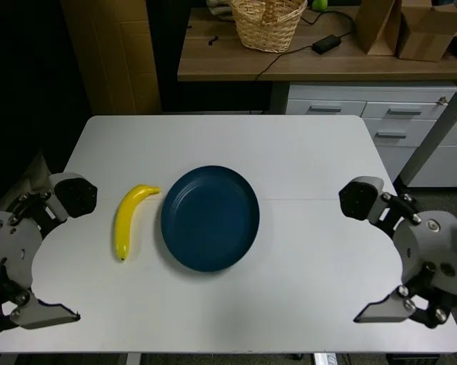
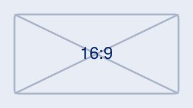

# Part I: Layout

## Five Bullets at the Density Limit

- First key point stated in a single short line
- Second point with a [highlighted term]{.hi} inline
- Third point, also kept to one line
- Fourth point with a [positive result]{.positive}
- Fifth and final point — the density ceiling

## A Standalone Statement

Minimalism means the slide breathes.

## Statement Class

[World models are zero-shot policies.]{.statement}

## One Box Only

::: {.keybox}
**Key insight:** the box hugs its content and sits centered, while its text stays left-aligned.
:::

## Figure With Caption

{width="55%"}

## Figure Plus Three Bullets

{width="50%"}

- Observation drawn from the figure
- Second observation, one line
- Third observation closes the slide

## Two Columns

:::: {.columns}
::: {.column width="50%"}
- Left column bullet one
- Left column bullet two
:::
::: {.column width="50%"}

:::
::::

## A Small Table

| Method | Success | Latency |
|--------|---------|---------|
| Ours   | 87%     | 12 ms   |
| Base   | 61%     | 15 ms   |

## Display Math

$$
\mathcal{L}(\theta) = \mathbb{E}_{t}\left[\lVert \epsilon - \epsilon_\theta(\mathbf{z}_t, t) \rVert^2\right]
$$

The loss is centered like every other element.

## Top-Aligned Escape Hatch {.top-align}

- This slide opts out of vertical centering
- Content anchors right under the title

##

An untitled slide centers everything, title included.

## With a Footnote

- A bullet above the footnote
- Another bullet

::: {.footnote}
Source: placeholder attribution (2026)
:::

# Part II: Slide Types

Every class below is styled by the SLIDE TYPES section of the theme; the
placeholder assets under `assets/` are committed so this deck renders anywhere.

## {.divider}

::: {.divider-number}
2
:::

::: {.divider-title}
Slide types
:::

::: {.divider-sub}
fixture
:::

## {.video-full video="assets/placeholder-video.mp4" poster="assets/placeholder-poster.jpg"}

::: {.video-caption}
[Placeholder clip fills the frame]{.video-caption-title}
[fixture &middot; 3 s loop &middot; muted]{.video-caption-meta}
:::

## Inline Video With Bullets

```{=html}
<video class="video-inline" src="assets/placeholder-video.mp4" poster="assets/placeholder-poster.jpg" muted loop autoplay playsinline></video>
```

- A 16:9 clip inside a content slide, capped so the list fits
- Centered like a figure, 4px corners

## Chart Figure Plus Bullets

```{=html}
<figure class="chart-figure">
<svg class="chart" viewBox="0 0 900 420" xmlns="http://www.w3.org/2000/svg" role="img" aria-label="three placeholder bars">
<style>.chart text{font-family:inherit;fill:currentColor} .chart .grid{stroke:currentColor;stroke-opacity:.15} .chart .bar{fill:var(--chart-muted,#9aa3ad)} .chart .bar.hi{fill:var(--accent,#012169)} .chart .ref{stroke:var(--accent2,#B9975B);stroke-width:3;stroke-dasharray:8 6}</style>
<line class="grid" x1="70" x2="880" y1="360" y2="360"/>
<text x="58" y="366" font-size="23" text-anchor="end" opacity=".75">0</text>
<line class="grid" x1="70" x2="880" y1="195" y2="195"/>
<text x="58" y="201" font-size="23" text-anchor="end" opacity=".75">50</text>
<line class="grid" x1="70" x2="880" y1="30" y2="30"/>
<text x="58" y="36" font-size="23" text-anchor="end" opacity=".75">100</text>
<rect class="bar" x="160" y="129" width="160" height="231" rx="3"/>
<text x="240" y="119" font-size="24" text-anchor="middle">70</text>
<text x="240" y="388" font-size="23" text-anchor="middle">Baseline</text>
<text x="240" y="412" font-size="18" text-anchor="middle" opacity=".75">2024</text>
<rect class="bar hi" x="395" y="63" width="160" height="297" rx="3"/>
<text x="475" y="53" font-size="24" text-anchor="middle" font-weight="700">90</text>
<text x="475" y="388" font-size="23" text-anchor="middle">Ours</text>
<text x="475" y="412" font-size="18" text-anchor="middle" opacity=".75">2025</text>
<rect class="bar" x="630" y="228" width="160" height="132" rx="3"/>
<text x="710" y="218" font-size="24" text-anchor="middle">40</text>
<text x="710" y="388" font-size="23" text-anchor="middle">Ablation</text>
<text x="710" y="412" font-size="18" text-anchor="middle" opacity=".75">2025</text>
<line class="ref" x1="70" x2="880" y1="96" y2="96"/>
<text x="74" y="88" font-size="18" text-anchor="start" opacity=".85">reference 80</text>
</svg>
</figure>
```

- Numbers in the chart stay readable from the back row
- Three bullets follow the figure
- The footnote below never overlaps them

::: {.footnote}
Data: placeholder values (2026). Chart: inline SVG using the theme's CSS vars.
:::

## Formula, Legend and Gloss

$$\pi(a \mid o,\; l)$$

::: {.formula-legend}
- $o$ = what it sees
- $l$ = what you told it
- $a$ = what it does
:::

<!-- Hangul as HTML entities: the pre-commit Korean gate scans the source. -->
[policy &middot; &#51221;&#52293; - the one symbol we reuse every week]{.gloss}

## Timeline, Five Items

```{=html}
<div class="timeline">
  <div class="tl-item"><div class="tl-date">Jul 2023</div><div class="tl-name">RT-2</div></div>
  <div class="tl-item"><div class="tl-date">Jun 2024</div><div class="tl-name">OpenVLA</div></div>
  <div class="tl-item"><div class="tl-date">Oct 2024</div><div class="tl-name">&pi;<sub>0</sub></div></div>
  <div class="tl-item"><div class="tl-date">Feb 2025</div><div class="tl-name">Helix</div></div>
  <div class="tl-item"><div class="tl-date">Apr 2025</div><div class="tl-name">&pi;<sub>0.5</sub></div></div>
</div>
```

::: {.footnote}
Thumbs: committed placeholder SVG. One row up to six items.
:::

## Timeline, Eight Items

```{=html}
<div class="timeline">
  <div class="tl-item"><div class="tl-date">Jul 2023</div><div class="tl-name">RT-2</div></div>
  <div class="tl-item"><div class="tl-date">Jun 2024</div><div class="tl-name">OpenVLA</div></div>
  <div class="tl-item"><div class="tl-date">Oct 2024</div><div class="tl-name">&pi;<sub>0</sub></div></div>
  <div class="tl-item"><div class="tl-date">Feb 2025</div><div class="tl-name">Helix</div></div>
  <div class="tl-item"><div class="tl-date">Apr 2025</div><div class="tl-name">&pi;<sub>0.5</sub></div></div>
  <div class="tl-item"><div class="tl-date">Jan 2026</div><div class="tl-name">Atlas at CES</div></div>
  <div class="tl-item"><div class="tl-date">Jan 2026</div><div class="tl-name">Helix 02</div></div>
  <div class="tl-item"><div class="tl-date">Jul 2026</div><div class="tl-name">Gemini Robotics 2</div></div>
</div>
```

::: {.footnote}
Thumbs: committed placeholder SVG. Seven or more items wrap to two rows of four.
:::
