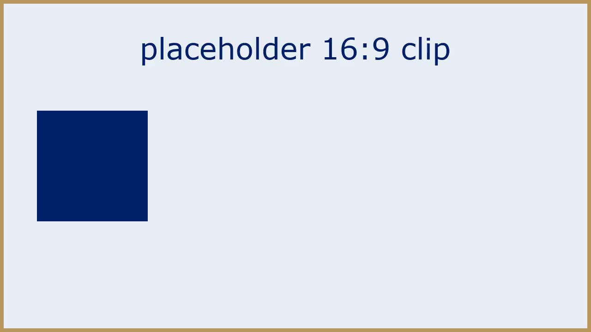

## A plain slide

- One idea, written with plain hyphens - like this one
- A second line that names a model, RT-2, without tripping the acronym check


## {.divider}

::: {.divider-number}
1
:::

::: {.divider-title}
Section dividers are level-2 slides
:::

## A third-party figure, attributed

{width="50%"}

- The figure is listed as third_party in figures.yml

::: {.footnote}
Source: Fixture Studio (CC BY 4.0), placeholder still.
:::

## Raw HTML: a stylesheet is not text, a source line is

```{=html}
<figure class="chart-figure">
<svg class="chart" viewBox="0 0 300 60" xmlns="http://www.w3.org/2000/svg" role="img" aria-label="one placeholder bar">
<style>.chart .bar{fill:var(--chart-muted,#9aa3ad)} .chart text{fill:currentColor}</style>
<rect class="bar" x="10" y="10" width="200" height="40" rx="3"/>
<text x="220" y="38" font-size="20">placeholder</text>
</svg>
</figure>

```

- The CSS custom property above carries `--` and is not a dash expression
- The third-party image inside the raw block is attributed below

::: {.footnote}
Source: Fixture Studio (CC BY 4.0).
:::

## Inline math is not a dash expression

$$
x_{t} - x_{t-1} = -\alpha \nabla L
$$

- Math keeps its minus signs; the lint reads only the words around it
