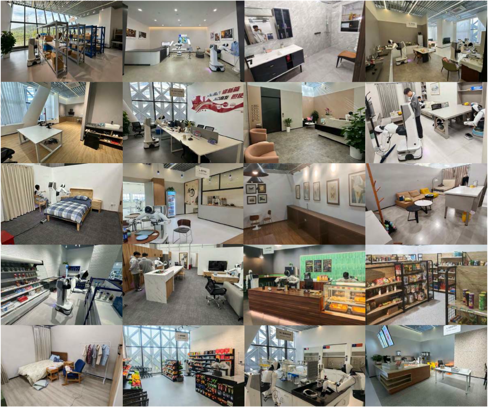
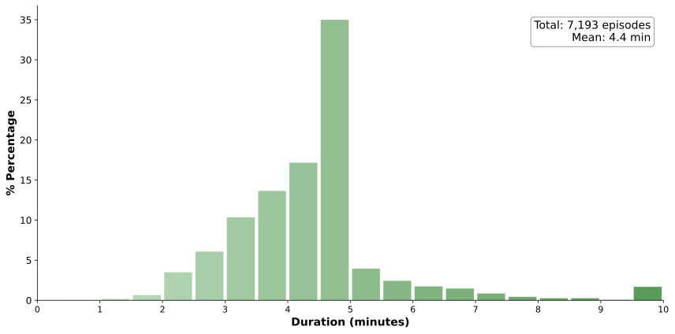

# Part I: Layout

## Five Bullets at the Density Limit

- First key point stated in a single short line
- Second point with a [highlighted term]{.hi} inline
- Third point, also kept to one line
- Fourth point with a [positive result]{.positive}
- Fifth and final point — the density ceiling

## A Standalone Statement

Minimalism means the slide breathes.

## Statement Class

[World models are zero-shot policies.]{.statement}

## One Box Only

::: {.keybox}
**Key insight:** the box hugs its content and sits centered, while its text stays left-aligned.
:::

## Figure With Caption

{width="55%"}

## Figure Plus Three Bullets

{width="50%"}

- Observation drawn from the figure
- Second observation, one line
- Third observation closes the slide

## Two Columns

:::: {.columns}
::: {.column width="50%"}
- Left column bullet one
- Left column bullet two
:::
::: {.column width="50%"}

:::
::::

## A Small Table

| Method | Success | Latency |
|--------|---------|---------|
| Ours   | 87%     | 12 ms   |
| Base   | 61%     | 15 ms   |

## Display Math

$$
\mathcal{L}(\theta) = \mathbb{E}_{t}\left[\lVert \epsilon - \epsilon_\theta(\mathbf{z}_t, t) \rVert^2\right]
$$

The loss is centered like every other element.

## Top-Aligned Escape Hatch {.top-align}

- This slide opts out of vertical centering
- Content anchors right under the title

##

An untitled slide centers everything, title included.

## With a Footnote

- A bullet above the footnote
- Another bullet

::: {.footnote}
Source: placeholder attribution (2026)
:::
