## About me {.tight}

{.profile-photo fig-alt="Yunsung Lee"}

**WoRV:** the autonomous driving & robotics research lab at Maum.AI<br>
robots that learn from data

**Co-instructor:** Chris Choi, CEO of Maum.AI<br>
closing keynote on Dec 4

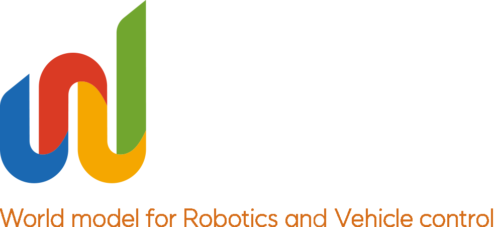{fig-alt="WoRV logo" width="240px"}


## Picking up from last week

- Last Friday (): 
- This course: one semester on AI that gets a body





## Attendance: two numbers

::: {.compact}
- In person: sign the sheet; the TA spot-checks at random
- Attendance and participation: [40% of the grade]{.hi}
- Three absences: [F]{.hi-red}
- Remote Sep 11 / Nov 6: DGIST login records attendance
:::

::: {.footnote}

:::


## Essays: submitting is what counts

- Eight talks: five lectures, two guests, one closing keynote
- Reflection after each talk: 50%; submission counts; three missing = F
- Final synthesis essay: 10%; prompts and deadlines on the LMS

::: {.footnote}

:::


## Ask anytime {.qr-slide}

::: {.qr-block}
::: {.keybox}
**Wooclap**

code announced in class
:::
:::

Questions go on the wall any time; we answer them in the last 10 minutes.


## {.video-full video="@s07a-bd-atlas-bring-me-a-drink"}


## Autonomous or teleoperated?

::: {.question-overlay .fragment .fade-out fragment-index="1"}
[Hands up: did Atlas move on its own?]{.statement}
:::

:::: {.columns}
::: {.column style="flex:0 0 44%;"}
::: {.fragment fragment-index="1"}
Company claim: trained in simulation, running on its own.

[Atlas · Boston Dynamics · May 2026 · autonomy claimed]{.meta-line}
:::

::: {.fragment fragment-index="2"}
Not stated: "no teleoperation"
:::

::: {.fragment fragment-index="3"}
Teleoperation actually looks like this:
:::
:::

::: {.column style="flex:0 0 52%;"}

:::
::::


## Moravec's paradox (1988)

[The hard problems are easy.<br>The easy problems are hard.]{.statement}

Chess fell in 1997. An AI can write your essay.<br>Fetching a drink held out until now.

::: {.footnote}
Hans Moravec, *Mind Children* (1988) - paraphrased.
:::


##

[AI is getting a body: from AI that [talks]{.hi-gold} to AI that [acts]{.hi-gold}.]{.statement}


## Today's route

1. The problem - why easy is hard (done)
2. The history - how AI learned to see and talk, 2012-2022
3. The turn - why action is next, and why now
4. The map - where this course goes


## {.divider}

::: {.divider-number}
1
:::

::: {.divider-title}
How AI Learned to See and Talk
:::

::: {.divider-sub}
2012 - 2022
:::

::: {.divider-sub}
Wooclap · code announced in class
:::


## 2012 · AlexNet: Machines Learn to See



- ImageNet: 1.2 million labeled photos, plus two gaming GPUs
- No hand-written rules - the network learned from examples
- Within three years it beat a human at this benchmark

::: {.footnote}
Metric: ILSVRC top-5 error · Data: Russakovsky et al. (2015); 2015 point: He et al. (2016), ensemble · [Try a CNN yourself](https://poloclub.github.io/cnn-explainer/)
:::


## 2017 · One architecture for everything

:::: {.columns}
::: {.column style="flex:0 0 58%;"}
You don't need to read this diagram. Just remember the name: [Transformer]{.hi}.
:::

::: {.column style="flex:0 0 34%;"}

:::
::::

::: {.footnote}
Figure: Vaswani et al. (2017), "Attention Is All You Need" · Interactive: [poloclub.github.io/transformer-explainer](https://poloclub.github.io/transformer-explainer/)
:::


## 2018-2020 · GPT: One Simple Game {.tight}

Guess the next word. That was the whole training.

"Scientists discovered unicorns in the Andes<br>that spoke perfect \_\_\_\_" [English.]{.fragment .hi-gold}

::: {.highlightbox .fragment}
**GPT-2 continues (2019):**<br>
"The scientist named the population, after their distinctive horn, Ovid's Unicorn."
:::

[Fluent is not the same as true.]{.fragment}

::: {.footnote}
Sample: OpenAI (2019), "Better language models and their implications"
:::


## 2020 · Bigger kept getting better



- Bigger model + more data + more compute = predictably better
- A straight line, again and again - no ceiling in sight
- That one chart became the industry's playbook: scale up

::: {.footnote}
Concept chart, redrawn after Kaplan et al. (2020), Fig. 1
:::


## 2022 · Language Meets Images

One sentence in, a painting out: "a fox in a field, in the style of Monet"

:::: {.columns}
::: {.column}
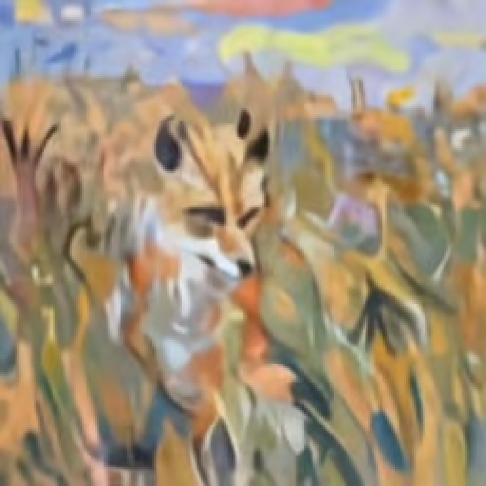{width="100%" style="max-height:330px;"}
:::

::: {.column}
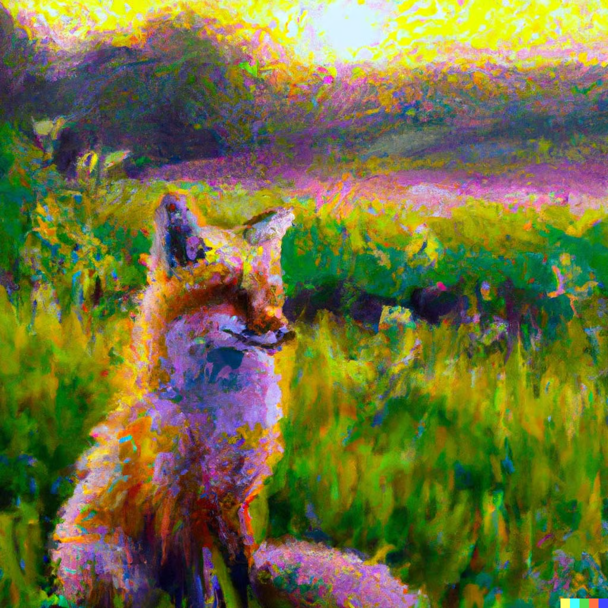{width="100%" style="max-height:330px;"}
:::

::: {.column .fragment}
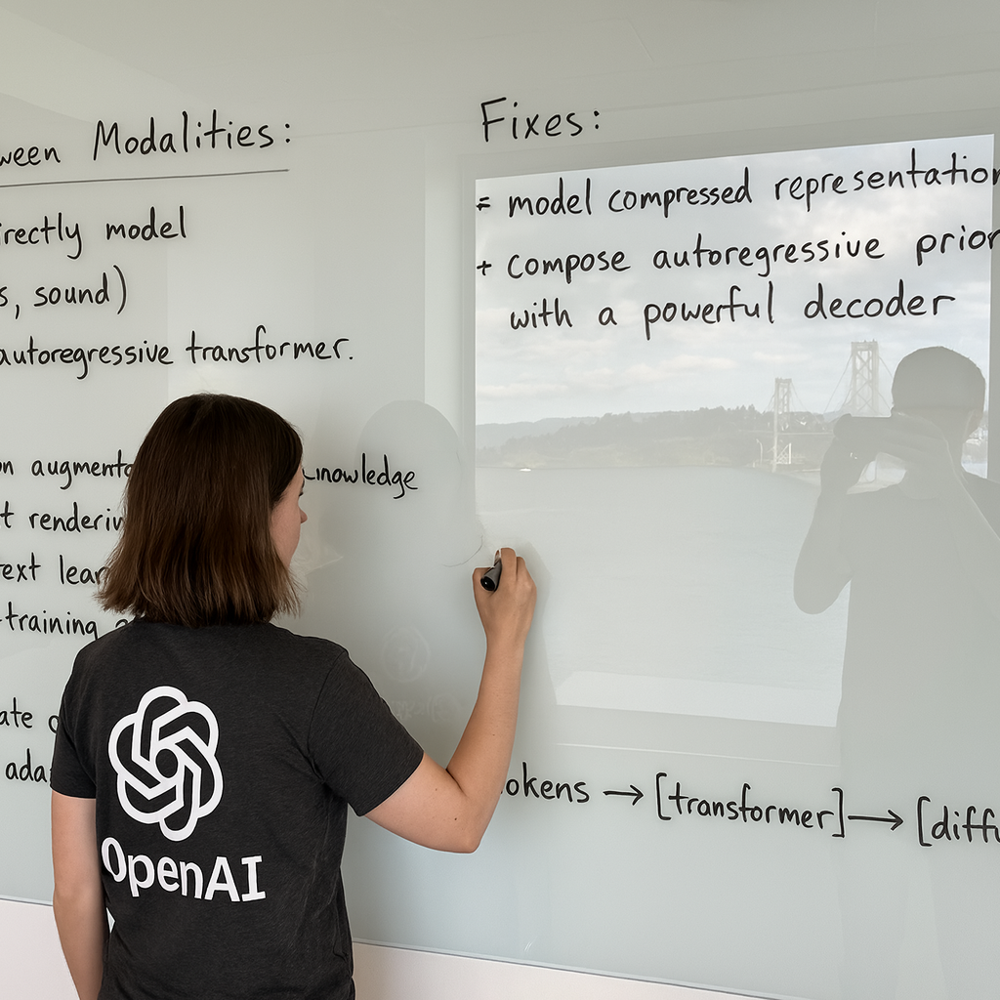{width="100%" style="max-height:330px;"}
:::
::::

::: {.footnote}
Source: OpenAI (2022, 2025)
:::


## 2022 · Talking AI becomes a habit

[100 million users in two months.]{.statement}

Talking AI stopped being a demo and became a habit.

::: {.footnote}
Estimate: UBS / Similarweb, reported by Reuters (Feb 2023)
:::


## Foundation Models: Train Once, Do Many Things

:::: {.columns}
::: {.column style="flex:0 0 48%;"}
- One model from varied data
- Adapt it to many tasks
- That is a [foundation model]{.hi}
:::

::: {.column style="flex:0 0 48%;"}
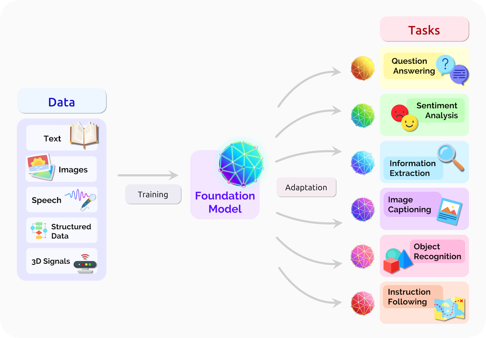
:::
::::

::: {.footnote}
Figure: Bommasani et al. (2021), Fig. 2 - CC BY 4.0
:::


## Meanwhile, Robots…



- Astonishing athletics - every move modeled, planned, and choreographed by engineers
- Superb engineering. But nothing here was learned from data.


## Two Waves, One Wall

```{=html}
<div style="display:grid;grid-template-columns:repeat(2,minmax(0,1fr));gap:4px 24px;width:100%;">
  <div class="hi" style="text-align:center;">Wave 1 · Trial and error</div>
  <div class="hi" style="text-align:center;">Wave 2 · Imitation</div>
  <figure style="margin:0;">
    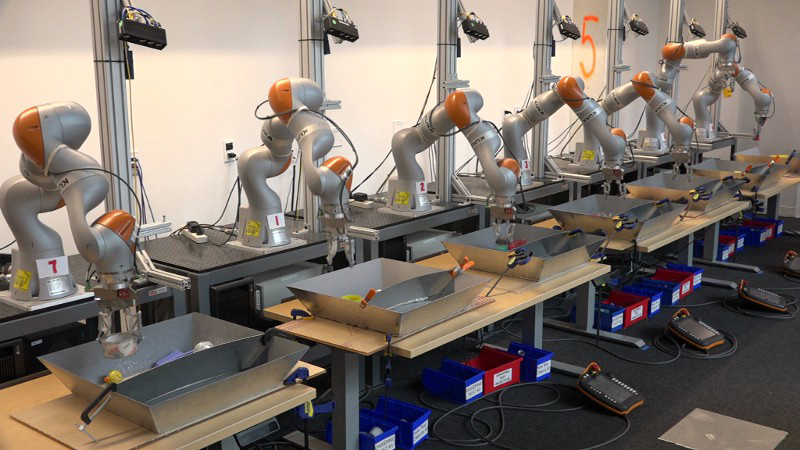
    <figcaption>Robot farm - Google, 2018</figcaption>
  </figure>
  <figure style="margin:0;">
    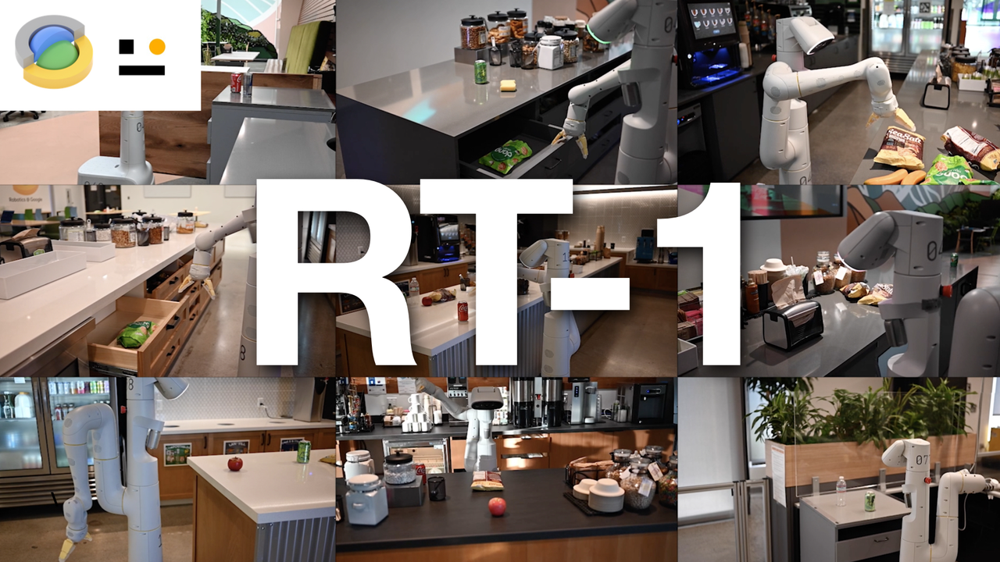
    <figcaption>Thousands of demonstrations - Google, 2022</figcaption>
  </figure>
  <figure style="margin:0;">
    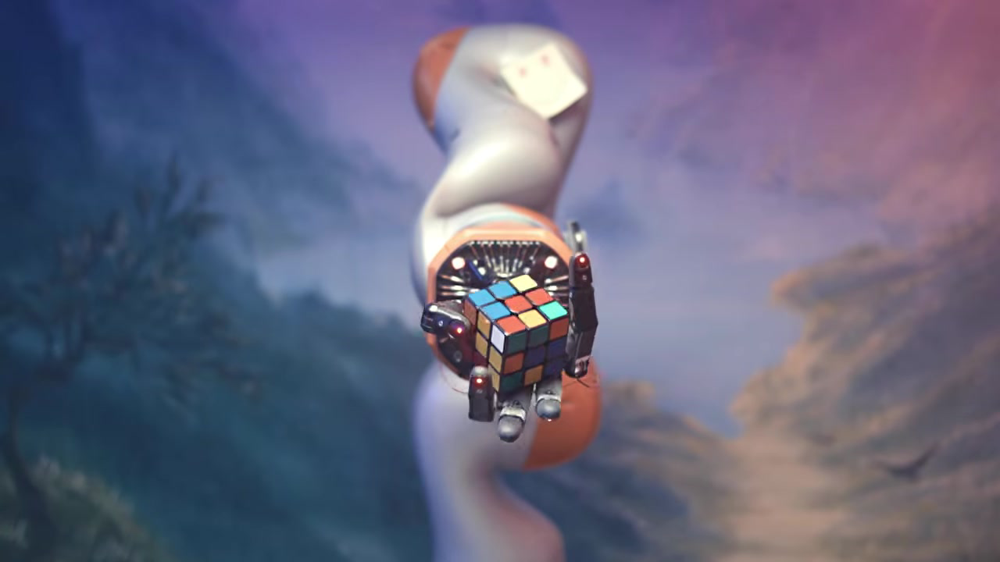
    <figcaption>Robot-hand dexterity - OpenAI, 2019</figcaption>
  </figure>
  <figure style="margin:0;">
    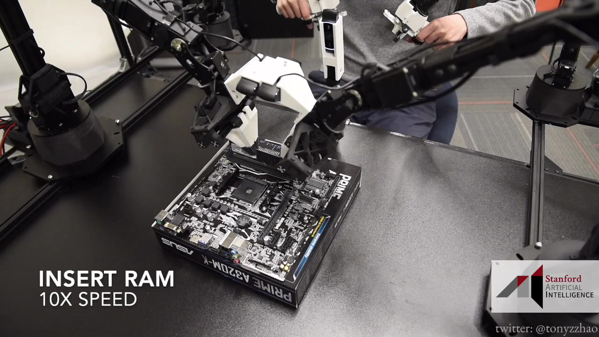
    <figcaption>Two arms copy human hands - Stanford, 2023</figcaption>
  </figure>
</div>
```

::: {.keybox .fragment}
Both waves hit the same wall: generalization.
:::

::: {.footnote}
Sources: Kalashnikov et al. (2018) · OpenAI (2019) · Brohan et al. (2022) · Zhao et al. (2023)
:::


## What Was Still Missing

The robots of that decade were missing three things.

- Common sense - everyday knowledge of how the world works
- Language - you could not just tell a robot what you wanted
- The open world - anything beyond the scripted lab task

[By 2022, talking AI suddenly had all three.<br>What happens when you give it a body?]{.fragment .hi}


## {.divider}

::: {.divider-number}
2
:::

::: {.divider-title}
The Turn
:::

::: {.divider-sub}
Why action is next - and why now
:::

::: {.divider-sub}
Wooclap · code announced in class
:::


## Same recipe, new output



- Language models learn one trick: predict the next word.
- Give the model eyes, and the same trick describes images (VLM).
- Give it a body, and the same trick predicts the next action (VLA).


## The only formula this course needs

$$
\pi(a \mid o, l)
$$

::: {.formula-legend}
- $a$ - the action the robot takes
- $o$ - what the robot observes
- $l$ - the instruction, in language
- $\pi$ - the rule that picks the action (researchers call it a policy)
:::

It comes back every week.


## RT-2: web knowledge moves a robot arm



- "Pick up the extinct animal" - it picks the dinosaur.
- The command never appears in its robot training data.
- Web knowledge starts moving a robot arm.


## What does Embodied AI mean?

Embodied AI closes the loop in one body: seeing, understanding, deciding, and acting.

```{=html}
<figure class="chart-figure">
<svg id="s27-terms" viewBox="0 0 900 390" xmlns="http://www.w3.org/2000/svg" role="img" aria-label="Embodied AI terminology map">
  <style>
    #s27-terms text { font-family: inherit; fill: #012169; }
    #s27-terms .outer { fill: #f3f6fb; stroke: #012169; stroke-width: 4; }
    #s27-terms .inner { fill: #ffffff; stroke: #B9975B; stroke-width: 4; }
    #s27-terms .chip { fill: #012169; }
    #s27-terms .chip-text { fill: #ffffff; }
    #s27-terms .muted { fill: #59667a; }
  </style>
  <rect class="outer" x="35" y="25" width="830" height="335" rx="38"/>
  <text x="450" y="78" text-anchor="middle" font-size="32" font-weight="700">Embodied AI ≈ Physical AI</text>
  <text class="muted" x="450" y="110" text-anchor="middle" font-size="22">industry term</text>
  <rect class="inner" x="165" y="138" width="570" height="175" rx="30"/>
  <text x="450" y="185" text-anchor="middle" font-size="30" font-weight="700">Robot Learning</text>
  <text class="muted" x="450" y="216" text-anchor="middle" font-size="22">the academic field</text>
  <rect class="chip" x="265" y="238" width="370" height="54" rx="27"/>
  <text class="chip-text" x="450" y="273" text-anchor="middle" font-size="24" font-weight="700">RFM · Robot Foundation Models</text>
</svg>
</figure>
```

From here on, we use the term [Embodied AI]{.hi}.


## Every new model bets on one of three axes




## The data barrier



[Action is [not on the internet]{.hi}.]{.fragment .statement}

::: {.footnote}
Log scale; units differ by type (words / images / hours) - read orders of magnitude, not counts. Own figure.
:::


## {.video-full video="@pi0-laundry"}




## {.video-full video="@pi05-unseen-bedroom"}




## Helix: two robots, one brain



- Two Figure robots share one learned policy (Feb 2025).
- By 2026, Helix 02 claims "fully autonomous, not teleoperated."

::: {.footnote}
The 2025 announcement never states the autonomy mode - the label under the clip is doing the checking for you. Source: Figure (2025).
:::


## {.video-full video="@unitree-gala"}




## {.video-full video="@atlas-tomorrow"}




## {.video-full video="@neo-home"}




## The 2023-2026 unlock

```{=html}
<div class="timeline" style="width:94%;margin:0 auto;row-gap:0.4em;">
  <div class="tl-item">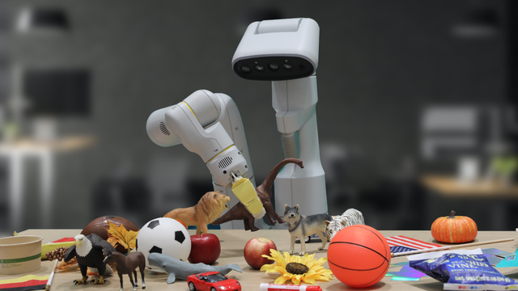<div class="tl-date">Jul 2023</div><div class="tl-name">RT-2</div></div>
  <div class="tl-item">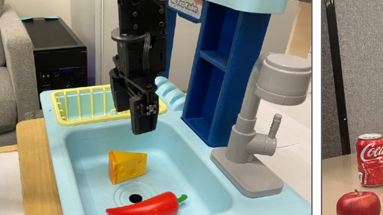<div class="tl-date">Jun 2024</div><div class="tl-name">OpenVLA</div></div>
  <div class="tl-item">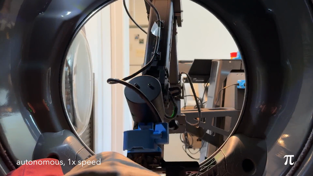<div class="tl-date">Oct 2024</div><div class="tl-name">&pi;<sub>0</sub></div></div>
  <div class="tl-item">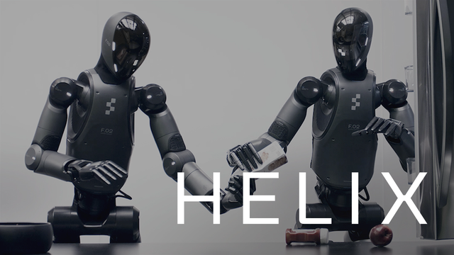<div class="tl-date">Feb 2025</div><div class="tl-name">Helix</div></div>
  <div class="tl-item">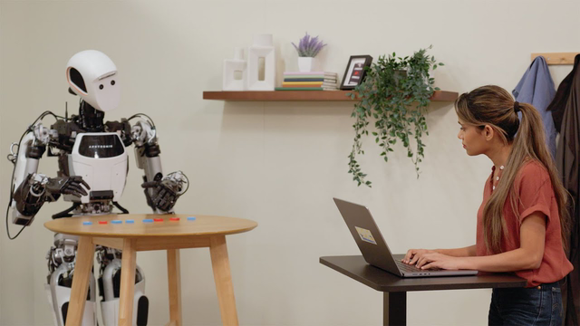<div class="tl-date">Mar 2025</div><div class="tl-name">Gemini Robotics</div></div>
  <div class="tl-item">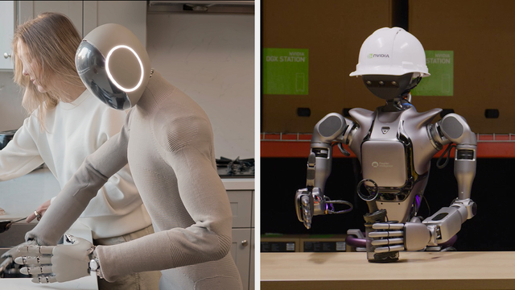<div class="tl-date">Mar 2025</div><div class="tl-name">GR00T N1</div></div>
  <div class="tl-item">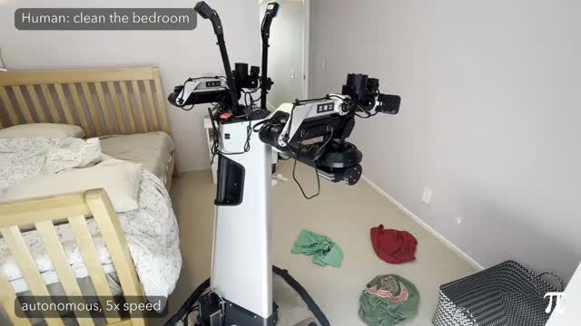<div class="tl-date">Apr 2025</div><div class="tl-name">&pi;<sub>0.5</sub></div></div>
  <div class="tl-item">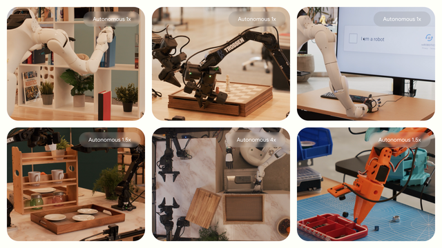<div class="tl-date">Jul 2026</div><div class="tl-name">Gemini Robotics 2</div></div>
</div>
```

Everything you just watched happened in [36 months]{.hi-gold}.

::: {.footnote}
Sources: Google DeepMind · OpenVLA, Kim et al. (2024) · Physical Intelligence · Figure · NVIDIA
:::


## The pull now comes from industry, not academia

```{=html}
<div class="fact-grid">
  <div class="fact-label">Capital</div>
  <div class="fact-text">Figure $1B+ at $39B; Skild $1.4B at $14B+; NEURA up to $1.4B.</div>
  <div class="fact-label">Production</div>
  <div class="fact-text">Unitree reports 5,500+ humanoids shipped in 2025; its $904M IPO rose 460% on debut. It was mainland China’s first listed humanoid maker.</div>
  <div class="fact-label">Platforms</div>
  <div class="fact-text">NVIDIA’s open GR00T reference humanoid and Google DeepMind’s whole-body Gemini Robotics 2 arrived in 2026.</div>
</div>
```

::: {.footnote}
Capital: Figure, Sep 16 2025 · Skild, Jan 14 2026 · NEURA/CNBC, Jun 10 2026<br>
Production: Bloomberg/Unitree, Aug 19 2026 (shipments company-reported)<br>
Platforms: NVIDIA, Jun 1 2026 · Google DeepMind, Jul 30 2026
:::


## One case from where I work

::: {.two-up}



:::

Left: can a robot's route earn its keep? Right: can two arms do real work?


## Demo ≠ deployment

::: {.compact}
- Precise contact - buttons, cables, glassware.
- Long horizons - an hour of chores without a reset.
- Unfamiliar bodies - policies still cling to their own hardware.
- Speed and safety - human pace, around actual humans.
:::

::: {.keybox .fragment}
Ask first: was it autonomous?
:::


## {.divider}

::: {.divider-number}
3
:::

::: {.divider-title}
The map
:::

::: {.divider-sub}
Where this course goes
:::

::: {.divider-sub}
Wooclap · code announced in class
:::


## The semester, again



Today set the question. The rest of the semester answers it.


## First: how robots learn

```{=html}
<div class="roadmap">
  <div class="rm-row">
    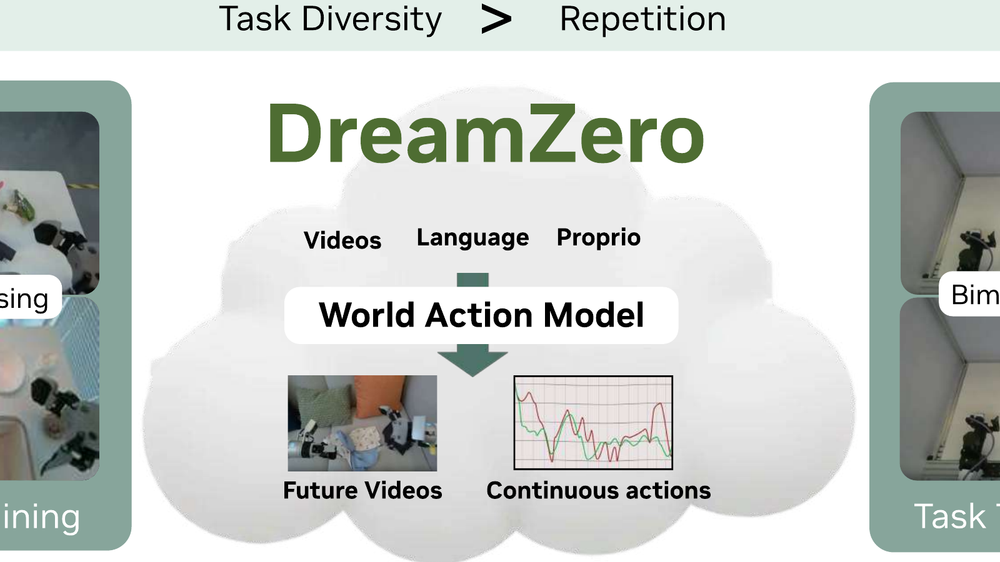
    <div class="rm-text">
      <div class="rm-title">Sep 11 · Video and Robot Foundation Models</div>
      <div class="rm-desc"><span class="rm-guest">Guest: Hyeongmin Lee</span> · Robots that learn by watching video.</div>
    </div>
  </div>
  <div class="rm-row">
    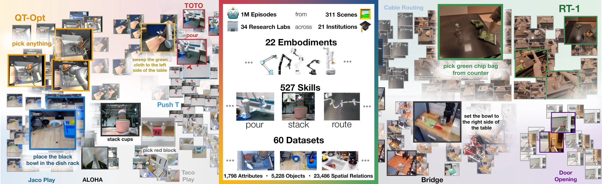
    <div class="rm-text">
      <div class="rm-title">Oct 2 · Action Data</div>
      <div class="rm-desc">Where robot experience comes from.</div>
    </div>
  </div>
  <div class="rm-row">
    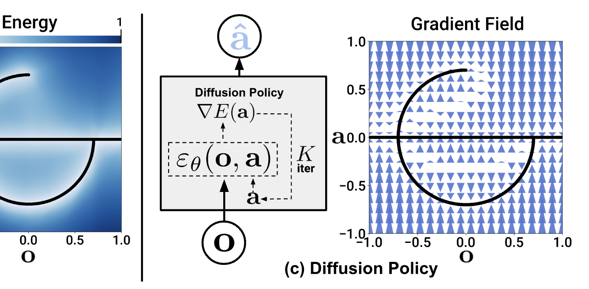
    <div class="rm-text">
      <div class="rm-title">Oct 23 · Learning Methods</div>
      <div class="rm-desc">How demonstrations become skills.</div>
    </div>
  </div>
</div>
```

::: {.footnote}
Sources: DreamZero (NVIDIA, 2026) · Open X-Embodiment Collaboration (2023) · Chi et al. (2023)
:::


## Then: from policy to physical motion

```{=html}
<div class="roadmap rm-two">
  <div class="rm-row">
    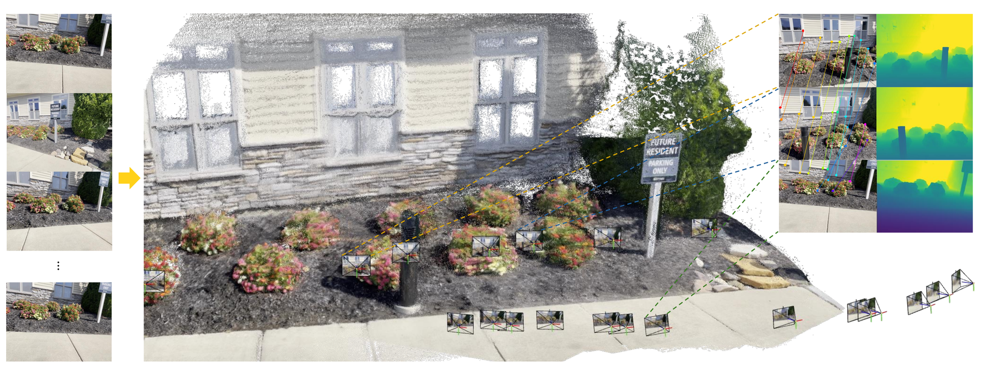
    <div class="rm-text">
      <div class="rm-title">Nov 6 · Spatial AI to Physical AI</div>
      <div class="rm-desc"><span class="rm-guest">Guest: Sunghwan Hong</span> · Machines that know where things are.</div>
    </div>
  </div>
  <div class="rm-row">
    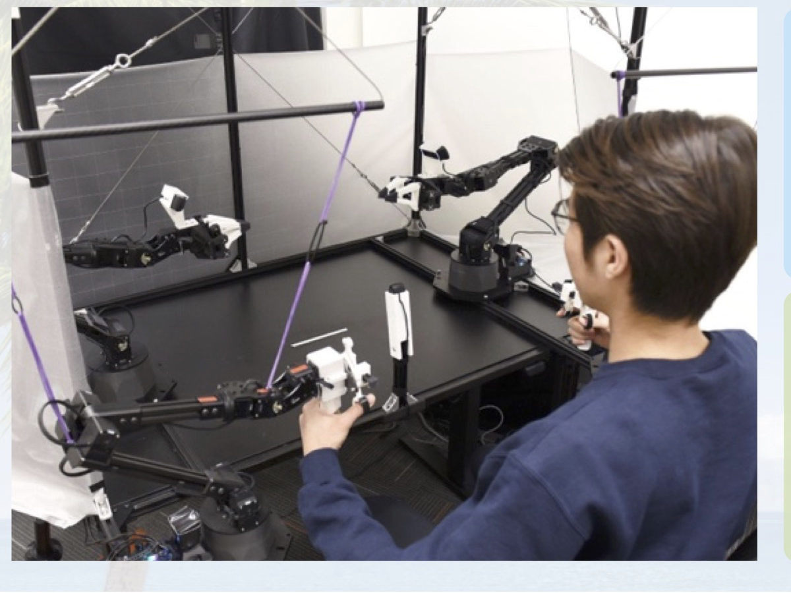
    <div class="rm-text">
      <div class="rm-title">Nov 20 · Robot Hardware Special</div>
      <div class="rm-desc">Control and mechanics beneath learned policies.</div>
    </div>
  </div>
</div>
```

::: {.footnote}
Sources: Wang et al. (2025) · Zhao et al. (2023)
:::


## Finally: safety and industry

```{=html}
<div class="roadmap rm-two">
  <div class="rm-row">
    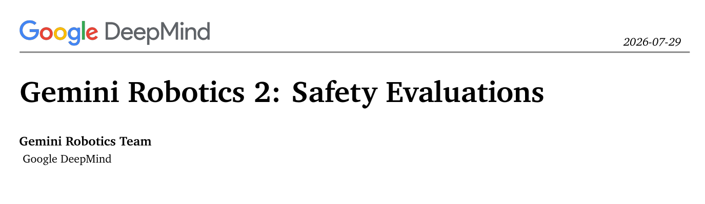
    <div class="rm-text">
      <div class="rm-title">Nov 27 · Ethics and Safety</div>
      <div class="rm-desc">What robots must never do, and who checks.</div>
    </div>
  </div>
  <div class="rm-row">
    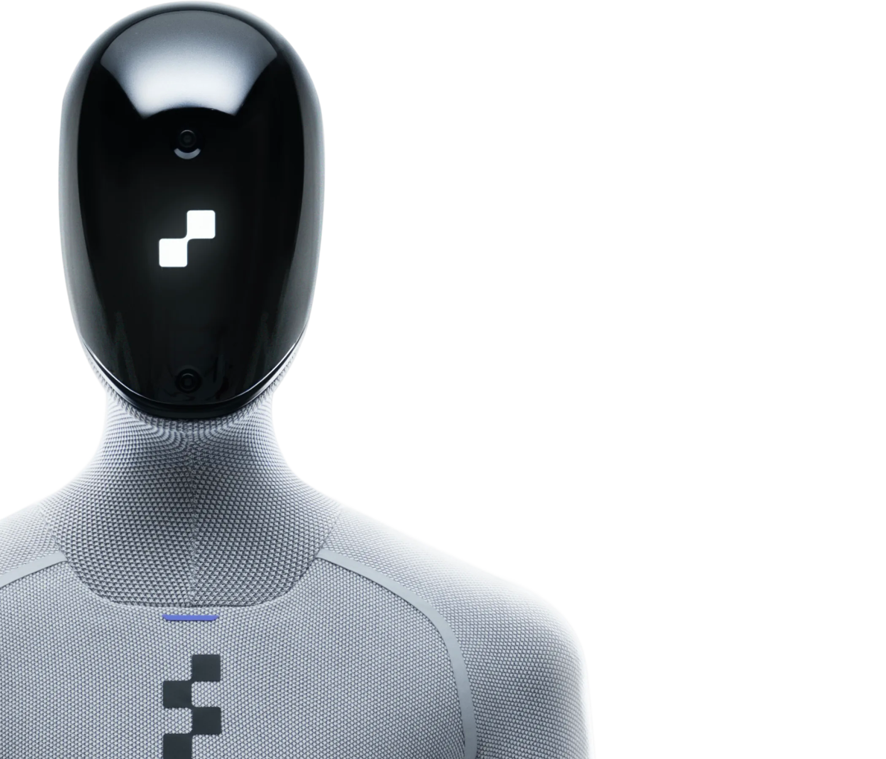
    <div class="rm-text">
      <div class="rm-title">Dec 4 · Closing Keynote</div>
      <div class="rm-desc"><span class="rm-guest">Chris Choi</span> · Physical AI as a megatrend: the view from industry.</div>
    </div>
  </div>
</div>
```

::: {.footnote}
Sources: Google DeepMind (2026) · Figure (2025)
:::


## Three takeaways

```{=html}
<ol class="takeaways">
  <li>Same recipe, new output: <span class="hi">action</span>.</li>
  <li class="fragment"><span class="hi">Data</span> is the bottleneck: action is not on the internet.</li>
  <li class="fragment">When you see a demo, ask first: <span class="hi-gold">is it autonomous?</span></li>
</ol>
```


## Your questions {.qr-slide}

::: {.qr-block}
::: {.keybox}
**Wooclap**

code announced in class
:::
:::

<!-- End of deck. -->
