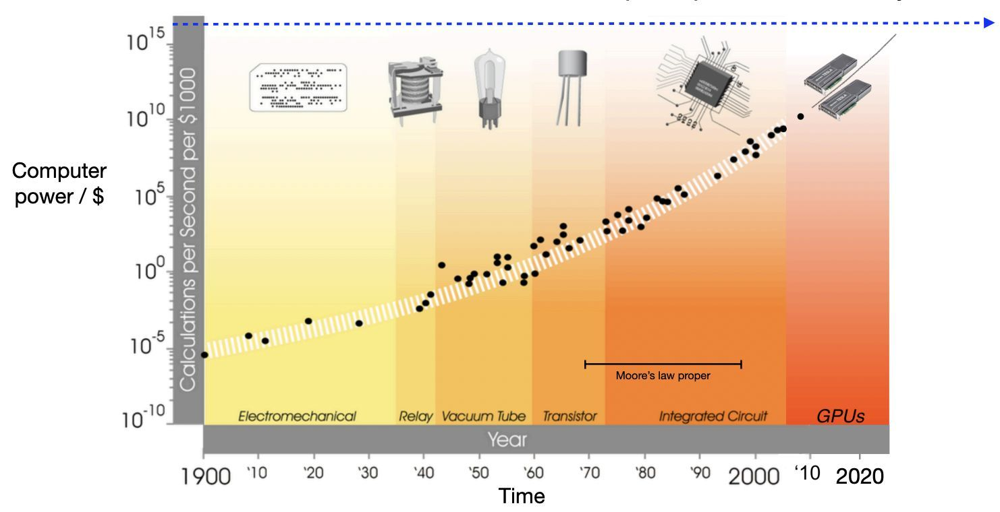
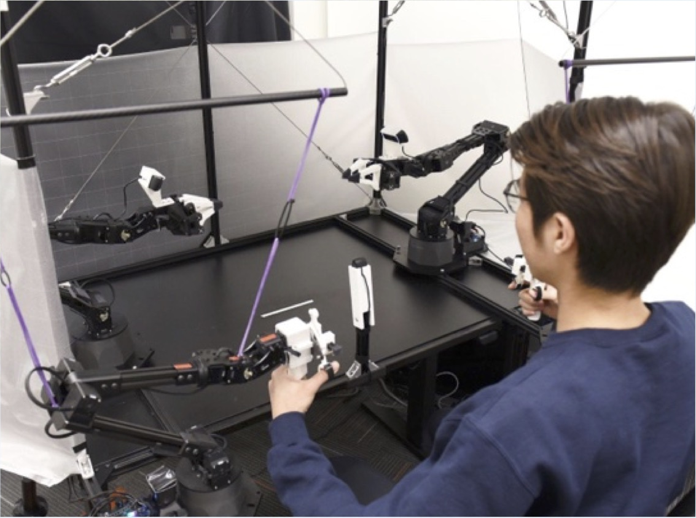
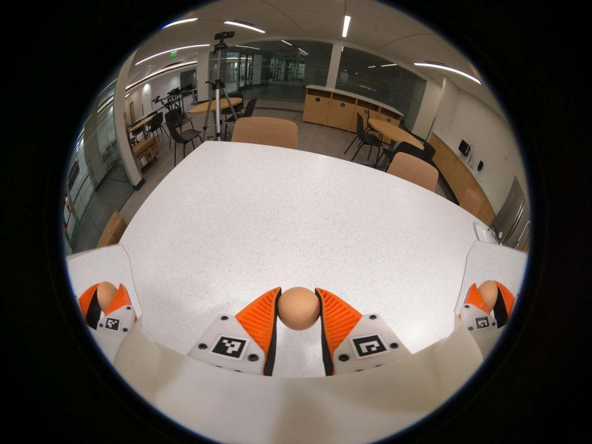
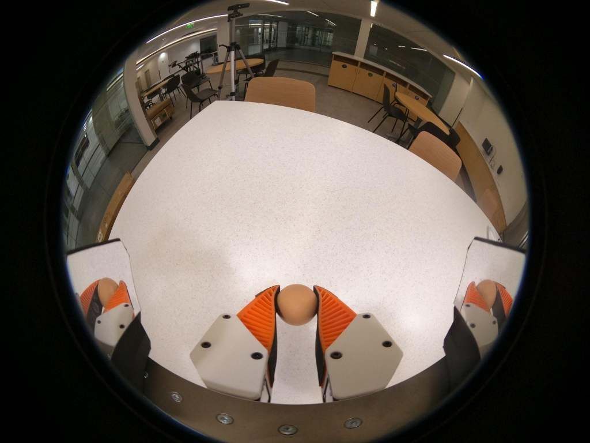
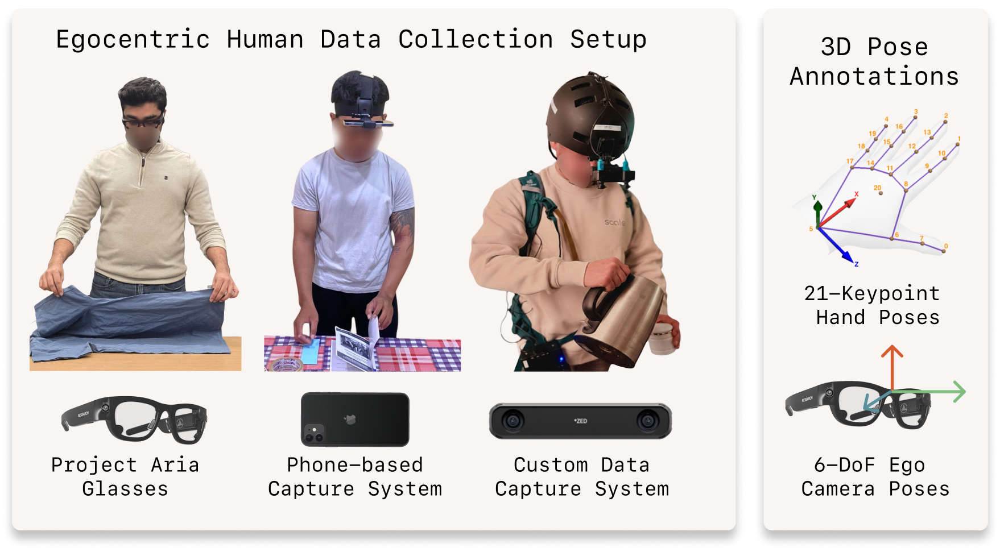
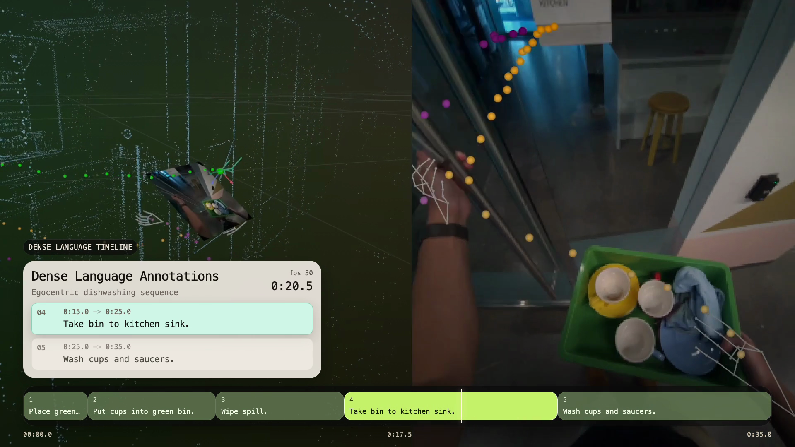
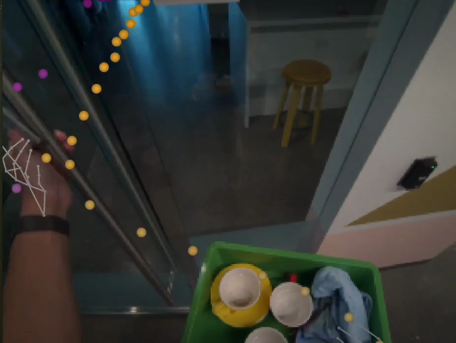
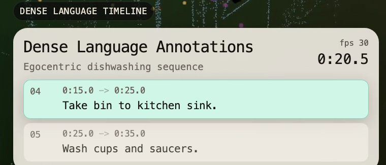

## {#p01 .title-scene data-chapter="intro" data-seconds="20"}



::: {.footnote}
 · 
:::


## Connecting our previous lectures {#p02 data-chapter="intro" data-seconds="40" .recap}



::: {.footnote}
W02: The Paradigm Shift Toward Embodied AI. W03: [Hyeongmin Lee, DGIST (2026)](https://hyeongminlee.github.io/slides/video-world-models-2026/), slide 31.
:::


## The semester in one picture {#p03 data-chapter="intro" data-seconds="15"}



::: {.footnote}
Course series: DGIST HSS118, Fall 2026
:::


## How this course runs {#p04 data-chapter="intro" data-seconds="10"}

- Attendance: every session
- Assignments and deadlines: the LMS
- Questions: Wooclap throughout the lecture

::: {.footnote}

:::


## Ask anytime {#p05 .qr-slide data-chapter="intro" data-seconds="15"}



Leave a question at any time.

::: {.footnote}

:::


## What experience would teach this? {#p06 data-chapter="intro" data-seconds="50"}

:::: {.r-stack .visual-stack}
::: {.fragment .fade-out fragment-index="0"}

:::
::: {.fragment fragment-index="0"}

:::
::::

::: {.footnote}
Own teaching example; record structure informed by [ETH Real-World Robotics (2025)](https://rwr.ethz.ch/slides/2025/2025-Unit07-Data_Davidev2.pdf), p6. © Robert Katzschmann.
:::


## What experience teaches a robot? {#route-1 .route-slide data-chapter="intro" data-seconds="30"}

```{=html}
<div class="lecture-route" aria-label="Lecture route, now at chapter 1 of five">
<p class="route-position">Lecture route: 1 of 5</p>
<div class="route-stops"><div class="route-stop current" aria-current="step"><span class="route-number">1</span><p>Learn from<br>text</p></div><div class="route-stop upcoming"><span class="route-number">2</span><p>Output<br>actions</p></div><div class="route-stop upcoming"><span class="route-number">3</span><p>Collect<br>examples</p></div><div class="route-stop upcoming"><span class="route-number">4</span><p>Scale with<br>people</p></div><div class="route-stop upcoming"><span class="route-number">5</span><p>More kinds<br>of video</p></div></div>
<div class="route-bridge"><p>Our task: open a drawer and put an empty cup inside.</p><p class="route-question">First, how do models learn from text?</p></div>
</div>
```


## 1. What did language models learn from? {#p07 data-chapter="chapter-1" data-seconds="45"}

:::: {.r-stack .visual-stack .source-stack}
::: {.fragment .fade-out fragment-index="0"}

:::
::: {.fragment fragment-index="0"}

:::
::::

::: {.footnote}
Adapted from [Jason Wei, Stanford CS25 (2024), slide 4](https://www.youtube.com/watch?v=3gb-ZkVRemQ&t=35s). Illustrative scores.
:::


## One task, many skills {#p08 data-chapter="chapter-1" data-seconds="75"}

:::: {.r-stack .visual-stack .source-stack}
::: {.fragment .fade-out fragment-index="0"}

:::
::: {.fragment .current-visible fragment-index="0"}

:::
::: {.fragment .current-visible fragment-index="1"}

:::
::: {.fragment .current-visible fragment-index="2"}

:::
::: {.fragment .current-visible fragment-index="3"}

:::
::: {.fragment fragment-index="4"}

:::
::::

::: {.footnote}
Adapted from [Wei, Stanford CS25 (2024), slide 6](https://www.youtube.com/watch?v=3gb-ZkVRemQ&t=263s).
:::


## One passage, many next-token tasks {#p09 data-chapter="chapter-1" data-seconds="60"}

:::: {.r-stack .visual-stack .source-stack}
::: {.fragment .fade-out fragment-index="0"}

:::
::: {.fragment .current-visible fragment-index="0"}

:::
::: {.fragment fragment-index="1"}

:::
::::

::: {.footnote}
Adapted from [Wei, Stanford CS25 (2024), slide 7](https://www.youtube.com/watch?v=3gb-ZkVRemQ&t=438s). Teaching passage; illustrative token boundaries.
:::


## More training, lower prediction error {#p10 data-chapter="chapter-1" data-seconds="45"}

:::: {.r-stack .visual-stack .source-stack}
::: {.fragment .fade-out fragment-index="0"}

:::
::: {.fragment fragment-index="0"}

:::
::::

::: {.footnote}
Schematic reconstruction of [Wei's chalkboard explanation](https://www.youtube.com/watch?v=3gb-ZkVRemQ&t=600s), after Kaplan et al. (2020).
:::


## One average, different abilities {#p11 data-chapter="chapter-1" data-seconds="45"}



::: {.footnote}
Original [Jason Wei, Stanford CS25 (2024), slide 13](https://www.youtube.com/watch?v=3gb-ZkVRemQ). Original conceptual curves with teaching cues; not measured data.
:::


## More compute becomes affordable {#p12 data-chapter="chapter-1" data-seconds="45"}

:::: {.r-stack .visual-stack .source-stack}
::: {.fragment .fade-out fragment-index="0"}
{.source-image fig-alt="Chung original historical compute chart"}
:::
::: {.fragment fragment-index="0"}

:::
::::

::: {.footnote}
Original [Hyung Won Chung, Stanford CS25 (2024), slide 7](https://www.youtube.com/watch?v=3gb-ZkVRemQ). Historical hardware cost/performance; qualitative takeaway follows.
:::


## Same task, different model designs {#p13 data-chapter="chapter-1" data-seconds="60"}

:::: {.r-stack .visual-stack .source-stack}
::: {.fragment .fade-out fragment-index="0"}

:::
::: {.fragment .current-visible fragment-index="0"}

:::
::: {.fragment fragment-index="1"}

:::
::::

::: {.footnote}
[Hyung Won Chung, Stanford CS25 (2024), slides 10 and 37](https://www.youtube.com/watch?v=3gb-ZkVRemQ). Teaching diagram and original conceptual curves; not measured architecture comparisons.
:::


## The best choice depends on resources {#p14 data-chapter="chapter-1" data-seconds="75"}

:::: {.r-stack .visual-stack .source-stack}
::: {.fragment .fade-out fragment-index="0"}

:::
::: {.fragment fragment-index="0"}

:::
::::

::: {.footnote}
Original [Hyung Won Chung, Stanford CS25 (2024), slides 11-12](https://www.youtube.com/watch?v=3gb-ZkVRemQ). Original conceptual curves with teaching cues.
:::


## One model can read and write {#p15 data-chapter="chapter-1" data-seconds="60"}

:::: {.r-stack .visual-stack .source-stack}
::: {.fragment .fade-out fragment-index="0"}

:::
::: {.fragment fragment-index="0"}

:::
::::

::: {.footnote}
Adapted from [Chung, Stanford CS25 (2024)](https://www.youtube.com/watch?v=3gb-ZkVRemQ), slides 22-37, 54-58, 64-66.
:::


## What experience could teach action? {#p16 data-chapter="chapter-1" data-seconds="30"}



::: {.footnote}
Instructor synthesis after [Wei and Chung, Stanford CS25 (2024)](https://www.youtube.com/watch?v=3gb-ZkVRemQ).
:::


## 2. Answering with actions {#route-2 .route-slide data-chapter="chapter-2" data-seconds="20"}

```{=html}
<div class="lecture-route" aria-label="Lecture route, now at chapter 2 of five">
<p class="route-position">Lecture route: 2 of 5</p>
<div class="route-stops"><div class="route-stop done"><span class="route-number">1</span><p>Learn from<br>text</p></div><div class="route-stop current" aria-current="step"><span class="route-number">2</span><p>Output<br>actions</p></div><div class="route-stop upcoming"><span class="route-number">3</span><p>Collect<br>examples</p></div><div class="route-stop upcoming"><span class="route-number">4</span><p>Scale with<br>people</p></div><div class="route-stop upcoming"><span class="route-number">5</span><p>More kinds<br>of video</p></div></div>
<div class="route-bridge"><p>Text provides examples to learn from.</p><p class="route-question">What would an example of action contain?</p></div>
</div>
```


## Add vision: from LLM to multimodal {#p17 data-chapter="chapter-2" data-seconds="60"}

:::: {.r-stack .visual-stack}
::: {.fragment .fade-out fragment-index="0"}

:::
::: {.fragment .current-visible fragment-index="0"}

:::
::: {.fragment fragment-index="1"}

:::
::::

::: {.footnote}
Teaching schematic. [ETH Robot Learning (2026)](https://www.youtube.com/watch?v=X0k14u6pSxw&t=3015s); [Qwen2.5-VL (2025)](https://arxiv.org/abs/2502.13923); [Qwen2.5-Omni (2025)](https://arxiv.org/abs/2503.20215).
:::


## Make the answer a movement {#p18 data-chapter="chapter-2" data-seconds="40"}

:::: {.r-stack .visual-stack}
::: {.fragment .fade-out fragment-index="0"}

:::
::: {.fragment fragment-index="0"}

:::
::::

::: {.footnote}
Vision-Language-Action (VLA). Teaching schematic after [Mees, ETH (2026), 50:15-52:30](https://www.youtube.com/watch?v=X0k14u6pSxw&t=3015s).
:::


## What does the robot need to know? {#p19 data-chapter="chapter-2" data-seconds="75"}

:::: {.r-stack .visual-stack}
::: {.fragment .fade-out fragment-index="0"}

:::
::: {.fragment .current-visible fragment-index="0"}

:::
::: {.fragment fragment-index="1"}

:::
::::

::: {.footnote}
Inputs vary by system. Based on [MIT Robotic Manipulation, Fall 2025, Lecture 20, p2](https://manipulation.csail.mit.edu/Fall2025/lec/fall25-lec20.pdf#page=2).
:::


## What is an action? {#p20 data-chapter="chapter-2" data-seconds="90"}

:::: {.r-stack .visual-stack}
::: {.fragment .fade-out fragment-index="0"}

:::
::: {.fragment .current-visible fragment-index="0"}

:::
::: {.fragment fragment-index="1"}

:::
::::

::: {.footnote}
Illustrative command types and units. After [Mees, ETH (2026)](https://www.youtube.com/watch?v=X0k14u6pSxw&t=3015s); [Levine, Berkeley CS285, Spring 2026, p12](https://rail.eecs.berkeley.edu/deeprlcourse/static/slides/lec-2.pdf#page=12).
:::


## Look, move, look again {#p21 data-chapter="chapter-2" data-seconds="105"}

:::: {.r-stack .visual-stack .source-stack}
::: {.fragment .fade-out fragment-index="0"}

:::
::: {.fragment .current-visible fragment-index="0"}

:::
::: {.fragment .current-visible fragment-index="1"}

:::
::: {.fragment fragment-index="2"}

:::
::::

::: {.footnote}
Diagram after [Stanford CS231n (2025), p29](https://cs231n.stanford.edu/slides/2025/lecture_17.pdf#page=29). Video: [OpenVLA (2024)](https://openvla.github.io/), publisher’s 1.5x playback.
:::


## Connect knowledge to movement {#p22 data-chapter="chapter-2" data-seconds="75"}

:::: {.r-stack .visual-stack}
::: {.fragment .fade-out fragment-index="0"}

:::
::: {.fragment fragment-index="0"}

:::
::::

::: {.footnote}
Teaching schematic after [Mees, ETH Robot Learning (2026), 52:30-54:20](https://www.youtube.com/watch?v=X0k14u6pSxw&t=3150s).
:::


## Agents act on their environment {#p23 data-chapter="chapter-2" data-seconds="75"}

:::: {.r-stack .visual-stack}
::: {.fragment .fade-out fragment-index="0"}

:::
::: {.fragment .current-visible fragment-index="0"}

:::
::: {.fragment fragment-index="1"}

:::
::::

::: {.footnote}
Own agent-environment schematic after [Stanford CS224R, Introduction (2025)](https://cs224r.stanford.edu/spring_2025/slides/01_cs224r_intro_2025.pdf). Reward is an illustrative goal score.
:::


## 3. Collecting experience {#route-3 .route-slide data-chapter="chapter-3" data-seconds="20"}

```{=html}
<div class="lecture-route" aria-label="Lecture route, now at chapter 3 of five">
<p class="route-position">Lecture route: 3 of 5</p>
<div class="route-stops"><div class="route-stop done"><span class="route-number">1</span><p>Learn from<br>text</p></div><div class="route-stop done"><span class="route-number">2</span><p>Output<br>actions</p></div><div class="route-stop current" aria-current="step"><span class="route-number">3</span><p>Collect<br>examples</p></div><div class="route-stop upcoming"><span class="route-number">4</span><p>Scale with<br>people</p></div><div class="route-stop upcoming"><span class="route-number">5</span><p>More kinds<br>of video</p></div></div>
<div class="route-bridge"><p>The robot needs observations paired with actions.</p><p class="route-question">Who will make those examples?</p></div>
</div>
```


## 3. Who creates a robot’s experience? {#p24 data-chapter="chapter-3" data-seconds="35"}

:::: {.r-stack .visual-stack .source-stack}
::: {.fragment .fade-out fragment-index="0"}

:::
::: {.fragment fragment-index="0"}
{.source-image fig-alt="ALOHA operator holding leader devices"}
:::
::::

::: {.footnote}
Original [Zhao et al., ALOHA (2023)](https://tonyzhaozh.github.io/aloha/). Teleoperated · Real-time excerpt.
:::


## Hand motion becomes robot motion {#p25 data-chapter="chapter-3" data-seconds="75"}

:::: {.r-stack .visual-stack .source-stack}
::: {.fragment .fade-out fragment-index="0"}

:::
::: {.fragment fragment-index="0"}

:::
::::

::: {.footnote}
Original [ALOHA 2 (2024)](https://aloha-2.github.io/), teleoperated at 1x. Command/feedback diagram after ETH Real-World Robotics (2025).
:::


## Aligned records become training pairs {#p26 data-chapter="chapter-3" data-seconds="90"}

:::: {.r-stack .visual-stack}
::: {.fragment .fade-out fragment-index="0"}

:::
::: {.fragment fragment-index="0"}

:::
::::

::: {.footnote}
Adapted from [ETH Real-World Robotics (2025)](https://rwr.ethz.ch/slides/2025/2025-Unit07-Data_Davidev2.pdf), p6. © Robert Katzschmann.
:::


## Collection hardware has a cost {#p27 data-chapter="chapter-3" data-seconds="60"}

:::: {.r-stack .visual-stack}
::: {.fragment .fade-out fragment-index="0"}

:::
::: {.fragment fragment-index="0"}

:::
::::

::: {.footnote}
Collection workflow based on [ETH Real-World Robotics (2025)](https://rwr.ethz.ch/slides/2025/2025-Unit07-Data_Davidev2.pdf), p17, and [UMI (2024), section VII](https://arxiv.org/html/2402.10329v1#S7). © Robert Katzschmann.
:::


## Carry the gripper {#p28 data-chapter="chapter-3" data-seconds="90"}

:::: {.r-stack .visual-stack .source-stack}
::: {.fragment .fade-out fragment-index="0"}

:::
::: {.fragment fragment-index="0"}

:::
::::

::: {.footnote}
Original [Chi et al., UMI (2024), Fig2 and project demo](https://umi-gripper.github.io/). Photo enlarged with teaching callouts. Human-held tool video · Source playback speed.
:::


## Learn from the recording {#p29 data-chapter="chapter-3" data-seconds="105"}

:::: {.r-stack .visual-stack .source-stack}
::: {.fragment .fade-out fragment-index="0"}
::: {.columns}
:::: {.column width="50%"}
Human-held tool

{.source-image fig-alt="Matched camera views from a human-held UMI tool and a robot gripper"}
::::
:::: {.column width="50%"}
Robot

{.source-image fig-alt="Matched camera views from a human-held UMI tool and a robot gripper"}
::::
:::
:::
::: {.fragment .current-visible fragment-index="0"}

:::
::: {.fragment .current-visible fragment-index="1"}

:::
::: {.fragment fragment-index="2"}
Sunday: Skill Capture Glove → Memo


:::
::::

::: {.footnote}
Views: [UMI (2024), Fig2](https://umi-gripper.github.io/). Video: [Sunday Robotics (2025)](https://www.sunday.ai/technology), two official excerpts. Human capture, then Memo; robot segment originally 5x.
:::


## More people, more places {#p30 data-chapter="chapter-3" data-seconds="65"}



Could people record without the gripper?

::: {.footnote}
Original [UMI project montage (2024)](https://umi-gripper.github.io/). Human collection in three settings · Source playback speed.
:::


## 4. Scaling with human video {#route-4 .route-slide data-chapter="chapter-4" data-seconds="30"}

:::: {.r-stack .visual-stack .source-stack}
::: {.fragment .fade-out fragment-index="0"}
```{=html}
<div class="lecture-route" aria-label="Lecture route, now at chapter 4 of five">
<p class="route-position">Lecture route: 4 of 5</p>
<div class="route-stops"><div class="route-stop done"><span class="route-number">1</span><p>Learn from<br>text</p></div><div class="route-stop done"><span class="route-number">2</span><p>Output<br>actions</p></div><div class="route-stop done"><span class="route-number">3</span><p>Collect<br>examples</p></div><div class="route-stop current" aria-current="step"><span class="route-number">4</span><p>Scale with<br>people</p></div><div class="route-stop upcoming"><span class="route-number">5</span><p>More kinds<br>of video</p></div></div>
<div class="route-bridge"><p>We can record demonstrations with robots and tools.</p><p class="route-question">Could human activity give us much more data?</p></div>
</div>
```
:::
::: {.fragment .current-visible fragment-index="0"}
Human activity from a first-person view


:::
::: {.fragment fragment-index="1"}
```{=html}
<div class="lecture-route" aria-label="Lecture route, now at chapter 4 of five">
<p class="route-position">Lecture route: 4 of 5</p>
<div class="route-stops"><div class="route-stop done"><span class="route-number">1</span><p>Learn from<br>text</p></div><div class="route-stop done"><span class="route-number">2</span><p>Output<br>actions</p></div><div class="route-stop done"><span class="route-number">3</span><p>Collect<br>examples</p></div><div class="route-stop current" aria-current="step"><span class="route-number">4</span><p>Scale with<br>people</p></div><div class="route-stop upcoming"><span class="route-number">5</span><p>More kinds<br>of video</p></div></div>
<div class="route-bridge"><p>Human activity is already being recorded.</p><p class="route-question">How much experience could human video provide?</p></div>
</div>
```
:::
::::

::: {.footnote}
Video by [Sergi Coffee (YouTube)](https://www.youtube.com/watch?v=g80ruOmVEVE). [CC BY 4.0](https://creativecommons.org/licenses/by/4.0/), creator-linked master; 8-second muted excerpt.
:::


## 4. Learning from human activity {#p31 data-chapter="chapter-4" data-seconds="25"}

{.source-image fig-alt="EgoVerse original collection setup figure"}

::: {.footnote}
Original [Punamiya et al., EgoVerse (2026), capture setup](https://arxiv.org/abs/2604.07607v2). Also discussed by Danfei Xu, Stanford ENGR319 (2026).
:::


## What a human record contains {#p32 data-chapter="chapter-4" data-seconds="75"}

:::: {.r-stack .visual-stack .source-stack}
::: {.fragment .fade-out fragment-index="0"}

:::
::: {.fragment .current-visible .figure-with-line fragment-index="0"}
{.source-image fig-alt="Human video with estimated hand and camera motion plus task annotations"}

Video · Movement estimates · Task annotation
:::
::: {.fragment .current-visible fragment-index="1"}
{.source-image fig-alt="Original EgoVerse camera and hand tracks, focus view"}
:::
::: {.fragment fragment-index="2"}
{.source-image fig-alt="Original EgoVerse task annotation, focus view"}
:::
::::

::: {.footnote}
Original [EgoVerse annotation demo (2026)](https://egoverse.ai/). Human demonstration · Source playback speed.
:::


## How much experience is 100,000 hours? {#p33 data-chapter="chapter-4" data-seconds="60"}

:::: {.r-stack .visual-stack .source-stack}
::: {.fragment .fade-out fragment-index="0"}

:::
::: {.fragment fragment-index="0"}

:::
::::

::: {.footnote}
Arithmetic: 100,000 ÷ 24 ÷ 365. Continuous playback, not collection time.
:::


## A public data program at this scale {#p34 data-chapter="chapter-4" data-seconds="60"}

:::: {.r-stack .visual-stack .source-stack}
::: {.fragment .fade-out fragment-index="0"}

:::
::: {.fragment fragment-index="0"}

:::
::::

::: {.footnote}
[EgoSuite-Open100K announcement](https://huggingface.co/blog/LightwheelAI/egosuite-open100k), August 26, 2026. Human recordings at source playback speed. Staged access; current total not verified.
:::


## Generalist: a growing data foundation {#p35 data-chapter="chapter-4" data-seconds="90"}

:::: {.r-stack .visual-stack .source-stack}
::: {.fragment .fade-out fragment-index="0"}

:::
::: {.fragment .current-visible fragment-index="0"}
Human demonstration


:::
::: {.fragment fragment-index="1"}
Robot execution


:::
::::

::: {.footnote}
Original [Generalist GEN-1.5 demos (2026)](https://generalistai.com/blog/gen-1.5). 500,000+h belongs to [GEN-1, Apr 2](https://generalistai.com/blog/gen-1). Source playback speed; robot autonomy claimed.
:::


## Dyna-2: a million hours of human video {#p36 data-chapter="chapter-4" data-seconds="90"}

:::: {.r-stack .visual-stack .source-stack}
::: {.fragment .fade-out fragment-index="0"}

:::
::: {.fragment fragment-index="0"}

:::
::::

::: {.footnote}
Original [Dyna-2 (2026), Figure 4](https://www.dyna.co/dyna-2#fig-4): human pretraining footage, source playback speed. Robot-data training follows.
:::


## Many people collect at the same time {#p37 data-chapter="chapter-4" data-seconds="50"}



::: {.footnote}
Illustrative arithmetic only: 1,000 people × 8 h/day × 12.5 days = 100,000 h.
:::


## Which experiences fill those hours? {#p38 data-chapter="chapter-4" data-seconds="60"}

:::: {.r-stack .visual-stack .source-stack}
::: {.fragment .fade-out fragment-index="0"}

:::
::: {.fragment fragment-index="0"}

:::
::::

::: {.footnote}
Selected original examples from [EgoVerse (2026), dataset composition](https://arxiv.org/abs/2604.07607v2). Teaching labels and questions; these excerpts do not show dataset proportions.
:::


## 5. Learning from more kinds of video {#route-5 .route-slide data-chapter="chapter-5" data-seconds="15"}

```{=html}
<div class="lecture-route" aria-label="Lecture route, now at chapter 5 of five">
<p class="route-position">Lecture route: 5 of 5</p>
<div class="route-stops"><div class="route-stop done"><span class="route-number">1</span><p>Learn from<br>text</p></div><div class="route-stop done"><span class="route-number">2</span><p>Output<br>actions</p></div><div class="route-stop done"><span class="route-number">3</span><p>Collect<br>examples</p></div><div class="route-stop done"><span class="route-number">4</span><p>Scale with<br>people</p></div><div class="route-stop current" aria-current="step"><span class="route-number">5</span><p>More kinds<br>of video</p></div></div>
<div class="route-bridge"><p>We have learned from our own recorded actions.</p><p class="route-question">Could we also learn by watching other people?</p></div>
</div>
```


## A view tied to the body {#p39 data-chapter="chapter-5" data-seconds="50"}

:::: {.r-stack .visual-stack .source-stack}
::: {.fragment .fade-out fragment-index="0"}

:::
::: {.fragment fragment-index="0"}

:::
::::

::: {.footnote}
Frame: [Sergi Coffee](https://www.youtube.com/watch?v=g80ruOmVEVE), [CC BY 4.0](https://creativecommons.org/licenses/by/4.0/). Body-position sense: [Proske & Gandevia (2012)](https://doi.org/10.1152/physrev.00048.2011).
:::


## First-person video is one slice {#p40 data-chapter="chapter-5" data-seconds="40"}

:::: {.r-stack .visual-stack .source-stack}
::: {.fragment .fade-out fragment-index="0"}

:::
::: {.fragment fragment-index="0"}

:::
::::

::: {.footnote}
Own selection schematic. Diverse collection: [Ego4D](https://ego4d-data.org/); broader video pretraining: [V-JEPA 2 (2025)](https://ai.meta.com/research/vjepa/). No quantitative share of web video is implied.
:::


## We also learn by watching others {#p41 data-chapter="chapter-5" data-seconds="55"}

:::: {.r-stack .visual-stack .source-stack}
::: {.fragment .fade-out fragment-index="0"}

:::
::: {.fragment fragment-index="0"}

:::
::::

::: {.footnote}
Original photograph: [AFC, Australia v Korea Republic (2024)](https://www.the-afc.com/en/national/afc_asian_cup/news/korea_republic_fight_back_to_edge_australia_in_thriller.html). Observation and practice: [D’Innocenzo et al. (2016)](https://journals.plos.org/plosone/article?id=10.1371/journal.pone.0155442).
:::


## From an action to a prediction {#p42-question data-chapter="chapter-5" data-seconds="40"}

:::: {.r-stack .visual-stack .source-stack}
::: {.fragment .fade-out fragment-index="0"}

:::
::: {.fragment fragment-index="0"}

:::
::::

::: {.footnote}
Own illustrative trajectory; not a measured match replay. Observational learning: [D’Innocenzo et al. (2016)](https://journals.plos.org/plosone/article?id=10.1371/journal.pone.0155442).
:::


## A model of what happens next {#p42 data-chapter="chapter-5" data-seconds="45"}

:::: {.r-stack .visual-stack .source-stack}
::: {.fragment .fade-out fragment-index="0"}

:::
::: {.fragment fragment-index="0"}

:::
::::

::: {.footnote}
Reconstructed after [Hyeongmin Lee, DGIST (2026)](https://hyeongminlee.github.io/slides/video-world-models-2026/), slide 31. [Original diagram](../../Figures/lectures/dgist-2026f-w06/visuals/ch05-world-models-2026-10-02/references/guest-world-model-original.svg){target="_blank"}.
:::


## Two ways to predict a world {#p43 data-chapter="chapter-5" data-seconds="45"}

:::: {.r-stack .visual-stack .source-stack}
::: {.fragment .fade-out fragment-index="0"}

:::
::: {.fragment fragment-index="0"}

:::
::::

::: {.footnote}
Examples: [DreamDojo](https://dreamdojo-world.github.io/), [Genie 3](https://deepmind.google/blog/genie-3-a-new-frontier-for-world-models/), [V-JEPA](https://ai.meta.com/blog/v-jepa-yann-lecun-ai-model-video-joint-embedding-predictive-architecture/), [LeWorldModel](https://le-wm.github.io/). The comparison concerns prediction targets.
:::


## Predict images you can watch {#p43-generation data-chapter="chapter-5" data-seconds="50"}

:::: {.r-stack .visual-stack .source-stack}
::: {.fragment .fade-out fragment-index="0"}

:::
::: {.fragment fragment-index="0"}

:::
::::

::: {.footnote}
Own teaching filmstrip after [DreamDojo (2026)](https://dreamdojo-world.github.io/) and [Genie 3 (2025)](https://deepmind.google/blog/genie-3-a-new-frontier-for-world-models/).
:::


## Generated futures can respond to actions {#p44 data-chapter="chapter-5" data-seconds="60"}

:::: {.r-stack .visual-stack .source-stack}
::: {.fragment .fade-out fragment-index="0"}
DreamDojo: generated robot futures


:::
::: {.fragment fragment-index="0"}
Genie 3: a generated world responds to keys


:::
::::

::: {.footnote}
Official generated-video examples: [NVIDIA GEAR, DreamDojo (2026)](https://dreamdojo-world.github.io/) · [Google DeepMind, Genie 3 (2025)](https://deepmind.google/blog/genie-3-a-new-frontier-for-world-models/). Source playback speed.
:::


## JEPA predicts representations {#p45 data-chapter="chapter-5" data-seconds="65"}

:::: {.r-stack .visual-stack .source-stack}
::: {.fragment .fade-out fragment-index="0"}

:::
::: {.fragment fragment-index="0"}

:::
::::

::: {.footnote}
JEPA: Joint-Embedding Predictive Architecture. Original video panels: [CMU (2025), p35](https://www.cs.cmu.edu/~mgormley/courses/10423-f25/slides/lecture26-world-models.pdf), after [Meta V-JEPA](https://ai.meta.com/blog/v-jepa-yann-lecun-ai-model-video-joint-embedding-predictive-architecture/). Feature bars are illustrative.
:::


## Use the prediction to choose an action {#p45-latent data-chapter="chapter-5" data-seconds="50"}

:::: {.r-stack .visual-stack .source-stack}
::: {.fragment .fade-out fragment-index="0"}
V-JEPA 2: planning, then real robot execution


:::
::: {.fragment fragment-index="0"}
LeWorldModel: planning in feature space

```{=html}
<div class="wm-panel-labels"><span>Simulated rollout</span><span>Goal image</span></div>
```


:::
::::

::: {.footnote}
[Meta, V-JEPA 2 (2025)](https://ai.meta.com/research/vjepa/): real robot. [Maes et al., LeWorldModel (2026)](https://le-wm.github.io/): simulated Push-T; original animation shown four times.
:::


## More videos, more experience to learn from {#p46 data-chapter="chapter-5" data-seconds="25"}



::: {.footnote}
Lecture synthesis. [V-JEPA 2](https://arxiv.org/abs/2506.09985) · [DreamDojo](https://arxiv.org/abs/2602.06949) · [LeWorldModel](https://arxiv.org/abs/2603.19312).
:::


## Three ideas to keep {#p47 data-chapter="outro" data-seconds="60"}

:::: {.r-stack .visual-stack}
::: {.fragment .fade-out fragment-index="0"}

:::
::: {.fragment .current-visible fragment-index="0"}

:::
::: {.fragment fragment-index="1"}

:::
::::

::: {.footnote}
Lecture synthesis. Collection: [ETH Real-World Robotics (2025)](https://rwr.ethz.ch/slides/2025/2025-Unit07-Data_Davidev2.pdf); learning loop: [Stanford CS231n (2025)](https://cs231n.stanford.edu/slides/2025/lecture_17.pdf), p69.
:::


## What would you teach a robot? {#p48 data-chapter="outro" data-seconds="60"}




## How does experience become a skill? {#p49 data-chapter="outro" data-seconds="60"}



::: {.footnote}
Next session from the course series; learning-loop framing: [Stanford CS231n (2025)](https://cs231n.stanford.edu/slides/2025/lecture_17.pdf), p69.
:::


## Your questions {#p50 .qr-slide data-chapter="qa" data-seconds="540"}



::: {.footnote}
[Sources](https://alohays.github.io/teaching/dgist-hss118-2026f/w06-sources/)
:::


<!-- End of deck. -->
