## {.on-manifold-tfg data-source-section="01" background-color="#ffffff"}

```{=html}
<div class="showcase-section">
  <div class="max-w-5xl mx-auto w-full">
    <p class="text-base lg:text-lg uppercase tracking-[0.22em] text-cyan-deep font-semibold">ECCV 2026 · Poster</p>
    <h1 class="mt-8 font-display text-[2.5rem] lg:text-[3.4rem] leading-[1.12] tracking-tight font-semibold text-ink">
      Not All Prediction Targets Keep<br>
      <span class="text-navy">Training-Free Diffusion Guidance</span><br>
      on the Manifold
    </h1>
    <div class="title-affiliation-row mt-10">
      <div class="title-affiliation-item">
        
        <div class="title-affiliation-copy">
          <p class="title-affiliation-name">Yunsung Lee</p>
          <p class="title-affiliation-role">MaumAI</p>
        </div>
      </div>
      <div class="title-affiliation-item">
        <div class="title-logo-seoultech"></div>
        <div class="title-affiliation-copy">
          <p class="title-affiliation-name">Hyeongmin Lee</p>
          <p class="title-affiliation-role">Assistant Professor · SeoulTech</p>
        </div>
      </div>
    </div>
    <p class="mt-5 text-sm text-ink-mute"><a class="author-site-link" href="https://alohays.github.io/">https://alohays.github.io/</a> · <a class="author-site-link" href="https://hyeongminlee.github.io/">https://hyeongminlee.github.io/</a></p>
    <p class="mt-5 text-sm text-ink-mute">Paper · arxiv.org/abs/2607.00647 · Code · github.com/ManLuML/on-manifold-tfg</p>

  </div>
</div>
```

<!-- source-section=01 rewrite=ECCV-title formulas=0 fragment-groups=0 -->


## {.on-manifold-tfg data-source-section="07" background-color="#ffffff"}

```{=html}
<div class="showcase-section">
 <div class="max-w-6xl mx-auto w-full"> <header class="max-w-6xl mx-auto w-full"> <div class="font-display text-base lg:text-lg tracking-[0.22em] text-cyan-deep font-semibold uppercase"> Background · 04 </div> <h2 class="mt-3 font-display text-4xl lg:text-5xl tracking-tight font-semibold text-ink leading-tight"> Diffusion: repeated denoising </h2> <p class="mt-3 text-lg lg:text-xl text-ink-soft">Start from pure noise. Denoise a little, hundreds of times. An image appears.</p> </header> <div class="mt-10 flex flex-col items-center gap-8"> 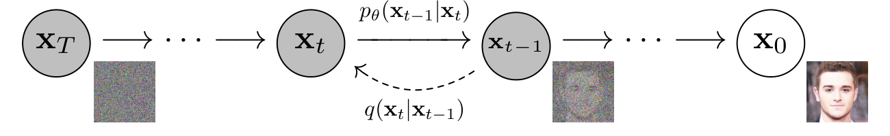 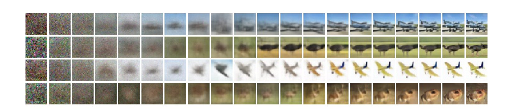 </div> <div class="mt-8 text-center"> <div class="math-block text-base lg:text-lg"><span class="katex-display"><span class="katex"><span class="katex-mathml"><math xmlns="http://www.w3.org/1998/Math/MathML" display="block"><semantics><mrow><msub><mi>x</mi><mrow><mi>t</mi><mo>−</mo><mn>1</mn></mrow></msub><mtext>  </mtext><mo>=</mo><mtext>  </mtext><mstyle scriptlevel="0" displaystyle="false"><mfrac><mn>1</mn><msqrt><msub><mi>α</mi><mi>t</mi></msub></msqrt></mfrac></mstyle><mo fence="true" stretchy="true" minsize="1.8em" maxsize="1.8em">(</mo><msub><mi>x</mi><mi>t</mi></msub><mtext>  </mtext><mo>−</mo><mtext>  </mtext><mstyle scriptlevel="0" displaystyle="false"><mfrac><mrow><mn>1</mn><mo>−</mo><msub><mi>α</mi><mi>t</mi></msub></mrow><msqrt><mrow><mn>1</mn><mo>−</mo><msub><mover accent="true"><mi>α</mi><mo>ˉ</mo></mover><mi>t</mi></msub></mrow></msqrt></mfrac></mstyle><mtext> </mtext><msub><mi>ϵ</mi><mi>θ</mi></msub><mo stretchy="false">(</mo><msub><mi>x</mi><mi>t</mi></msub><mo separator="true">,</mo><mtext> </mtext><mi>t</mi><mo stretchy="false">)</mo><mo fence="true" stretchy="true" minsize="1.8em" maxsize="1.8em">)</mo><mtext>  </mtext><mo>+</mo><mtext>  </mtext><msub><mi>σ</mi><mi>t</mi></msub><mtext> </mtext><mi>z</mi></mrow><annotation encoding="application/x-tex">x_{t-1} \;=\; \tfrac{1}{\sqrt{\alpha_t}}\Bigl(x_t \;-\; \tfrac{1-\alpha_t}{\sqrt{1-\bar{\alpha}_t}}\,\epsilon_\theta(x_t,\,t)\Bigr) \;+\; \sigma_t\, z</annotation></semantics></math></span><span class="katex-html" aria-hidden="true"><span class="base"><span class="strut" style="height:0.6389em;vertical-align:-0.2083em;"></span><span class="mord"><span class="mord mathnormal">x</span><span class="msupsub"><span class="vlist-t vlist-t2"><span class="vlist-r"><span class="vlist" style="height:0.3011em;"><span style="top:-2.55em;margin-left:0em;margin-right:0.05em;"><span class="pstrut" style="height:2.7em;"></span><span class="sizing reset-size6 size3 mtight"><span class="mord mtight"><span class="mord mathnormal mtight">t</span><span class="mbin mtight">−</span><span class="mord mtight">1</span></span></span></span></span><span class="vlist-s">​</span></span><span class="vlist-r"><span class="vlist" style="height:0.2083em;"><span></span></span></span></span></span></span><span class="mspace" style="margin-right:0.2778em;"></span><span class="mspace" style="margin-right:0.2778em;"></span><span class="mrel">=</span><span class="mspace" style="margin-right:0.2778em;"></span><span class="mspace" style="margin-right:0.2778em;"></span></span><span class="base"><span class="strut" style="height:1.8em;vertical-align:-0.65em;"></span><span class="mord"><span class="mopen nulldelimiter"></span><span class="mfrac"><span class="vlist-t vlist-t2"><span class="vlist-r"><span class="vlist" style="height:0.8451em;"><span style="top:-2.655em;"><span class="pstrut" style="height:3em;"></span><span class="sizing reset-size6 size3 mtight"><span class="mord mtight"><span class="mord sqrt mtight"><span class="vlist-t vlist-t2"><span class="vlist-r"><span class="vlist" style="height:0.7344em;"><span class="svg-align" style="top:-3em;"><span class="pstrut" style="height:3em;"></span><span class="mord mtight" style="padding-left:0.833em;"><span class="mord mtight"><span class="mord mathnormal mtight" style="margin-right:0.0037em;">α</span><span class="msupsub"><span class="vlist-t vlist-t2"><span class="vlist-r"><span class="vlist" style="height:0.2963em;"><span style="top:-2.357em;margin-left:-0.0037em;margin-right:0.0714em;"><span class="pstrut" style="height:2.5em;"></span><span class="sizing reset-size3 size1 mtight"><span class="mord mathnormal mtight">t</span></span></span></span><span class="vlist-s">​</span></span><span class="vlist-r"><span class="vlist" style="height:0.143em;"><span></span></span></span></span></span></span></span></span><span style="top:-2.6944em;"><span class="pstrut" style="height:3em;"></span><span class="hide-tail mtight" style="min-width:0.853em;height:1.08em;"><svg xmlns="http://www.w3.org/2000/svg" width="400em" height="1.08em" viewBox="0 0 400000 1080" preserveAspectRatio="xMinYMin slice"><path d="M95,702
c-2.7,0,-7.17,-2.7,-13.5,-8c-5.8,-5.3,-9.5,-10,-9.5,-14
c0,-2,0.3,-3.3,1,-4c1.3,-2.7,23.83,-20.7,67.5,-54
c44.2,-33.3,65.8,-50.3,66.5,-51c1.3,-1.3,3,-2,5,-2c4.7,0,8.7,3.3,12,10
s173,378,173,378c0.7,0,35.3,-71,104,-213c68.7,-142,137.5,-285,206.5,-429
c69,-144,104.5,-217.7,106.5,-221
l0 -0
c5.3,-9.3,12,-14,20,-14
H400000v40H845.2724
s-225.272,467,-225.272,467s-235,486,-235,486c-2.7,4.7,-9,7,-19,7
c-6,0,-10,-1,-12,-3s-194,-422,-194,-422s-65,47,-65,47z
M834 80h400000v40h-400000z"></path></svg></span></span></span><span class="vlist-s">​</span></span><span class="vlist-r"><span class="vlist" style="height:0.3056em;"><span></span></span></span></span></span></span></span></span><span style="top:-3.23em;"><span class="pstrut" style="height:3em;"></span><span class="frac-line" style="border-bottom-width:0.04em;"></span></span><span style="top:-3.394em;"><span class="pstrut" style="height:3em;"></span><span class="sizing reset-size6 size3 mtight"><span class="mord mtight"><span class="mord mtight">1</span></span></span></span></span><span class="vlist-s">​</span></span><span class="vlist-r"><span class="vlist" style="height:0.5589em;"><span></span></span></span></span></span><span class="mclose nulldelimiter"></span></span><span class="mopen"><span class="delimsizing size2">(</span></span><span class="mord"><span class="mord mathnormal">x</span><span class="msupsub"><span class="vlist-t vlist-t2"><span class="vlist-r"><span class="vlist" style="height:0.2806em;"><span style="top:-2.55em;margin-left:0em;margin-right:0.05em;"><span class="pstrut" style="height:2.7em;"></span><span class="sizing reset-size6 size3 mtight"><span class="mord mathnormal mtight">t</span></span></span></span><span class="vlist-s">​</span></span><span class="vlist-r"><span class="vlist" style="height:0.15em;"><span></span></span></span></span></span></span><span class="mspace" style="margin-right:0.2778em;"></span><span class="mspace" style="margin-right:0.2222em;"></span><span class="mbin">−</span><span class="mspace" style="margin-right:0.2778em;"></span><span class="mspace" style="margin-right:0.2222em;"></span></span><span class="base"><span class="strut" style="height:1.8em;vertical-align:-0.65em;"></span><span class="mord"><span class="mopen nulldelimiter"></span><span class="mfrac"><span class="vlist-t vlist-t2"><span class="vlist-r"><span class="vlist" style="height:0.8612em;"><span style="top:-2.6011em;"><span class="pstrut" style="height:3em;"></span><span class="sizing reset-size6 size3 mtight"><span class="mord mtight"><span class="mord sqrt mtight"><span class="vlist-t vlist-t2"><span class="vlist-r"><span class="vlist" style="height:0.8413em;"><span class="svg-align" style="top:-3em;"><span class="pstrut" style="height:3em;"></span><span class="mord mtight" style="padding-left:0.833em;"><span class="mord mtight">1</span><span class="mbin mtight">−</span><span class="mord mtight"><span class="mord accent mtight"><span class="vlist-t"><span class="vlist-r"><span class="vlist" style="height:0.5678em;"><span style="top:-2.7em;"><span class="pstrut" style="height:2.7em;"></span><span class="mord mathnormal mtight" style="margin-right:0.0037em;">α</span></span><span style="top:-2.7em;"><span class="pstrut" style="height:2.7em;"></span><span class="accent-body" style="left:-0.2222em;"><span class="mord mtight">ˉ</span></span></span></span></span></span></span><span class="msupsub"><span class="vlist-t vlist-t2"><span class="vlist-r"><span class="vlist" style="height:0.2963em;"><span style="top:-2.357em;margin-left:-0.0037em;margin-right:0.0714em;"><span class="pstrut" style="height:2.5em;"></span><span class="sizing reset-size3 size1 mtight"><span class="mord mathnormal mtight">t</span></span></span></span><span class="vlist-s">​</span></span><span class="vlist-r"><span class="vlist" style="height:0.143em;"><span></span></span></span></span></span></span></span></span><span style="top:-2.8013em;"><span class="pstrut" style="height:3em;"></span><span class="hide-tail mtight" style="min-width:0.853em;height:1.08em;"><svg xmlns="http://www.w3.org/2000/svg" width="400em" height="1.08em" viewBox="0 0 400000 1080" preserveAspectRatio="xMinYMin slice"><path d="M95,702
c-2.7,0,-7.17,-2.7,-13.5,-8c-5.8,-5.3,-9.5,-10,-9.5,-14
c0,-2,0.3,-3.3,1,-4c1.3,-2.7,23.83,-20.7,67.5,-54
c44.2,-33.3,65.8,-50.3,66.5,-51c1.3,-1.3,3,-2,5,-2c4.7,0,8.7,3.3,12,10
s173,378,173,378c0.7,0,35.3,-71,104,-213c68.7,-142,137.5,-285,206.5,-429
c69,-144,104.5,-217.7,106.5,-221
l0 -0
c5.3,-9.3,12,-14,20,-14
H400000v40H845.2724
s-225.272,467,-225.272,467s-235,486,-235,486c-2.7,4.7,-9,7,-19,7
c-6,0,-10,-1,-12,-3s-194,-422,-194,-422s-65,47,-65,47z
M834 80h400000v40h-400000z"></path></svg></span></span></span><span class="vlist-s">​</span></span><span class="vlist-r"><span class="vlist" style="height:0.1987em;"><span></span></span></span></span></span></span></span></span><span style="top:-3.23em;"><span class="pstrut" style="height:3em;"></span><span class="frac-line" style="border-bottom-width:0.04em;"></span></span><span style="top:-3.4101em;"><span class="pstrut" style="height:3em;"></span><span class="sizing reset-size6 size3 mtight"><span class="mord mtight"><span class="mord mtight">1</span><span class="mbin mtight">−</span><span class="mord mtight"><span class="mord mathnormal mtight" style="margin-right:0.0037em;">α</span><span class="msupsub"><span class="vlist-t vlist-t2"><span class="vlist-r"><span class="vlist" style="height:0.2963em;"><span style="top:-2.357em;margin-left:-0.0037em;margin-right:0.0714em;"><span class="pstrut" style="height:2.5em;"></span><span class="sizing reset-size3 size1 mtight"><span class="mord mathnormal mtight">t</span></span></span></span><span class="vlist-s">​</span></span><span class="vlist-r"><span class="vlist" style="height:0.143em;"><span></span></span></span></span></span></span></span></span></span></span><span class="vlist-s">​</span></span><span class="vlist-r"><span class="vlist" style="height:0.538em;"><span></span></span></span></span></span><span class="mclose nulldelimiter"></span></span><span class="mspace" style="margin-right:0.1667em;"></span><span class="mord"><span class="mord mathnormal">ϵ</span><span class="msupsub"><span class="vlist-t vlist-t2"><span class="vlist-r"><span class="vlist" style="height:0.3361em;"><span style="top:-2.55em;margin-left:0em;margin-right:0.05em;"><span class="pstrut" style="height:2.7em;"></span><span class="sizing reset-size6 size3 mtight"><span class="mord mathnormal mtight" style="margin-right:0.0278em;">θ</span></span></span></span><span class="vlist-s">​</span></span><span class="vlist-r"><span class="vlist" style="height:0.15em;"><span></span></span></span></span></span></span><span class="mopen">(</span><span class="mord"><span class="mord mathnormal">x</span><span class="msupsub"><span class="vlist-t vlist-t2"><span class="vlist-r"><span class="vlist" style="height:0.2806em;"><span style="top:-2.55em;margin-left:0em;margin-right:0.05em;"><span class="pstrut" style="height:2.7em;"></span><span class="sizing reset-size6 size3 mtight"><span class="mord mathnormal mtight">t</span></span></span></span><span class="vlist-s">​</span></span><span class="vlist-r"><span class="vlist" style="height:0.15em;"><span></span></span></span></span></span></span><span class="mpunct">,</span><span class="mspace" style="margin-right:0.1667em;"></span><span class="mspace" style="margin-right:0.1667em;"></span><span class="mord mathnormal">t</span><span class="mclose">)</span><span class="mclose"><span class="delimsizing size2">)</span></span><span class="mspace" style="margin-right:0.2778em;"></span><span class="mspace" style="margin-right:0.2222em;"></span><span class="mbin">+</span><span class="mspace" style="margin-right:0.2778em;"></span><span class="mspace" style="margin-right:0.2222em;"></span></span><span class="base"><span class="strut" style="height:0.5806em;vertical-align:-0.15em;"></span><span class="mord"><span class="mord mathnormal" style="margin-right:0.0359em;">σ</span><span class="msupsub"><span class="vlist-t vlist-t2"><span class="vlist-r"><span class="vlist" style="height:0.2806em;"><span style="top:-2.55em;margin-left:-0.0359em;margin-right:0.05em;"><span class="pstrut" style="height:2.7em;"></span><span class="sizing reset-size6 size3 mtight"><span class="mord mathnormal mtight">t</span></span></span></span><span class="vlist-s">​</span></span><span class="vlist-r"><span class="vlist" style="height:0.15em;"><span></span></span></span></span></span></span><span class="mspace" style="margin-right:0.1667em;"></span><span class="mord mathnormal" style="margin-right:0.044em;">z</span></span></span></span></span></div> <p class="mt-1 text-sm text-ink-mute">
one denoising step, written out (Ho et al., 2020, Alg. 2) · no need to read it — the pictures say the same thing
</p> </div> <figcaption class="mt-6 text-xs text-ink-mute text-center source-attribution"> Figures: Ho et al., NeurIPS 2020 (Figs. 2, 6) · sampling proceeds left to right </figcaption> </div>
</div>
```

<!-- source-section=07 formulas=1 fragment-groups=0 -->


## {.on-manifold-tfg data-source-section="08" background-color="#f9fafc"}

```{=html}
<div class="showcase-section bg-paper-soft">
 <div class="max-w-6xl mx-auto w-full"> <header class="max-w-6xl mx-auto w-full"> <div class="font-display text-base lg:text-lg tracking-[0.22em] text-cyan-deep font-semibold uppercase"> Background · 05 </div> <h2 class="mt-3 font-display text-4xl lg:text-5xl tracking-tight font-semibold text-ink leading-tight"> The network's output: noise </h2> <p class="mt-3 text-lg lg:text-xl text-ink-soft">One denoising step, up close.</p> </header> <div class="mt-14 flex items-center justify-center gap-4 lg:gap-6 flex-wrap"> <div class="text-center"> 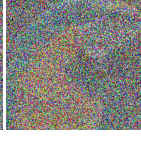 <p class="mt-2 text-base lg:text-lg text-ink-soft">noisy image <span class="math-inline "><span class="katex"><span class="katex-mathml"><math xmlns="http://www.w3.org/1998/Math/MathML"><semantics><mrow><msub><mi>z</mi><mi>t</mi></msub></mrow><annotation encoding="application/x-tex">z_t</annotation></semantics></math></span><span class="katex-html" aria-hidden="true"><span class="base"><span class="strut" style="height:0.5806em;vertical-align:-0.15em;"></span><span class="mord"><span class="mord mathnormal" style="margin-right:0.044em;">z</span><span class="msupsub"><span class="vlist-t vlist-t2"><span class="vlist-r"><span class="vlist" style="height:0.2806em;"><span style="top:-2.55em;margin-left:-0.044em;margin-right:0.05em;"><span class="pstrut" style="height:2.7em;"></span><span class="sizing reset-size6 size3 mtight"><span class="mord mathnormal mtight">t</span></span></span></span><span class="vlist-s">​</span></span><span class="vlist-r"><span class="vlist" style="height:0.15em;"><span></span></span></span></span></span></span></span></span></span></span></p> </div> <span class="text-3xl text-ink-mute">→</span> <div class="rounded-xl border-2 border-navy bg-navy-soft px-5 py-7 text-center"> <p class="font-display text-xl font-semibold text-navy">network</p> <span class="math-inline text-base"><span class="katex"><span class="katex-mathml"><math xmlns="http://www.w3.org/1998/Math/MathML"><semantics><mrow><msub><mi>ϵ</mi><mi>θ</mi></msub></mrow><annotation encoding="application/x-tex">\epsilon_\theta</annotation></semantics></math></span><span class="katex-html" aria-hidden="true"><span class="base"><span class="strut" style="height:0.5806em;vertical-align:-0.15em;"></span><span class="mord"><span class="mord mathnormal">ϵ</span><span class="msupsub"><span class="vlist-t vlist-t2"><span class="vlist-r"><span class="vlist" style="height:0.3361em;"><span style="top:-2.55em;margin-left:0em;margin-right:0.05em;"><span class="pstrut" style="height:2.7em;"></span><span class="sizing reset-size6 size3 mtight"><span class="mord mathnormal mtight" style="margin-right:0.0278em;">θ</span></span></span></span><span class="vlist-s">​</span></span><span class="vlist-r"><span class="vlist" style="height:0.15em;"><span></span></span></span></span></span></span></span></span></span></span> </div> <span class="text-3xl text-ink-mute">→</span> <div class="text-center"> 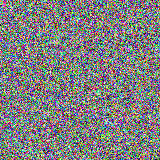 <p class="mt-2 text-base lg:text-lg text-ink-soft">predicted noise <span class="math-inline "><span class="katex"><span class="katex-mathml"><math xmlns="http://www.w3.org/1998/Math/MathML"><semantics><mrow><mover accent="true"><mi>ϵ</mi><mo>^</mo></mover></mrow><annotation encoding="application/x-tex">\hat{\epsilon}</annotation></semantics></math></span><span class="katex-html" aria-hidden="true"><span class="base"><span class="strut" style="height:0.6944em;"></span><span class="mord accent"><span class="vlist-t"><span class="vlist-r"><span class="vlist" style="height:0.6944em;"><span style="top:-3em;"><span class="pstrut" style="height:3em;"></span><span class="mord mathnormal">ϵ</span></span><span style="top:-3em;"><span class="pstrut" style="height:3em;"></span><span class="accent-body" style="left:-0.1944em;"><span class="mord">^</span></span></span></span></span></span></span></span></span></span></span></p> </div> <div class="text-center px-2 flex flex-col items-center gap-2"> <span class="flex items-center justify-center w-12 h-12 rounded-full border-2 border-ink text-3xl font-bold text-ink leading-none">−</span> <p class="text-sm lg:text-base text-ink-soft whitespace-nowrap">subtract<br>a little</p> </div> <div class="text-center"> 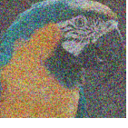 <p class="mt-2 text-base lg:text-lg text-ink-soft">cleaner · <span class="text-ink-mute">repeat</span></p> </div> </div> <div class="mt-10 flex flex-col items-center gap-4"> <p class="text-base text-ink-soft">
the same step, as a formula · <span class="math-inline "><span class="katex"><span class="katex-mathml"><math xmlns="http://www.w3.org/1998/Math/MathML"><semantics><mrow><msub><mi>ϵ</mi><mi>θ</mi></msub><mo stretchy="false">(</mo><msub><mi>z</mi><mi>t</mi></msub><mo stretchy="false">)</mo><mo>≈</mo><mi>ϵ</mi></mrow><annotation encoding="application/x-tex">\epsilon_\theta(z_t) \approx \epsilon</annotation></semantics></math></span><span class="katex-html" aria-hidden="true"><span class="base"><span class="strut" style="height:1em;vertical-align:-0.25em;"></span><span class="mord"><span class="mord mathnormal">ϵ</span><span class="msupsub"><span class="vlist-t vlist-t2"><span class="vlist-r"><span class="vlist" style="height:0.3361em;"><span style="top:-2.55em;margin-left:0em;margin-right:0.05em;"><span class="pstrut" style="height:2.7em;"></span><span class="sizing reset-size6 size3 mtight"><span class="mord mathnormal mtight" style="margin-right:0.0278em;">θ</span></span></span></span><span class="vlist-s">​</span></span><span class="vlist-r"><span class="vlist" style="height:0.15em;"><span></span></span></span></span></span></span><span class="mopen">(</span><span class="mord"><span class="mord mathnormal" style="margin-right:0.044em;">z</span><span class="msupsub"><span class="vlist-t vlist-t2"><span class="vlist-r"><span class="vlist" style="height:0.2806em;"><span style="top:-2.55em;margin-left:-0.044em;margin-right:0.05em;"><span class="pstrut" style="height:2.7em;"></span><span class="sizing reset-size6 size3 mtight"><span class="mord mathnormal mtight">t</span></span></span></span><span class="vlist-s">​</span></span><span class="vlist-r"><span class="vlist" style="height:0.15em;"><span></span></span></span></span></span></span><span class="mclose">)</span><span class="mspace" style="margin-right:0.2778em;"></span><span class="mrel">≈</span><span class="mspace" style="margin-right:0.2778em;"></span></span><span class="base"><span class="strut" style="height:0.4306em;"></span><span class="mord mathnormal">ϵ</span></span></span></span></span> · look at the noisy image, predict the noise inside it
</p> <p class="text-xl lg:text-2xl font-display font-semibold text-navy text-center frag-appear fragment" data-fragment-index="0">
The model never outputs an image. It outputs noise.
</p> </div> <figcaption class="mt-10 text-xs text-ink-mute text-center source-attribution"> <span class="math-inline "><span class="katex"><span class="katex-mathml"><math xmlns="http://www.w3.org/1998/Math/MathML"><semantics><mrow><mi>ϵ</mi></mrow><annotation encoding="application/x-tex">\epsilon</annotation></semantics></math></span><span class="katex-html" aria-hidden="true"><span class="base"><span class="strut" style="height:0.4306em;"></span><span class="mord mathnormal">ϵ</span></span></span></span></span>-prediction, the standard choice since DDPM (Ho et al., 2020) · a third target, velocity <span class="math-inline "><span class="katex"><span class="katex-mathml"><math xmlns="http://www.w3.org/1998/Math/MathML"><semantics><mrow><mi>v</mi></mrow><annotation encoding="application/x-tex">v</annotation></semantics></math></span><span class="katex-html" aria-hidden="true"><span class="base"><span class="strut" style="height:0.4306em;"></span><span class="mord mathnormal" style="margin-right:0.0359em;">v</span></span></span></span></span>, exists but is not covered in this talk · photo crops: Li &amp; He 2025, Fig. 7 </figcaption> </div>
</div>
```

<!-- source-section=08 formulas=6 fragment-groups=1 -->


## {.on-manifold-tfg data-source-section="09" background-color="#ffffff"}

```{=html}
<div class="showcase-section">
 <div class="max-w-6xl mx-auto w-full"> <header class="max-w-6xl mx-auto w-full"> <div class="font-display text-base lg:text-lg tracking-[0.22em] text-cyan-deep font-semibold uppercase"> Setting · 01 </div> <h2 class="mt-3 font-display text-4xl lg:text-5xl tracking-tight font-semibold text-ink leading-tight"> A model that draws only birds </h2> <p class="mt-3 text-lg lg:text-xl text-ink-soft">Trained models draw random images, of anything. What if we want one class?</p> </header> <div class="mt-12 space-y-10 max-w-5xl mx-auto"> <div class="flex items-center gap-5 lg:gap-8"> <div class="rounded-xl border border-line bg-paper px-5 py-6 text-center shrink-0 w-40 lg:w-48"> <p class="font-display text-lg lg:text-xl font-semibold text-ink">ImageNet<br>model</p> <p class="mt-1 text-sm text-ink-mute">general</p> </div> <span class="text-3xl text-ink-mute shrink-0">→</span> <div class="flex gap-3 lg:gap-4 overflow-hidden"> 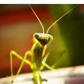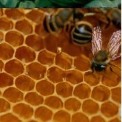 </div> </div> <div class="flex items-center gap-5 lg:gap-8"> <div class="rounded-xl border-2 border-navy bg-navy-soft px-5 py-6 text-center shrink-0 w-40 lg:w-48"> <p class="font-display text-lg lg:text-xl font-semibold text-navy">the same<br>model</p> <p class="mt-1 text-sm text-navy">condition · "bird"</p> </div> <span class="text-3xl text-ink-mute shrink-0">→</span> <div class="flex gap-3 lg:gap-4 overflow-hidden"> 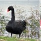 </div> </div> </div> <p class="mt-10 text-xl lg:text-2xl font-display font-semibold text-ink text-center frag-appear fragment" data-fragment-index="0">
How do we get the second row, without training a bird model?
</p> <figcaption class="mt-8 text-xs text-ink-mute text-center source-attribution"> All images are real model outputs · top: ImageNet samples, JiT-H (Li &amp; He 2025, Fig. 5) · bottom: guided bird samples from our experiments (Fig. 7c) </figcaption> </div>
</div>
```

<!-- source-section=09 formulas=0 fragment-groups=1 -->


## {.on-manifold-tfg data-source-section="10" background-color="#f9fafc"}

```{=html}
<div class="showcase-section bg-paper-soft">
 <div class="max-w-6xl mx-auto w-full"> <header class="max-w-6xl mx-auto w-full"> <div class="font-display text-base lg:text-lg tracking-[0.22em] text-cyan-deep font-semibold uppercase"> Setting · 02 </div> <h2 class="mt-3 font-display text-4xl lg:text-5xl tracking-tight font-semibold text-ink leading-tight"> Generating only what you want </h2> <p class="mt-3 text-lg lg:text-xl text-ink-soft">Think of every image as a point. The model samples from the whole set.</p> </header> <svg viewBox="0 0 900 400" class="mt-8 w-full max-w-3xl mx-auto"> <ellipse cx="430" cy="200" rx="395" ry="172" fill="#f8fafc" stroke="#e2e8f0" stroke-width="2"></ellipse> <circle cx="120" cy="180" r="5" fill="#94a3b8"></circle><circle cx="160" cy="120" r="5" fill="#94a3b8"></circle><circle cx="200" cy="250" r="5" fill="#94a3b8"></circle><circle cx="240" cy="90" r="5" fill="#94a3b8"></circle><circle cx="260" cy="190" r="5" fill="#94a3b8"></circle><circle cx="300" cy="300" r="5" fill="#94a3b8"></circle><circle cx="320" cy="150" r="5" fill="#94a3b8"></circle><circle cx="360" cy="230" r="5" fill="#94a3b8"></circle><circle cx="400" cy="100" r="5" fill="#94a3b8"></circle><circle cx="430" cy="290" r="5" fill="#94a3b8"></circle><circle cx="460" cy="180" r="5" fill="#94a3b8"></circle><circle cx="500" cy="120" r="5" fill="#94a3b8"></circle><circle cx="520" cy="260" r="5" fill="#94a3b8"></circle><circle cx="560" cy="90" r="5" fill="#94a3b8"></circle><circle cx="580" cy="180" r="5" fill="#94a3b8"></circle><circle cx="620" cy="110" r="5" fill="#94a3b8"></circle><circle cx="700" cy="90" r="5" fill="#94a3b8"></circle><circle cx="760" cy="160" r="5" fill="#94a3b8"></circle><circle cx="790" cy="230" r="5" fill="#94a3b8"></circle><circle cx="720" cy="310" r="5" fill="#94a3b8"></circle><circle cx="180" cy="310" r="5" fill="#94a3b8"></circle><circle cx="390" cy="330" r="5" fill="#94a3b8"></circle> <ellipse cx="650" cy="245" rx="120" ry="72" fill="#ecfeff" stroke="#0891b2" stroke-width="2.5"></ellipse> <circle cx="600" cy="255" r="5" fill="#0891b2"></circle><circle cx="688" cy="262" r="5" fill="#0891b2"></circle><circle cx="615" cy="215" r="5" fill="#0891b2"></circle> <image href="../../Figures/talks/on-manifold-tfg/cell-bunting.png" x="638" y="212" width="40" height="40"></image> <foreignObject x="70" y="46" width="520" height="36"> <div xmlns="http://www.w3.org/1999/xhtml" class="text-base text-ink-soft">
every image the model can draw · one dot = one image
</div> </foreignObject> <foreignObject x="560" y="322" width="260" height="36"> <div xmlns="http://www.w3.org/1999/xhtml" class="text-base font-semibold text-cyan-deep">
"bird" images
</div> </foreignObject> </svg> <p class="mt-6 text-lg lg:text-xl text-ink text-center">
Sampling drops a point <span class="font-semibold text-ink">anywhere in the big set</span> ·
        we want it to land <span class="font-semibold text-cyan-deep">only in the small one</span>.
</p> <div class="mt-8 grid grid-cols-1 lg:grid-cols-2 gap-5 max-w-4xl mx-auto frag-appear fragment" data-fragment-index="0"> <div class="rounded-xl border border-line bg-paper-soft p-5 text-center"> <p class="text-base lg:text-lg text-ink">option 1 · <span class="font-semibold">retrain on the subset</span></p> <p class="mt-2 text-base text-red-600">works, but one full training run for every new goal</p> </div> <div class="rounded-xl border-2 border-navy bg-paper p-5 text-center"> <p class="text-base lg:text-lg text-ink">option 2 · <span class="font-semibold text-navy">keep the model frozen, steer it</span></p> <p class="mt-2 text-base text-ink-soft">all we need is something that knows the subset</p> </div> </div> </div>
</div>
```

<!-- source-section=10 formulas=0 fragment-groups=1 -->


## {.on-manifold-tfg data-source-section="11" background-color="#ffffff"}

```{=html}
<div class="showcase-section">
 <div class="max-w-6xl mx-auto w-full"> <header class="max-w-6xl mx-auto w-full"> <div class="font-display text-base lg:text-lg tracking-[0.22em] text-cyan-deep font-semibold uppercase"> Setting · 03 </div> <h2 class="mt-3 font-display text-4xl lg:text-5xl tracking-tight font-semibold text-ink leading-tight"> A classifier knows the direction </h2> <p class="mt-3 text-lg lg:text-xl text-ink-soft">It is a neural network. Gradients flow all the way back to the pixels.</p> </header> <div class="mt-12 flex items-center justify-center gap-4 lg:gap-6"> <div class="text-center"> <div class="rounded-lg border border-line bg-paper p-1.5">  </div> <p class="mt-2 text-base text-ink-soft">input image <span class="math-inline "><span class="katex"><span class="katex-mathml"><math xmlns="http://www.w3.org/1998/Math/MathML"><semantics><mrow><mi>x</mi></mrow><annotation encoding="application/x-tex">x</annotation></semantics></math></span><span class="katex-html" aria-hidden="true"><span class="base"><span class="strut" style="height:0.4306em;"></span><span class="mord mathnormal">x</span></span></span></span></span></p> </div> <span class="text-3xl text-ink-mute">→</span> <div class="rounded-xl border-2 border-cyan-deep bg-cyan-soft px-6 py-8 text-center"> <p class="font-display text-xl font-semibold text-cyan-deep">classifier</p> <p class="mt-1 text-sm lg:text-base text-ink-soft">a neural network</p> </div> <span class="text-3xl text-ink-mute">→</span> <div class="rounded-xl border border-line bg-paper px-6 py-6 text-center"> <p class="text-lg lg:text-xl text-ink">"bird" · <span class="font-semibold text-red-600">3%</span></p> </div> </div> <div class="mt-8 flex flex-col items-center gap-4 frag-appear fragment" data-fragment-index="0"> <p class="text-lg lg:text-xl text-ink text-center">
run the gradient <span class="font-semibold text-navy">back to the input</span> ·
<span class="math-inline "><span class="katex"><span class="katex-mathml"><math xmlns="http://www.w3.org/1998/Math/MathML"><semantics><mrow><msub><mi mathvariant="normal">∇</mi><mi>x</mi></msub><mi>log</mi><mo>⁡</mo><mi>p</mi><mo stretchy="false">(</mo><mtext>bird</mtext><mtext> </mtext><mi mathvariant="normal">∣</mi><mtext> </mtext><mi>x</mi><mo stretchy="false">)</mo></mrow><annotation encoding="application/x-tex">\nabla_x \log p(\text{bird}\,|\,x)</annotation></semantics></math></span><span class="katex-html" aria-hidden="true"><span class="base"><span class="strut" style="height:1em;vertical-align:-0.25em;"></span><span class="mord"><span class="mord">∇</span><span class="msupsub"><span class="vlist-t vlist-t2"><span class="vlist-r"><span class="vlist" style="height:0.1514em;"><span style="top:-2.55em;margin-left:0em;margin-right:0.05em;"><span class="pstrut" style="height:2.7em;"></span><span class="sizing reset-size6 size3 mtight"><span class="mord mathnormal mtight">x</span></span></span></span><span class="vlist-s">​</span></span><span class="vlist-r"><span class="vlist" style="height:0.15em;"><span></span></span></span></span></span></span><span class="mspace" style="margin-right:0.1667em;"></span><span class="mop">lo<span style="margin-right:0.0139em;">g</span></span><span class="mspace" style="margin-right:0.1667em;"></span><span class="mord mathnormal">p</span><span class="mopen">(</span><span class="mord text"><span class="mord">bird</span></span><span class="mspace" style="margin-right:0.1667em;"></span><span class="mord">∣</span><span class="mspace" style="margin-right:0.1667em;"></span><span class="mord mathnormal">x</span><span class="mclose">)</span></span></span></span></span> ·
<span class="font-semibold text-navy">"how should the pixels change, to look more like a bird?"</span> </p> <div class="flex flex-wrap justify-center gap-3"> <span class="rounded-full border-2 border-navy bg-paper px-5 py-2 text-base lg:text-lg text-navy">"wings should appear"</span> <span class="rounded-full border-2 border-navy bg-paper px-5 py-2 text-base lg:text-lg text-navy">"a beak, over here"</span> <span class="rounded-full border-2 border-navy bg-paper px-5 py-2 text-base lg:text-lg text-navy">"feathers, not a cap"</span> </div> </div> <p class="mt-8 text-base lg:text-lg text-ink-soft text-center frag-appear fragment" data-fragment-index="1">
not just a judge · <span class="font-semibold text-ink">a compass</span> ·
        and classifiers for almost anything are already on the shelf
</p> </div>
</div>
```

<!-- source-section=11 formulas=2 fragment-groups=2 -->


## {.on-manifold-tfg data-source-section="12" background-color="#f9fafc"}

```{=html}
<div class="showcase-section bg-paper-soft">
 <div class="max-w-6xl mx-auto w-full"> <header class="max-w-6xl mx-auto w-full"> <div class="font-display text-base lg:text-lg tracking-[0.22em] text-cyan-deep font-semibold uppercase"> Setting · 04 </div> <h2 class="mt-3 font-display text-4xl lg:text-5xl tracking-tight font-semibold text-ink leading-tight"> Training-free guidance (TFG) </h2> <p class="mt-3 text-lg lg:text-xl text-ink-soft">Sampling walks a point from noise into the image set. Nudge every step.</p> </header> <svg viewBox="0 0 900 440" class="mt-6 w-full max-w-3xl mx-auto"> <defs> <marker id="arrowCyan" viewBox="0 0 10 10" refX="9" refY="5" markerWidth="7" markerHeight="7" orient="auto-start-reverse"> <path d="M 0 0 L 10 5 L 0 10 z" fill="#0891b2"></path> </marker> <marker id="arrowNavy2" viewBox="0 0 10 10" refX="9" refY="5" markerWidth="8" markerHeight="8" orient="auto-start-reverse"> <path d="M 0 0 L 10 5 L 0 10 z" fill="#0d47a1"></path> </marker> <marker id="arrowMute" viewBox="0 0 10 10" refX="9" refY="5" markerWidth="7" markerHeight="7" orient="auto-start-reverse"> <path d="M 0 0 L 10 5 L 0 10 z" fill="#94a3b8"></path> </marker> </defs> <ellipse cx="450" cy="235" rx="405" ry="180" fill="#f8fafc" stroke="#e2e8f0" stroke-width="2"></ellipse> <ellipse cx="695" cy="168" rx="135" ry="82" fill="#ecfeff" stroke="#0891b2" stroke-width="2.5"></ellipse> <image href="../../Figures/talks/on-manifold-tfg/noise-patch.png" x="66" y="58" width="54" height="54"></image> <path d="M 116 108 C 220 220, 340 300, 448 322" fill="none" stroke="#94a3b8" stroke-width="3" stroke-dasharray="7 7" marker-end="url(#arrowMute)"></path> <image href="../../Figures/talks/on-manifold-tfg/gen-mushroom.jpg" x="444" y="292" width="52" height="52"></image> <image href="../../Figures/talks/on-manifold-tfg/gen-train.jpg" x="506" y="330" width="52" height="52"></image> <image href="../../Figures/talks/on-manifold-tfg/gen-coffee.jpg" x="400" y="348" width="52" height="52"></image> <image href="../../Figures/talks/on-manifold-tfg/gen-capitol.jpg" x="562" y="286" width="52" height="52"></image> <path d="M 116 108 C 230 150, 340 210, 460 240" fill="none" stroke="#0d47a1" stroke-width="3.5"></path> <path d="M 460 240 C 540 255, 585 232, 612 208" fill="none" stroke="#0d47a1" stroke-width="3.5" marker-end="url(#arrowNavy2)"></path> <circle cx="240" cy="157" r="7" fill="#0d47a1"></circle><circle cx="360" cy="213" r="7" fill="#0d47a1"></circle><circle cx="470" cy="242" r="7" fill="#0d47a1"></circle><circle cx="575" cy="230" r="7" fill="#0d47a1"></circle> <line x1="252" y1="157.2" x2="292" y2="157.9" stroke="#0891b2" stroke-width="3" marker-end="url(#arrowCyan)"></line><line x1="371.9" y1="211.3" x2="411.5" y2="205.5" stroke="#0891b2" stroke-width="3" marker-end="url(#arrowCyan)"></line><line x1="481.3" y1="238" x2="519.1" y2="224.8" stroke="#0891b2" stroke-width="3" marker-end="url(#arrowCyan)"></line><line x1="585.4" y1="224.1" x2="620.3" y2="206" stroke="#0891b2" stroke-width="3" marker-end="url(#arrowCyan)"></line> <image href="../../Figures/talks/on-manifold-tfg/bird-swan.jpg" x="618" y="128" width="52" height="52"></image> <image href="../../Figures/talks/on-manifold-tfg/cell-bunting.png" x="700" y="118" width="52" height="52"></image> <image href="../../Figures/talks/on-manifold-tfg/bird-hummingbird.jpg" x="668" y="182" width="52" height="52"></image> <foreignObject x="46" y="112" width="160" height="36"> <div xmlns="http://www.w3.org/1999/xhtml" class="text-base text-ink-soft">pure noise</div> </foreignObject> <foreignObject x="640" y="256" width="180" height="34"> <div xmlns="http://www.w3.org/1999/xhtml" class="text-base font-semibold text-cyan-deep">bird images</div> </foreignObject> <foreignObject x="470" y="392" width="330" height="40"> <div xmlns="http://www.w3.org/1999/xhtml" class="text-base text-ink-mute">without guidance · lands anywhere</div> </foreignObject> <foreignObject x="290" y="112" width="300" height="46"> <div xmlns="http://www.w3.org/1999/xhtml" class="text-base font-semibold text-cyan-deep">
the classifier's nudge, every step
</div> </foreignObject> </svg> <div class="mt-6 flex flex-col items-center gap-3"> <p class="text-lg lg:text-xl text-ink text-center">
one guidance step · <span class="math-inline frag-hl"><span class="katex"><span class="katex-mathml"><math xmlns="http://www.w3.org/1998/Math/MathML"><semantics><mrow><mi>z</mi><mtext>  </mtext><mo>←</mo><mtext>  </mtext><mi>z</mi><mtext>  </mtext><mo>+</mo><mtext>  </mtext><mi>ρ</mi><mtext> </mtext><mi mathvariant="normal">∇</mi><mi>log</mi><mo>⁡</mo><mi>p</mi><mo stretchy="false">(</mo><mi>y</mi><mtext> </mtext><mi mathvariant="normal">∣</mi><mtext> </mtext><msub><mover accent="true"><mi>x</mi><mo>^</mo></mover><mn>0</mn></msub><mo stretchy="false">)</mo></mrow><annotation encoding="application/x-tex">z \;\leftarrow\; z \;+\; \rho\,\nabla \log p(y\,|\,\htmlClass{hl}{\hat{x}_0})</annotation></semantics></math></span><span class="katex-html" aria-hidden="true"><span class="base"><span class="strut" style="height:0.4306em;"></span><span class="mord mathnormal" style="margin-right:0.044em;">z</span><span class="mspace" style="margin-right:0.2778em;"></span><span class="mspace" style="margin-right:0.2778em;"></span><span class="mrel">←</span><span class="mspace" style="margin-right:0.2778em;"></span><span class="mspace" style="margin-right:0.2778em;"></span></span><span class="base"><span class="strut" style="height:0.6667em;vertical-align:-0.0833em;"></span><span class="mord mathnormal" style="margin-right:0.044em;">z</span><span class="mspace" style="margin-right:0.2778em;"></span><span class="mspace" style="margin-right:0.2222em;"></span><span class="mbin">+</span><span class="mspace" style="margin-right:0.2778em;"></span><span class="mspace" style="margin-right:0.2222em;"></span></span><span class="base"><span class="strut" style="height:1em;vertical-align:-0.25em;"></span><span class="mord mathnormal">ρ</span><span class="mspace" style="margin-right:0.1667em;"></span><span class="mord">∇</span><span class="mspace" style="margin-right:0.1667em;"></span><span class="mop">lo<span style="margin-right:0.0139em;">g</span></span><span class="mspace" style="margin-right:0.1667em;"></span><span class="mord mathnormal">p</span><span class="mopen">(</span><span class="mord mathnormal" style="margin-right:0.0359em;">y</span><span class="mspace" style="margin-right:0.1667em;"></span><span class="mord">∣</span><span class="mspace" style="margin-right:0.1667em;"></span><span class="enclosing hl"><span class="mord"><span class="mord accent"><span class="vlist-t"><span class="vlist-r"><span class="vlist" style="height:0.6944em;"><span style="top:-3em;"><span class="pstrut" style="height:3em;"></span><span class="mord mathnormal">x</span></span><span style="top:-3em;"><span class="pstrut" style="height:3em;"></span><span class="accent-body" style="left:-0.2222em;"><span class="mord">^</span></span></span></span></span></span></span><span class="msupsub"><span class="vlist-t vlist-t2"><span class="vlist-r"><span class="vlist" style="height:0.3011em;"><span style="top:-2.55em;margin-left:0em;margin-right:0.05em;"><span class="pstrut" style="height:2.7em;"></span><span class="sizing reset-size6 size3 mtight"><span class="mord mtight">0</span></span></span></span><span class="vlist-s">​</span></span><span class="vlist-r"><span class="vlist" style="height:0.15em;"><span></span></span></span></span></span></span></span><span class="mclose">)</span></span></span></span></span> </p> <p class="text-base lg:text-lg text-ink-soft frag-appear fragment" data-fragment-index="0">
one detail · the classifier reads <span class="math-inline "><span class="katex"><span class="katex-mathml"><math xmlns="http://www.w3.org/1998/Math/MathML"><semantics><mrow><msub><mover accent="true"><mi>x</mi><mo>^</mo></mover><mn>0</mn></msub></mrow><annotation encoding="application/x-tex">\hat{x}_0</annotation></semantics></math></span><span class="katex-html" aria-hidden="true"><span class="base"><span class="strut" style="height:0.8444em;vertical-align:-0.15em;"></span><span class="mord"><span class="mord accent"><span class="vlist-t"><span class="vlist-r"><span class="vlist" style="height:0.6944em;"><span style="top:-3em;"><span class="pstrut" style="height:3em;"></span><span class="mord mathnormal">x</span></span><span style="top:-3em;"><span class="pstrut" style="height:3em;"></span><span class="accent-body" style="left:-0.2222em;"><span class="mord">^</span></span></span></span></span></span></span><span class="msupsub"><span class="vlist-t vlist-t2"><span class="vlist-r"><span class="vlist" style="height:0.3011em;"><span style="top:-2.55em;margin-left:0em;margin-right:0.05em;"><span class="pstrut" style="height:2.7em;"></span><span class="sizing reset-size6 size3 mtight"><span class="mord mtight">0</span></span></span></span><span class="vlist-s">​</span></span><span class="vlist-r"><span class="vlist" style="height:0.15em;"><span></span></span></span></span></span></span></span></span></span></span> · a
<span class="font-semibold text-ink"> clean-image estimate</span>, not the noisy point itself
</p> </div> <div class="mt-7 flex flex-wrap justify-center gap-3 text-sm lg:text-base"> <span class="rounded-full border border-line bg-paper px-4 py-1.5 text-ink-soft">frozen model · no retraining</span> <span class="rounded-full border border-line bg-paper px-4 py-1.5 text-ink-soft">any objective</span> <span class="rounded-full border border-line bg-paper px-4 py-1.5 text-ink-soft">class · style · inverse problems</span> </div> <figcaption class="mt-8 text-xs text-ink-mute text-center source-attribution"> Shown: gradient guidance in DPS form (Chung et al., ICLR 2023) · the TFG framework (Ye et al., NeurIPS 2024) unifies these variants under one interface </figcaption> </div>
</div>
```

<!-- source-section=12 formulas=2 fragment-groups=1 -->


## {.on-manifold-tfg data-source-section="13" background-color="#ffffff"}

```{=html}
<div class="showcase-section">
 <div class="max-w-6xl mx-auto w-full"> <header class="max-w-6xl mx-auto w-full"> <div class="font-display text-base lg:text-lg tracking-[0.22em] text-cyan-deep font-semibold uppercase"> The catch · 01 </div> <h2 class="mt-3 font-display text-4xl lg:text-5xl tracking-tight font-semibold text-ink leading-tight"> A classifier that has never seen noise </h2> <p class="mt-3 text-lg lg:text-xl text-ink-soft">What happens when we hand it the middle of sampling?</p> </header> <div class="mt-12 space-y-8 max-w-4xl mx-auto"> <div class="flex items-center justify-center gap-4 lg:gap-6"> <div class="rounded-lg border border-line bg-paper p-1.5 shrink-0">  </div> <span class="text-3xl text-ink-mute">→</span> <div class="rounded-xl border-2 border-cyan-deep bg-cyan-soft px-6 py-7 text-center shrink-0"> <p class="font-display text-xl font-semibold text-cyan-deep">classifier</p> </div> <span class="text-3xl text-ink-mute">→</span> <div class="rounded-xl border-2 border-navy bg-paper px-6 py-5 text-center"> <p class="text-lg lg:text-xl text-navy font-semibold">"bird" · 97%</p> <p class="mt-1 text-base text-ink-soft">a photograph · knows exactly what to say</p> </div> </div> <div class="flex items-center justify-center gap-4 lg:gap-6 frag-appear fragment" data-fragment-index="0"> <div class="rounded-lg border border-line bg-paper p-1.5 shrink-0">  </div> <span class="text-3xl text-ink-mute">→</span> <div class="rounded-xl border-2 border-cyan-deep bg-cyan-soft px-6 py-7 text-center shrink-0"> <p class="font-display text-xl font-semibold text-cyan-deep">classifier</p> </div> <span class="text-3xl text-ink-mute">→</span> <div class="rounded-xl border-2 border-red-600 bg-paper px-6 py-5 text-center"> <p class="text-lg lg:text-xl text-red-600 font-semibold">" ? ? ? "</p> <p class="mt-1 text-base text-ink-soft">nothing it was ever trained on</p> </div> </div> </div> <p class="mt-10 text-xl lg:text-2xl font-display font-semibold text-navy text-center frag-appear fragment" data-fragment-index="1">
Trained on photographs · a noisy state is not a photograph ·<br>its "direction" here means nothing.
</p> <figcaption class="mt-8 text-xs text-ink-mute text-center source-attribution"> Confidence numbers are illustrative · left images: model samples and a noised state (sources as before) </figcaption> </div>
</div>
```

<!-- source-section=13 formulas=0 fragment-groups=2 -->


## {.on-manifold-tfg data-source-section="14" background-color="#f9fafc"}

```{=html}
<div class="showcase-section bg-paper-soft">
 <div class="max-w-6xl mx-auto w-full"> <header class="max-w-6xl mx-auto w-full"> <div class="font-display text-base lg:text-lg tracking-[0.22em] text-cyan-deep font-semibold uppercase"> The catch · 02 </div> <h2 class="mt-3 font-display text-4xl lg:text-5xl tracking-tight font-semibold text-ink leading-tight"> Where images live: a thin manifold </h2> <p class="mt-3 text-lg lg:text-xl text-ink-soft">The same fact, drawn as a picture.</p> </header> <div class="mt-10 grid grid-cols-1 lg:grid-cols-12 gap-10 items-center"> <div class="lg:col-span-5"> 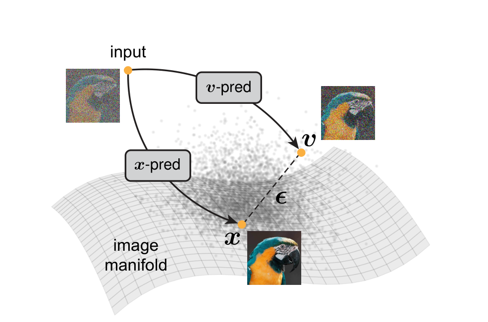 <figcaption class="mt-2 text-xs text-ink-mute source-attribution">Li &amp; He, arXiv:2511.13720, Fig. 1</figcaption> </div> <div class="lg:col-span-7 space-y-4 text-lg lg:text-xl text-ink leading-relaxed"> <p>
Natural images occupy a <span class="font-semibold text-navy">low-dimensional manifold</span> <span class="math-inline "><span class="katex"><span class="katex-mathml"><math xmlns="http://www.w3.org/1998/Math/MathML"><semantics><mrow><mi mathvariant="script">M</mi></mrow><annotation encoding="application/x-tex">\mathcal{M}</annotation></semantics></math></span><span class="katex-html" aria-hidden="true"><span class="base"><span class="strut" style="height:0.6833em;"></span><span class="mord mathcal">M</span></span></span></span></span> inside pixel space.
</p> <p>
The classifier was trained on <span class="math-inline "><span class="katex"><span class="katex-mathml"><math xmlns="http://www.w3.org/1998/Math/MathML"><semantics><mrow><mi mathvariant="script">M</mi></mrow><annotation encoding="application/x-tex">\mathcal{M}</annotation></semantics></math></span><span class="katex-html" aria-hidden="true"><span class="base"><span class="strut" style="height:0.6833em;"></span><span class="mord mathcal">M</span></span></span></span></span> only ·
            the noisy <span class="math-inline "><span class="katex"><span class="katex-mathml"><math xmlns="http://www.w3.org/1998/Math/MathML"><semantics><mrow><msub><mi>z</mi><mi>t</mi></msub></mrow><annotation encoding="application/x-tex">z_t</annotation></semantics></math></span><span class="katex-html" aria-hidden="true"><span class="base"><span class="strut" style="height:0.5806em;vertical-align:-0.15em;"></span><span class="mord"><span class="mord mathnormal" style="margin-right:0.044em;">z</span><span class="msupsub"><span class="vlist-t vlist-t2"><span class="vlist-r"><span class="vlist" style="height:0.2806em;"><span style="top:-2.55em;margin-left:-0.044em;margin-right:0.05em;"><span class="pstrut" style="height:2.7em;"></span><span class="sizing reset-size6 size3 mtight"><span class="mord mathnormal mtight">t</span></span></span></span><span class="vlist-s">​</span></span><span class="vlist-r"><span class="vlist" style="height:0.15em;"><span></span></span></span></span></span></span></span></span></span></span> lies <span class="font-semibold text-red-600">off</span> <span class="math-inline "><span class="katex"><span class="katex-mathml"><math xmlns="http://www.w3.org/1998/Math/MathML"><semantics><mrow><mi mathvariant="script">M</mi></mrow><annotation encoding="application/x-tex">\mathcal{M}</annotation></semantics></math></span><span class="katex-html" aria-hidden="true"><span class="base"><span class="strut" style="height:0.6833em;"></span><span class="mord mathcal">M</span></span></span></span></span>.
</p> <p class="frag-appear fragment" data-fragment-index="0">
So guidance must be computed on a clean-image estimate <span class="math-inline "><span class="katex"><span class="katex-mathml"><math xmlns="http://www.w3.org/1998/Math/MathML"><semantics><mrow><msub><mover accent="true"><mi>x</mi><mo>^</mo></mover><mn>0</mn></msub></mrow><annotation encoding="application/x-tex">\hat{x}_0</annotation></semantics></math></span><span class="katex-html" aria-hidden="true"><span class="base"><span class="strut" style="height:0.8444em;vertical-align:-0.15em;"></span><span class="mord"><span class="mord accent"><span class="vlist-t"><span class="vlist-r"><span class="vlist" style="height:0.6944em;"><span style="top:-3em;"><span class="pstrut" style="height:3em;"></span><span class="mord mathnormal">x</span></span><span style="top:-3em;"><span class="pstrut" style="height:3em;"></span><span class="accent-body" style="left:-0.2222em;"><span class="mord">^</span></span></span></span></span></span></span><span class="msupsub"><span class="vlist-t vlist-t2"><span class="vlist-r"><span class="vlist" style="height:0.3011em;"><span style="top:-2.55em;margin-left:0em;margin-right:0.05em;"><span class="pstrut" style="height:2.7em;"></span><span class="sizing reset-size6 size3 mtight"><span class="mord mtight">0</span></span></span></span><span class="vlist-s">​</span></span><span class="vlist-r"><span class="vlist" style="height:0.15em;"><span></span></span></span></span></span></span></span></span></span></span> ·
            and now <span class="font-semibold text-navy">everything depends on how good that estimate is.</span> </p> </div> </div> <figcaption class="mt-10 text-xs text-ink-mute text-center source-attribution"> Figure labels <span class="math-inline "><span class="katex"><span class="katex-mathml"><math xmlns="http://www.w3.org/1998/Math/MathML"><semantics><mrow><mi>v</mi></mrow><annotation encoding="application/x-tex">v</annotation></semantics></math></span><span class="katex-html" aria-hidden="true"><span class="base"><span class="strut" style="height:0.4306em;"></span><span class="mord mathnormal" style="margin-right:0.0359em;">v</span></span></span></span></span> (velocity), a third prediction target omitted in this talk · the off-manifold argument applies to every noised quantity </figcaption> </div>
</div>
```

<!-- source-section=14 formulas=6 fragment-groups=1 -->


## {.on-manifold-tfg data-source-section="15" background-color="#ffffff"}

```{=html}
<div class="showcase-section">
 <div class="max-w-6xl mx-auto w-full"> <header class="max-w-6xl mx-auto w-full"> <div class="font-display text-base lg:text-lg tracking-[0.22em] text-cyan-deep font-semibold uppercase"> The weak link </div> <h2 class="mt-3 font-display text-4xl lg:text-5xl tracking-tight font-semibold text-ink leading-tight"> Getting a clean image, mid-sampling </h2> <p class="mt-3 text-lg lg:text-xl text-ink-soft">The classifier needs a clean image. Does the ε-model have one to give?</p> </header> <div class="mt-8 grid grid-cols-1 lg:grid-cols-2 gap-10 items-center"> <div class="space-y-6"> <div class="text-center"> <p class="text-sm uppercase tracking-[0.18em] text-ink-mute font-semibold">Tweedie's formula</p> <div class="math-block mt-2 text-lg"><span class="katex-display"><span class="katex"><span class="katex-mathml"><math xmlns="http://www.w3.org/1998/Math/MathML" display="block"><semantics><mrow><msub><mover accent="true"><mi>x</mi><mo>^</mo></mover><mn>0</mn></msub><mtext>  </mtext><mo>=</mo><mtext>  </mtext><mo fence="true" stretchy="true" minsize="1.2em" maxsize="1.2em">(</mo><msub><mi>z</mi><mi>t</mi></msub><mo>−</mo><mo stretchy="false">(</mo><mn>1</mn><mo>−</mo><mi>t</mi><mo stretchy="false">)</mo><mtext> </mtext><mover accent="true"><mi>ϵ</mi><mo>^</mo></mover><mo fence="true" stretchy="true" minsize="1.2em" maxsize="1.2em">)</mo><mtext> </mtext><mi mathvariant="normal">/</mi><mtext>  </mtext><mi>t</mi></mrow><annotation encoding="application/x-tex">\hat{x}_0 \;=\; \bigl(z_t - (1-t)\,\hat{\epsilon}\bigr)\,/\;t</annotation></semantics></math></span><span class="katex-html" aria-hidden="true"><span class="base"><span class="strut" style="height:0.8444em;vertical-align:-0.15em;"></span><span class="mord"><span class="mord accent"><span class="vlist-t"><span class="vlist-r"><span class="vlist" style="height:0.6944em;"><span style="top:-3em;"><span class="pstrut" style="height:3em;"></span><span class="mord mathnormal">x</span></span><span style="top:-3em;"><span class="pstrut" style="height:3em;"></span><span class="accent-body" style="left:-0.2222em;"><span class="mord">^</span></span></span></span></span></span></span><span class="msupsub"><span class="vlist-t vlist-t2"><span class="vlist-r"><span class="vlist" style="height:0.3011em;"><span style="top:-2.55em;margin-left:0em;margin-right:0.05em;"><span class="pstrut" style="height:2.7em;"></span><span class="sizing reset-size6 size3 mtight"><span class="mord mtight">0</span></span></span></span><span class="vlist-s">​</span></span><span class="vlist-r"><span class="vlist" style="height:0.15em;"><span></span></span></span></span></span></span><span class="mspace" style="margin-right:0.2778em;"></span><span class="mspace" style="margin-right:0.2778em;"></span><span class="mrel">=</span><span class="mspace" style="margin-right:0.2778em;"></span><span class="mspace" style="margin-right:0.2778em;"></span></span><span class="base"><span class="strut" style="height:1.2em;vertical-align:-0.35em;"></span><span class="mopen"><span class="delimsizing size1">(</span></span><span class="mord"><span class="mord mathnormal" style="margin-right:0.044em;">z</span><span class="msupsub"><span class="vlist-t vlist-t2"><span class="vlist-r"><span class="vlist" style="height:0.2806em;"><span style="top:-2.55em;margin-left:-0.044em;margin-right:0.05em;"><span class="pstrut" style="height:2.7em;"></span><span class="sizing reset-size6 size3 mtight"><span class="mord mathnormal mtight">t</span></span></span></span><span class="vlist-s">​</span></span><span class="vlist-r"><span class="vlist" style="height:0.15em;"><span></span></span></span></span></span></span><span class="mspace" style="margin-right:0.2222em;"></span><span class="mbin">−</span><span class="mspace" style="margin-right:0.2222em;"></span></span><span class="base"><span class="strut" style="height:1em;vertical-align:-0.25em;"></span><span class="mopen">(</span><span class="mord">1</span><span class="mspace" style="margin-right:0.2222em;"></span><span class="mbin">−</span><span class="mspace" style="margin-right:0.2222em;"></span></span><span class="base"><span class="strut" style="height:1.2em;vertical-align:-0.35em;"></span><span class="mord mathnormal">t</span><span class="mclose">)</span><span class="mspace" style="margin-right:0.1667em;"></span><span class="mord accent"><span class="vlist-t"><span class="vlist-r"><span class="vlist" style="height:0.6944em;"><span style="top:-3em;"><span class="pstrut" style="height:3em;"></span><span class="mord mathnormal">ϵ</span></span><span style="top:-3em;"><span class="pstrut" style="height:3em;"></span><span class="accent-body" style="left:-0.1944em;"><span class="mord">^</span></span></span></span></span></span></span><span class="mclose"><span class="delimsizing size1">)</span></span><span class="mspace" style="margin-right:0.1667em;"></span><span class="mord">/</span><span class="mspace" style="margin-right:0.2778em;"></span><span class="mord mathnormal">t</span></span></span></span></span></div> </div> <div class="flex items-center justify-center"> <div class="flex flex-col items-center shrink-0">  <p class="mt-1 text-sm lg:text-base text-ink-soft">predicted noise <span class="math-inline "><span class="katex"><span class="katex-mathml"><math xmlns="http://www.w3.org/1998/Math/MathML"><semantics><mrow><mover accent="true"><mi>ϵ</mi><mo>^</mo></mover></mrow><annotation encoding="application/x-tex">\hat{\epsilon}</annotation></semantics></math></span><span class="katex-html" aria-hidden="true"><span class="base"><span class="strut" style="height:0.6944em;"></span><span class="mord accent"><span class="vlist-t"><span class="vlist-r"><span class="vlist" style="height:0.6944em;"><span style="top:-3em;"><span class="pstrut" style="height:3em;"></span><span class="mord mathnormal">ϵ</span></span><span style="top:-3em;"><span class="pstrut" style="height:3em;"></span><span class="accent-body" style="left:-0.1944em;"><span class="mord">^</span></span></span></span></span></span></span></span></span></span></span></p> </div> <div class="h-[3px] w-10 lg:w-14 bg-ink-soft shrink-0 mb-8"></div> <div class="flex flex-col items-center shrink-0">  <p class="mt-1 text-sm lg:text-base text-ink-soft">noisy <span class="math-inline "><span class="katex"><span class="katex-mathml"><math xmlns="http://www.w3.org/1998/Math/MathML"><semantics><mrow><msub><mi>z</mi><mi>t</mi></msub></mrow><annotation encoding="application/x-tex">z_t</annotation></semantics></math></span><span class="katex-html" aria-hidden="true"><span class="base"><span class="strut" style="height:0.5806em;vertical-align:-0.15em;"></span><span class="mord"><span class="mord mathnormal" style="margin-right:0.044em;">z</span><span class="msupsub"><span class="vlist-t vlist-t2"><span class="vlist-r"><span class="vlist" style="height:0.2806em;"><span style="top:-2.55em;margin-left:-0.044em;margin-right:0.05em;"><span class="pstrut" style="height:2.7em;"></span><span class="sizing reset-size6 size3 mtight"><span class="mord mathnormal mtight">t</span></span></span></span><span class="vlist-s">​</span></span><span class="vlist-r"><span class="vlist" style="height:0.15em;"><span></span></span></span></span></span></span></span></span></span></span></p> </div> <div class="flex items-center shrink-0 mb-8"> <div class="w-12 lg:w-20 border-t-[3px] border-dashed border-navy"></div> <span class="text-navy text-2xl leading-none -ml-1">▸</span> </div> <div class="flex flex-col items-center shrink-0"> 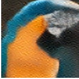 <p class="mt-1 text-sm lg:text-base font-semibold text-red-600">estimate <span class="math-inline "><span class="katex"><span class="katex-mathml"><math xmlns="http://www.w3.org/1998/Math/MathML"><semantics><mrow><msub><mover accent="true"><mi>x</mi><mo>^</mo></mover><mn>0</mn></msub></mrow><annotation encoding="application/x-tex">\hat{x}_0</annotation></semantics></math></span><span class="katex-html" aria-hidden="true"><span class="base"><span class="strut" style="height:0.8444em;vertical-align:-0.15em;"></span><span class="mord"><span class="mord accent"><span class="vlist-t"><span class="vlist-r"><span class="vlist" style="height:0.6944em;"><span style="top:-3em;"><span class="pstrut" style="height:3em;"></span><span class="mord mathnormal">x</span></span><span style="top:-3em;"><span class="pstrut" style="height:3em;"></span><span class="accent-body" style="left:-0.2222em;"><span class="mord">^</span></span></span></span></span></span></span><span class="msupsub"><span class="vlist-t vlist-t2"><span class="vlist-r"><span class="vlist" style="height:0.3011em;"><span style="top:-2.55em;margin-left:0em;margin-right:0.05em;"><span class="pstrut" style="height:2.7em;"></span><span class="sizing reset-size6 size3 mtight"><span class="mord mtight">0</span></span></span></span><span class="vlist-s">​</span></span><span class="vlist-r"><span class="vlist" style="height:0.15em;"><span></span></span></span></span></span></span></span></span></span></span></p> </div> </div> <p class="text-base lg:text-lg text-ink text-center">
draw the line from <span class="math-inline "><span class="katex"><span class="katex-mathml"><math xmlns="http://www.w3.org/1998/Math/MathML"><semantics><mrow><mover accent="true"><mi>ϵ</mi><mo>^</mo></mover></mrow><annotation encoding="application/x-tex">\hat{\epsilon}</annotation></semantics></math></span><span class="katex-html" aria-hidden="true"><span class="base"><span class="strut" style="height:0.6944em;"></span><span class="mord accent"><span class="vlist-t"><span class="vlist-r"><span class="vlist" style="height:0.6944em;"><span style="top:-3em;"><span class="pstrut" style="height:3em;"></span><span class="mord mathnormal">ϵ</span></span><span style="top:-3em;"><span class="pstrut" style="height:3em;"></span><span class="accent-body" style="left:-0.1944em;"><span class="mord">^</span></span></span></span></span></span></span></span></span></span></span> through <span class="math-inline "><span class="katex"><span class="katex-mathml"><math xmlns="http://www.w3.org/1998/Math/MathML"><semantics><mrow><msub><mi>z</mi><mi>t</mi></msub></mrow><annotation encoding="application/x-tex">z_t</annotation></semantics></math></span><span class="katex-html" aria-hidden="true"><span class="base"><span class="strut" style="height:0.5806em;vertical-align:-0.15em;"></span><span class="mord"><span class="mord mathnormal" style="margin-right:0.044em;">z</span><span class="msupsub"><span class="vlist-t vlist-t2"><span class="vlist-r"><span class="vlist" style="height:0.2806em;"><span style="top:-2.55em;margin-left:-0.044em;margin-right:0.05em;"><span class="pstrut" style="height:2.7em;"></span><span class="sizing reset-size6 size3 mtight"><span class="mord mathnormal mtight">t</span></span></span></span><span class="vlist-s">​</span></span><span class="vlist-r"><span class="vlist" style="height:0.15em;"><span></span></span></span></span></span></span></span></span></span></span> ·
<span class="font-semibold text-navy">extend it, and you land on</span> <span class="math-inline "><span class="katex"><span class="katex-mathml"><math xmlns="http://www.w3.org/1998/Math/MathML"><semantics><mrow><msub><mover accent="true"><mi>x</mi><mo>^</mo></mover><mn>0</mn></msub></mrow><annotation encoding="application/x-tex">\hat{x}_0</annotation></semantics></math></span><span class="katex-html" aria-hidden="true"><span class="base"><span class="strut" style="height:0.8444em;vertical-align:-0.15em;"></span><span class="mord"><span class="mord accent"><span class="vlist-t"><span class="vlist-r"><span class="vlist" style="height:0.6944em;"><span style="top:-3em;"><span class="pstrut" style="height:3em;"></span><span class="mord mathnormal">x</span></span><span style="top:-3em;"><span class="pstrut" style="height:3em;"></span><span class="accent-body" style="left:-0.2222em;"><span class="mord">^</span></span></span></span></span></span></span><span class="msupsub"><span class="vlist-t vlist-t2"><span class="vlist-r"><span class="vlist" style="height:0.3011em;"><span style="top:-2.55em;margin-left:0em;margin-right:0.05em;"><span class="pstrut" style="height:2.7em;"></span><span class="sizing reset-size6 size3 mtight"><span class="mord mtight">0</span></span></span></span><span class="vlist-s">​</span></span><span class="vlist-r"><span class="vlist" style="height:0.15em;"><span></span></span></span></span></span></span></span></span></span></span> </p> <p class="text-base lg:text-lg text-ink text-center frag-appear fragment" data-fragment-index="0">
at high noise the extension is long · a small error in <span class="math-inline "><span class="katex"><span class="katex-mathml"><math xmlns="http://www.w3.org/1998/Math/MathML"><semantics><mrow><mover accent="true"><mi>ϵ</mi><mo>^</mo></mover></mrow><annotation encoding="application/x-tex">\hat{\epsilon}</annotation></semantics></math></span><span class="katex-html" aria-hidden="true"><span class="base"><span class="strut" style="height:0.6944em;"></span><span class="mord accent"><span class="vlist-t"><span class="vlist-r"><span class="vlist" style="height:0.6944em;"><span style="top:-3em;"><span class="pstrut" style="height:3em;"></span><span class="mord mathnormal">ϵ</span></span><span style="top:-3em;"><span class="pstrut" style="height:3em;"></span><span class="accent-body" style="left:-0.1944em;"><span class="mord">^</span></span></span></span></span></span></span></span></span></span></span> lands far off ·
            the estimate comes out <span class="font-semibold text-red-600">damaged</span> <span class="text-ink-mute"> (~×9 near the start)</span> </p> <p class="text-lg font-display font-semibold text-navy text-center frag-appear fragment" data-fragment-index="1">
Guidance matters most at early, high-noise steps ·<br>exactly where this estimate is worst.
</p> </div> <div> 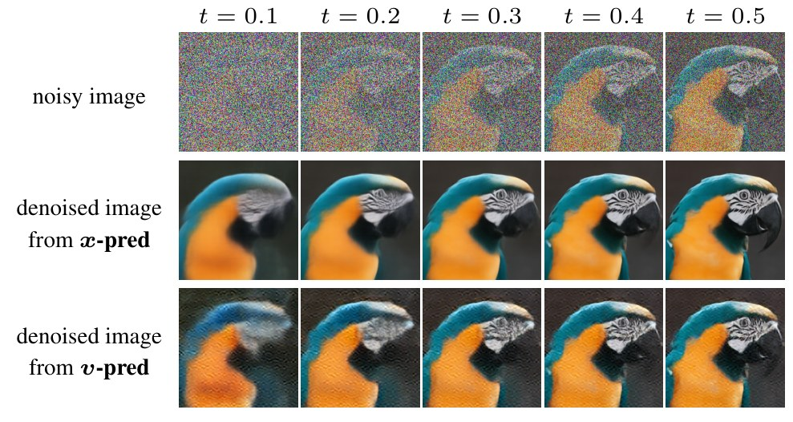 <div class="mt-3 text-sm lg:text-base text-ink-soft space-y-1"> <p>top · the noisy input</p> <p>middle · a clean image, <span class="font-semibold text-navy">predicted directly</span> by a network</p> <p>bottom · a clean image, <span class="font-semibold text-red-600">recovered by conversion</span> · artifacts</p> </div> </div> </div> <figcaption class="mt-8 text-xs text-ink-mute text-center source-attribution"> Exact form (linear schedule): recovery divides the de-noised residual by the signal level, amplifying the network error by (1−t)/t — Prop. 1 (Eq. 1) of our paper; posterior-mean recovery, the flow-matching analogue of Tweedie's formula (Efron, 2011) · images: Li &amp; He 2025, Fig. 7 · the recovered example converts from the velocity target, the mildest indirect case; noise-prediction is less stable still (≈3× higher training loss, ibid. §B.1) </figcaption> </div>
</div>
```

<!-- source-section=15 formulas=8 fragment-groups=2 -->


## {.on-manifold-tfg data-source-section="16" background-color="#f9fafc"}

```{=html}
<div class="showcase-section bg-paper-soft">
 <div class="max-w-6xl mx-auto w-full"> <header class="max-w-6xl mx-auto w-full"> <div class="font-display text-base lg:text-lg tracking-[0.22em] text-cyan-deep font-semibold uppercase"> The fix </div> <h2 class="mt-3 font-display text-4xl lg:text-5xl tracking-tight font-semibold text-ink leading-tight"> JiT: predict the clean image instead </h2> <p class="mt-3 text-lg lg:text-xl text-ink-soft">Just image Transformers (Li &amp; He, 2025). The only change: what the network predicts.</p> </header> <div class="mt-10 space-y-7 max-w-6xl mx-auto"> <div class="flex items-center justify-center gap-3 lg:gap-4"> <div class="text-center shrink-0">  <p class="mt-2 text-base text-ink-soft">noisy image</p> </div> <span class="text-3xl text-ink-mute shrink-0">→</span> <div class="rounded-xl border border-line bg-paper px-4 py-5 text-center shrink-0 w-40 lg:w-48"> <p class="font-display text-lg lg:text-xl font-semibold text-ink">network · <span class="math-inline "><span class="katex"><span class="katex-mathml"><math xmlns="http://www.w3.org/1998/Math/MathML"><semantics><mrow><msub><mi>ϵ</mi><mi>θ</mi></msub></mrow><annotation encoding="application/x-tex">\epsilon_\theta</annotation></semantics></math></span><span class="katex-html" aria-hidden="true"><span class="base"><span class="strut" style="height:0.5806em;vertical-align:-0.15em;"></span><span class="mord"><span class="mord mathnormal">ϵ</span><span class="msupsub"><span class="vlist-t vlist-t2"><span class="vlist-r"><span class="vlist" style="height:0.3361em;"><span style="top:-2.55em;margin-left:0em;margin-right:0.05em;"><span class="pstrut" style="height:2.7em;"></span><span class="sizing reset-size6 size3 mtight"><span class="mord mathnormal mtight" style="margin-right:0.0278em;">θ</span></span></span></span><span class="vlist-s">​</span></span><span class="vlist-r"><span class="vlist" style="height:0.15em;"><span></span></span></span></span></span></span></span></span></span></span></p> <p class="mt-1 text-sm lg:text-base text-ink-mute">trained to predict noise</p> </div> <span class="text-3xl text-ink-mute shrink-0">→</span> <div class="text-center shrink-0">  <p class="mt-2 text-base font-semibold text-red-600">the noise</p> </div> <div class="text-center shrink-0 px-1"> <p class="text-2xl text-ink-mute">→</p> <p class="text-sm text-ink-soft whitespace-nowrap">subtract<br>a little</p> </div> <div class="text-center shrink-0"> 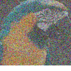 <p class="mt-2 text-base text-ink-soft">next state</p> </div> </div> <div class="flex items-center justify-center gap-3 lg:gap-4"> <div class="text-center shrink-0">  <p class="mt-2 text-base text-ink-soft">the same image</p> </div> <span class="text-3xl text-ink-mute shrink-0">→</span> <div class="rounded-xl border-2 border-navy bg-navy-soft px-4 py-5 text-center shrink-0 w-40 lg:w-48"> <p class="font-display text-lg lg:text-xl font-semibold text-navy">network · <span class="math-inline "><span class="katex"><span class="katex-mathml"><math xmlns="http://www.w3.org/1998/Math/MathML"><semantics><mrow><msub><mi>x</mi><mi>θ</mi></msub></mrow><annotation encoding="application/x-tex">x_\theta</annotation></semantics></math></span><span class="katex-html" aria-hidden="true"><span class="base"><span class="strut" style="height:0.5806em;vertical-align:-0.15em;"></span><span class="mord"><span class="mord mathnormal">x</span><span class="msupsub"><span class="vlist-t vlist-t2"><span class="vlist-r"><span class="vlist" style="height:0.3361em;"><span style="top:-2.55em;margin-left:0em;margin-right:0.05em;"><span class="pstrut" style="height:2.7em;"></span><span class="sizing reset-size6 size3 mtight"><span class="mord mathnormal mtight" style="margin-right:0.0278em;">θ</span></span></span></span><span class="vlist-s">​</span></span><span class="vlist-r"><span class="vlist" style="height:0.15em;"><span></span></span></span></span></span></span></span></span></span></span> · JiT</p> <p class="mt-1 text-sm lg:text-base text-navy">trained to predict the clean image</p> </div> <span class="text-3xl text-ink-mute shrink-0">→</span> <div class="text-center shrink-0"> 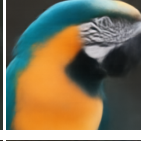 <p class="mt-2 text-base font-semibold text-navy">the clean image</p> </div> <div class="text-center shrink-0 px-1"> <p class="text-2xl text-ink-mute">→</p> <p class="text-sm text-ink-soft whitespace-nowrap">step toward it<br>a little</p> </div> <div class="text-center shrink-0">  <p class="mt-2 text-base text-ink-soft">the <span class="font-semibold text-ink">same</span> next state</p> </div> </div> </div> <p class="mt-8 text-lg lg:text-xl text-ink text-center frag-appear fragment" data-fragment-index="0">
Either way, one step lands in the same place · <span class="font-semibold">only the network's direct output differs.</span> </p> <p class="mt-4 text-xl lg:text-2xl font-display font-semibold text-navy text-center frag-appear fragment" data-fragment-index="1">
But now a clean image exists at every step · exactly what the classifier needs.
</p> <figcaption class="mt-8 text-xs text-ink-mute text-center source-attribution"> JiT: a plain ViT on pixel patches · generation quality comparable (ImageNet 256×256 FID 1.86 vs DiT-XL/2 2.27, Tab. 1 of our paper) · the targets are interconvertible parameterizations of the same step (Li &amp; He, Tab. 1); what differs is what the network must represent · a third target, velocity, omitted · images: Li &amp; He 2025, Fig. 7 crops </figcaption> </div>
</div>
```

<!-- source-section=16 formulas=2 fragment-groups=2 -->


## {.on-manifold-tfg data-source-section="paper-transition" background-color="#f9fafc"}

```{=html}
<div class="showcase-section bg-paper-soft">
  <div class="max-w-5xl mx-auto w-full">
    <p class="text-base lg:text-lg uppercase tracking-[0.22em] text-cyan-deep font-semibold">ECCV 2026 · Our paper</p>
    <p class="mt-8 font-display text-5xl lg:text-6xl tracking-tight font-semibold text-navy leading-tight">on-manifold tfg</p>
    <p class="mt-6 text-xl lg:text-2xl text-ink leading-relaxed max-w-4xl">Not All Prediction Targets Keep Training-Free Diffusion Guidance on the Manifold</p>
  </div>
</div>
```

<!-- added-slide=paper-transition alias=on-manifold-tfg formulas=0 fragment-groups=0 -->


## {.on-manifold-tfg data-source-section="17" background-color="#ffffff"}

```{=html}
<div class="showcase-section">
 <div class="max-w-6xl mx-auto w-full"> <header class="max-w-6xl mx-auto w-full"> <div class="font-display text-base lg:text-lg tracking-[0.22em] text-cyan-deep font-semibold uppercase"> Our paper · ECCV 2026 </div> <h2 class="mt-3 font-display text-4xl lg:text-5xl tracking-tight font-semibold text-ink leading-tight"> The same recipe, two prediction targets </h2> <p class="mt-3 text-lg lg:text-xl text-ink-soft">Frozen model + bird classifier + TFG. Only the prediction target differs.</p> </header> <div class="mt-6 space-y-4"> <div> <div class="flex items-baseline justify-between max-w-3xl mx-auto"> <p class="text-base lg:text-lg font-semibold text-navy"> <span class="math-inline "><span class="katex"><span class="katex-mathml"><math xmlns="http://www.w3.org/1998/Math/MathML"><semantics><mrow><mi>x</mi></mrow><annotation encoding="application/x-tex">x</annotation></semantics></math></span><span class="katex-html" aria-hidden="true"><span class="base"><span class="strut" style="height:0.4306em;"></span><span class="mord mathnormal">x</span></span></span></span></span>-prediction · JiT
</p> <p class="text-base text-ink-soft">diverse poses · diverse backgrounds</p> </div> 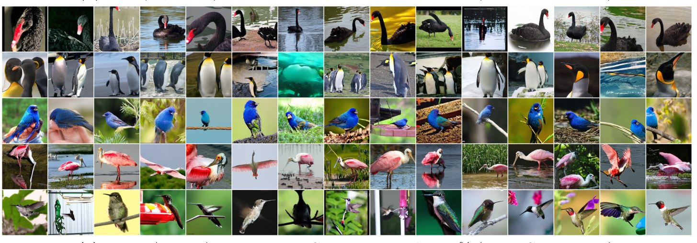 </div> <div> <div class="flex items-baseline justify-between max-w-3xl mx-auto"> <p class="text-base lg:text-lg font-semibold text-red-600"> <span class="math-inline "><span class="katex"><span class="katex-mathml"><math xmlns="http://www.w3.org/1998/Math/MathML"><semantics><mrow><mi>ϵ</mi></mrow><annotation encoding="application/x-tex">\epsilon</annotation></semantics></math></span><span class="katex-html" aria-hidden="true"><span class="base"><span class="strut" style="height:0.4306em;"></span><span class="mord mathnormal">ϵ</span></span></span></span></span>-prediction · DiT
</p> <p class="text-base text-ink-soft">the same pose, again and again · dark backgrounds</p> </div> 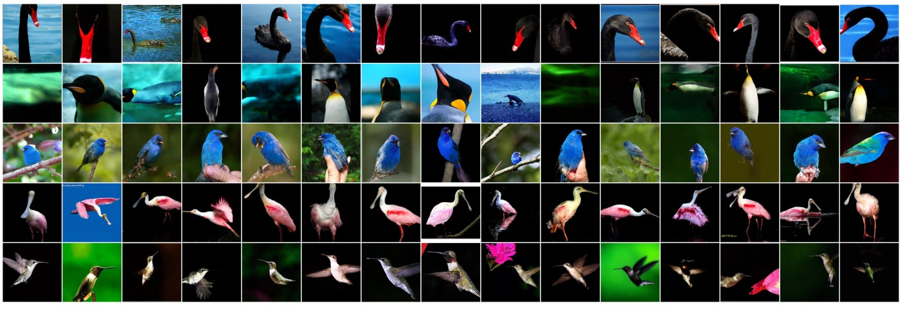 <p class="mt-3 text-lg lg:text-xl font-display font-semibold text-navy text-center frag-appear fragment" data-fragment-index="0">
This is our paper's message · the prediction target decides whether guidance works.
</p> </div> </div> <figcaption class="mt-4 text-xs text-ink-mute text-center source-attribution"> Fig. 7(c)(d) of our paper · five species, 15 random samples each, no cherry-picking · strong guidance </figcaption> </div>
</div>
```

<!-- source-section=17 formulas=2 fragment-groups=1 -->


## {.on-manifold-tfg data-source-section="18" background-color="#f9fafc"}

```{=html}
<div class="showcase-section bg-paper-soft">
 <div class="max-w-6xl mx-auto w-full"> <header class="max-w-6xl mx-auto w-full"> <div class="font-display text-base lg:text-lg tracking-[0.22em] text-cyan-deep font-semibold uppercase"> Our paper · measured </div> <h2 class="mt-3 font-display text-4xl lg:text-5xl tracking-tight font-semibold text-ink leading-tight"> Child FID: putting a number on it </h2> <p class="mt-3 text-lg lg:text-xl text-ink-soft">C-FID · distance between guided samples of a class and real photos of that class.</p> </header> <div class="mt-10 grid grid-cols-1 lg:grid-cols-12 gap-10 items-center"> <div class="lg:col-span-7 space-y-5"> <p class="text-lg text-ink leading-relaxed">
Standard metrics miss the damage · classifier accuracy rewards
<span class="font-semibold text-red-600"> adversarial-like images</span> that fool the network ·
            C-FID asks instead: <span class="font-semibold text-navy">do the samples look like the real class?</span> </p> <div class="flex flex-wrap gap-3 text-sm lg:text-base"> <span class="rounded-full border border-line bg-paper px-4 py-1.5 text-ink-soft">143 bird species</span> <span class="rounded-full border border-line bg-paper px-4 py-1.5 text-ink-soft">64 samples per species</span> <span class="rounded-full border border-line bg-paper px-4 py-1.5 text-ink-soft">9,152 images per point</span> </div> <div class="rounded-xl border border-line bg-paper-soft p-6 frag-appear fragment" data-fragment-index="0"> <p class="text-lg text-ink leading-relaxed">
At matched classifier accuracy · C-FID
<span class="font-display font-semibold text-navy"> 32.9</span> (<span class="math-inline "><span class="katex"><span class="katex-mathml"><math xmlns="http://www.w3.org/1998/Math/MathML"><semantics><mrow><mi>x</mi></mrow><annotation encoding="application/x-tex">x</annotation></semantics></math></span><span class="katex-html" aria-hidden="true"><span class="base"><span class="strut" style="height:0.4306em;"></span><span class="mord mathnormal">x</span></span></span></span></span>, JiT) vs.
<span class="font-display font-semibold text-red-600"> 38.1</span> (<span class="math-inline "><span class="katex"><span class="katex-mathml"><math xmlns="http://www.w3.org/1998/Math/MathML"><semantics><mrow><mi>ϵ</mi></mrow><annotation encoding="application/x-tex">\epsilon</annotation></semantics></math></span><span class="katex-html" aria-hidden="true"><span class="base"><span class="strut" style="height:0.4306em;"></span><span class="mord mathnormal">ϵ</span></span></span></span></span>, DiT)
</p> <p class="mt-2 text-base lg:text-lg text-ink-soft">
and a <span class="font-semibold text-ink">131M</span> x-prediction model sustains lower C-FID than a
<span class="font-semibold text-ink">724M</span> <span class="math-inline "><span class="katex"><span class="katex-mathml"><math xmlns="http://www.w3.org/1998/Math/MathML"><semantics><mrow><mi>ϵ</mi></mrow><annotation encoding="application/x-tex">\epsilon</annotation></semantics></math></span><span class="katex-html" aria-hidden="true"><span class="base"><span class="strut" style="height:0.4306em;"></span><span class="mord mathnormal">ϵ</span></span></span></span></span>-prediction model
</p> </div> </div> <div class="lg:col-span-5"> 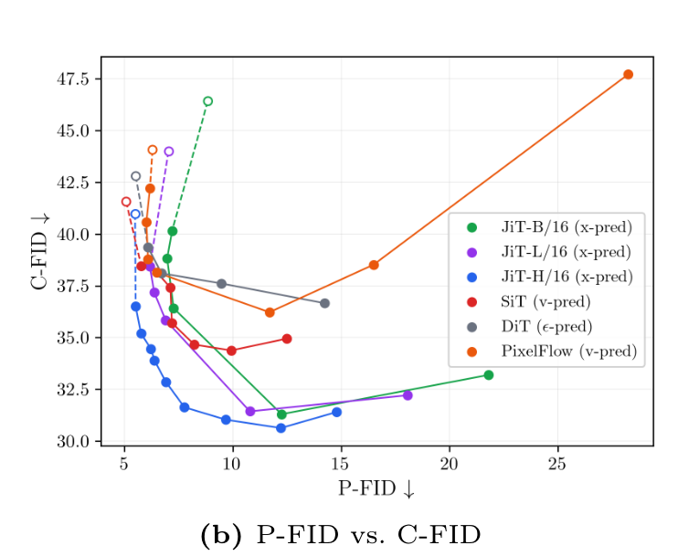 <p class="mt-2 text-sm text-ink-mute">
lower-left is better · <span class="math-inline "><span class="katex"><span class="katex-mathml"><math xmlns="http://www.w3.org/1998/Math/MathML"><semantics><mrow><mi>x</mi></mrow><annotation encoding="application/x-tex">x</annotation></semantics></math></span><span class="katex-html" aria-hidden="true"><span class="base"><span class="strut" style="height:0.4306em;"></span><span class="mord mathnormal">x</span></span></span></span></span>-prediction keeps improving where the others reverse (Fig. 4b)
</p> </div> </div> <figcaption class="mt-8 text-xs text-ink-mute text-center source-attribution"> Validity: top-1 accuracy of an evaluation classifier kept separate from the guidance classifier (§4.3–4.4) · matched point ≈26.6% Validity · parameter counts include the 49M VAE decoder used at every guidance step (Tab. 1) · controlled toy ablation in the paper: at D=512, on-manifold rate 93.3% (x) vs 0.5% (ε) </figcaption> </div>
</div>
```

<!-- source-section=18 formulas=4 fragment-groups=1 -->


## {.on-manifold-tfg data-source-section="20" background-color="#f9fafc"}

```{=html}
<div class="showcase-section bg-paper-soft">
 <div class="max-w-5xl mx-auto w-full"> <p class="text-base uppercase tracking-[0.22em] text-cyan-deep font-semibold">Takeaway</p> <ul class="mt-10 space-y-8"> <li class="flex items-start gap-6 frag-appear fragment" data-fragment-index="0"> <span class="font-display text-3xl font-semibold text-ink-mute">1</span> <p class="text-xl lg:text-2xl text-ink leading-relaxed">
Training-free guidance steers a <span class="font-semibold text-navy">frozen</span> diffusion model
            with classifier gradients, at sampling time.
</p> </li> <li class="flex items-start gap-6 frag-appear fragment" data-fragment-index="1"> <span class="font-display text-3xl font-semibold text-ink-mute">2</span> <p class="text-xl lg:text-2xl text-ink leading-relaxed">
Its weak link is the clean-image estimate <span class="math-inline "><span class="katex"><span class="katex-mathml"><math xmlns="http://www.w3.org/1998/Math/MathML"><semantics><mrow><msub><mover accent="true"><mi>x</mi><mo>^</mo></mover><mn>0</mn></msub></mrow><annotation encoding="application/x-tex">\hat{x}_0</annotation></semantics></math></span><span class="katex-html" aria-hidden="true"><span class="base"><span class="strut" style="height:0.8444em;vertical-align:-0.15em;"></span><span class="mord"><span class="mord accent"><span class="vlist-t"><span class="vlist-r"><span class="vlist" style="height:0.6944em;"><span style="top:-3em;"><span class="pstrut" style="height:3em;"></span><span class="mord mathnormal">x</span></span><span style="top:-3em;"><span class="pstrut" style="height:3em;"></span><span class="accent-body" style="left:-0.2222em;"><span class="mord">^</span></span></span></span></span></span></span><span class="msupsub"><span class="vlist-t vlist-t2"><span class="vlist-r"><span class="vlist" style="height:0.3011em;"><span style="top:-2.55em;margin-left:0em;margin-right:0.05em;"><span class="pstrut" style="height:2.7em;"></span><span class="sizing reset-size6 size3 mtight"><span class="mord mtight">0</span></span></span></span><span class="vlist-s">​</span></span><span class="vlist-r"><span class="vlist" style="height:0.15em;"><span></span></span></span></span></span></span></span></span></span></span> ·
            recovering it from predicted noise amplifies error by <span class="math-inline "><span class="katex"><span class="katex-mathml"><math xmlns="http://www.w3.org/1998/Math/MathML"><semantics><mrow><mstyle scriptlevel="0" displaystyle="false"><mfrac><mrow><mn>1</mn><mo>−</mo><mi>t</mi></mrow><mi>t</mi></mfrac></mstyle></mrow><annotation encoding="application/x-tex">\tfrac{1-t}{t}</annotation></semantics></math></span><span class="katex-html" aria-hidden="true"><span class="base"><span class="strut" style="height:1.1901em;vertical-align:-0.345em;"></span><span class="mord"><span class="mopen nulldelimiter"></span><span class="mfrac"><span class="vlist-t vlist-t2"><span class="vlist-r"><span class="vlist" style="height:0.8451em;"><span style="top:-2.655em;"><span class="pstrut" style="height:3em;"></span><span class="sizing reset-size6 size3 mtight"><span class="mord mtight"><span class="mord mathnormal mtight">t</span></span></span></span><span style="top:-3.23em;"><span class="pstrut" style="height:3em;"></span><span class="frac-line" style="border-bottom-width:0.04em;"></span></span><span style="top:-3.394em;"><span class="pstrut" style="height:3em;"></span><span class="sizing reset-size6 size3 mtight"><span class="mord mtight"><span class="mord mtight">1</span><span class="mbin mtight">−</span><span class="mord mathnormal mtight">t</span></span></span></span></span><span class="vlist-s">​</span></span><span class="vlist-r"><span class="vlist" style="height:0.345em;"><span></span></span></span></span></span><span class="mclose nulldelimiter"></span></span></span></span></span></span>.
</p> </li> <li class="flex items-start gap-6 frag-appear fragment" data-fragment-index="2"> <span class="font-display text-3xl font-semibold text-ink-mute">3</span> <p class="text-xl lg:text-2xl text-ink leading-relaxed">
Predicting the clean image <span class="font-semibold text-navy">directly</span> removes the weak link ·
            guidance stays on the manifold.
</p> </li> </ul> </div>
</div>
```

<!-- source-section=20 formulas=2 fragment-groups=3 -->


## {.on-manifold-tfg data-source-section="21" background-color="#ffffff"}

```{=html}
<div class="showcase-section">
  <div class="max-w-6xl mx-auto w-full grid grid-cols-1 lg:grid-cols-12 gap-12 items-center">
    <div class="lg:col-span-5 flex flex-col items-center gap-4">
      
      <p class="text-lg lg:text-xl font-semibold text-ink">arxiv.org/abs/2607.00647</p>
    </div>
    <div class="lg:col-span-7">
      <div class="space-y-8">
        <div>
          <p class="text-base uppercase tracking-[0.22em] text-cyan-deep font-semibold">Code</p>
          <p class="mt-2 text-xl lg:text-2xl text-ink">github.com/ManLuML/on-manifold-tfg</p>
        </div>
        <div>
          <p class="text-base uppercase tracking-[0.22em] text-cyan-deep font-semibold">Project · on-manifold tfg</p>
          <p class="mt-2 text-xl lg:text-2xl text-ink">ManLuML.github.io/on-manifold-tfg</p>
        </div>
      </div>
      <div class="mt-10 space-y-2 text-ink-soft">
        <p class="text-lg lg:text-xl text-ink">Yunsung Lee · <a class="author-site-link" href="https://alohays.github.io/">https://alohays.github.io/</a></p>
<p class="text-lg lg:text-xl text-ink">Hyeongmin Lee · <a class="author-site-link" href="https://hyeongminlee.github.io/">https://hyeongminlee.github.io/</a></p>
      </div>

    </div>
  </div>
</div>
```

<!-- source-section=21 rewrite=resources-and-authors formulas=0 fragment-groups=0 -->
